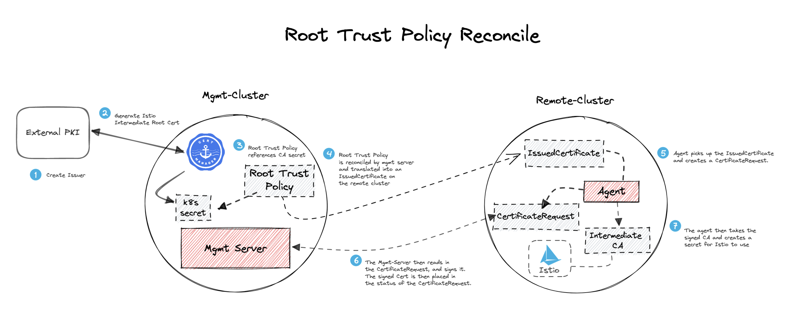

# Cert Manager + Gloo Mesh

This guide is meant to help getting started with integrating Cert Manager with Gloo Mesh and Istio components. 

- Leverage Cert Manager to generate certificates used to establish trust between the Gloo Mesh Control Plane and relay agents.
- Leverage Cert Manager to generate root certificates used by Istio to manage workload certificates used to enable mTLS

This guide requires just one Kubernetes cluster without
Gloo Mesh or Istio installed on it yet. This guide describes:
* Using `cert-manager` to create a CA and then sign the gloo mesh management serer and relay certificates that are used for trusted communication between them.
* Install gloo mesh management server on the management cluster
* Install gloo mesh relay agent also on the managment cluster (though
typically you would install the relay agent on a seprate cluster).
* Deploy Istio with the Istio Life Cycle Manager
* Generate certs to be used for shared root trust
* Use RootTrustPolicy to establish shared root trust


# Preparation

Set the context environment variable:

```bash
export MGMT=mgmt
```

Specify the version of gloo mesh to use:
```bash
export GLOO_MESH_VERSION=v2.1.2
```


## Install cert-manager
```
helm repo add jetstack https://charts.jetstack.io
helm repo update
helm upgrade --install jetstack jetstack/cert-manager --namespace cert-manager --create-namespace --version v1.7.2 --set-string installCRDs=true --wait
```

## Part 1: Establish trust between Gloo Mesh Control Plane and Relay Agents

### Configure cert manager components for Gloo Mesh relay trust
Create the gloo mesh namespace:
```
kubectl create ns gloo-mesh
```

Apply the the self-signed relay root CA that cert-manager will be using to generate additional certificates from:
```
kubectl apply -f cert/gloo-mesh-relay-root-ca.yaml
```

Next we will create an Issuer which will use this CA secret:
```
kubectl apply -f cert/gloo-mesh-relay-issuer.yaml
```

Now generate the relay certs used for the control plane / agent registration process:
```
kubectl apply -f cert/gloo-mesh-cert.yaml
kubectl apply -f cert/gloo-mesh-agent-cert.yaml
```

Check all certificates:
```
% kubectl get Certificates -A
```
The output should look like this:
```
NAMESPACE   NAME                    READY   SECRET                 AGE
gloo-mesh   gloo-mesh-mgmt-server   True    gloo-server-tls-cert   13s
gloo-mesh   gloo-mesh-agent         True    gloo-agent-tls-cert    13s
```

## Install gloo-mesh control plane
Set the GLOO_MESH_LICENSE_KEY variable:
```
GLOO_MESH_LICENSE_KEY="[insert key here]"
```

Deploy Gloo Mesh Enterprise using Helm:
```
helm repo add gloo-mesh-enterprise https://storage.googleapis.com/gloo-mesh-enterprise/gloo-mesh-enterprise
helm repo update
helm upgrade --install \
    gloo-mesh-enterprise gloo-mesh-enterprise/gloo-mesh-enterprise \
    --namespace gloo-mesh \
    --create-namespace \
    --version ${GLOO_MESH_VERSION} \
    --set-string licenseKey=$GLOO_MESH_LICENSE_KEY \
    --values helm/cp-values.yaml
```

If you take a look at the `helm/cp-values.yaml` you can see that we have disabled the default CA cert and token generation as well as set the `glooMeshMgmtServer.relay.tlsSecret` to the `gloo-server-tls-cert` generated by cert-manager above.  We don't need a token for the Gloo Mesh Agent to send to the
Gloo Mesh Management server because the agent's certificate
in secret `gloo-agent-tls-cert` was signed by the same CA as the
certificate used for Gloo Mesh Management certificate.

## Install gloo-mesh-agent
Deploy Gloo Mesh Agent using Helm on the management cluster:
```
helm repo add gloo-mesh-agent https://storage.googleapis.com/gloo-mesh-enterprise/gloo-mesh-agent
helm repo update
helm upgrade --install gloo-mesh-agent gloo-mesh-agent/gloo-mesh-agent \
  --create-namespace \
  --version ${GLOO_MESH_VERSION} \
  --namespace gloo-mesh \
  --kube-context=${MGMT} \
  --values helm/agent-values.yaml
```

If you take a look at the `helm/agent-values.yaml` you can see that we have set the `relay.clientTlsSecret.name` to the `gloo-agent-tls-cert` generated by cert-manager above.

Lastly we will create the `KubernetesCluster` Custom Resource to complete the agent registration process. Note the use of the label `roottrust: shared` as we will use this later to establish shared root trust across multiple clusters.
```
kubectl apply --context ${MGMT} -f- <<EOF
apiVersion: admin.gloo.solo.io/v2
kind: KubernetesCluster
metadata:
  name: mgmt
  namespace: gloo-mesh
  labels:
    roottrust: shared   # Will be used later for multiple cluster shared trust
spec:
  clusterDomain: cluster.local
EOF
```

## Port-forward to gloo-mesh-ui to check status
```
kubectl port-forward -n gloo-mesh svc/gloo-mesh-ui 8090
```

Access the UI in your browser at http://localhost:8090

### Conclusion
You should see that the agent on the `mgmt` cluster has been registered. Using cert-manager we can automate the process of registering an agent to the control plane and integrate with existing PKI pretty easily.

## Part 2: Establish Shared Root Trust for Istio with Gloo Mesh RootTrustPolicy
In this next step, we will deploy Istio and demonstrate cert-manager integration with Istio using the Gloo Mesh `RootTrustPolicy` to establish shared root trust across meshes

## Deploy Istio with ILCM
With the control plane and agents deployed and configured in part 1, you can now use the `IstioLifecycleManager` and `GatewayLifecycleManager` CRDs to have Gloo Mesh manage new deployments of Istio

First deploy control plane:
```
kubectl apply -f lifecycle/ilcm-mgmt.yaml
```

Watch the istio-system namespace. This may take a few minutes:
```
% kubectl get pods -n istio-system -w
NAME                           READY   STATUS    RESTARTS   AGE
istiod-1-15-6b66f9f4cf-tgcrv   1/1     Running   0          3m46s
```

The `IstioLifecycleManager` uses the Istio Operator under the hood, so you can also check the output of the generated Istio operator logs
```
% kubectl logs -n gm-iop-1-15 deploy/istio-operator-1-15
2022-12-13T22:51:26.509137Z     info    installer       Processing resources from manifest: IngressGateways for CR istiod-control-plane-mgmt-gm-iop-1-15-IngressGateways-https://10.43.0.1:443
2022-12-13T22:51:26.509146Z     info    installer       Generated manifest objects are the same as cached for component IngressGateways.
- Processing resources for Istiod. Waiting for Deployment/istio-system/istiod-1-15
✔ Istiod installed
```

Next install the north-south gateway:
```
kubectl apply -f lifecycle/glcm-ns-mgmt.yaml
```

Watch the istio-gateways namespace:
```
% k get pods -n istio-gateways -w
NAME                                         READY   STATUS    RESTARTS   AGE
istio-ingressgateway-1-15-6b756d9594-jwllj   1/1     Running   0          4m36s
```

Lastly, install the east-west gateway:
```
kubectl apply -f lifecycle/glcm-ew-mgmt.yaml
```

Watch the istio-eastwest namespace:
```
% k get pods -n istio-eastwest
NAME                                          READY   STATUS    RESTARTS   AGE
istio-eastwestgateway-1-15-6c756b6f54-gz4wg   1/1     Running   0          70s
```

Note: You can also check the output of the generated Istio operator logs again if you need more detail


### Review default secrets generated by Istio
By default, Istio’s CA generates a self-signed root certificate and key, and uses them to sign the workload certificates. 

If you take a look at the secrets generated by Istio by default, you will see the default Root CA named `istio-ca-secret`. Note that if you were to deploy Istio on another cluster, these two Root CA secrets would be unique.
```
% kubectl get secrets -n istio-system
NAME                                       TYPE                                  DATA   AGE
default-token-vnjdn                        kubernetes.io/service-account-token   3      2m15s
istio-reader-service-account-token-z9gsd   kubernetes.io/service-account-token   3      115s
istiod-service-account-token-bzhvh         kubernetes.io/service-account-token   3      115s
istiod-1-15-token-78gbd                    kubernetes.io/service-account-token   3      114s
istio-ca-secret                            istio.io/ca-root                      5      107s
```

Using Gloo Mesh and Cert Manager, we can easily unify the Root Trust across many clusters in an automated fashion. This is especially important when clusters in the mesh require cross-cluster communication over mTLS!

## Generate certs to be used for shared root trust
In this example we will use the cert-manager `selfsigned` issuer. In a real-world scenario, you would replace this `selfsigned` issuer with the Issuer provided by your Enterprise PKI
```
kubectl apply -f cert/certmanager-selfsigned-issuer.yaml
```

Then the root CA that we will want Gloo Mesh to manage
```
kubectl apply -f cert/certmanager-istio-ca-cert.yaml
```
If you take a look at the manifest, you can see the use of the `selfsigned` issuer as well as the `isCA: true`. 

This will create a secret named `dummy-signing-secret` in the gloo-mesh namespace
```
% k get secrets -n gloo-mesh | grep signing
dummy-signing-cert                           kubernetes.io/tls                     3      20s
```

You can also check the status of all the Certificates
```
% kubectl get certs -A
NAMESPACE   NAME                    READY   SECRET                 AGE
gloo-mesh   gloo-mesh-mgmt-server   True    gloo-server-tls-cert   22m
gloo-mesh   gloo-mesh-agent         True    gloo-agent-tls-cert    22m
gloo-mesh   istio-ca                True    dummy-signing-cert     92s
```

## Use RootTrustPolicy to establish shared root trust

The RootTrustPolicy provides a mechanism for Gloo Mesh to establish and manage shared root trust across multiple clusters. The RTP will generate intermediate certificates in the trust chain with the above `dummy-signing-cert` as the root.
```
kubectl apply -f cert/roottrustpolicy-secretref.yaml
```

If you take a look at the manifest, you can see the use of the `applyToMeshes` selector to select `KubernetesClusters` with a label `roottrust: shared` as well as the `secretRef` to our `dummy-signing-cert` created by cert-manager
```
apiVersion: admin.gloo.solo.io/v2
kind: RootTrustPolicy
metadata:
  name: root-trust-policy
  namespace: gloo-mesh
spec:
  applyToMeshes:
  - istio:
      clusterSelector:
        roottrust: shared   # Clusters with this label should share trust
  config:
    autoRestartPods: true
    mgmtServerCa:
      secretRef:
        name: dummy-signing-cert
        namespace: gloo-mesh
```

Below is an illustration of the RootTrustPolicy process


watch istio-system namespace for `cacerts` secret:
```
% k get secrets -n istio-system -w         
NAME                                       TYPE                                       DATA   AGE
default-token-vnjdn                        kubernetes.io/service-account-token        3      17m
istio-reader-service-account-token-z9gsd   kubernetes.io/service-account-token        3      17m
istiod-service-account-token-bzhvh         kubernetes.io/service-account-token        3      17m
istiod-1-15-token-78gbd                    kubernetes.io/service-account-token        3      17m
istio-ca-secret                            istio.io/ca-root                           5      17m
cacerts                                    internal.gloo.solo.io/issued_certificate   4      1s
```

## Next Steps
At this point, if you were to follow the steps on a new cluster (i.e. `cluster1`), Gloo Mesh would automatically configure the above `cacerts` secret with the shared root of trust as a new cluster is deployed and onboarded.
You would need to create a certificate for the new cluster that
includes the new clustername and is also trusted by the management server.
