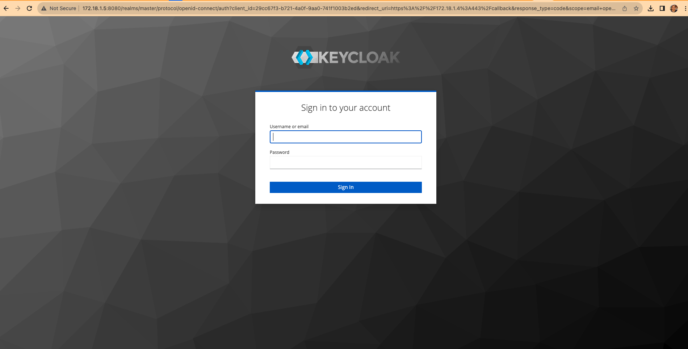
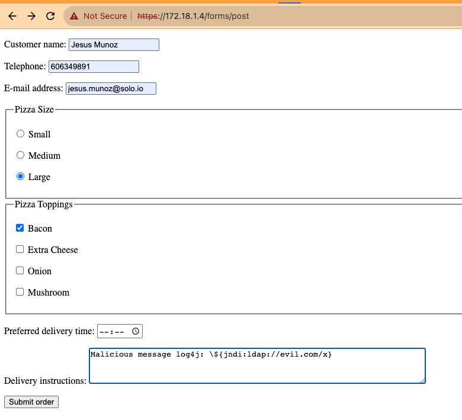
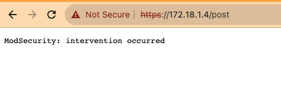
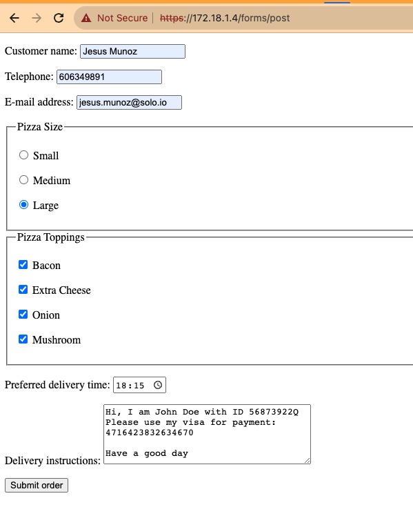
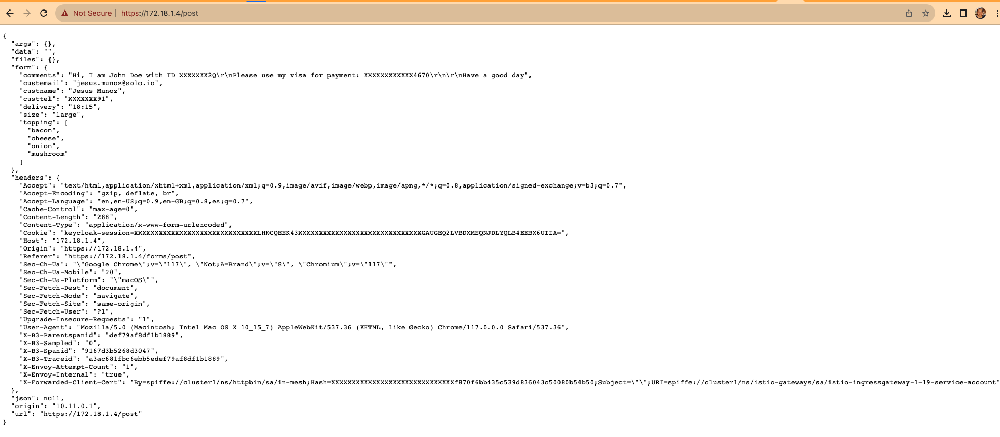

# 5 Essential Steps for Effective Data Loss Prevention: Protect Your Business with Gloo Gateway

## Table of Contents

- [Introduction](#introduction)
1. [Identify your sensitive data](#identify-your-sensitive-data)
2. [Implement strong access controls](#implement-strong-access-controls)
3. [Utilize encryption and other security measures](#utilize-encryption-and-other-security-measures)
4. [Implement DLP policies](#implement-dlp-policies)
   - [Testing time!](#testing-time)
5. [Continuously monitor and update your data loss prevention strategy](#continuously-monitor-and-update-your-data-loss-prevention-strategy)

## Introduction

Data loss prevention (DLP) is a critical component of any organization's security strategy. With the increasing amount of sensitive data being stored and shared online, it's more important than ever to have a comprehensive DLP plan in place.

In this guide, we'll cover the five essential steps for effective data loss prevention. From identifying your sensitive data to implementing strong access controls and utilizing encryption, these steps will help you protect your business from data breaches and other security threats.

Whether you're a small business owner or part of a large enterprise, this guide will provide you with the knowledge and tools you need to safeguard your sensitive data and keep your business secure.

## Identify your sensitive data

Before you can effectively protect your sensitive data, you need to know what it is. Sensitive data can include anything from personal information like names and addresses to financial data like credit card numbers and bank account information.

To identify your sensitive data, start by conducting a thorough inventory of all the data your organization collects and stores. This should include both digital and physical data, such as paper records or backup tapes.

Once you have a complete inventory, categorize the data based on its sensitivity level. This will help you prioritize your protection efforts and ensure that your most sensitive data is receiving the highest level of security.

Some common categories of sensitive data include:

- Personal information (e.g. names, addresses, social security numbers)
- Financial information (e.g. credit card numbers, bank account information)
- Health information (e.g. medical records, insurance information)
- Intellectual property (e.g. patents, trade secrets, proprietary data)
- Legal information (e.g. contracts, legal documents)

By identifying your sensitive data and categorizing it based on its level of sensitivity, you can develop a targeted data loss prevention strategy that will help you protect your most valuable assets.

## Utilize encryption and other security measures

Once you've identified your sensitive data, the next step is to utilize encryption and other security measures to protect your sensitive data. Encryption is the process of converting data into a code that can only be deciphered with a key or password.

We have one of our applications exposed in Gloo Gateway (source code here).

Let's make sure that our application is exposed securely with a TLS certificate.
```
apiVersion: networking.gloo.solo.io/v2
kind: VirtualGateway
metadata:
  name: north-south-gw
  namespace: istio-gateways
spec:
  workloads:
    - selector:
        labels:
          istio: ingressgateway
        cluster: cluster1
  listeners: 
    - http: {}
      port:
        number: 80
# ---------------- Redirect to https --------------------
      httpsRedirect: true
# -------------------------------------------------------
    - http: {}
# ---------------- SSL config ---------------------------
      port:
        number: 443
      tls:
        parameters:
          minimumProtocolVersion: TLSv1_3
        mode: SIMPLE
        secretName: tls-secret
# -------------------------------------------------------
      allowedRouteTables:
        - host: '*'
```

## Implement strong access controls

In addition to enabling encryption in the gateway, next thing to do is to implement strong access controls to ensure that only authorized users can access it. Access controls should be implemented in multiple layers to ensure that a single compromised layer won't grant access to sensitive data.

Here are some best practices for implementing strong access controls:

- Web Application Firewall (WAF) policy
- Authentication with OAuth
- Authorization with Open Policy Agent (OPA)
- Cross-site request forgery (CSRF) policy
- Control access or route traffic based on verified claims in a JSON web token (JWT)

Gloo gateway provides all protections in the list and many more protections (CORS, Rate limiter, LDAP, ApiKeys, etc).

Let's see how easy is to add WAF protection to our app:
```
apiVersion: security.policy.gloo.solo.io/v2
kind: WAFPolicy
metadata:
  name: basic-protection
  namespace: httpbin
spec:
  applyToRoutes:
  - route:
      labels:
        waf: "true"
  config:
    disableCoreRuleSet: true
    customRuleSets:
    - ruleStr: |
        SecRuleEngine On
        SecRequestBodyAccess On
        SecRule REQUEST_HEADERS_NAMES "Proxy-Connection|Lock-Token|Content-Range|Translate|via|if" "log,deny,id:48,status:403,t:lowercase,msg:'Malicious header detected'"
        SecRule REQUEST_LINE|ARGS|ARGS_NAMES|REQUEST_COOKIES|REQUEST_COOKIES_NAMES|REQUEST_BODY|REQUEST_HEADERS|XML:/*|XML://@*  
          "@rx \\\${jndi:(?:ldaps?|iiop|dns|rmi)://" 
          "id:1000,phase:2,deny,status:403,log,msg:'Potential Remote Command Execution: Log4j CVE-2021-44228'"
```

And then a combination of *Authorization* with OAuth 2.0 protocol and *Authorization* with OPA
```
apiVersion: security.policy.gloo.solo.io/v2
kind: ExtAuthPolicy
metadata:
  name: httpbin
  namespace: httpbin
spec:
  applyToRoutes:
  - route:
      labels:
        oauth: "true"
  config:
    server:
      name: ext-auth-server
      namespace: gloo-mesh-addons
      cluster: cluster1
    glooAuth:
      configs:
      - oauth2:
          oidcAuthorizationCode:
            appUrl: "https://${ENDPOINT_HTTPS_GW_CLUSTER1}"
            callbackPath: /callback
            clientId: ${KEYCLOAK_CLIENT}
            clientSecretRef:
              name: oauth
              namespace: httpbin
            issuerUrl: "${KEYCLOAK_URL}/realms/master/"
            logoutPath: /logout
            afterLogoutUrl: "https://${ENDPOINT_HTTPS_GW_CLUSTER1}/get"
            session:
              failOnFetchFailure: true
              redis:
                cookieName: keycloak-session
                options:
                  host: redis:6379
            scopes:
            - email
            headers:
              idTokenHeader: jwt
      - opaAuth:
          modules:
          - name: allow-solo-email-users
            namespace: httpbin
          query: "data.test.allow == true"
```

As you can see, these policies can be added or removed very easily, so you can very quickly get a more than decent level of protection for your data.

## Implement DLP policies

Protecting and controlling who access the data is important, but humans make mistakes, and your applications can also expose sensitive information as credit cards, personal ids and whatnot. This data leaks are usually found in app responses and logs. 

All first-class api gateways allow you to protect from such situations, and with Gloo Gateway this is insanely easy. Let's check how it is done:

```
apiVersion: security.policy.gloo.solo.io/v2
kind: DLPPolicy
metadata:
  name: basic-dlp-policy
  namespace: httpbin
spec:
  applyToRoutes:
  - route:
      labels:
        dlp: "true"
  config:
    sanitize: ALL # Enable DLP masking for both responses bodies and access logs
    actions:
    - predefinedAction: ALL_CREDIT_CARDS
    - predefinedAction: SSN
    - customAction:
        regexActions:
        - regex: '[0-9]{8,8}[A-Za-z]' # Spanish National ID number
        - regex: '((?:ASIA|AKIA|AROA|AIDA)([A-Z0-7]{16}))' # AWS key
        - regex: '([a-zA-Z0-9+/]{40})' # AWS secret
```

### Testing time!

Open the Istio Ingress Gateway external IP from a browser: https://172.18.1.4/forms/post



Let's sign in with user2/passwordin order to pass the first defense filter.

Now we'll try to inject some malicious code:



Oops! Looks like it didn't work


This time we'll include some valid personal data, that will be sent back from the upstream, and hopefully masked by the gateway before getting back to me.



As expected, our data is safe, even in the event of human errors



You can see how easy it is to add different layers of protection using Gloo Gateway policies!

## Continuously monitor and update your data loss prevention strategy

Data loss prevention is an ongoing process, and it's important to continuously monitor and update your strategy to ensure that it remains effective.

Gloo Gateway allows easy integration with OpenTelemetry (OTel). To learn how to configure and set it up, check out this other blogpost from my colleague:

[](https://www.solo.io/blog/service-mesh-for-developers-exploring-the-power-of-observability-and-opentelemetry/)