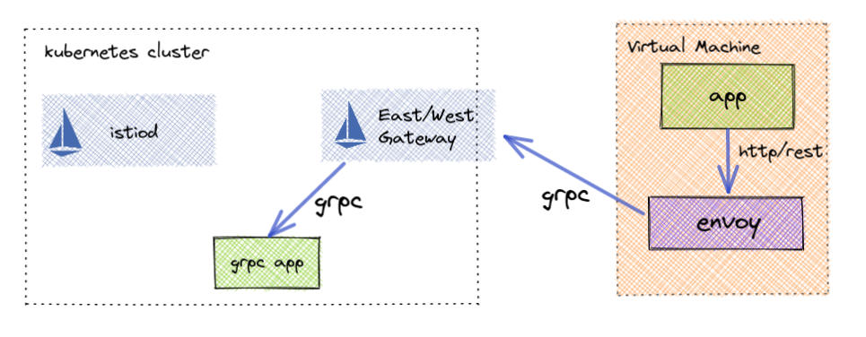

# Connecting Docker VM to Istio
Part 1 Simple VM Architectures- https://istio.io/latest/blog/2021/simple-vms/
Part 2 Implementing Simple VMs - https://www.solo.io/blog/add-virtual-machines-to-istio-service-mesh/

## Prerequisites

* openssl - to generate root ca
* docker-compose (latest)
* k3d (5.2.1+) - setup local kubernetes cluster running in docker
* istioctl (1.9+) - https://istio.io/latest/docs/setup/getting-started/
* jq - https://stedolan.github.io/jq/download/

## Quick Install

```sh
make install
```

## Access mesh service through local envoy
```sh
# test connection
curl localhost:8080/frontend
```
Response
```
{
  "name": "frontend",
  "uri": "/frontend",
  "type": "HTTP",
  "ip_addresses": [
    "10.42.0.11"
  ],
  "start_time": "2021-12-09T21:20:37.287462",
  "end_time": "2021-12-09T21:20:37.287539",
  "duration": "76.577µs",
  "body": "Hello From frontend (call /ui for service graph)",
  "code": 200
}
```

## gRPC to JSON

Translate gRPC requests into REST based ones using envoy



```sh
# make http request to envoy
curl localhost:8080/v1/fortune/solo
```
Response
```json
{
 "message": "Hi there!  This is just a note from me, to you, to tell you, the person\nreading this note, that I can't think up any more famous quotes, jokes,\nnor bizarre stories, so you may as well go home."
}
```

## Files
```sh
├── config
│   ├── app.yaml # deploy frontend application
│   ├── cert-manager.yaml # deploy cert-manager
│   ├── envoy.yaml # local envoy configuration
│   ├── fortune-teller # gRPC application
│   │   ├── app.yaml
│   │   ├── fortune.pb
│   │   ├── fortune.proto
│   │   ├── generate-pb.sh
│   │   └── google
│   │       └── api
│   │           ├── annotations.proto
│   │           └── http.proto
│   ├── istio # Istio installation and configuration
│   │   ├── gateway.yaml
│   │   ├── istiooperator.yaml
│   │   └── istio-root-ca.conf
│   └── k3d-cluster.yaml
├── docker-compose.yml # run locally using docker
└── scripts
    └── gen-certs.sh # Deploy cert-manager and generate all certificates
```

## Makefile
```sh
▶ make help
help:           print this help message
clean-certs:    deletes existing certificates.
gen-certs:      generates new root/ca/workload certificates in certs/.
deploy-istio:   deploys istio to cluster using IstioOperator spec.
docker-init:    sets up docker for use by vm and k3d.
k3d-up:         creates k3d cluster.
k3d-down:       deletes k3d cluster.
vm-up:          creates envoy vm.
vm-down:        deletes envoy vm.
install:        fresh full configuration and installation
teardown:       stops environment and deletes containers.
clean:          cleans up entire working environment.
```
