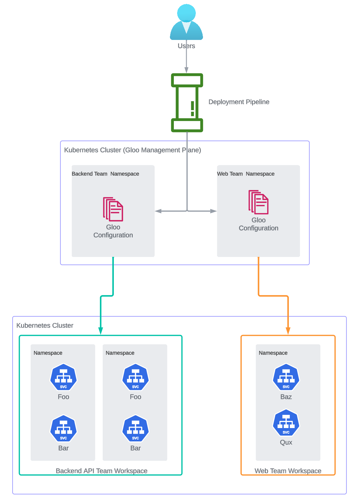
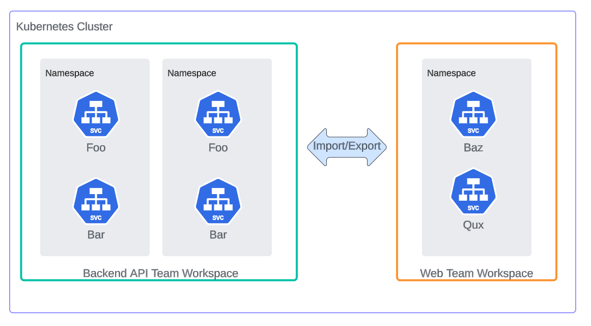
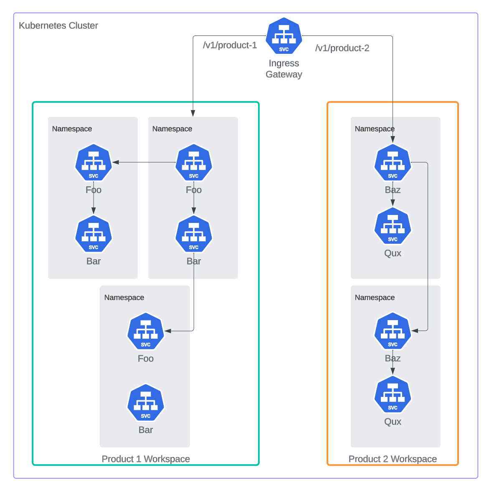
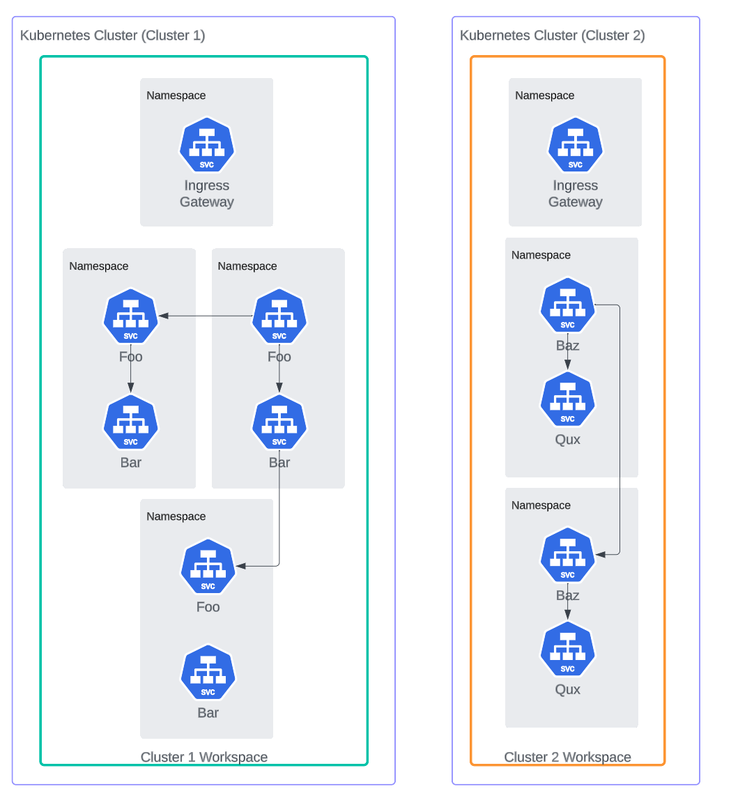
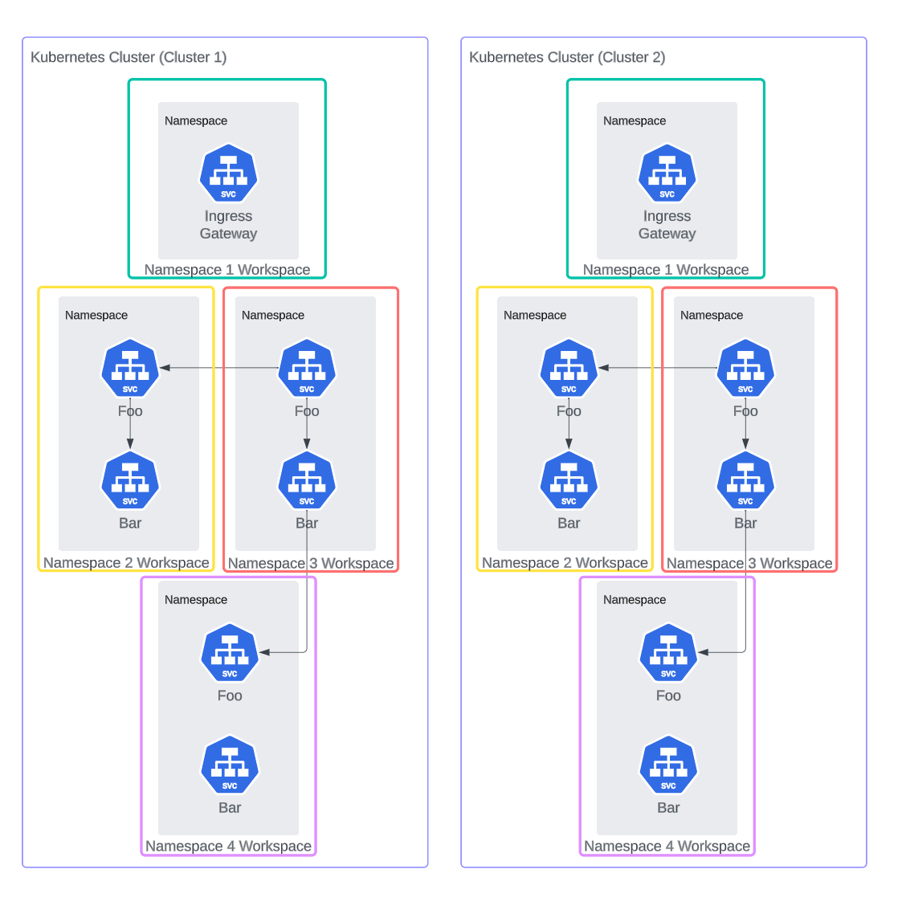
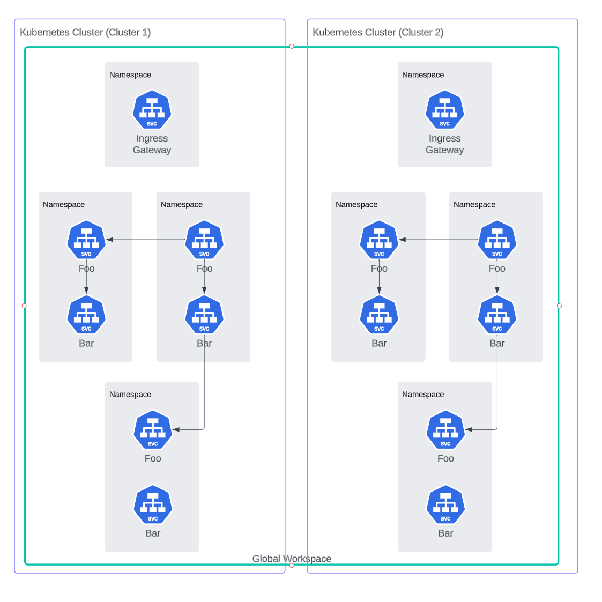

# Workspace Best Practices

As explained in the [Intro](./Intro.md), Workspaces serve 3 main functions, Service Discovery, Security, and Configuration boundaries. The size of your workspace and the namespaces within all affect these three main areas. This blog will explain some common uses of workspaces that Solo.io users have used and the pros and cons of each.

### Configuration Namespace

In many cases it is recommended to create a Gloo "Configuration Namespace" in which all Gloo configuration should be placed. Due to Gloo configuration having Workspace level scope, it could potentially be configuring workloads across many clusters. Although configuration namespaces can be either in a specific workload cluster or Gloo Management Plane cluster, it is recommended to typically use the Gloo Management Plane Cluster. This is because it is much easier to manage and secure Gloo configuration in a single location rather than having to debug it on all clusters. RBAC and CI/CD make it easy for many teams to submit and edit Gloo configuration that is placed in the Management Plane. 

> It is recommended to create a configuration namespace for each workspace in the Gloo Management Plane Cluster. 

By default any Gloo configuration placed into a namespace that is owned by a Workspace will be applied. This includes the Gloo Management Plane cluster as well as workload clusters. For example, a developer could create a RouteTable within their workload namespace and Gloo will accept it as valid configuration. If you do not want this behavior, update the Workspace using the `configEnabled: false` on clusters and namespaces to be ignored.

```yaml
apiVersion: admin.gloo.solo.io/v2
kind: Workspace
metadata:
  name: web-team
  namespace: gloo-mesh
spec:
  workloadClusters:
  - name: 'mgmt-cluster'
    namespaces:
    - name: 'web-team-config'
    configEnabled: true         # Gloo Mesh will read Gloo Mesh configuration from this namespace
  - name: '*'
      namespaces:
      - name: 'web-ui'
    configEnabled: false        # Dont read Gloo Mesh configuration from this namespace
```

The optimal way to place configuration into these namespaces is via automated CI/CD pipelines. Using GitOps is the best approach due to the security, audit, and automation it provides. If users have direct access to the Gloo Management Plane cluster, RBAC rules can be enforced at the namespace level to prevent teams from applying Gloo configuration in workspaces they do not own. 



### Workspace Per Team

Creating a Workspace per team is the recommended starting Workspace architecture recommended by Solo.io.  
Typically per Application team, this Workspace model aligns well with development team responsibilities. Developers will only have access to configure service mesh components for applications that they currently own. Service discovery and security boundary will automatically be scoped to the owned applications. This means that if another team would like to discover and have access to another team's services, an explicit two-way relationship must be established. 



When to try this?
* Good to try when learning Gloo
* When teams deploy their microservices to namespaces they solely own
* Teams own their microservices for long periods of time

Pros:
* Good starting architecture
* Can align teams configuration with RBAC
* Reasonable service discovery boundaries
* Export and Import services with other teams workspaces
* Service discovery is scoped to teams application ownership
* Reasonable security boundaries

Cons:
* If applications changes team ownership, the workspace must change
* Not for companies where Infra teams own all namespaces (thus leading to global namespaces)
* Does not work where many teams own applications in the same namespaces

Example:

* Backend APIs Team Workspace

```yaml
apiVersion: admin.gloo.solo.io/v2
kind: Workspace
metadata:
  name: backend-apis-team
  namespace: gloo-mesh
spec:
  workloadClusters:
  # Configuration Namespace
  - name: 'mgmt'
    namespaces:
    - name: backend-apis-team
  # Workload namespace owned by backend-apis-team (any cluster) 
  - name: '*'
    namespaces:
    - name: backend-apis
    - name: other-backend-apis
---
apiVersion: admin.gloo.solo.io/v2
kind: WorkspaceSettings
metadata:
  name: settings
  # Configuration namespace
  namespace: backend-apis-team
spec:
  # Share service discovery with web-team
  exportTo:
  - workspaces:
    - name: web-team
  options:
    serviceIsolation:
      # Allow access within workspace
      enabled: true
      # Scope service discovery to workspace
      trimProxyConfig: true
```

* Web Team Workspace
```yaml
apiVersion: admin.gloo.solo.io/v2
kind: Workspace
metadata:
  name: web-team
  namespace: gloo-mesh
spec:
  workloadClusters:
  # Configuration Namespace for web-team
  - name: 'mgmt'
    namespaces:
    - name: web-team
  # Workload namespace owned by web-team (any cluster) 
  - name: '*'
    namespaces:
    - name: web-ui
---
apiVersion: admin.gloo.solo.io/v2
kind: WorkspaceSettings
metadata:
  name: settings
  # Configuration namespace on mgmt cluster
  namespace: web-team
spec:
  # Import service discovery from backend-apis-team
  importFrom:
  - workspaces:
    - name: backend-apis-team
  options:
    serviceIsolation:
      # Allow access within workspace
      enabled: true
      # Scope service discovery to workspace
      trimProxyConfig: true
```

### Workspace Per Product

If many teams are contributing microservices as a part of a product or API and they are responsible for certain features, this Workspace architecture might be better suited for them. This architecture assumes that there is no clear ownership by teams for their microservices or the microservices are co-mingled in the same namespace or set of namespaces. Often these types of products are deployed in "packages" where all the microservices are deployed and promoted at the same time. 



When to try this?
* Microservices are co-mingled with other teams
* A collection of microservices make up a larger function or product
* Team ownership of microservices changes hands frequently
* Microservice are deployed in "packages" or move together
* Self contained microservices and little cross product communication  

Pros:
* Configuration scope is at project level
* Do not need to change configuration if team ownership changes
* Typically cross product communication is at API Gateway level

Cons:
* If product is 100s or 1000s of microservices, this may be too large for a single workspace
* Allows many users to apply configuration to same set of microservices

**(Optional) Workspace Per Feature** - If the product is very large, a smaller scoped approach could be to create workspaces per feature as a part of a larger product. This limits scope and might improve performance if many of these features are just APIs behind a larger API set. 

Example:

* Product 1 Workspace

```yaml
apiVersion: admin.gloo.solo.io/v2
kind: Workspace
metadata:
  name: product-1
  namespace: gloo-mesh
spec:
  workloadClusters:
  # Configuration Namespace
  - name: 'mgmt'
    namespaces:
    - name: product-1
  # All microservices for this API product
  - name: '*'
    namespaces:
    - name: product-1-web
    - name: product-1-frontend
    - name: product-1-backend
---
apiVersion: admin.gloo.solo.io/v2
kind: WorkspaceSettings
metadata:
  name: settings
  # Configuration namespace in mgmt cluster
  namespace: product-1
spec:
  # No shared service discovery
  exportTo: {}
  importFrom: {}
  options:
    serviceIsolation:
      # All microservices in product can access each other
      enabled: true
      # All microservices in product can discover each other
      trimProxyConfig: true
```

* Product 2 Workspace
```yaml
apiVersion: admin.gloo.solo.io/v2
kind: Workspace
metadata:
  name: product-2
  namespace: gloo-mesh
spec:
  workloadClusters:
  # Configuration Namespace
  - name: 'mgmt'
    namespaces:
    - name: product-2
  # All microservices for this API product
  - name: '*'
    namespaces:
    - name: product-2-apis
    - name: product-2-datasources
---
apiVersion: admin.gloo.solo.io/v2
kind: WorkspaceSettings
metadata:
  name: settings
  # Configuration namespace in mgmt cluster
  namespace: product-2
spec:
  # No shared service discovery
  exportTo: {}
  importFrom: {}
  options:
    serviceIsolation:
      # All microservices in product can access each other
      enabled: true
      # All microservices in product can discover each other
      trimProxyConfig: true
```

### Workspace Per Cluster

A Workspace per cluster closely aligns with an Istio deployment. Service discovery, security, and configuration will retain the same level of scope as a non Gloo Istio deployment. This may be optimal if deploying Gloo to a cluster that already contains a mature Istio deployment. This can prevent Gloo from writing Istio configuration that would potentially conflict with the existing configuration. Long term some tuning may be needed if the cluster becomes too large or multiple teams are sharing resources which could cause cross cutting concerns. Use `TrimProxyConfigPolicy` and `AccessPolicies` to scope the resources further.



When to try this?
* Mature Istio deployment already exists on cluster
* Each development team is given their own cluster
* Platform Teams own clusters and deployments rather than developer teams

Pros:
* Works well with existing Istio implementations
* If services do not communicate between clusters

Cons:
* If product is 100s or 1000s of microservices, this may be too large for a single workspace
* Allows many users to apply configuration to same set of microservices


Example

* Cluster 1 - It is recommended to use labels for namespace selection as to not discover non mesh namespaces. If using revisions it is recommended to use some other unique label for all workspace owned namespaces, for example `solo.io/workspace: enabled` due to the revision label changing with each deployment. If using revision tags in Istio you could select this label instead. 

```yaml
apiVersion: admin.gloo.solo.io/v2
kind: Workspace
metadata:
  name: cluster-1
  namespace: gloo-mesh
spec:
  workloadClusters:
  # Configuration Namespace
  - name: 'mgmt'
    namespaces:
    - name: cluster-1-gloo-config
  # All microservices in cluster-1 that are mesh enabled
  - name: 'cluster-1'
    namespaces:
    - name: '*'
      labels:
        istio-injection: enabled
---
apiVersion: admin.gloo.solo.io/v2
kind: WorkspaceSettings
metadata:
  name: settings
  # Configuration namespace in mgmt cluster
  namespace: cluster-1
spec:
  # No shared service discovery between clusters
  exportTo: {}
  importFrom: {}
  options:
    serviceIsolation:
      # All microservices in cluster can access each other
      enabled: true
      # All microservices in cluster can discover each other
      trimProxyConfig: true
```

* Cluster 2

```yaml
apiVersion: admin.gloo.solo.io/v2
kind: Workspace
metadata:
  name: cluster-2
  namespace: gloo-mesh
spec:
  workloadClusters:
  # Configuration Namespace
  - name: 'mgmt'
    namespaces:
    - name: cluster-2-gloo-config
  # All microservices in cluster-2 that are mesh enabled
  - name: 'cluster-2'
    namespaces:
    - name: '*'
      labels:
        istio-injection: enabled
---
apiVersion: admin.gloo.solo.io/v2
kind: WorkspaceSettings
metadata:
  name: settings
  # Configuration namespace in mgmt cluster
  namespace: cluster-2-gloo-config
spec:
  # No shared service discovery between clusters
  exportTo: {}
  importFrom: {}
  options:
    serviceIsolation:
      # All microservices in cluster can access each other
      enabled: true
      # All microservices in cluster can discover each other
      trimProxyConfig: true
```

### Workspace Per Namespace

Some users have opted to create a unique Workspace per namespace that spans all clusters. In many cases these users also deploy a single microservice per namespace as well. They use this architecture because the namespace semantics allow for good isolation boundaries for most products including Gloo. This approach leads to many more namespaces and thus Workspaces than other traditional models and can have a significant impact on configuration debt and potentially control plane performance.Gloo Platform can support thousands of Workspaces and can accommodate these types of architectures. Due to the configuration heavy nature, it is advised to have strong automation to generate and manage the configuration at scale.



When to try this?
* When each microservice is deployed to its own namespace
* Controlling for all ingress and egress communication to each namespace
* Clusters are replicated in other regions with the same namespace architecture
* Clusters are managed by a centralized OPs team

Pros:
* Fine grained control of ingress and egress to each namespace
* Highly scoped service discovery to help with performance
* Each dependency is well defined

Cons:
* Requires lots of Gloo configuration
* Development teams need to know and describe service dependencies
* Resource pressure on the Gloo Management Plane to enforce fine grained policies at scale


Example

```yaml
apiVersion: admin.gloo.solo.io/v2
kind: Workspace
metadata:
  name: istio-ingress
  namespace: gloo-mesh
spec:
  workloadClusters:
  # Istio Ingress workspace
  - name: '*'
    namespaces:
    - name: istio-ingress
---
apiVersion: admin.gloo.solo.io/v2
kind: WorkspaceSettings
metadata:
  name: settings
  namespace: istio-ingress
spec:
  # Access to routing to namespace-2
  importFrom:
  - workspaces:
    - name: namespace-2
```

* Namespace 2
```yaml
apiVersion: admin.gloo.solo.io/v2
kind: Workspace
metadata:
  name: namespace-2
  namespace: gloo-mesh
spec:
  workloadClusters:
  - name: '*'
    namespaces:
    - name: namespace-2
---
apiVersion: admin.gloo.solo.io/v2
kind: WorkspaceSettings
metadata:
  name: settings
  namespace: namespace-2
spec:
  # Share services with istio-ingress
  exportTo:
  - workspaces:
    - name: istio-ingress
  importFrom:
  - workspaces:
    - name: namespace-3
```

* Namespace 3
```yaml
apiVersion: admin.gloo.solo.io/v2
kind: Workspace
metadata:
  name: namespace-3
  namespace: gloo-mesh
spec:
  workloadClusters:
  - name: '*'
    namespaces:
    - name: namespace-3
---
apiVersion: admin.gloo.solo.io/v2
kind: WorkspaceSettings
metadata:
  name: settings
  namespace: namespace-3
spec:
  # Share services with namespace-2, import namespace-4
  exportTo:
  - workspaces:
    - name: namespace-2
  importFrom:
  - workspaces:
    - name: namespace-4
```

* Namespace 4
```yaml
apiVersion: admin.gloo.solo.io/v2
kind: Workspace
metadata:
  name: namespace-4
  namespace: gloo-mesh
spec:
  workloadClusters:
  - name: '*'
    namespaces:
    - name: namespace-4
---
apiVersion: admin.gloo.solo.io/v2
kind: WorkspaceSettings
metadata:
  name: settings
  # Configuration namespace
  namespace: namespace-4
spec:
  # Share services with namespace-3
  exportTo:
  - workspaces:
    - name: namespace-3
```


### Global Workspace

A global workspace is a single workspace that spans all clusters and all namespaces. The only time this is recommended is if the end user uses Gloo Platform solely for Gloo Gateway and does not have any workloads running in the mesh. The reason is that Gateway use cases do not benefit from the service discovery, configuration scope or security from Workspaces as much as mesh workloads. 

> If the workload clusters do contain mesh workloads managed by Gloo, this is not recommended. 

The reason it is not recommended for mesh workloads owned by Gloo is due to the fact that scope is global for security, configuration, and service discovery. This can lead to decreased performance and potentially worse security practices. 



When to try this?
* Gateway only use case and no mesh workloads

Pros:
* Very little Gloo configuration needed

Cons:
* Increased resource consumption on mesh workloads
* Incorrect configurations could impact everything Gloo manages
* All mesh workloads can see and access each other, regardless of cluster

Example 

* Global Workspace - it is recommended to use labels to only select mesh enabled namespaces. If using revisions it is recommended to use some other unique label for all workspace owned namespaces, for example `solo.io/workspace: enabled` due to the revision label changing with each deployment. If using revision tags in Istio you could select this label instead. 
```yaml
apiVersion: admin.gloo.solo.io/v2
kind: Workspace
metadata:
  name: global
  namespace: gloo-mesh
spec:
  workloadClusters:
  # All microservices that are mesh enabled
  - name: '*'
    namespaces:
    - name: '*'
      labels:
        istio-injection: enabled
---
apiVersion: admin.gloo.solo.io/v2
kind: WorkspaceSettings
metadata:
  name: settings
  # Configuration namespace in mgmt cluster
  namespace: gloo-mesh
spec: {}
```