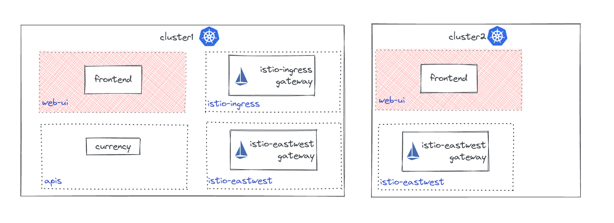

# Gloo Mesh Workspaces

Gloo Mesh Workspaces set the foundation for building a mutli-cluster/multi-tenant service mesh. Workspaces serve as a logical separation of services and policies to reduce risk and scope when operating on your environment.

Workspaces were created for organizations to better represent the logical business functions as it relates to managing services within your company. For example, a Workspace could represent the services a team/product/line of business needs to manage. 

**What is a Workspace?**

Workspaces serve a few different purposes as it relates to a service mesh. 

* Service Discovery - Workspaces must select the clusters and namespace that it represents. Services that run in these namespaces will be added to a service discovery group. A Developer then will be able to implement service mesh features for these services. By default, services within the same Workspace can 'see' other services within the same workspace but not services in other workspaces. 
* Routing - 
* Policy Enforcement
* Security 


**How do Workspaces interact with other Workspaces?**


## Default Workspaces

Here are some recommended example workspaces for users just getting started with Gloo Mesh. These workspaces have been simplified so that users can get up and running without worrying about the advanced features.


>The below examples will utilize workspaces to represent different teams within an organization.
>
>- web-team - Team responsible for managing the frontend UI application
>- ops-team - Manages cluster operations and Ingress gateways
>- apis-team - Manages backend API services


* Wildcard clusters - The below Workspace utilizes a wildcard `*` for the cluster name to represent any cluster in the environment that has the namespace `web-ui`. One advantage of using wildcards is that as new clusters are added, if they contain the namespace `web-ui` they will automatically be added to said Workspace. 

```yaml
apiVersion: admin.gloo.solo.io/v2
kind: Workspace
metadata:
  name: web-team
  namespace: gloo-mesh
spec:
  workloadClusters:
  - name: '*'            # any cluster that has the namespace 'web-ui'
    namespaces:
    - name: web-ui
```
The above configuration will create the `web-team` Worksapace which contains both of the `frontend` services in `cluster1` and `cluster2` because both clusters contain the namespace `web-ui`




* Wildcard namespaces - Some users may want to allow any service within a cluster to belong to a workspace regardless of the namespace it is in. You can wildcard the namespace to include all namespaces within a given cluster. 

```yaml
apiVersion: admin.gloo.solo.io/v2
kind: Workspace
metadata:
  name: web-team
  namespace: gloo-mesh
spec:
  workloadClusters:
  - name: 'cluster1'            # all namespaces in cluster1
    namespaces:
    - name: '*'
---
apiVersion: admin.gloo.solo.io/v2
kind: Workspace
metadata:
  name: apis-team
  namespace: gloo-mesh
spec:
  workloadClusters:
  - name: 'cluster2'            # all namespaces in cluster2
    namespaces:
    - name: '*'
```


* Wildcard namespaces match labels - Using a wildcard for all namespace within a cluster may include namespaces not intended to be managed by Gloo Mesh. You can filter the workspace using namespace label selectors. The below example only selects namespaces where Istio sidecars are enabled.

```yaml
apiVersion: admin.gloo.solo.io/v2
kind: Workspace
metadata:
  name: web-team
  namespace: gloo-mesh
spec:
  workloadClusters:
  - name: 'cluster1'            # all namespaces in cluster1 with label istio-injection=enabled
    namespaces:
    - name: '*'
      labels:
        istio-injection: enabled
```


* Exact namespaces - In some cases, users may want to select specific namespaces that belong to a Workspace. This creats a 'static' Workspace that will not update dynamically as new namespaces and clusters are added. 

```yaml
apiVersion: admin.gloo.solo.io/v2
kind: Workspace
metadata:
  name: ops-team
  namespace: gloo-mesh
spec:
  workloadClusters:
  - name: 'cluster1'            # istio-ingress and istio-eastwest in cluster1
    namespaces:
    - name: 'istio-ingress'
    - name: 'istio-eastwest'
  - name: 'cluster2'            # istio-eastwest in cluster2
    namespaces:
    - name: 'istio-eastwest'
```


## East West Gateways


## Gloo Mesh Addons


## Import / Export


### Service Selection


### Service Isolation