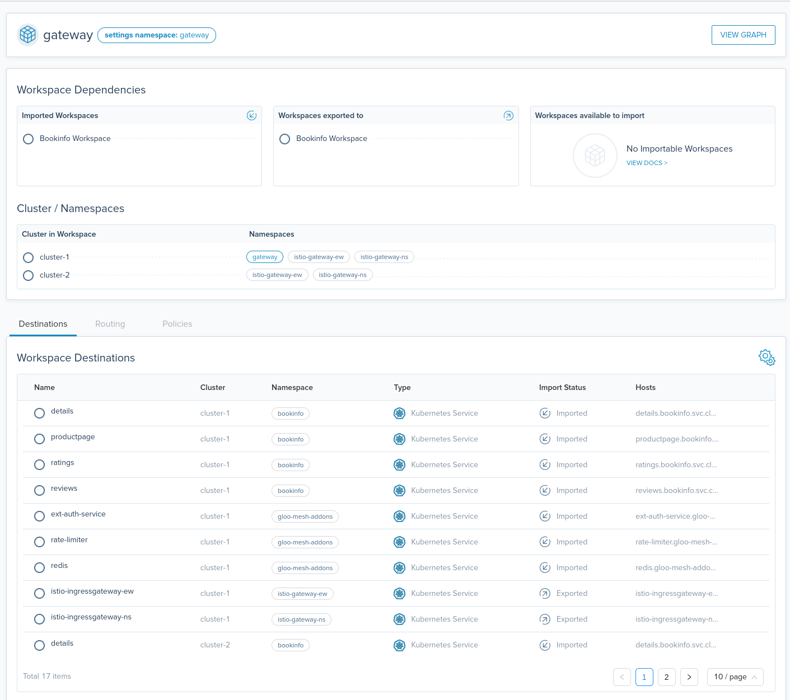
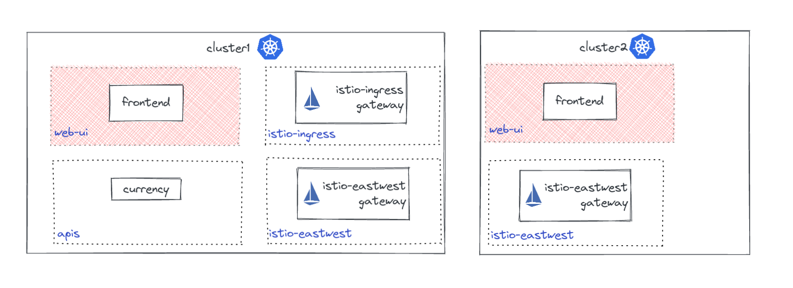
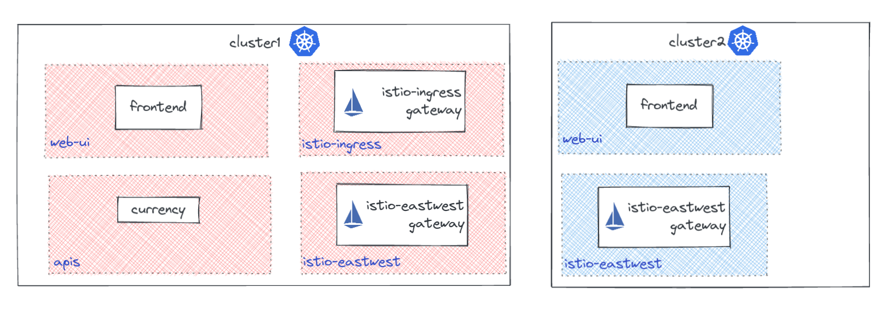
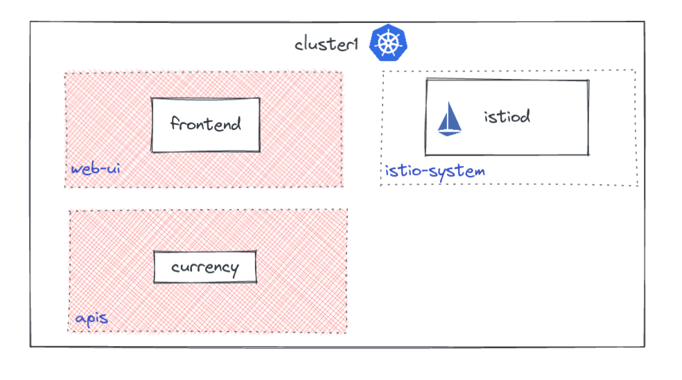
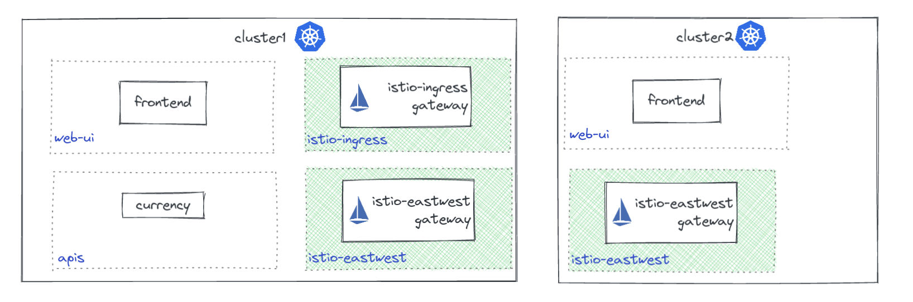
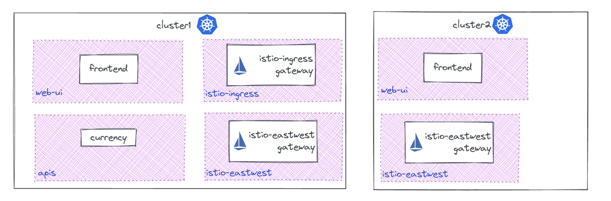
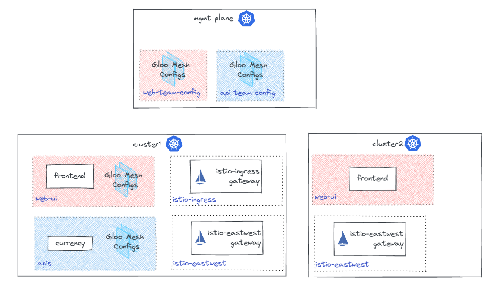
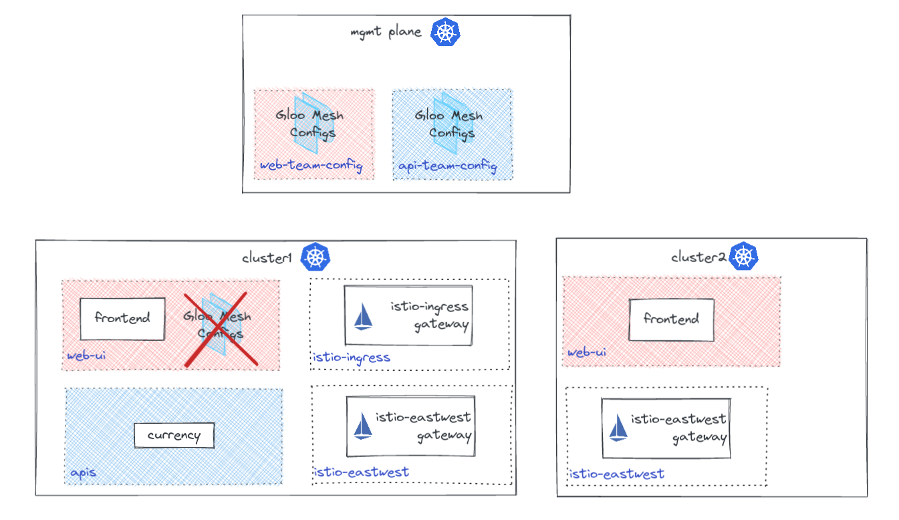
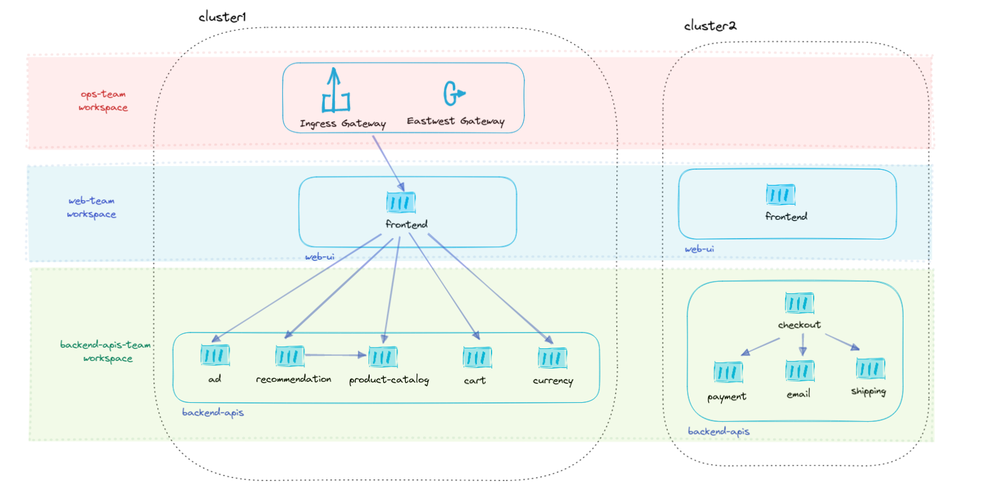

# Gloo Mesh Workspaces

- [Workspace Config](#workspaces)
  * [Gateways](#gateways)
  * [Gloo Mesh Addons](#gloo-mesh-addons)
- [WorkspaceSettings](#workspacesettings)
  * [Federation](#federation)
  * [Eastwest Gateway Selection](#eastwest-gateway-selection)
  * [Import / Export](#import-export)
  * [Service Isolation (recommended)](#service-isolation)
- [Full Example](#full-example)


Gloo Mesh Workspaces set the foundation for building a mutli-cluster/multi-tenant service mesh. Workspaces serve as a logical separation of services and policies to reduce risk and scope when operating on your environment.

Workspaces were created for organizations to better represent the logical business functions as it relates to managing services within your company. For example, a Workspace could represent the services a team/product/line of business needs to manage. 

**What is a Workspace?**

Workspaces serve a few different purposes as it relates to a service mesh. 

* Service Discovery - Workspaces must select the clusters and namespace that it represents. Services that run in these namespaces will be added to a service discovery group. A Developer then will be able to implement service mesh features for these services. By default, services within the same Workspace can 'see' other services within the same workspace but not services in other workspaces. 
* Routing - Workspaces are a logical boundary for which services can route to one another. To route to services in other workspaces one must import/export with that Workspace.
* Policy Enforcement - Workspaces define the scope at which a policy can impact your environment. This helps reduce the blast radius of a misconfiguration. 
* Security - Workspaces set a virtual boundary to protect services from traffic outside of the given Workspace. 
* Gloo Mesh Configuration - Gloo Mesh configs will only apply to the workspace of which they are associated. The Gloo Mesh config must be in one of the contained namespaces in a Workspace. 

**How do Workspaces interact with other Workspaces?**

Most use cases require sevices to communicate with services from other Workspaces. To establish a relationship with another Workspace, both Workspaces must agree to the union. The source Workspace must `export` its resources and the destination Workspace must `import` the sources resources. This is an important security detail to prevent either side from inadvertantly oversharing with other Workspaces. 

Some examples of Workspace relationships
* Ingress gateway workspace imports Workspaces that will recieve traffic that flows through the gateway.
* Services from one Workspace need to communicate with Services in another Workspace so each Workspace imports/exports to the other.
* One Workspace wants to share its APIs with all other Workspaces.




# Workspace Configuration

Here are some recommended example workspaces for users just getting started with Gloo Mesh.

**Workspace configs must be placed in the `gloo-mesh` namespace in the management cluster.**

>The below examples will utilize workspaces to represent different teams within an organization.
>
>- web-team - Team responsible for managing the frontend UI application
>- ops-team - Manages cluster operations and Ingress gateways
>- apis-team - Manages backend API services


* **Wildcard clusters** - The below Workspace utilizes a wildcard `*` for the cluster name to represent any cluster in the environment that has the namespace `web-ui`. One advantage of using wildcards is that as new clusters are added, if they contain the namespace `web-ui` they will automatically be added to said Workspace. 

```yaml
apiVersion: admin.gloo.solo.io/v2
kind: Workspace
metadata:
  name: web-team
  namespace: gloo-mesh
spec:
  workloadClusters:
  - name: '*'            # any cluster that has the namespace 'web-ui'
    namespaces:
    - name: web-ui
```
The above configuration will create the `web-team` Worksapace which contains both of the `frontend` services in `cluster1` and `cluster2` because both clusters contain the namespace `web-ui`




* **Wildcard namespaces** - Some users may want to allow any service within a cluster to belong to a workspace regardless of the namespace it is in. You can wildcard the namespace to include all namespaces within a given cluster. 

```yaml
apiVersion: admin.gloo.solo.io/v2
kind: Workspace
metadata:
  name: web-team
  namespace: gloo-mesh
spec:
  workloadClusters:
  - name: 'cluster1'            # all namespaces in cluster1
    namespaces:
    - name: '*'
---
apiVersion: admin.gloo.solo.io/v2
kind: Workspace
metadata:
  name: apis-team
  namespace: gloo-mesh
spec:
  workloadClusters:
  - name: 'cluster2'            # all namespaces in cluster2
    namespaces:
    - name: '*'
```



* **Wildcard namespaces match labels** - Using a wildcard for all namespace within a cluster may include namespaces not intended to be managed by Gloo Mesh. You can filter the workspace using namespace label selectors. The below example only selects namespaces where Istio sidecars are enabled.

```yaml
apiVersion: admin.gloo.solo.io/v2
kind: Workspace
metadata:
  name: web-team
  namespace: gloo-mesh
spec:
  workloadClusters:
  - name: 'cluster1'            # all namespaces in cluster1 with label istio-injection=enabled
    namespaces:
    - name: '*'
      labels:
        istio-injection: enabled
```



* **Exact namespaces** - In some cases, users may want to select specific namespaces that belong to a Workspace. This creats a 'static' Workspace that will not update dynamically as new namespaces and clusters are added. 

```yaml
apiVersion: admin.gloo.solo.io/v2
kind: Workspace
metadata:
  name: ops-team
  namespace: gloo-mesh
spec:
  workloadClusters:
  - name: 'cluster1'            # istio-ingress and istio-eastwest in cluster1
    namespaces:
    - name: 'istio-ingress'
    - name: 'istio-eastwest'
  - name: 'cluster2'            # istio-eastwest in cluster2
    namespaces:
    - name: 'istio-eastwest'
```




* **Global Workspace** - In some cases it may be easier to include all services within the same workspace. This means that they all share the same service discovery policies and security. This is only recommended for beginners learning gloo mesh as long term **it may have potential performance issues**.

```yaml
apiVersion: admin.gloo.solo.io/v2
kind: Workspace
metadata:
  name: global
  namespace: gloo-mesh
spec:
  workloadClusters:
  - name: '*'            # all namespaces in all clusters
    namespaces:
    - name: '*'
```




* **Management Plane Configuration Namespace** - It is recommended that a user store their Gloo Mesh Configuration (VirtualGateways/RouteTables/Policies/etc.) in the management plane unless otherwise stated. To make sure the correct configuration makes it to the right workspace, its recommended to create a `config` namespace per workspace in the mgmt plane like so.

```yaml
apiVersion: admin.gloo.solo.io/v2
kind: Workspace
metadata:
  name: web-team
  namespace: gloo-mesh
spec:
  workloadClusters:
  - name: 'mgmt-cluster'       # gloo mesh configuration only namespace in the management plane
    namespaces:
    - name: 'web-team-config'
  - name: '*'                  # any cluster that has the namespace 'web-ui'
      namespaces:
      - name: 'web-ui'
---
apiVersion: admin.gloo.solo.io/v2
kind: Workspace
metadata:
  name: apis-team
  namespace: gloo-mesh
spec:
  workloadClusters:
  - name: 'mgmt-cluster'       # gloo mesh configuration only namespace in the management plane
    namespaces:
    - name: 'apis-team-config'
  - name: 'cluster1'           # apis namespace in cluster1
      namespaces:
      - name: 'aips'
```



* **Config Only Namespaces** - By default Gloo Mesh will read Gloo Mesh configuration from **ANY** namespace that is in the Workspace. If you would like to limit who and where Gloo Mesh configuration can be read, you can use the `configEnabled: true|false` field.

```yaml
apiVersion: admin.gloo.solo.io/v2
kind: Workspace
metadata:
  name: web-team
  namespace: gloo-mesh
spec:
  workloadClusters:
  - name: 'mgmt-cluster'
    namespaces:
    - name: 'web-team-config'
    configEnabled: true         # Gloo Mesh will read Gloo Mesh configuration from this namespace
  - name: '*'
      namespaces:
      - name: 'web-ui'
    configEnabled: false        # Dont read Gloo Mesh configuration from this namespace
```



## Gateways

* Ingress Gateways - In order to apply Gloo Mesh configuration to Istio ingress gateways it will need to be a part of a workspace. It is typically recommended to be in a separate workspace than the developer applications so it can be managed separately, especially when shared by multiple workspaces. It will be explained below in WorkspaceSettings how to share this ingress gateway with multiple workspaces.

```yaml
apiVersion: admin.gloo.solo.io/v2
kind: Workspace
metadata:
  name: ops-team
  namespace: gloo-mesh
spec:
  workloadClusters:
  - name: 'cluster1'            # istio-ingress and istio-eastwest in cluster1
    namespaces:
    - name: 'istio-ingress'
```

* Eastwest Gateways - Istio eastwest gateways are required for multi cluster routing within Gloo Mesh. These gateways just need to exist in a workspace to enable multi cluster routing for all workspaces. It is recommended to have a workspace 

```yaml
apiVersion: admin.gloo.solo.io/v2
kind: Workspace
metadata:
  name: gloo-mesh-internal
  namespace: gloo-mesh
spec:
  workloadClusters:
  - name: '*'            # selects istio-eastwest namespaces in all clusters
    namespaces:
    - name: 'istio-eastwest'
```


## Gloo Mesh Addons

If you have deployed the gloo-mesh-addons features you will need to include them into a Workspace. If these addons are being used by multiple Workspaces, it is recommended to place these into a separate Workspace and use WorkspaceSettings to export them. Alternatively you could include them in the `gloo-mesh-internal` workspace described above with the `istio-eastwest` gateways.

```yaml
apiVersion: admin.gloo.solo.io/v2
kind: Workspace
metadata:
  name: gloo-mesh-addons
  namespace: gloo-mesh
spec:
  workloadClusters:
- name: '*'                   ## any cluster that has the namespace 'gloo-mesh-addons'
    namespaces:
    - name: 'gloo-mesh-addons'

```


# WorkspaceSettings

The WorkspaceSettings API allows each Workspace administrator to decide which other workspaces it interacts with. There are a number of settings discussed below that allow Gloo Mesh users to tune their environment based on their use cases.

## Federation

Federation is one of the main features within Gloo Mesh. It is the mechanism in which makes applications discoverable and routable from other clusters. In almost all cases it is recommended to enable federation if the applications within the workspace need multi-cluster availability.

> When federation is enabled, Gloo Mesh creates Istio ServiceEntries in each cluster that are used for multi cluster routing. Example....
> ```yaml
>apiVersion: networking.istio.io/v1beta1
>kind: ServiceEntry
>metadata:
>  generation: 1
>  name: vd-frontend-currency-apis-svc-cluster2-apis-team
>  namespace: currency-apis
>spec:
>  addresses:
>  - 252.38.49.193
>  endpoints:
>  - address: 172.18.0.7
>    labels:
>      app: frontend
>      security.istio.io/tlsMode: istio
>      version: v1
>    ports:
>      http-8080: 15443
>      http2-9080: 15443
>  exportTo:
>  - .
>  hosts:
>  - currency.apis.svc.cluster2
>  location: MESH_INTERNAL
>  ports:
>  - name: http-8080
>    number: 8080
>    protocol: HTTP
>  - name: http2-9080
>    number: 9080
>    protocol: HTTP2
>  resolution: STATIC
>  subjectAltNames:
>  - spiffe://cluster2.solo.io/ns/apis/sa/currency
> ```

* Recommended Default

```yaml
apiVersion: admin.gloo.solo.io/v2
kind: WorkspaceSettings
metadata:
  name: web-team
  namespace: web-team-config
spec:
  options:
    federation:
      enabled: true  # enables multi-cluster routing between services in this Workspace
...
```

* Optional Filtering - in larger workspaces it may make more sense to only federate a subset of services that are used for multi cluster routing.

```yaml
apiVersion: admin.gloo.solo.io/v2
kind: WorkspaceSettings
metadata:
  name: web-team
  namespace: web-team-config
spec:
  options:
    federation:
      enabled: true       # enables multi-cluster routing/availability for services in `web-ui` namespace
      serviceSelector:
      - namespace: web-ui
```

## Eastwest Gateway Selection

Users have the option to chose the eastwest gateways used for multi-cluster routing if multiple are deployed. By default, it is recommended to use the following configuration for most deployments of Istio, Gloo Mesh will look for a port named `tls` on the gateway to facilitate the routing.

```yaml
apiVersion: admin.gloo.solo.io/v2
kind: WorkspaceSettings
metadata:
  name: web-team
  namespace: web-team-config
spec:
  options:
    eastWestGateways:
    - selector:
        labels:
          istio: eastwestgateway       # select any Gateway with the following label
        # port:
        #   name: cross-cluster-mtls   # optional override of named port used for mtls
...
```

## Import / Export <a name="import-export"></a>

To form a relationship between two Workspaces, **both workspaces must agree to the relationship**. This is done by one Workspace exporting its services, VirtualDestinations, RouteTables, or VirtualGateways, and another workspace importing them. 

> The services, VirtualDestinations, RouteTables, and VirtualGateways that are exported and imported can be filtered using selectors to reduce the amount of information shared. 

**Importing other Workspaces** - Allows the current Workspace to 'import' services, VirtualDestinations, RouteTables, and VirtualGateways from another workspace. The other workspace must export to the current workspace or resources will not be shared.

* **Importing a Workspace (recommended)**
```yaml
apiVersion: admin.gloo.solo.io/v2
kind: WorkspaceSettings
metadata:
  name: ops-team
  namespace: ops-team-config
spec:
  importFrom:
  - workspaces:
    - name: web-team
...
```

* **Import using label selectors (not recommended)** - Optionally you can import any Workspace that has a given label. This is considered an advanced feature and not recommended for most environments. **This relinquishes the ability for your workspace to control which workspaces it imports and could have unintended side affects.**

```yaml
apiVersion: admin.gloo.solo.io/v2
kind: WorkspaceSettings
metadata:
  name: web-team
  namespace: web-team-config
spec:
  importFrom:
  - workspaces:
    - selector:
        allow_ingress: "true"
...
---
apiVersion: admin.gloo.solo.io/v2
kind: Workspace
metadata:
  name: apis-team
  namespace: gloo-mesh
  labels:
    allow_ingress: "true"
spec:
  workloadClusters:
  - name: cluster1
    namespaces:
    - name: apis
```

* **Import specific resources (advanced)** - In certain situations you may be importing from a large Workspace that has a lot of services. You can filter those resources using the resource selector on `importFrom` shown below. **If you only import specific kinds, it may be difficult to debug why your applciation or Gloo Mesh configuration cannot route to or attach to a specific resource.**

  > resource kinds: ALL, SERVICE, ROUTE_TABLE, VIRTUAL_DESTINATION, EXTERNAL_SERVICE

```yaml
apiVersion: admin.gloo.solo.io/v2
kind: WorkspaceSettings
metadata:
  name: web-team
  namespace: web-team-config
spec:
  options:
    eastWestGateways:
    - selector:
        labels:
          istio: eastwestgateway
    federation:
      enabled: false
  importFrom:
  - workspaces:
    - name: apis-team
    resources:
    - kind: VIRTUAL_DESTINATION      # Import VirtualDestinations created in the backend-apis-team-config namespace on the mgmt-cluster
      namespace: apis-team-config
      cluster: mgmt-cluster
    - kind: SERVICE                  # import kubernetes services from the apis namespace belonging to the apis team
      namespace: apis
```

**Exporting to other Workspaces** - Shares services, VirtualDestinations, RouteTables, and VirtualGateways with another workspace. Requires the other workspace to 'import' the current workspace

```yaml
apiVersion: admin.gloo.solo.io/v2
kind: WorkspaceSettings
metadata:
  name: web-team
  namespace: web-team
spec:
  exportTo:
  - workspaces:
    - name: ops-team               # export web-team service and Gloo Mesh config with ops-team Workspace
```

* **Export specific resources (advanced)** - A Workspace may contain service meant for outside consumption as well as internal services. Using resource filtering a Workspace can share only specific services with other workspaces.

```yaml
apiVersion: admin.gloo.solo.io/v2
kind: WorkspaceSettings
metadata:
  name: ops-team
  namespace: ops-team-config
spec:
  exportTo:
  - workspaces:
    - name: "web-team"
    resources:
    - kind: SERVICE
      namespace: external-apis    # only export kubernetes services in the external-apis namespace
    - kind: VIRTUAL_DESTINATION
      namespace: ops-team-config  # only export VirtualDestinations with the label expose: true
      labels:
        expose: "true"
...
---
apiVersion: networking.gloo.solo.io/v2
kind: VirtualDestination
metadata:
  name: currency-app
  namespace: ops-team-config
  labels:
    expose: "true"            # share this VirtualDestination with other workspaces
spec:
  hosts:
  - currency.mesh.external
  services:
  - labels:
      app: currency
  ports:
  - number: 80
    protocol: HTTP
    targetPort:
      number: 8080
```

* **Wildcard Export** - Sometimes you will want to expose your application to be available to any mesh service who wants to consume your application. Rather than having to update your WorkspaceSettings everytime a new consumer is added you can allow any Workspace to import your Workspace. This is recommended for Workspaces wishing to use the Gloo Mesh Addons. 

```yaml
apiVersion: admin.gloo.solo.io/v2
kind: WorkspaceSettings
metadata:
  name: gloo-mesh-internal
  namespace: gloo-mesh-internal-config
spec:
  exportTo:
  - workspaces:
    - name: "*"                     # allow any Workspace to import the gloo-mesh-addons services and VirtualDestination
    resources:
    - kind: SERVICE
      namespace: gloo-mesh-addons
      cluster: cluster1
    - kind: VIRTUAL_DESTINATION
      namespace: gloo-mesh-internal-config
      cluster: mgmt-cluster
...
```

## Service Isolation (recommended) <a name="service-isolation"></a>

Service Isolation is a great way to set sane security defaults when it relates to service access. If enabled, service isolation will allow communication between services within a given workspace and deny all others. It will also extend to allow access from workspaces that import the Workspace to make things easy.

However if you would like to employ full Zero Trust architecture its recommended to disable this feature and manage service access using Gloo Mesh AccessPolicies

* **Enable service isolation** - sets up a walled garden of access around the apis-team workspace as well as allows access from the web-team applications

```yaml
apiVersion: admin.gloo.solo.io/v2
kind: WorkspaceSettings
metadata:
  name: apis-team
  namespace: apis-team-config
spec:
  exportTo:
  - workspaces:
    - name: web-team         # Workspaces importing apis-team Workspace will still have access
  options:
    serviceIsolation:
      enabled: true          # block traffic from outside the Workspace
...
```

* **Trim Proxy Config ( performance improvement)** - Scopes service discovery of the sidecar to only the workspace and services that are imported. This improves resource usage on the sidecar in large environments and is recommended. For Istio users this creates the `Sidecar` resource in each namespace for the Workspace.

> This feature currently only works if serviceIsolation.enabled=true

```yaml
apiVersion: admin.gloo.solo.io/v2
kind: WorkspaceSettings
metadata:
  name: apis-team
  namespace: apis-team-config
spec:
  exportTpo:
  - workspaces:
    - name: web-team
  options:
    serviceIsolation:
      enabled: true
      trimProxyConfig: true      # enable scoping of service discovery to the workspace
```

  Example Sidecar output
  ```yaml
  apiVersion: networking.istio.io/v1beta1
  kind: Sidecar
  metadata:
    name: sidecar-backend-v1-backend-apis-cluster1-backend-apis-team
    namespace: backend-apis
  spec:
    egress:
    - hosts:
      - '*/backend.backend-apis.svc.cluster.local'
      - '*/backend.solo-io.mesh'
      - '*/frontend.backend-apis.svc.cluster.local'
      - '*/istio-eastwestgateway.istio-gateways.svc.cluster.local'
      - '*/istio-in
  ```


# Full Example



This example shows the relationship between 3 different workspaces (ops-team, web-team, backend-apis-team). All Gloo Mesh configuration for this example is assumed to be placed in the management plane. See configuration above for alternatives.

```yaml
# Ops-team owns the istio gateways and gloo mesh addons
apiVersion: admin.gloo.solo.io/v2
kind: Workspace
metadata:
  name: ops-team
  namespace: gloo-mesh
spec:
  workloadClusters:
  - name: 'mgmt'             # mgmt plane gloo mesh config namespace
    namespaces:
    - name: ops-team-config
  - name: '*'
    namespaces:              # gloo mesh addons and gateways namespaces
    - name: istio-gateways   
    - name: gloo-mesh-addons
---
apiVersion: admin.gloo.solo.io/v2
kind: Workspace
metadata:
  name: web-team
  namespace: gloo-mesh
spec:
  workloadClusters:
  - name: 'mgmt'            # mgmt plane gloo mesh config namespace
    namespaces:
    - name: web-team-config
  - name: '*'               # application namespaces
    namespaces:
    - name: web-ui
---
apiVersion: admin.gloo.solo.io/v2
kind: Workspace
metadata:
  name: backend-apis-team
  namespace: gloo-mesh
spec:
  workloadClusters:
  - name: 'mgmt'                       # mgmt plane gloo mesh config namespace
    namespaces:
    - name: backend-apis-team-config
  - name: '*'                          # application namespaces
    namespaces:
    - name: backend-apis
```

* WorkspaceSettings

```yaml
apiVersion: admin.gloo.solo.io/v2
kind: WorkspaceSettings
metadata:
  name: ops-team
  namespace: ops-team-config
spec:
  importFrom:              # import services/RouteTables/VirtualDestinations from the web-team so the gateway can route to them
  - workspaces:
    - name: web-team
  exportTo:                # export to any Workspace that wants to use the Gloo Mesh Addons
  - workspaces:
    - name: "*"
    resources:
    - kind: SERVICE
      namespace: gloo-mesh-addons
    - kind: VIRTUAL_DESTINATION
      namespace: gloo-mesh-addons
  options:
    federation:                     # federate only the gloo-mesh-addons
      enabled: true
      serviceSelector:
      - namespace: gloo-mesh-addons
    eastWestGateways:               # default eastwest gateway routing
    - selector:
        labels:
          istio: eastwestgateway
    serviceIsolation:               # enable service isolation and Istio Sidecar resource
      enabled: true
      trimProxyConfig: true
---
apiVersion: admin.gloo.solo.io/v2
kind: WorkspaceSettings
metadata:
  name: web-team
  namespace: web-team-config
spec:
  importFrom:
  - workspaces:
    - name: backend-apis-team      # import service and VirtualDestinations from the backend APIs so frontend can call them
  - workspaces:
    - name: ops-team               # import the gloo-mesh-addons and Gloo Mesh Gateway resource
  exportTo:
  - workspaces:
    - name: ops-team               # export frontend services to the ops-team to enable routing from gateway
  options:
    eastWestGateways:               # default eastwest gateway routing
    - selector:
        labels:
          istio: eastwestgateway
    federation:                     # enable service federation of the web-ui namespace
      enabled: true
      serviceSelector:
      - namespace: web-ui
    serviceIsolation:               # enable service isolation and Istio Sidecar resource
      enabled: true
      trimProxyConfig: true
---
apiVersion: admin.gloo.solo.io/v2
kind: WorkspaceSettings
metadata:
  name: backend-apis-team
  namespace: backend-apis-team
spec:
  exportTo:
  - workspaces:
    - name: web-team                 # export services to the web-team so they can call our services
  importFrom:
  - workspaces:
    - name: ops-team                 # import gloo-mesh-addons
  options: 
    eastWestGateways:                # default eastwest gateway routing
    - selector:
        labels:
          istio: eastwestgateway
    federation:                      # enable federation of the services in the backend-apis namespace
      enabled: true
      serviceSelector:
      - namespace: backend-apis
    serviceIsolation:                # disable service isolation and instead use AccessPolicies to control fine grained access
      enabled: false
      trimProxyConfig: false
```
