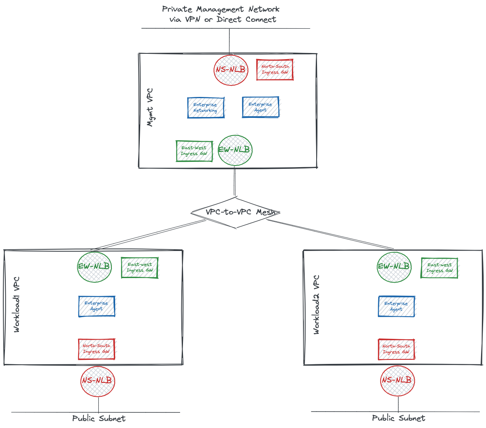

WIP...

# Gloo Mesh Multi-Cluster EKS Deployment

This guide defines production best-practices for deploying multi-cluster gloo mesh in eks environment.

## 0. Architecture diagram



## 1. Pre-requisistes

The following pre-requisistes are expected to be in place:
* EKS cluster to host gloo mesh management plane. The architecture diagram shows a high-available management cluster across 3 availability zones.
* EKS clusters hosting your applications (worker clusters) to join the multicluster gloo-mesh setup and be managed by the centralized gloo management. The architecture diagram show high-available worker clusters across 3 availability zones.
* [AWS Load-Balancer Controller](https://docs.aws.amazon.com/eks/latest/userguide/aws-load-balancer-controller.html) and [Amazon EBS CSI Driver](https://docs.aws.amazon.com/eks/latest/userguide/ebs-csi.html) deployed with service accounts attached to iam policy with the privileges to provision cloud load-balancers and storage.
* Inter-VPC mesh connectivity implemented using aws vpc connectivity [options](https://docs.aws.amazon.com/whitepapers/latest/aws-vpc-connectivity-options/introduction.html).
* Connectivity from your management network to the management cluster using one of the aws vpc connectivity [options](https://docs.aws.amazon.com/whitepapers/latest/aws-vpc-connectivity-options/network-to-amazon-vpc-connectivity-options.html)
* AWS security groups allowing required communication for [istio](https://istio.io/latest/docs/ops/deployment/requirements/) and [gloo mesh](https://docs.solo.io/gloo-mesh-enterprise/latest/concepts/about/).
* Kubernetes network policies allowing required communication.
* RBAC and Admission Controller privileges allowing the deployments of privileged pods.

## 2. Istio Installation

Gloo-mesh requires istio to be installed in clusters so that it can manage its configuration. Gloo mesh v1.3.0 introduced support for istio installation lifecycle management, which is still experimental as of this writing until declared GA.

The following recommendations apply to istio installation:
* It is recommended to install istio in all clusters including the management cluster. It is expected that the same management cluster would be hosting the management plane of other platform application and this provides the capability of securing and segmenting the management and control plane in management cluster, in addition to the dataplane in worker clusters.
* Install istio in your management and workload clusters using the following guidelines:
  * [Guide](https://istio.io/latest/docs/setup/platform-setup/) for installing istio.
  * [Best-practices](https://docs.solo.io/gloo-mesh-enterprise/latest/setup/istio/istio_production/) for using istio in production in gloo mesh documentation.
* It is recommended to deploy separate istio ingress gateways for east-west (inter-vpc communication) and north-south (communication with the outside world for exposing services or for management). 
  * [Guide](https://kubernetes-sigs.github.io/aws-load-balancer-controller/v2.3/guide/service/nlb/) on aws load-balancer controller annotations.
  * Following are required istio-ingressgateway-east-west service annotations for setting up aws NLB. Notice the recommendation of instance-based load-balancing which has been tested to provide better failover at scale. IP-based load-balancing uses a more efficient routing path but has been tested to be slow in responding to depoyment scaling at the time of this writing. 
```
  annotations:
    # Enables load-balancing across availability zones
    service.beta.kubernetes.io/aws-load-balancer-cross-zone-load-balancing-enabled: "true"
    # Instructs NLB to send traffic to the EC2 instances and the kube-proxy on the individual worker nodes forward it to the pods through one or more worker nodes in the Kubernetes cluster.
    service.beta.kubernetes.io/aws-load-balancer-nlb-target-type: "instance"
    # Instructs NLB to create an internal load-balancer
    service.beta.kubernetes.io/aws-load-balancer-scheme: "internal"
    # Ignore in-tree controllers and pass it to aws cloud load-balancer controller
    service.beta.kubernetes.io/aws-load-balancer-type: "external"
    # Define healthcheck probes from NLB to istio ingress-gateway
    service.beta.kubernetes.io/aws-load-balancer-healthcheck-path: "/healthz/ready"
    service.beta.kubernetes.io/aws-load-balancer-healthcheck-port: "15021"
    service.beta.kubernetes.io/aws-load-balancer-healthcheck-protocol: "http"
```
  * Label your istio-ingressgateway-east-west service.
```
  labels:
    ingressgateway.istio.io/type: internal
    ingressgateway.istio.io/direction: east-west
```
  * Following are required istio-ingressgateway-north-south service annotations for setting up aws NLB.
```
  annotations:
    service.beta.kubernetes.io/aws-load-balancer-cross-zone-load-balancing-enabled: "true"
    service.beta.kubernetes.io/aws-load-balancer-nlb-target-type: "instance"
    service.beta.kubernetes.io/aws-load-balancer-type: "external"
    service.beta.kubernetes.io/aws-load-balancer-healthcheck-path: "/healthz/ready"
    service.beta.kubernetes.io/aws-load-balancer-healthcheck-port: "15021"
    service.beta.kubernetes.io/aws-load-balancer-healthcheck-protocol: "http"
```
  * Label your istio-ingressgateway-north-south service. The management cluster north-south gateway is expected to be an internal load-balancing connecting to your enterprise network. The worker clusters north-south gateways are expected to be external for exposing your applications.
    * Label management cluster istio-ingressgateway-north-south service.
```
  labels:
    ingressgateway.istio.io/type: internal
    ingressgateway.istio.io/direction: north-south
```
    * Label worker clusters istio-ingressgateway-north-south service.
```
  labels:
    ingressgateway.istio.io/type: external
    ingressgateway.istio.io/direction: north-south
```

## 3. Gloo Mesh Installation

* Install gloo mesh enterprise in management cluster. 
  * [Guide](https://docs.solo.io/gloo-mesh-enterprise/latest/setup/installation/enterprise_installation/) for installing gloo mesh enterprise.
  * [Link](https://docs.solo.io/gloo-mesh-enterprise/latest/reference/helm/gloo_mesh_enterprise/) to gloo mesh helm values reference.
* Register the local management cluster to be managed by gloo mesh enterprise. 
  * [Guide](https://docs.solo.io/gloo-mesh-enterprise/latest/setup/cluster_registration/enterprise_cluster_registration/) for registering clusters with gloo mesh.
  * Use local enterprise networking service address as relay address, for example: **enterprise-networking.your-cluster-domain:9900**
* Gloo mesh enterprise installation deploys Enterprise Networking services which listens for connections from remote clusters for management. Expose Enterprise-Networking service via istio-ingressgateway-east-west for remote worker clusters to connect to it.
  * It is advisable to use a controller for managing route53 dns record of gateway services, such as [External DNS](https://github.com/kubernetes-sigs/external-dns)
  * Add the following annotation to management cluster istio-ingressgateway-east-west service to instruct external dns to update route53 A records.
```
  annotations:
    external-dns.alpha.kubernetes.io/hostname: relay-jad-mgmt.your-domain
```
  * Create VirtualGateway and VirtualHost resources for gloo mesh to configure the management cluster to configure istio-ingressgateway-east-west to expose enterprise-networking service.
```
apiVersion: networking.enterprise.mesh.gloo.solo.io/v1beta1
kind: VirtualGateway
metadata:
  name: istio-ingressgateway-east-west
  namespace: gloo-mesh
spec:
  connectionHandlers:
  - connectionOptions:
      sslConfig:
        tlsMode: PASSTHROUGH
    connectionMatch: 
      serverNames:
      - relay.your-domain:9900
    http:
      routeConfig:
      - virtualHostSelector:
          namespaces:
          - "gloo-mesh"
  ingressGatewaySelectors:
  - destinationSelectors:
    - kubeServiceMatcher:
        clusters:
        - your-management-cluster-name
        labels:
          istio: ingressgateway
          ingressgateway.istio/type: internal
          ingressgateway.istio/direction: east-west
        namespaces:
        - istio-system
    portName: https
---
apiVersion: networking.enterprise.mesh.gloo.solo.io/v1beta1
kind: VirtualHost
metadata:
  name: enterprise-networking
  namespace: gloo-mesh
spec:
  domains:
  - "relay.your-domain:9900"
  routes:
  - matchers:
    - uri:
        prefix: /
    name: ratings
    routeAction:
      destinations:
      - kubeService:
          clusterName: your-management-cluster-name
          name: enterprise-networking
          namespace: gloo-mesh
```
* Register remote clusters with gloo mesh.
  * [Guide](https://docs.solo.io/gloo-mesh-enterprise/latest/setup/cluster_registration/enterprise_cluster_registration/) for registering worker clusters with gloo mesh

