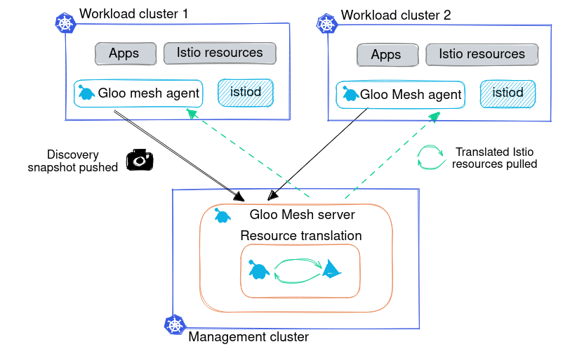

# Install Gloo Mesh Using Helm



This example installation is for a typical 3 cluster setup


## Environment Variables
```
export MGMT_CONTEXT=mgmt
export REMOTE_CONTEXT1=cluster1
export REMOTE_CONTEXT2=cluster2

export GLOO_MESH_VERSION=v2.0.0-beta33
```

## Helm Repositories

```sh
helm repo add gloo-mesh-agent https://storage.googleapis.com/gloo-mesh-enterprise/gloo-mesh-agent
helm repo add gloo-mesh-enterprise https://storage.googleapis.com/gloo-mesh-enterprise/gloo-mesh-enterprise 
helm repo update
```

## View all default values

* Default Management plane values
```
helm show values gloo-mesh-enterprise/gloo-mesh-enterprise --version $GLOO_MESH_VERSION
```

* Default control plane values
```
helm show values gloo-mesh-agent/gloo-mesh-agent --version $GLOO_MESH_VERSION
```


## Management Plane Install

* Install the management plane using helm and a values file

```sh
helm upgrade --install gloo-mesh-enterprise gloo-mesh-enterprise/gloo-mesh-enterprise \
  --namespace gloo-mesh \
  --version=${GLOO_MESH_VERSION} \
  --set licenseKey=${GLOO_MESH_LICENSE_KEY} \
  --kube-context $MGMT \
  -f mgmt-values.yaml \
  --create-namespace \
  --wait
```

## Management Plane Configuration

* Before any agent can connect with the management plane, a KubernetesCluster object needs to be created in the mgmt plane.
```sh
kubectl apply --context $MGMT -f- <<EOF
apiVersion: admin.gloo.solo.io/v2
kind: KubernetesCluster
metadata:
  name: cluster1
  namespace: gloo-mesh
spec:
  clusterDomain: cluster.local
---
apiVersion: admin.gloo.solo.io/v2
kind: KubernetesCluster
metadata:
  name: cluster2
  namespace: gloo-mesh
spec:
  clusterDomain: cluster.local
EOF
```

* Grab the mgmt plane IP address that the agents will connect through
```sh
MGMT_INGRESS_ADDRESS=$(kubectl get svc -n gloo-mesh gloo-mesh-mgmt-server --context $MGMT -o jsonpath='{.status.loadBalancer.ingress[0].ip}')
MGMT_INGRESS_PORT=$(kubectl -n gloo-mesh get service gloo-mesh-mgmt-server --context $MGMT -o jsonpath='{.spec.ports[?(@.name=="grpc")].port}')
RELAY_ADDRESS=${MGMT_INGRESS_ADDRESS}:${MGMT_INGRESS_PORT}
echo "RELAY_ADDRESS: ${RELAY_ADDRESS}"
```

## Control Plane Authentication

### Token Based Authentication

* If using token based authentication you will need to copy the relay root CA and token secret to each control plane cluster

```sh
kubectl create namespace gloo-mesh --context $REMOTE_CONTEXT1
kubectl create namespace gloo-mesh --context $REMOTE_CONTEXT2

# Relay root ca for cluster 1
kubectl get secret relay-root-tls-secret -n gloo-mesh --context $MGMT -o jsonpath='{.data.ca\.crt}' | base64 -d > ca.crt
kubectl create secret generic relay-root-tls-secret -n gloo-mesh --context $REMOTE_CONTEXT1 --from-file ca.crt=ca.crt
rm ca.crt
# Relay token secret for cluster 1
kubectl get secret relay-identity-token-secret -n gloo-mesh --context $MGMT -o jsonpath='{.data.token}' | base64 -d > token
kubectl create secret generic relay-identity-token-secret -n gloo-mesh --context $REMOTE_CONTEXT1 --from-file token=token
rm token


# Relay root ca for cluster 2
kubectl get secret relay-root-tls-secret -n gloo-mesh --context $MGMT -o jsonpath='{.data.ca\.crt}' | base64 -d > ca.crt
kubectl create secret generic relay-root-tls-secret -n gloo-mesh --context $REMOTE_CONTEXT2 --from-file ca.crt=ca.crt
rm ca.crt
# Relay token secret for cluster 2
kubectl get secret relay-identity-token-secret -n gloo-mesh --context $MGMT -o jsonpath='{.data.token}' | base64 -d > token
kubectl create secret generic relay-identity-token-secret -n gloo-mesh --context $REMOTE_CONTEXT2 --from-file token=token
rm token
```

### Using Certificates

TODO Add examples.

* See https://docs.solo.io/gloo-mesh-enterprise/main/setup/certs/


## Install the Control Plane(Token Authentication)


* Install the agents on each cluster with the token secret

```sh
# REMOTE CLUSTER 1
helm upgrade --install gloo-mesh-agent gloo-mesh-agent/gloo-mesh-agent \
  --kube-context=$REMOTE_CONTEXT1 \
  --namespace gloo-mesh \
  --set relay.serverAddress=${RELAY_ADDRESS} \
  --set cluster=cluster1 \
  --set relay.tokenSecret.name=relay-identity-token-secret \
  --version ${GLOO_MESH_VERSION} \
  --wait

# REMOTE CLUSTER 2
helm upgrade --install gloo-mesh-agent gloo-mesh-agent/gloo-mesh-agent \
  --kube-context=$REMOTE_CONTEXT2 \
  --namespace gloo-mesh \
  --set relay.serverAddress=${RELAY_ADDRESS} \
  --set cluster=cluster2 \
  --set relay.tokenSecret.name=relay-identity-token-secret \
  --version ${GLOO_MESH_VERSION} \
  --wait

```


## Install the Control Plane(Certificate Authentication)


* Install the agents on each cluster using a client tls secret 

```sh
# REMOTE CLUSTER 1
helm upgrade --install gloo-mesh-agent gloo-mesh-agent/gloo-mesh-agent \
  --kube-context=$REMOTE_CONTEXT1 \
  --namespace gloo-mesh \
  --set relay.serverAddress=${RELAY_ADDRESS} \
  --set cluster=cluster1 \
  --set relay.clientTlsSecret.name=gloo-mesh-agent-cluster1-tls-cert \
  --version ${GLOO_MESH_VERSION} \
  --wait

# REMOTE CLUSTER 2
helm upgrade --install gloo-mesh-agent gloo-mesh-agent/gloo-mesh-agent \
  --kube-context=$REMOTE_CONTEXT2 \
  --namespace gloo-mesh \
  --set relay.serverAddress=${RELAY_ADDRESS} \
  --set cluster=cluster2 \
  --set relay.clientTlsSecret.name=gloo-mesh-agent-cluster2-tls-cert \
  --version ${GLOO_MESH_VERSION} \
  --wait

```
