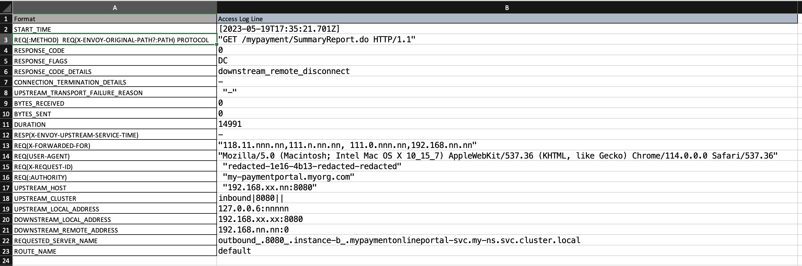

### Usage

- Open the input.txt and paste the Envoy Access log text
- Run the script

```bash
./extract-envoy-access-log-info.sh
```

- Paste the output in the spreadsheet.

- Here is how it would look:



- If you would like to see the output on the terminal itself, run the following

```bash
./extract-envoy-access-log-with-keynames.sh
```

Sample output:

```bash
START_TIME: [2023-05-19T17:35:21.701Z]
REQ(:METHOD)  REQ(X-ENVOY-ORIGINAL-PATH?:PATH) PROTOCOL: "GET /mypayment/SummaryReport.do HTTP/1.1"
RESPONSE_CODE: 0
RESPONSE_FLAGS: DC
RESPONSE_CODE_DETAILS: downstream_remote_disconnect
CONNECTION_TERMINATION_DETAILS: -
UPSTREAM_TRANSPORT_FAILURE_REASON:  "-"
BYTES_RECEIVED: 0
BYTES_SENT: 0
DURATION: 14991
RESP(X-ENVOY-UPSTREAM-SERVICE-TIME): -
REQ(X-FORWARDED-FOR): "118.11.nnn.nn,111.n.nn.nn, 111.0.nnn.nn,192.168.nn.nn"
REQ(USER-AGENT): "Mozilla/5.0 (Macintosh; Intel Mac OS X 10_15_7) AppleWebKit/537.36 (KHTML, like Gecko) Chrome/114.0.0.0 Safari/537.36"
REQ(X-REQUEST-ID):  "redacted-1e16-4b13-redacted-redacted"
REQ(:AUTHORITY):  "my-paymentportal.myorg.com"
UPSTREAM_HOST:  "192.168.xx.nn:8080"
UPSTREAM_CLUSTER: inbound|8080||
UPSTREAM_LOCAL_ADDRESS: 127.0.0.6:nnnnn
DOWNSTREAM_LOCAL_ADDRESS: 192.168.xx.xx:8080
DOWNSTREAM_REMOTE_ADDRESS: 192.168.nn.nn:0
REQUESTED_SERVER_NAME: outbound_.8080_.instance-b_.mypaymentonlineportal-svc.my-ns.svc.cluster.local
ROUTE_NAME: default
```

### Links
- [Access log format](https://istio.io/latest/docs/tasks/observability/logs/access-log/#default-access-log-format)
- [Access log values explanation](https://www.envoyproxy.io/docs/envoy/latest/configuration/observability/access_log/usage)
