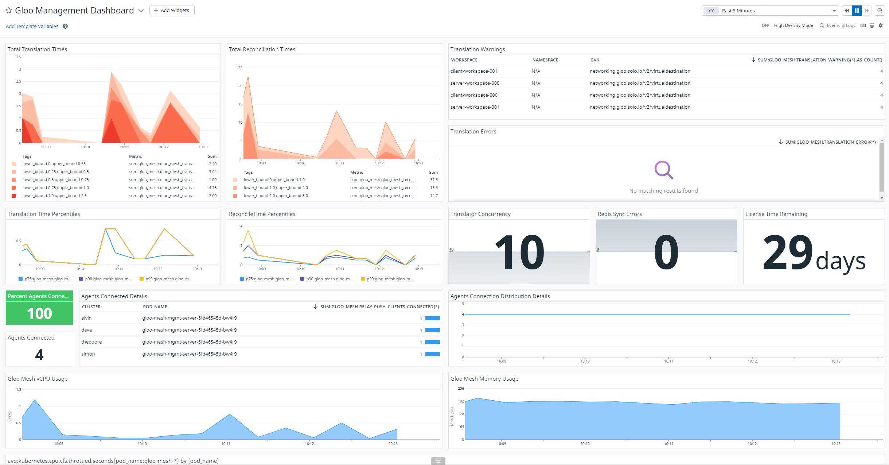
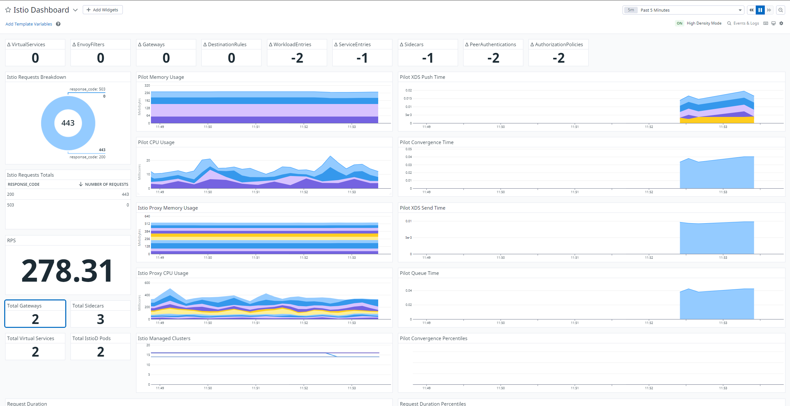

# Gloo Mesh / Istio Monitoring

> There are many different ways to operate datadog. This is just an illustrative example.

# Basic Install

If you are already familiar with the Datadog install process you may skip this section.

In the event that this documentation conflicts with the [Datadog install documentation](https://docs.datadoghq.com/containers/kubernetes/installation/?tab=operator#installation), please defer to the Datadog documentation.

1. [Generate an API Key](https://docs.datadoghq.com/account_management/api-app-keys/#add-an-api-key-or-client-token)
2. Install `helm`
```
curl https://raw.githubusercontent.com/helm/helm/main/scripts/get-helm-3 | bash
```
3. Add the datadog helm repo
```
helm repo add datadog https://helm.datadoghq.com
helm repo update
```
4. Install the agent on each of your clusters:
```
helm upgrade --install datadog --create-namespace -n datadog  -f datadog-values.yaml --set datadog.site='datadoghq.com' --set datadog.apiKey='{{GENERATED_API_KEY}}' datadog/datadog
```

# Add OpenMetrics annotations to Gloo Mesh Resources

1. Patch Gloo Mesh Mgmt
```
kubectl patch -n gloo-mesh deployment gloo-mesh-mgmt-server --patch-file 
```
2. Create a new dashboard.
3. Import `gloo-mesh-dashboard.json` into the new dashboard.
4. Edit `Percent Agents Connected` module.
  - Create a query for each workload cluster with `clamp_max` set to `1`.
  - Update the formula to average each cluster and multiply by 100.
5. Update distributions to show percentiles.
  - Navigate to metrics summary.
  - Locate `gloo_mesh.gloo_mesh_reconciler_time_sec`/`gloo_mesh.gloo_mesh_translation_time_sec` distributions
  - In `Advanced` toggle the `Enable percentiels and threshold queries` setting
6. Apply Unit to Trial License Expiration
  - Navigate to metrics summary.
  - Locate `gloo_mesh.solo_io_gloo_trial_license` guage.
  - Set `Unit` dropdown to minutes.

# What is being presented

* The `Times` charts on the top left represent system load. Darker colors represent slower translation and reconcile times.
* The `Warnings` and `Errors` charts on the top right will list warnings and errors in Solo CRD translations to Istio resources.
* The second row will demonstrate 75th,90th, and 99th percentiles for translations and reconciliations.
* The three boxes in the second row on the right represent component configuration.
* The third row represents agent connection tracking.
* The fourth and fifth row represent resource usage and cpu throttling for mesh components.




