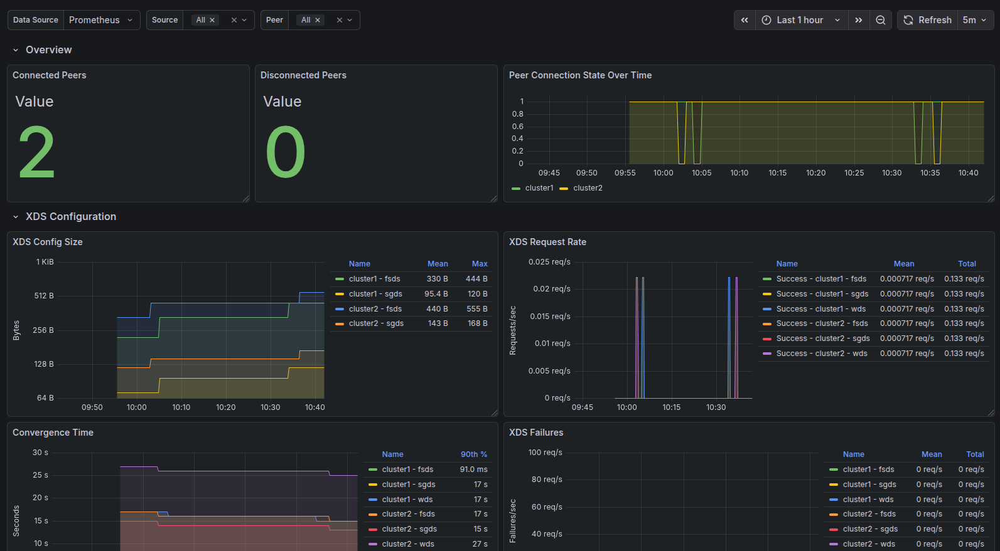

# Istio Cluster Performance Monitoring

Monitor the health of your Istio cluster using this dashboard. The dashboard compiles helpful information such as:
* Traffic volume and success rates
* Environment information like number of pods, services, gateways, and nodes by namespace
* Istio sidecar stats, including memory and vCPU usage, active connections, and active listeners
* `istiod` performance for how long pushes to the proxy take and the size of the xDS requests to the proxy

# Istio Peering Health

Monitor the health of Istio service mesh peering connections using this dashboard. The dashboard provides insights into:
* Connected and disconnected peer status
* Peer connection state over time
* XDS (eXtensible Discovery Service) configuration and config size
* XDS request rates and failures
* Convergence time for peer connections

