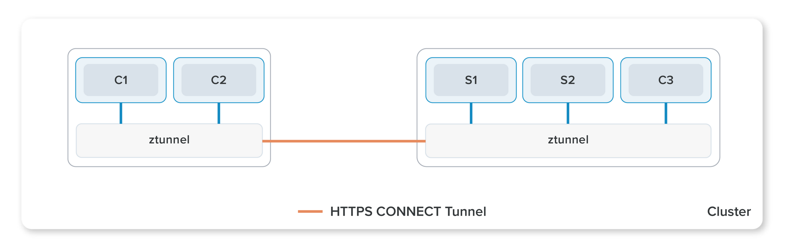
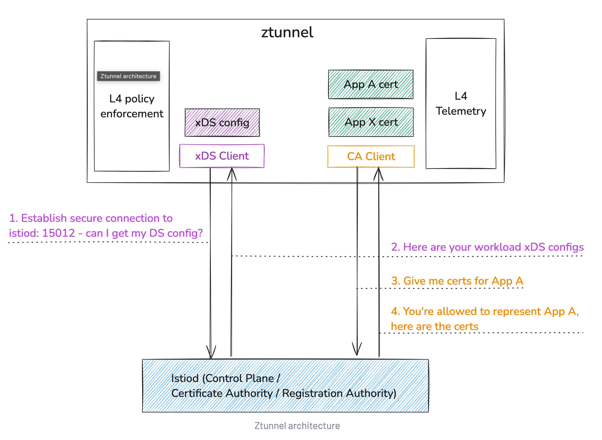
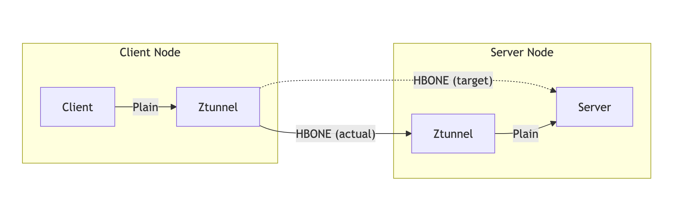
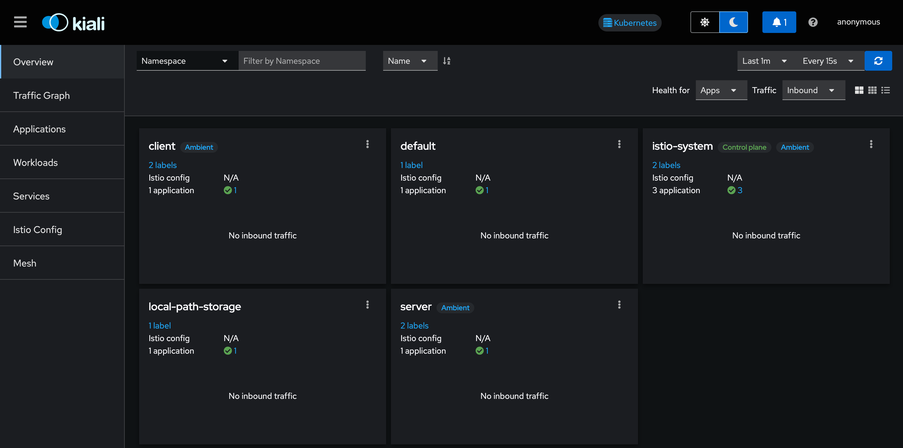
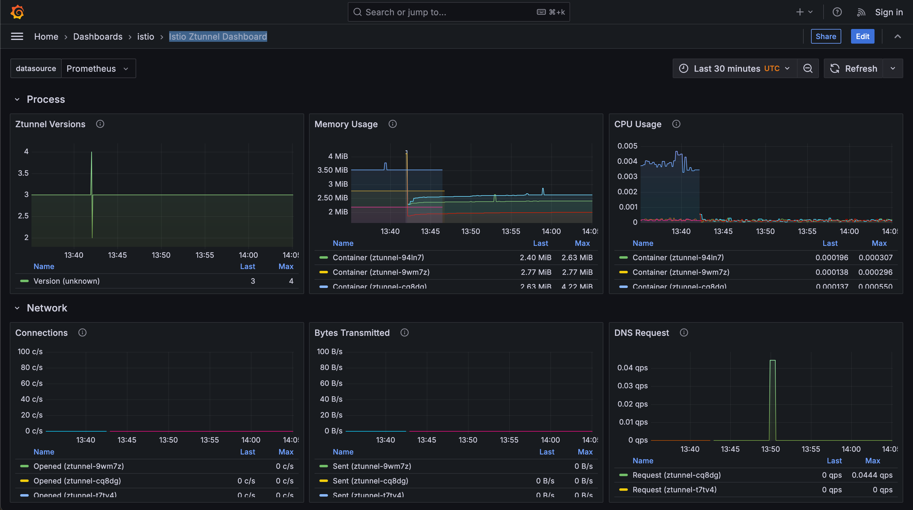

# Debugging Ambient with Solo Enterprise for Istio 1.29



This workshop walks through deploying and debugging Solo Enterprise for Istio in **ambient** mode on Istio 1.29.x. By the end you'll know how ztunnel, istio-cni, and waypoints fit together, what telemetry each layer produces (and doesn't), and how to triage common ambient failures with `istioctl` and ztunnel logs.

## Links

1. Ambient mesh overview - https://istio.io/latest/docs/ambient/
2. Solo enterprise for Istio docs - https://docs.solo.io/gloo-mesh/main/
3. Solo L7 telemetry on ambient - https://docs.solo.io/gloo-mesh/main/ambient/observability/layer7/
4. ztunnel architecture - https://github.com/istio/istio/blob/master/architecture/ambient/ztunnel.md

## Tools

1. [Install](https://kind.sigs.k8s.io/docs/user/quick-start/#installation) `kind`
2. Install the **Solo distribution of istioctl** (1.29+). The upstream `istioctl` from `istio.io/downloadIstio` does **not** include Solo commands like `istioctl multicluster check`, `istioctl ztunnel-config endpoints`, or the FIPS-compatible builds. Download the Solo build from Solo's public GCS bucket:

```bash
export ISTIO_VERSION=1.29.2-patch0
if [[ "$(uname -s)" == "Darwin" ]]; then export ISTIO_OS=osx; else export ISTIO_OS=linux; fi
export ISTIO_ARCH=$(uname -m)

curl -fSsLO "https://storage.googleapis.com/soloio-istio-binaries/release/${ISTIO_VERSION}-solo/istio-${ISTIO_VERSION}-solo-${ISTIO_OS}-${ISTIO_ARCH}.tar.gz"
tar xzf "istio-${ISTIO_VERSION}-solo-${ISTIO_OS}-${ISTIO_ARCH}.tar.gz"

# Use in place...
export PATH="$(pwd)/istio-${ISTIO_VERSION}-solo/bin:$PATH"
# ...or copy to your PATH:
# sudo cp "istio-${ISTIO_VERSION}-solo/bin/istioctl" /usr/local/bin/istioctl

istioctl version --remote=false
# Expect: client version: 1.29.2-patch0-solo
```

Full instructions: https://docs.solo.io/gloo-mesh/main/setup/install/istioctl/

## Deploy a Kubernetes Cluster

You have a few options for setting up your environment:

- [kind cluster on a mac](../environments/single_cluster/mac/kind.ipynb)
- [gke](../environments/single_cluster/gcp/gke.ipynb)
- [aws](../environments/single_cluster/aws/aws.ipynb)

2. Verify the cluster is up and running and is ready for Istio installation with the following command.

```bash
# change the path to kubeconfig file for the cluster you are using
# for example, if you are using the default kubeconfig, the path is ~/.kube/config
export KUBECONFIG=~/.kube/config
```

```bash
istioctl x precheck
```

## Install Solo Istio Ambient Mode

Istio Ambient Mode is a new architecture and approach to service mesh that eliminates the need for sidecar proxies while maintaining the core benefits of service mesh functionality. The installation process involves several key components: the Istio control plane (istiod), the CNI plugin for pod networking, and zTunnel for secure L4 communication. This installation will set up an Ambient Mode environment that enables zero-trust security and observability without the overhead of traditional sidecar-based deployments.

Ambient Components:
* **Istio Control Plane (istiod)**: Manages the service mesh configuration, handles service discovery, and coordinates the overall mesh behavior. It's responsible for distributing configuration to other components and managing the mesh's control plane functionality.
* **CNI Plugin**: Handles pod networking and ensures proper network configuration for pods in the mesh. It's responsible for setting up the necessary network interfaces and routing rules to enable ambient mode networking.
* [**zTunnel**](https://github.com/solo-io/ztunnel/blob/build/release-1.25/README.md): Provides secure L4 (transport layer) communication between services. It handles mTLS encryption, authentication, and secure tunneling of traffic between services, ensuring zero-trust security at the infrastructure level.
* **Waypoint Proxy** (optional): Provides L7 (application layer) capabilities when needed, such as advanced traffic management, observability, and security features. It can be deployed on-demand for services that require these additional capabilities.

### Install Istio Control Plane

The Istio Control Plane installation consists of two main components:

1. **Istio Base**: The foundation layer that installs the necessary Custom Resource Definitions (CRDs) and other base components required for the service mesh to function. This includes the core Istio APIs and configuration resources.
2. **Istiod**: The control plane component that manages the service mesh. It's responsible for:
  * Service discovery and configuration distribution
  * Certificate management and mTLS
  * Traffic management policies
  * Security policies
  * Mesh configuration

The Solo.io build of Istio includes several enhancements over the upstream version:

* **Enhanced L7 Telemetry**: Built-in support for detailed application-layer observability, including:
  * HTTP/gRPC request/response metrics
  * Detailed access logs
  * Distributed tracing integration
  * Custom metrics collection

* **Enterprise Features**: Additional capabilities like:
  * Advanced security features
  * Improved multi-cluster support
  * Enhanced debugging tools
  * Production-grade support

```bash
# Set Istio Version (latest 1.29 patch)
export ISTIO_VER=1.29.2-patch0
export ISTIO_HELM_CHART=oci://us-docker.pkg.dev/soloio-img/istio-helm
export ISTIO_REPO=us-docker.pkg.dev/soloio-img/istio

# Install Istio Base
helm upgrade -i istio-base "$ISTIO_HELM_CHART"/base                           \
    --version "${ISTIO_VER}-solo"                                             \
    --namespace istio-system                                                  \
    --create-namespace                                                        \
    --wait

# Install Istio Control Plane
#
# Optional best practice on autoscaled (Karpenter / Fargate) clusters: enable
# the ambient untaint controller so pods don't land on a node before istio-cni
# is ready. Requires the cni.istio.io/not-ready taint on nodes.
#   --set "pilot.taint.enabled=true"
#   --set "pilot.env.PILOT_ENABLE_NODE_UNTAINT_CONTROLLERS=true"
helm upgrade -i istiod "$ISTIO_HELM_CHART"/istiod                             \
    --version "${ISTIO_VER}-solo"                                             \
    --namespace istio-system                                                  \
    --set profile=ambient                                                     \
    --set license.value=$SOLO_ISTIO_LICENSE_KEY                                \
    --set "hub=${ISTIO_REPO}"                                                 \
    --set "tag=${ISTIO_VER}-solo"                                             \
    --wait
```

### Install Istio Dataplane



The Istio dataplane in ambient mode is two components working together to provide secure, efficient service-to-service communication.

1. **Istio CNI Plugin**:
  * Handles pod networking configuration at the node level
  * Sets up the necessary network interfaces and routing rules
  * Enables transparent traffic interception for ambient mode
  * Configures DNS capture for service discovery
  * Manages network policies and security rules
2. **zTunnel**:
  * Provides secure L4 (transport layer) communication
  * Implements zero-trust security principles
  * Handles mTLS encryption and authentication
  * Manages secure tunneling between services
  * Provides connection-level observability

Key features:
* **Zero-trust security**: built-in mTLS encryption for all service-to-service communication
* **Efficient resource usage**: no sidecar proxies required, reducing resource overhead
* **Transparent operation**: services communicate without awareness of the mesh
* **L4 observability**: connection-level metrics and logging
* **DNS integration**: automatic service discovery through DNS capture

#### Solo Enterprise telemetry contract

This is the most important thing to understand about telemetry in ambient with Solo Enterprise:

* **Metrics: yes.** ztunnel emits HTTP-level metrics for every request (`istio_requests_total`, response code, method, source/destination workload labels) **without requiring a waypoint**. This is the primary value-add over OSS ambient.
* **Tracing: no, not from ztunnel.** ztunnel is an L4 HBONE proxy. It cannot inject or mutate HTTP headers (no `traceparent` / `b3` / `x-request-id` propagation at this time). Enabling ztunnel tracing produces disconnected spans that don't stitch into a real trace tree. Tracing in ambient should be done at a **waypoint** (a full Envoy) for any service that needs end-to-end traces. We cover this further down.
* **Access logs: off at scale.** Per-request access logs from ztunnel are off by default and should stay off in production. ztunnel still emits warn/error log lines for connection failures, AuthorizationPolicy denials, certificate problems, and similar.

```bash
# Install Istio CNI Plugin
helm upgrade -i istio-cni "$ISTIO_HELM_CHART"/cni                             \
    --version "${ISTIO_VER}-solo"                                             \
    --namespace istio-system                                                  \
    --set profile=ambient                                                     \
    --set "hub=${ISTIO_REPO}"                                                 \
    --set "tag=${ISTIO_VER}-solo"                                             \
    --set "ambient.dnsCapture=true"                                           \
    --wait

# Install zTunnel with production-shaped L7 telemetry posture:
#   - L7 metrics:  ON  (Solo Enterprise differentiator, cheap and high-value)
#   - Access logs: OFF (too expensive at scale; errors still surface as warn/error)
#   - Tracing:     OFF (ztunnel can't propagate trace headers; trace at the waypoint)
helm upgrade -i ztunnel "$ISTIO_HELM_CHART"/ztunnel                           \
    --version "${ISTIO_VER}-solo"                                             \
    --namespace istio-system                                                  \
    --set "hub=${ISTIO_REPO}"                                                 \
    --set "tag=${ISTIO_VER}-solo"                                             \
    --set profile=ambient                                                     \
    --set l7Telemetry.enabled=true                                            \
    --set l7Telemetry.metrics.enabled=true                                    \
    --set l7Telemetry.accessLog.enabled=false                                 \
    --set l7Telemetry.distributedTracing.enabled=false                        \
    --wait
```

### Verify the L7 telemetry contract

Confirm ztunnel is running with the production-shaped telemetry posture: metrics on, access logs and tracing off.

```bash
istioctl ztunnel-config all -ojson | jq '.config.l7Config // .config.l7_config'

# Expected:
# {
#   "access_log": { "enabled": false, "skip_connection_log": false },
#   "enabled": true,
#   "metrics": { "enabled": true },
#   "tracing": { "enabled": false }
# }
```

### Install Observability Tools

In this section, we'll install the standard Istio observability stack to help visualize and monitor the service mesh. This includes:
* **Prometheus**: For metrics collection and storage
* **Grafana**: For metrics visualization and dashboards
* **Kiali**: For service mesh visualization and management
* **Metrics Server**: For Kubernetes metrics collection

> Note: The observability stack installed here is the default development configuration provided by Istio. While these tools are excellent for development, testing, and debugging, they are not configured for production use. In a production environment, you would want to:
> * Configure proper resource limits and requests
> * Set up persistent storage
> * Implement proper security controls
> * Configure high availability
> * Use production-grade monitoring solutions

For production deployments, consider using:
* Enterprise monitoring solutions
* Managed observability services
* Custom-configured Prometheus with proper scaling
* Production-grade Grafana with proper authentication and authorization


Components:
* Grafana - https://istio.io/latest/docs/ops/integrations/grafana/ 
* Kiali - https://istio.io/latest/docs/ops/integrations/kiali/
* Prometheus - https://istio.io/latest/docs/ops/integrations/prometheus/

```bash
kubectl apply -f data/metrics-server.yaml
kubectl apply -f https://raw.githubusercontent.com/istio/istio/release-1.29/samples/addons/prometheus.yaml
kubectl apply -f https://raw.githubusercontent.com/istio/istio/release-1.29/samples/addons/kiali.yaml
kubectl apply -f https://raw.githubusercontent.com/istio/istio/release-1.29/samples/addons/grafana.yaml

# Optional: deploy Jaeger now if you plan to run the waypoint tracing section later.
# kubectl apply -f https://raw.githubusercontent.com/istio/istio/release-1.29/samples/addons/jaeger.yaml
```

### Verify Installation

Verify that the monitoring components were installed correctly.

```bash
kubectl get pods -n istio-system
```

## Install Applications

We are going to install a client and server application to communicate with each other. These applications will deploy to separate nodes so that we can show the communication path utilizing multiple zTunnel Proxies. The test applications will consist of a client running on one node which makes calls to a server running on another node. A traffic generator has also been deployed to constantly trigger the client to make calls to the server. 

We will deploy the applications first without service mesh and test their connectivity. In the next exercise we will add zTunnel interception and observe.

```bash
# Deploy applications
kubectl create namespace client
kubectl create namespace server
kubectl apply -f data/client.yaml -n client --wait
kubectl apply -f data/server.yaml -n server --wait
kubectl apply -f data/traffic-gen-pod.yaml
```

### Verify communication

Let's connect to the client pod and start to make requests to the server to verify connectivity.

```bash
kubectl exec -it -n client -c client $(kubectl get pod -n client -l app=client -o jsonpath='{.items[0].metadata.name}') -- sh -c "curl -s http://server.server.svc.cluster.local:8080/hello"
```

### Enable Ambient on client and server namespace



Enabling Ambient Mode on a namespace fundamentally changes how traffic flows between services. Here's what happens when we add the `istio.io/dataplane-mode=ambient` label to a namespace:

1. **Before Ambient Mode**:
  * Services communicate directly using standard Kubernetes networking
  * No service mesh features are available
  * Traffic flows directly between pods without any interception
  * No mTLS, observability, or traffic management capabilities
2. **After Enabling Ambient Mode**:
  * The CNI plugin automatically intercepts all pod traffic
  * Traffic is redirected through the zTunnel proxy on each node
  * Services gain immediate access to:
  * mTLS encryption
  * L4 observability
  * Basic traffic management
  * No pod restarts or sidecar injection required

3. **Request Flow Changes**: 
```text
Before:
  Client Pod → Direct Network → Server Pod

After:
  Client Pod → Node zTunnel → Network → Node zTunnel → Server Pod
```

4. **Key Benefits**:
  * Zero-trust security is automatically enabled
  * Traffic is automatically encrypted with mTLS
  * Connection-level metrics are collected
  * No application changes required
  * No pod restarts needed

The transition to Ambient Mode is transparent to the applications, requiring no changes to the services themselves. This makes it an ideal way to incrementally adopt service mesh capabilities without disrupting existing workloads.

Let's enable both the client and servers traffic to be captured by Istio's Ambient mode. 

```bash
kubectl label namespace client istio.io/dataplane-mode=ambient
kubectl label namespace server istio.io/dataplane-mode=ambient
```

### Verify Traffic is now on Ambient

Verifying ambient enrollment is a layered check. Logs alone aren't the production debugging path. The Solo support cheatsheet leads with `istioctl ztunnel-config` because it shows you what ztunnel actually believes about your workload (its identity, its certs, the policies attached to it, its endpoints). Per-request log lines come last.

Layered verification:

1. **Pod annotations**: confirm the kubelet sees the workload as ambient-enrolled.
2. **`istioctl ztunnel-config workloads`**: does ztunnel know the workload?
3. **`istioctl ztunnel-config certificate`**: does ztunnel hold a leaf cert for the workload's service account?
4. **`istioctl ztunnel-config policies`**: what L4 policies (PeerAuthentication, AuthorizationPolicy) ztunnel sees attached.
5. **`istioctl ztunnel-config endpoints`** (new in 1.29.0): resolves which endpoints ztunnel will dial.
6. **`istioctl proxy-status`**: xDS sync status across ztunnel/waypoint/gateways.
7. **ztunnel logs**: only after the structural checks pass.

```bash
## Verify ambient enrollment + ztunnel state for the client workload

# 1. Confirm the pod is enrolled in ambient (kubelet view)
kubectl get pod -n client -l app=client -o yaml \
  | grep -E "ambient.istio.io/redirection|dataplane-mode" || true
# Expect: ambient.istio.io/redirection=enabled

# 2. Pick the ztunnel running on the client's node
zTunnelClientNode=$(kubectl get pods -n client -l app=client -o jsonpath='{.items[*].spec.nodeName}')
zTunnelClientPod=$(kubectl get pods -n istio-system -l app=ztunnel -o jsonpath="{.items[?(@.spec.nodeName==\"$zTunnelClientNode\")].metadata.name}")

# 3. Does ztunnel know the workloads?
printf "\n--- workloads (client/server) ---\n"
istioctl ztunnel-config workloads ${zTunnelClientPod}.istio-system | grep -E "client|server|NAMESPACE"

# 4. Does ztunnel hold a leaf cert for the workload's SA?
printf "\n--- certificates ---\n"
istioctl ztunnel-config certificate ${zTunnelClientPod}.istio-system

# 5. What L4 policies does ztunnel see?
printf "\n--- policies ---\n"
istioctl ztunnel-config pol ${zTunnelClientPod}.istio-system -o json | jq '. | length as $n | "policies seen: \($n)"'

# 6. Endpoints (new in 1.29.0)
printf "\n--- endpoints ---\n"
istioctl ztunnel-config endpoints ${zTunnelClientPod}.istio-system | grep -E "client|server|NAMESPACE"

# 7. xDS sync across the mesh
printf "\n--- proxy-status ---\n"
istioctl proxy-status

# 8. Multicluster check (works in single-cluster too; some checks will be skipped)
printf "\n--- multicluster check ---\n"
istioctl multicluster check || true

# 9. Finally, ztunnel logs: pull a few HTTP access lines if access logs are on
printf "\n--- ztunnel logs (client node) ---\n"
kubectl logs -n istio-system $zTunnelClientPod | grep -E "inbound|outbound" | tail -n 3 || true

printf "\n--- ztunnel logs (server node) ---\n"
zTunnelServerNode=$(kubectl get pods -n server -l app=server -o jsonpath='{.items[*].spec.nodeName}')
zTunnelServerPod=$(kubectl get pods -n istio-system -l app=ztunnel -o jsonpath="{.items[?(@.spec.nodeName==\"$zTunnelServerNode\")].metadata.name}")
kubectl logs -n istio-system $zTunnelServerPod | grep -E "inbound|outbound" | tail -n 3 || true
```

## `istioctl multicluster check`: the Solo health-check command

`istioctl multicluster check` is a Solo-specific extension to `istioctl` that runs a battery of mesh-wide sanity checks for Solo Enterprise for Istio. It's not in upstream istioctl. Despite the name, **it works in single-cluster too** cross-cluster checks just get skipped automatically. Treat it as the first thing on-call runs when something looks off.

### What it actually checks

The command runs ~10 distinct checks. Most are Solo-only because they cover features only Solo ships (multicluster peering, intermediate cert provisioning, the L7 telemetry contract, shared services, license validity).

| # | Check | What it catches |
|---|---|---|
| 1 | Incompatible env vars | Misconfigured `ENABLE_PEERING_DISCOVERY` / `K8S_SELECT_WORKLOAD_ENTRIES` on istiod — will silently break peering |
| 2 | License validity | Expired or missing Solo license on istiod — surfaces well before istiod starts rejecting pushes |
| 3 | CNI DNS capture | Istio CNI is installed and DNS proxying is wired correctly (ambient-only path) |
| 4 | Pod health | istiod / ztunnel / east-west gateway pods are Ready in every cluster |
| 5 | East-west gateway programmed | The east-west gateway has a `Programmed=True` Gateway API status |
| 6 | Peer gateway status | `gloo.solo.io/PeerConnected`, `PeeringSucceeded`, `PeerDataPlaneProgrammed` conditions are true on the remote |
| 7 | Shared services | `.mesh.internal` shared-services hostnames resolve and have endpoints in every peer |
| 8 | Intermediate cert compatibility | Each cluster's `cacerts` chains up to a common root — prevents the classic "mTLS works locally, fails cross-cluster" trap |
| 9 | Network configuration | `topology.istio.io/network` labels are consistent and east-west endpoints are reachable on the right network |
| 10 | Stale workload entries | Leftover `autogenflat` `WorkloadEntry`s in flat networks (these accumulate on cluster removal and break routing if not cleaned) |

### Flags worth knowing

```
--contexts strings        Run across multiple kubeconfig contexts at once
                          (this is what makes it actually multicluster)
--directory stringArray   Offline mode: read previously captured bug-report
                          dumps instead of live clusters. Lets you do post-mortem
                          checks against a snapshot.
-p, --precheck            Pre-install variant. Run BEFORE installing/upgrading
                          to catch incompatible env vars, license, cert chain.
-v, --verbose             Show the per-check line items (otherwise you only
                          see failures and a summary).
```

### Single-cluster vs multicluster

* **Single cluster (this lab):** runs checks 1–5 plus 8 and 10 against the current context. Checks 6, 7, 9 are skipped with a "not applicable" line. Useful even here — catches license, CNI/DNS, pod health, and cert chain in one command.
* **Multicluster:** pass `--contexts ctx1,ctx2,ctx3`. The command iterates each context, then evaluates pairwise checks (peer gateways, shared services, network reachability) across them.

### When to reach for it

* **First** thing on-call runs when ambient traffic breaks across clusters — it short-circuits hours of poking at ztunnel/eastwest logs.
* **Before** any upgrade: `istioctl multicluster check --precheck` against every cluster in the mesh.
* **After** topology changes: adding a peer, rotating cacerts, removing a cluster (catches stale `autogenflat` entries).
* **Inside support bundles:** ship the bug-report tarball + `--directory` for offline triage — customers don't have to give you live access.

```bash
# Run the full set of checks against the current cluster.
# In single-cluster mode you'll see some "skipped" lines for the cross-cluster checks - that's expected.
istioctl multicluster check --verbose

# Pre-install / pre-upgrade variant. Run this BEFORE bumping istiod.
# istioctl multicluster check --precheck --verbose

# Multicluster invocation (uncomment if you have multiple kubeconfig contexts):
# istioctl multicluster check --contexts cluster1,cluster2,cluster3 --verbose

# Offline mode against a previously captured bug-report bundle:
# istioctl multicluster check --directory ./bug-report-cluster1 --directory ./bug-report-cluster2
```

## Observability



Now that we have Ambient Mode enabled and traffic flowing through the mesh, we can visualize and analyze the service mesh behavior using the observability tools we installed earlier. This section focuses on using Kiali and Grafana to gain insights into the mesh's operation.

**Kiali Dashboard**

Kiali provides a comprehensive visualization of the service mesh, showing:
* Service-to-service communication patterns
* Traffic flow between services
* mTLS encryption status
* Request rates and response codes
* Error rates and latency metrics

To access the Kiali dashboard:

```bash
istioctl dashboard kiali
```

### Verifying Ambient Traffic in Kiali
When examining the Kiali dashboard, there are several key indicators that confirm Ambient Mode is working correctly:
1. Service Graph View:
  * Look for the client and server services connected by a line
  * The line should be solid (not dashed) indicating active traffic
  * Hover over the connection to see:
    * Request rates
    * Error rates
    * Response times
    * Protocol information
2. mTLS Status:
  * Check the security badge on the service graph
  * Should show "mTLS: Enabled" for both services
  * This confirms that traffic is being encrypted by zTunnel
3. Traffic Metrics:
  * In the service details view, verify:
    * Inbound and outbound traffic is present
    * Request rates match your test traffic
    * Response codes show successful requests (200s)
    * No unexpected errors or failures
4. Workload View:
  * Confirm that workloads are shown without sidecars
  * Look for the "Ambient" label on the workloads
  * Verify that traffic is being routed through zTunnel
5. Traffic Distribution:
  * Check that traffic is flowing between the correct services
  * Verify that the traffic paths match the expected Ambient Mode routing
  * Confirm that no direct pod-to-pod traffic is occurring
6. Health Indicators:
  * Services should show as "Healthy"
  * No critical errors or warnings should be present
  * Traffic should be flowing without interruption

These indicators help confirm that:
  * Ambient Mode is properly enabled
  * Traffic is being correctly intercepted
  * mTLS is working as expected
  * Services are communicating securely
  * The mesh is functioning as designed

### Grafana Monitoring



Istio provides a comprehensive set of pre-built Grafana dashboards that help monitor and analyze the health of your service mesh deployment. These dashboards are automatically installed with the observability stack and provide insights at different levels of the mesh:

1. Istio Service Dashboard:
  * Service-level metrics and health indicators
  * Request rates and latencies
  * Error rates and types
  * Protocol-specific metrics
  * Client and server performance
2. Istio Workload Dashboard:
  * Workload-specific performance metrics
  * Resource utilization
  * Request success rates
  * Response time distributions
  * Error breakdowns
3. Istio Control Plane Dashboard:
  * istiod performance metrics
  * Configuration distribution status
  * Resource usage of control plane components
  * Error rates and types
  * Cache hit/miss ratios
4. Istio Mesh Dashboard:
  * Mesh-wide overview
  * Global request rates
  * Error distribution
  * Traffic patterns
  * Security metrics
5. Istio Ztunnel Dashboard
  * Versions deployed
  * Resource consumption
  * Traffic flow
  * DNS requests
  * xDS communication

Run the following command to explore the Grafana dashboards. 

```bash
istioctl dashboard grafana
```

### Navigate to Dashboards
* Click on the "Dashboards" icon in the left sidebar (looks like four squares)
  * Select "Browse" from the dropdown menu
* You'll see several pre-configured Istio dashboards:
  * Istio Service Dashboard
  * Istio Workload Dashboard
  * Istio Control Plane Dashboard
  * Istio Mesh Dashboard
  * Istio Ztunnel Dashboard

## Production metrics: ztunnel, waypoints, istiod

Grafana ships with the dashboards above, but on-call needs to know **which signals page someone** and **which curated metrics actually leave the cluster** in Solo's pipeline. Solo's OTel collector + Prometheus pipeline does not pass through every Envoy/ztunnel metric — it curates a smaller, production-shaped set. The list below is what's available end-to-end in Solo UI / external Prometheus, plus the alert thresholds that have caught real issues.

### ztunnel (per-node L4 + optional L7)

Endpoint: `:15020/stats/prometheus` on each ztunnel pod.

| Metric | Notes |
|---|---|
| `istio_tcp_connections_opened_total` | L4 connection rate. Drops to zero on a node = ztunnel/CNI broken on that node. |
| `istio_tcp_connections_closed_total` | Pair with `opened` to spot pile-ups (long-lived connection leaks). |
| `istio_tcp_connections_failed_total` | **Page-worthy.** Non-zero rate = HBONE handshake / mTLS / policy failures. |
| `istio_tcp_sent_bytes_total`, `istio_tcp_received_bytes_total` | Per-workload byte counters — capacity & noisy-neighbor. |
| `istio_requests_total` | **L7 only.** Requires `L7_ENABLED=true` on ztunnel (default in Solo Enterprise 1.29). Same labels as Envoy: `response_code`, `source_workload`, `destination_service`. |
| `istio_request_duration_milliseconds_{bucket,count,sum}` | L7 latency histogram — P95/P99 for HBONE-only paths (no waypoint). |
| `istio_outlier_detection_endpoints`, `istio_outlier_detection_endpoints_unhealthy` | New in 1.29. Surfaces ejected backends from ztunnel's view. |
| `process_resident_memory_bytes`, `process_cpu_seconds_total` | ztunnel itself — watch for memory growth (cert cache leaks have happened). |

**Alert recipes that earn their keep:**

```promql
# 5xx rate per destination service (L7 - needs L7_ENABLED)
sum by (destination_service) (rate(istio_requests_total{reporter="source", response_code=~"5.."}[5m]))
  / sum by (destination_service) (rate(istio_requests_total{reporter="source"}[5m])) > 0.05

# HBONE/L4 failure rate per node
sum by (node) (rate(istio_tcp_connections_failed_total[5m])) > 0

# ztunnel memory growth (replace any node-name with the actual label)
rate(process_resident_memory_bytes{app="ztunnel"}[30m]) > 1e6
```

### Waypoint proxies (Envoy, L7)

Waypoints are Envoy. They expose the standard Envoy admin metrics on `:15020/stats/prometheus` — but Solo's curated set is narrower than what Envoy emits raw. The signals that actually matter:

| Metric | Notes |
|---|---|
| `istio_requests_total` | Same shape as sidecar. The waypoint reports as `reporter="waypoint"` (vs `source`/`destination`). |
| `istio_request_duration_milliseconds_*` | P95/P99 for L7 traffic that landed on a waypoint. |
| `envoy_cluster_membership_healthy` / `envoy_cluster_membership_total` | Endpoint health per upstream cluster. Ratio < 1 = some endpoints are out. |
| `envoy_cluster_outlier_detection_ejections_active` | Active ejections — non-zero = at least one backend is being shunned right now. |
| `envoy_cluster_upstream_rq_pending_overflow` | Connection-pool pressure. Almost always means undersized waypoint or a hot dest. |
| `envoy_server_live`, `envoy_server_state` | Liveness + warming state. State != 0 (LIVE) for more than 30s = stuck warming, page. |
| `pilot_proxy_convergence_time` (on istiod, but per-waypoint via labels) | How long pushes take to land on this waypoint. |

What matters is **`response_flags`** — these tell you *why* a request failed, not just that it did:

```promql
# Connection pool exhaustion (UO = upstream overflow)
sum by (destination_service) (rate(istio_requests_total{reporter="waypoint", response_flags="UO"}[5m])) > 0

# No healthy upstream (UH) - all endpoints down or ejected
sum by (destination_service) (rate(istio_requests_total{reporter="waypoint", response_flags="UH"}[5m])) > 0

# P99 latency through the waypoint
histogram_quantile(0.99,
  sum by (le, destination_service) (rate(istio_request_duration_milliseconds_bucket{reporter="waypoint"}[5m])))
```

**Waypoint vs sidecar gotchas:**
* No per-pod waypoint by default — a waypoint serves a whole namespace or service. So `destination_workload` cardinality is lower; group by `destination_service` instead.
* Tracing happens at the **waypoint**, not at ztunnel. If you want spans for L4-only flows, you need a waypoint in the path.
* `reporter="waypoint"` is the Solo-added label that distinguishes waypoint emissions from sidecar/source emissions.

### istiod (control plane)

Endpoint: `:15014/metrics` on each istiod pod.

| Metric | Notes |
|---|---|
| `pilot_xds_pushes` | Push rate by type (`cds`, `eds`, `lds`, `rds`). Sustained high rate = config churn. |
| `pilot_xds_push_time` | Histogram. **P99 > 1s = page.** Big config + slow push = data plane lagging real state. |
| `pilot_proxy_convergence_time` | Time from config change to ack from proxies. The ground-truth latency users feel. |
| `pilot_total_xds_rejects` | **Any non-zero rate is a bug.** A proxy NACKed istiod's config — something is invalid. |
| `pilot_total_xds_internal_errors` | Same idea but istiod-side. Watch for non-zero. |
| `pilot_xds` (gauge) | Current ADS connections. Should match (sidecars + ztunnels + waypoints). |
| `citadel_server_csr_count`, `citadel_server_success_cert_issuance_count` | Cert signing throughput. Rate dropping with proxies still up = signing backed up. |
| `galley_validation_failed` | Webhook validation rejections. Surfaces operator typos. |
| `process_*` | istiod CPU / memory — OOM during big pushes is a known footgun. |

**Solo-specific istiod metrics for multicluster** (only present in Solo Enterprise builds):

| Metric | Notes |
|---|---|
| `peer_connection_state` | 1 = connected, 0 = disconnected. Per peer. |
| `peer_convergence_time_*` | Histogram. How long peer xDS pushes take. |
| `peer_xds_config_size_bytes_*` | Push size to peers — watch for runaway growth on big shared-services counts. |

**Alert recipes:**

```promql
# xDS push latency too high
histogram_quantile(0.99, sum by (le) (rate(pilot_xds_push_time_bucket[5m]))) > 1.0

# ANY config rejection
rate(pilot_total_xds_rejects[5m]) > 0

# Peer disconnected
peer_connection_state == 0

# Cert signing has stopped while proxies are still connecting
rate(citadel_server_success_cert_issuance_count[5m]) == 0
  and pilot_xds > 0
```

### What on-call should actually wire up

If you only set up five alerts, set up these:

1. `pilot_total_xds_rejects > 0` — something is pushing invalid config
2. `histogram_quantile(0.99, pilot_xds_push_time) > 1s` — control plane is slow
3. `istio_tcp_connections_failed_total > 0` per node — ztunnel L4 broken
4. `istio_requests_total{response_flags="UH"|"UO"}` rate > 0 — waypoint can't reach upstreams

```bash
# Quick port-forwards to check live metrics during the lab.

# 1. ztunnel on the client's node
zTunnelClientNode=$(kubectl get pods -n client -l app=client -o jsonpath='{.items[*].spec.nodeName}')
zTunnelClientPod=$(kubectl get pods -n istio-system -l app=ztunnel -o jsonpath="{.items[?(@.spec.nodeName==\"$zTunnelClientNode\")].metadata.name}")

# Ztunnel L4 + L7 metrics (L7 requires L7_ENABLED, default in Solo Enterprise 1.29)
kubectl exec -n istio-system $zTunnelClientPod -c istio-proxy -- \
  curl -s localhost:15020/stats/prometheus | grep -E "^istio_(tcp|requests|request_duration|outlier)" | head -40

# 2. istiod control-plane metrics
istiodPod=$(kubectl get pods -n istio-system -l app=istiod -o jsonpath='{.items[0].metadata.name}')
kubectl exec -n istio-system $istiodPod -- \
  curl -s localhost:15014/metrics | grep -E "^(pilot_xds_pushes|pilot_xds_push_time|pilot_proxy_convergence_time|pilot_total_xds_rejects|peer_connection_state)" | head -40

# 3. Waypoint metrics (only if you've deployed a waypoint earlier in this notebook)
# waypointPod=$(kubectl get pods -n server -l gateway.networking.k8s.io/gateway-name -o jsonpath='{.items[0].metadata.name}' 2>/dev/null)
# [ -n "$waypointPod" ] && kubectl exec -n server $waypointPod -- \
#   curl -s localhost:15020/stats/prometheus | grep -E "^(istio_requests_total|istio_request_duration|envoy_cluster_(membership|outlier|upstream_rq_pending))" | head -40
```

## Tracing in ambient: deploy a waypoint

**Why not trace from ztunnel?** ztunnel is an L4 HBONE tunnel. It does not parse, add, or mutate HTTP headers. That's by design. Distributed tracing relies on the proxy injecting `traceparent` (W3C) or `b3` headers and propagating them across hops; ztunnel cannot do this. Turning on ztunnel tracing produces spans that don't connect to each other (same request, separate disconnected traces), which is worse than useless. So we don't trace from ztunnel.

Tracing in ambient is a **waypoint** capability. A waypoint is a full Envoy proxy deployed via the Kubernetes Gateway API that handles L7 for one or more services in a namespace. It can rewrite headers, run AuthorizationPolicies at the HTTP layer, and emit OpenTelemetry spans that thread together correctly.

Setup steps:

1. Deploy Jaeger (or any OTel-compatible collector) for traces to land in.
2. Deploy a waypoint Gateway in the `server` namespace.
3. Bind the `server` service to the waypoint via the `istio.io/use-waypoint` label.
4. Configure a `Telemetry` CR scoped to the waypoint pointing at an `extensionProvider` (set up in `MeshConfig`).
5. Drive traffic and look at Jaeger.

You'll need an `otel-tracing` extensionProvider configured on `MeshConfig` (patched into istiod values or applied via `IstioOperator` / Helm). Example:

```yaml
meshConfig:
  extensionProviders:
  - name: otel-tracing
    opentelemetry:
      service: jaeger-collector.istio-system.svc.cluster.local
      port: 4317
```

```bash
# 1. Deploy Jaeger (skip if you already applied it earlier)
kubectl apply -f https://raw.githubusercontent.com/istio/istio/release-1.29/samples/addons/jaeger.yaml

# 2. Deploy a waypoint Gateway for the server namespace
kubectl apply -f - <<EOF
apiVersion: gateway.networking.k8s.io/v1
kind: Gateway
metadata:
  name: waypoint
  namespace: server
  labels:
    istio.io/waypoint-for: service
spec:
  gatewayClassName: istio-waypoint
  listeners:
  - name: mesh
    port: 15008
    protocol: HBONE
EOF

# 3. Bind the server service to the waypoint
kubectl label service server -n server istio.io/use-waypoint=waypoint --overwrite

# 4. Verify the waypoint is programmed and the service is bound
istioctl waypoint list -n server
kubectl get svc server -n server -o jsonpath='{.status.conditions}' | jq
# Expect a condition: type=istio.io/WaypointBound, status=True

# 5. Enable tracing on the waypoint via a Telemetry resource scoped to the gateway
kubectl apply -f - <<EOF
apiVersion: telemetry.istio.io/v1
kind: Telemetry
metadata:
  name: waypoint-tracing
  namespace: server
spec:
  selector:
    matchLabels:
      gateway.networking.k8s.io/gateway-name: waypoint
  tracing:
  - providers:
    - name: otel-tracing
    randomSamplingPercentage: 100.0
EOF
```

### Open Jaeger and look for traces

Drive traffic (the traffic-gen pod is already doing this) and open Jaeger. Filter by the waypoint service to see traces that span `client → ztunnel → waypoint → server`.

Headline takeaway: tracing in ambient is a waypoint capability, not a ztunnel capability. Deploy a waypoint for the services you want traced, configure a `Telemetry` CR on the waypoint pointing at an `extensionProvider`, and you get a normal Envoy-quality trace tree. ztunnel stays focused on cheap, header-free L4 plus L7 metrics.

```bash
istioctl dashboard jaeger
```

## Troubleshooting 

In this section, we'll explore how to diagnose and resolve common issues in an Ambient Mode deployment. We'll use the tools and knowledge gained from previous sections to identify and fix problems.

**Common Issues and Diagnostic Steps**
1. Network Policy Issues:
  * Apply a restrictive NetworkPolicy to simulate connectivity problems
  * Use zTunnel logs to identify connection failures
  * Check Kiali for traffic flow disruptions
  * Verify mTLS status in the service graph
2. zTunnel Logging:
  * Adjust log levels to focus on specific issues
  * Monitor connection attempts and failures
  * Check for authentication and encryption problems
  * Verify traffic interception
3. Metrics and Monitoring:
  * Use Grafana dashboards to identify:
    * Increased error rates
    * Latency spikes
    * Connection failures
    * Resource constraints
  * Check Kiali for:
    * Broken service connections
    * Failed mTLS handshakes
    * Traffic routing issues
4. Control Plane Health:
  * Monitor istiod logs for configuration issues
  * Check control plane metrics for:
    * Configuration distribution problems
    * Resource utilization
    * Error rates
  * Verify certificate management
5. Diagnostic Tools:
  * Use istioctl commands for:
    * Configuration validation
    * Proxy status checks
    * Certificate verification
  * Check pod logs for application-level issues
  * Verify network policies and service configurations

This section will help you develop a systematic approach to troubleshooting Ambient Mode deployments, using the observability tools and logs to identify and resolve issues.


First lets introduce a network policy that will deny all traffic to the `server`. This will serve as our traffic issue we will need to investigate.

```yaml
apiVersion: networking.k8s.io/v1
kind: NetworkPolicy
metadata:
  name: deny-all-to-server
  namespace: server
spec:
  podSelector:
    matchLabels:
      app: server
  policyTypes:
    - Ingress
  ingress: []
```

```bash
kubectl apply -f data/networkpolicy.yaml

kubectl rollout restart deployment server -n server
```

### Tuning ztunnel logging for production

**At scale, don't run ztunnel access logs.** Per-request HTTP access logs from a node-level daemonset overwhelm log pipelines fast.

The good news: even with HTTP access logs disabled, ztunnel still emits log lines at `warn` or `error` level whenever something interesting goes wrong:

* Connection refused (no upstream listener)
* AuthorizationPolicy denial (request blocked at L4)
* NetworkPolicy / firewall drops upstream of HBONE
* Certificate fetch failures (`request authenticate failure`)
* HBONE handshake failures

That covers most "why is traffic broken" diagnostics, without per-request logging cost. For deep-dive HTTP diagnostics (paths, methods, response codes, `response_flags`), deploy a waypoint for the affected service and use waypoint access logs (full Envoy access logs, configurable per-listener).

Helm field reference (1.29):

* `l7Telemetry.enabled`: global L7 master switch.
* `l7Telemetry.metrics.enabled`: HTTP metrics (Solo Enterprise feature). **Keep on.**
* `l7Telemetry.accessLog.enabled`: per-request HTTP access logs. **Off in production.**
* `l7Telemetry.accessLog.skipConnectionLog`: only relevant when access logs are on.
* `l7Telemetry.distributedTracing.enabled`: **leave off**. Tracing belongs on waypoints.
* `logLevel`: ztunnel's own Rust log level (e.g. `info`, `warn`). At `info`, error/warn diagnostic lines still print.

```bash
# Production-shaped logging: access logs off, tracing off, ztunnel itself at info.
# Error/warn lines from connection failures and AuthZ denials still print.
helm upgrade -i ztunnel "$ISTIO_HELM_CHART"/ztunnel                           \
    --version "${ISTIO_VER}-solo"                                             \
    --namespace istio-system                                                  \
    --set "hub=${ISTIO_REPO}"                                                 \
    --set "tag=${ISTIO_VER}-solo"                                             \
    --set profile=ambient                                                     \
    --set l7Telemetry.enabled=true                                            \
    --set l7Telemetry.metrics.enabled=true                                    \
    --set l7Telemetry.accessLog.enabled=false                                 \
    --set l7Telemetry.distributedTracing.enabled=false                        \
    --set logLevel=info                                                       \
    --wait
```

## Verify Traffic

Let's go ahead and see if traffic from the client is able to reach the server.

```bash
kubectl exec -it -n client -c client $(kubectl get pod -n client -l app=client -o jsonpath='{.items[0].metadata.name}') -- sh -c "curl -s http://server.server.svc.cluster.local:8080/hello"
```

### Look at ztunnel logs for the failure signal

Per-request access logs are off (cell 41), but ztunnel still emits an `error access` log line whenever a connection fails. In this lab, the NetworkPolicy denies **ingress** on the server pods — packets to `:15008` get silently dropped at the server node, so the failure surfaces as a 10s timeout on the **client's** ztunnel (the side trying to open the HBONE TCP connection). We grep both ztunnels below; the interesting line is on the client's.

```bash
# The NetworkPolicy drops the SYN at the server node. The client's ztunnel
# is the one that observes (and logs) the timeout - so check it first.

zTunnelClientNode=$(kubectl get pods -n client -l app=client -o jsonpath='{.items[*].spec.nodeName}')
zTunnelClientPod=$(kubectl get pods -n istio-system -l app=ztunnel -o jsonpath="{.items[?(@.spec.nodeName==\"$zTunnelClientNode\")].metadata.name}")

printf "\n--- ztunnel on client node: %s ---\n" "$zTunnelClientPod"
kubectl logs -n istio-system $zTunnelClientPod --tail=200 \
  | grep -E "error\s+access|NetworkPolicy|policy rejection|certificate" \
  | tail -n 5

# For completeness, server's ztunnel - usually quiet for ingress NetworkPolicy
# (because the packets never get there), but useful for AuthorizationPolicy
# denials, which DO reach ztunnel and get logged on the inbound side.
zTunnelServerNode=$(kubectl get pods -n server -l app=server -o jsonpath='{.items[*].spec.nodeName}')
zTunnelServerPod=$(kubectl get pods -n istio-system -l app=ztunnel -o jsonpath="{.items[?(@.spec.nodeName==\"$zTunnelServerNode\")].metadata.name}")

printf "\n--- ztunnel on server node: %s ---\n" "$zTunnelServerPod"
kubectl logs -n istio-system $zTunnelServerPod --tail=200 \
  | grep -E "error\s+access|policy rejection|authorization" \
  | tail -n 5
```

### What ztunnel actually prints when traffic breaks

ztunnel's error messages are deliberately specific — it tells you *why* it thinks the connection failed, not just that it did. Here's the line you'll see for **this lab's** NetworkPolicy denial:

```
2025-12-11T15:27:11.175852Z    error    access    connection complete    \
  src.addr=10.244.2.6:48718 src.workload="client-7d4c8b9f5-abc12" \
  src.namespace="client" src.identity="spiffe://cluster1/ns/client/sa/client" \
  dst.addr=10.244.1.9:15008 dst.hbone_addr=10.244.1.9:8080 \
  dst.service="server.server.svc.cluster.local" \
  dst.workload="server-6f8a4d3c7-xyz45" dst.namespace="server" \
  dst.identity="spiffe://cluster1/ns/server/sa/default" \
  direction="outbound" bytes_sent=0 bytes_recv=0 duration="10002ms" \
  error="connection timed out, maybe a NetworkPolicy is blocking HBONE port 15008: deadline has elapsed"
```

The error string `"connection timed out, maybe a NetworkPolicy is blocking HBONE port 15008"` is **literal ztunnel output** — it's a named error variant in the ztunnel source ([`MaybeHBONENetworkPolicyError` in `proxy.rs`](https://github.com/istio/ztunnel/blob/master/src/proxy.rs)). When ztunnel can't open a TCP connection to a destination pod's `:15008` within the deadline, it emits this hint instead of a generic timeout. So when you see it: **trust it, check NetworkPolicies first.**

How to read the rest of the line:

* `error    access` — log level + target. Even with per-request access logs disabled, this line still prints because it's a *failure* event, not a normal access log.
* `direction="outbound"` — emitted on the **client's** ztunnel. The server-node ztunnel never sees these packets (they got dropped upstream of it by the NetworkPolicy on ingress).
* `dst.addr=10.244.1.9:15008` — ztunnel was trying HBONE on the destination pod's IP. `:15008` is the HBONE port and is what ingress NetworkPolicies most often block.
* `dst.hbone_addr=10.244.1.9:8080` — what ztunnel *would have* tunneled to inside HBONE (the app port).
* `duration="10002ms"` — the 10s HBONE connect timeout. If you see ~10s in `duration` along with `bytes_sent=0 bytes_recv=0`, the SYN was dropped.
* `src.identity` / `dst.identity` populated — the SPIFFE IDs were known from xDS, so this is **not** an mTLS, cert, or xDS-discovery problem. ztunnel just couldn't reach the destination.

#### Other failure shapes — these are also ztunnel error strings

All of the below come from the `Error` enum in ztunnel's `proxy.rs`. Grep `error="..."` against the exact fragment.

| Scenario | ztunnel `error="..."` fragment | What's actually wrong |
|---|---|---|
| NetworkPolicy denial (this lab) | `connection timed out, maybe a NetworkPolicy is blocking HBONE port 15008: deadline has elapsed` | Ingress NetworkPolicy on dest pods, or egress NetworkPolicy on source pods, dropping `:15008` |
| AuthorizationPolicy DENY | `connection closed due to policy rejection: ...` | An `AuthorizationPolicy` matched and denied. The trailing detail names the rule. |
| Late AuthZ change | `connection closed due to policy change` | An `AuthorizationPolicy` was updated mid-connection and the existing connection no longer satisfies it. |
| Egress policy block (Solo egress) | `request denied due to egress policy` | Egress traffic blocked by Solo's egress policy controller. |
| Cert not provisioned yet | `certificate for workload is not yet available` | SDS hasn't issued a leaf cert. Check `cacerts`, root CA, and `istioctl multicluster check`. |
| xDS hasn't synced dest | `unknown service '<svc>' in network '<net>'` | The destination workload isn't in ztunnel's xDS view. Check `istioctl ztunnel-config workloads` and `proxy-status`. |
| Waypoint not found | `unknown waypoint: <name>` | Service has a waypoint annotation but the waypoint Gateway isn't programmed. |
| HBONE required, plaintext sent | `destination requires HBONE` | Source isn't speaking HBONE (e.g. pod opted out of ambient) but dest requires it. |
| App not listening | `io error: ... Connection refused` (no NetworkPolicy hint) | App isn't bound to the advertised port, or crashed. |
| Cross-cluster cert mismatch | `tls error: ...` / `identity error: ...` | Trust-domain or cert-chain mismatch between clusters. `istioctl multicluster check` catches this. |
