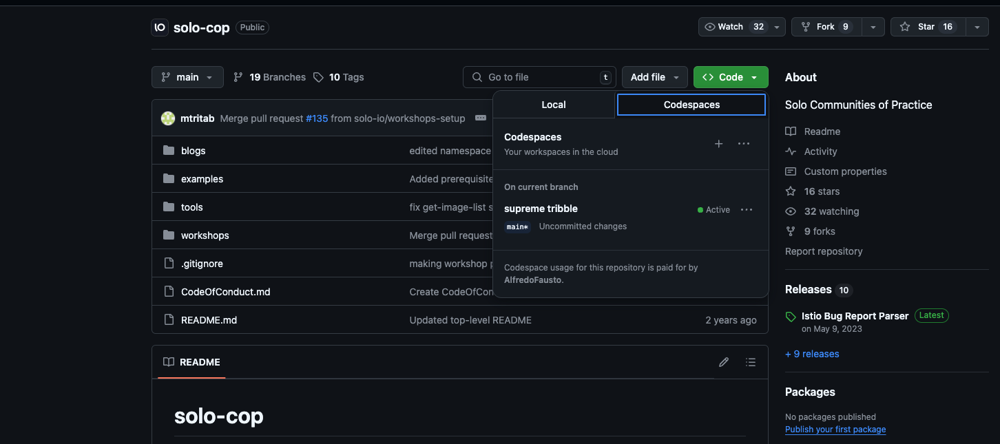
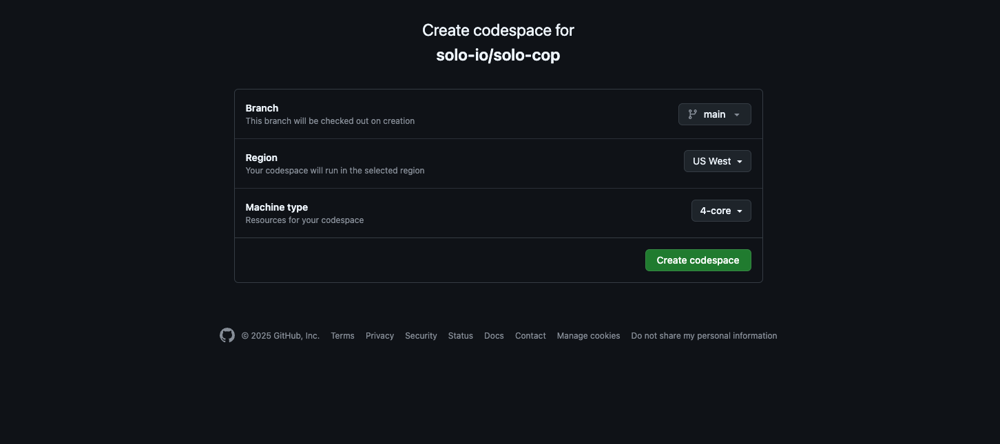
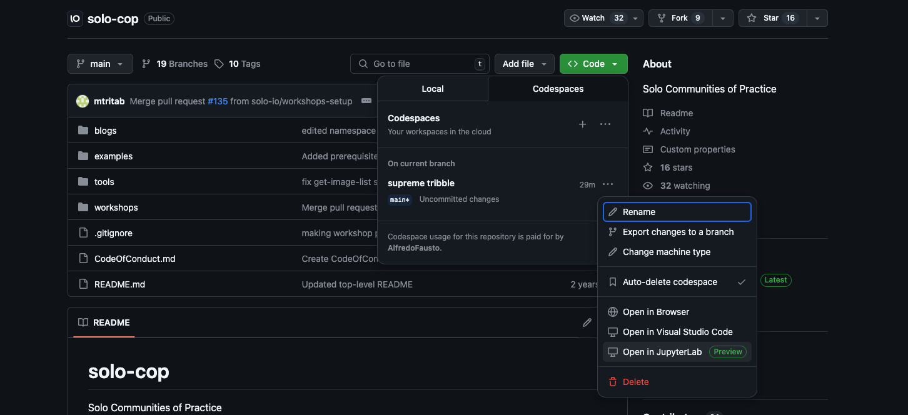
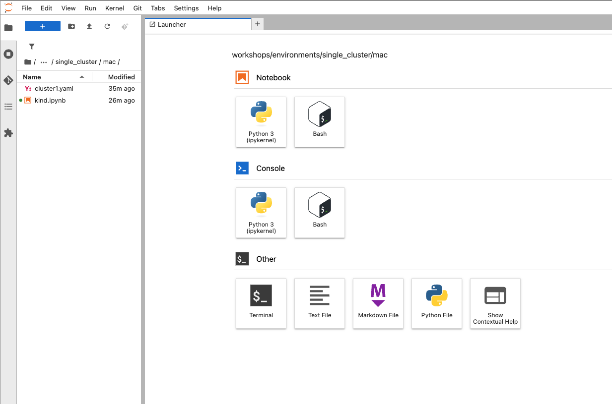

# Setup Workshops in Github Codespaces

You can run the workshop in a codespace for easy access. To create your codespace follow the instructions below:

> [!WARNING]
> Codespace usage for this repository is paid by yourself

1. Click on code and select the three dots for access codespace repository configuration.


2. Select new with options and you will be prompted with a few options select the Machine type to 4 cores.


3. Once the workspace is settled go back to the repo and select your codespace click on the three dots and select Open in JupyterLab


4. Finally, in the Laucher select the terminal. We need to install a bash kernel using the following commands:

```bash
pip install bash_kernel
python -m bash_kernel.install
```

5. A new bash kernel will be next to the python kernel as a notebook or console, select any workshop an ensure you are using the bash_kenrnel.


## About Codespaces

All personal GitHub accounts have a monthly quota of free use of GitHub Codespaces included in the Free or Pro plan. You can get started using GitHub Codespaces on your personal account without changing any settings or providing payment details.

If you create a codespace from an organization-owned repository, use of the codespace will either be charged to the organization (if the organization is configured for this), or to your personal account.

### Billing

The following storage and core hours of usage are included, free of charge, for personal accounts:

|Account plan|Storage per month|Core hours per month|
|------------|-----------------|--------------------|
|GitHub Free for personal accounts	|15 GB-month	|120|
|GitHub Pro	|20 GB-month	|180|

For more information click [here](https://docs.github.com/en/billing/managing-billing-for-your-products/managing-billing-for-github-codespaces/about-billing-for-github-codespaces)