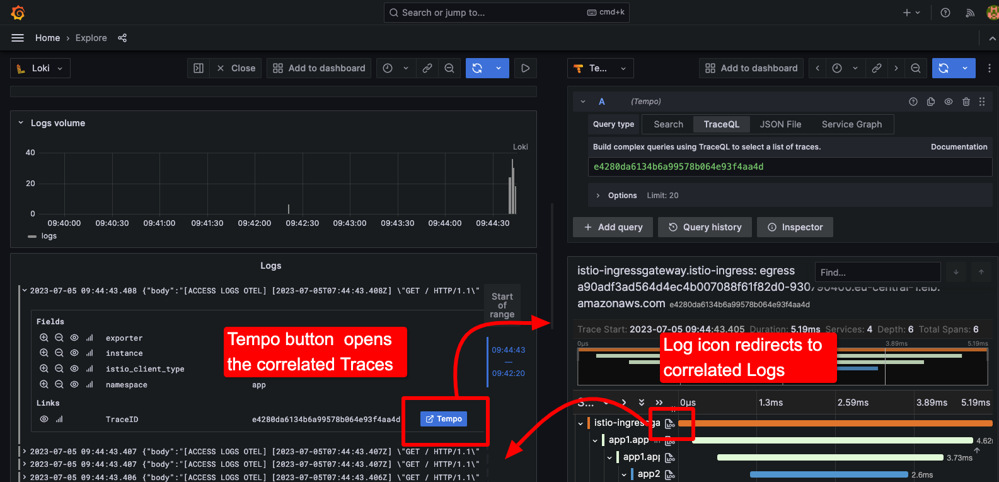
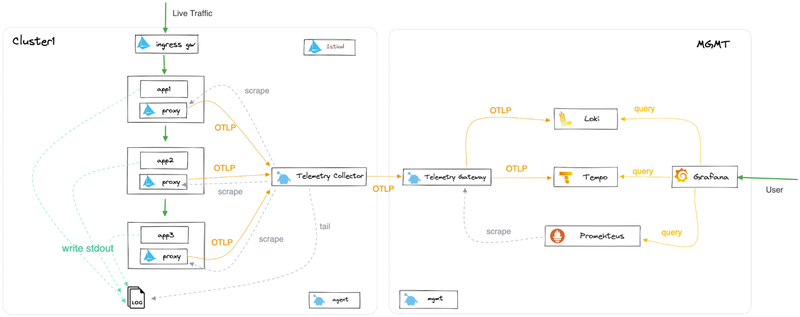
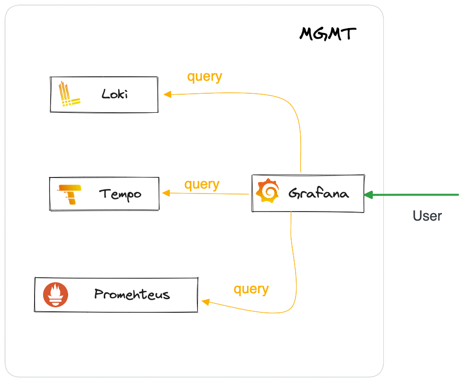
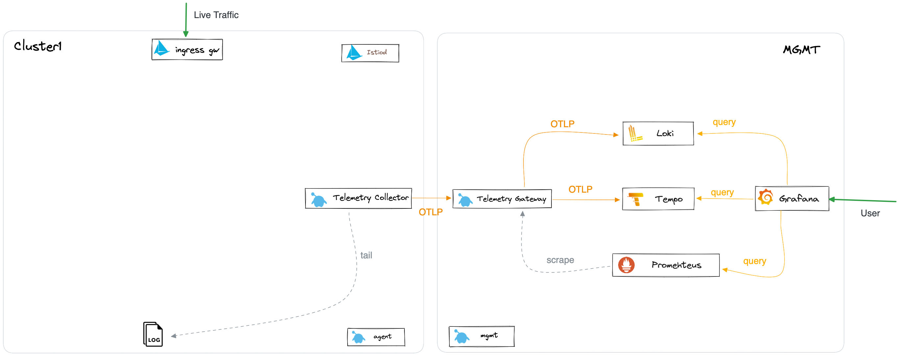
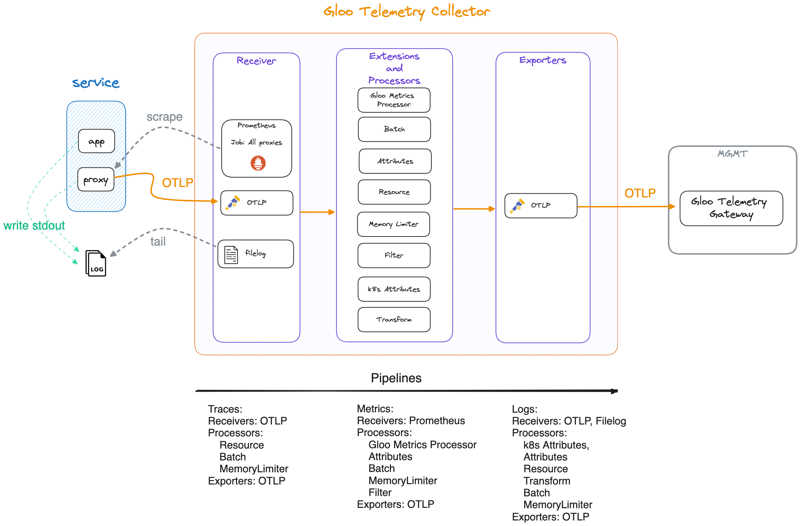
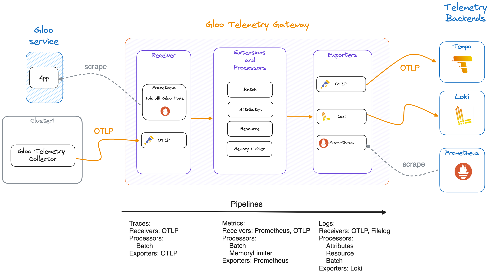
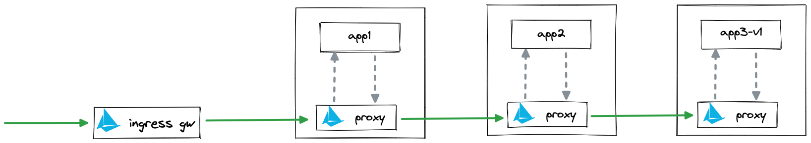
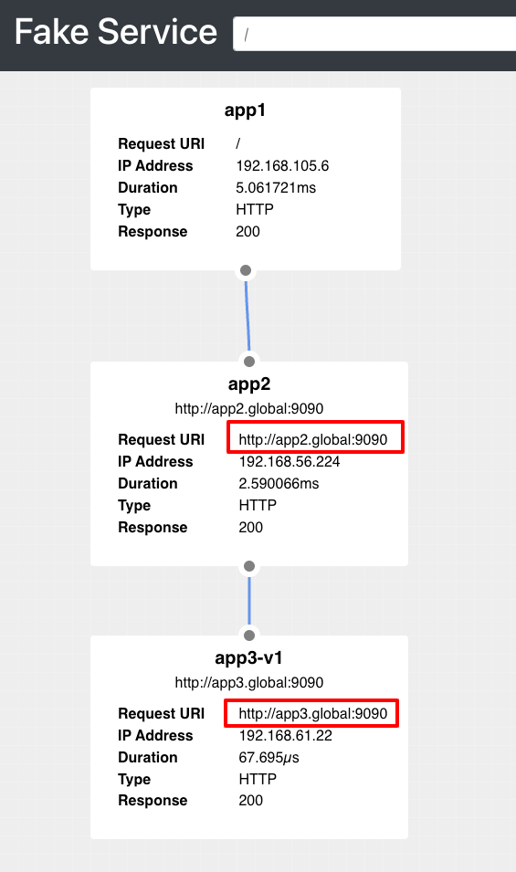
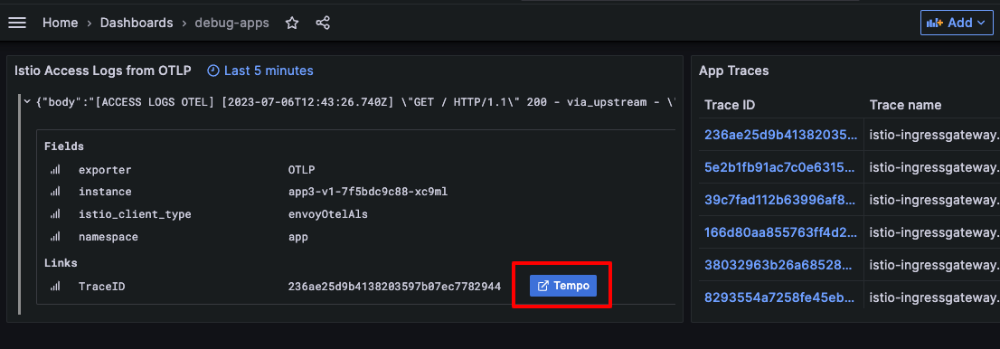
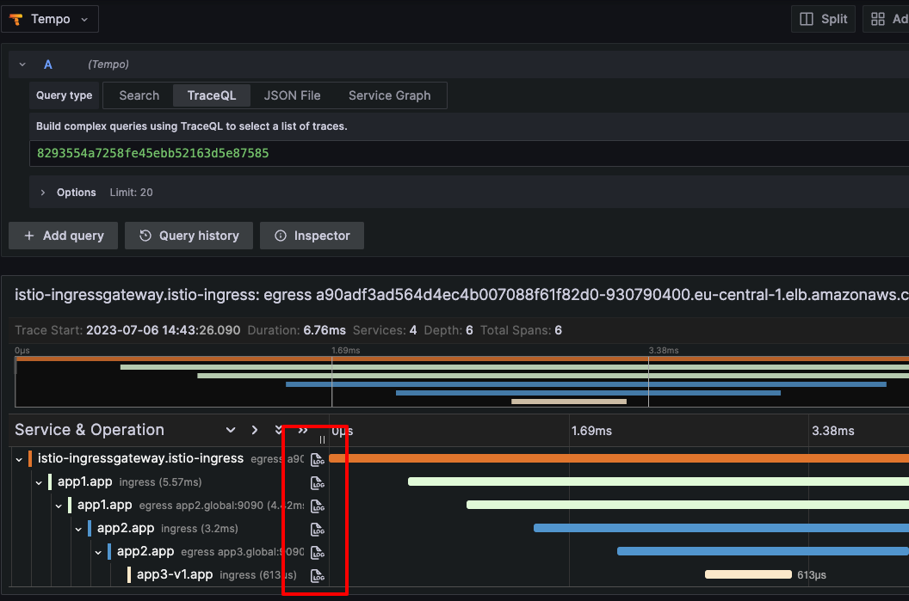

# Full Observability with Gloo Platform

This workshop aims to show how to configure Gloo Platform to collect Traces, Logs and Metrics from the applications deployed within the mesh.

But only gathering telemetry signals (Traces, Logs and Metrics) is not enough to get a full picture of the traffic flowing through the mesh. It's also necessary to correlate the telemetry signals to get a full picture of the traffic flowing through the mesh.

To correlate the telemetry signals, there are multiple solution. In this workshop you will correlate Traces and Logs through the common attribute TraceParent. This attribute is crated by the Tracing client at the proxy and it can be printed as part of the proxy logs.

Application logs usually have no standard format. Therefore, the application logs will be correlated by time with the Traces.

Metrics will be also correlated by time with the Traces.

Grafana allows you to connect all the dots by Links to make it more user friendly.

Here what you will achieve at the end of this workshop:



## Prerequisites

- Two (2) Kubernetes clusters with Gloo Mesh installed and configured to form a mesh. See [Gloo Mesh Getting Started](https://docs.solo.io/gloo-mesh/latest/getting_started/) for more details.
- This workshop has been tested with Gloo Platform 2.3.4
- This workshops assumes the environment is clean. If you have previously installed Gloo Mesh, please remove it before proceeding.

## Final Architecture

The goal of this workshop is to deploy the following architecture:



## Begin

To get started with this workshop, clone this repo.

```sh
git clone https://github.com/solo-io/solo-cop.git
cd solo-cop/workshops/debugging-with-observability/1-gloo-platform-observability
```

Set these environment variables which will be used throughout the workshop.

```sh
# Used to enable Gloo Mesh (please ask for a trail license key)
export GLOO_MESH_LICENSE_KEY=<licence_key>
export GLOO_MESH_VERSION=v2.3.4

# Istio version information
export ISTIO_IMAGE_REPO=us-docker.pkg.dev/gloo-mesh/istio-workshops
export ISTIO_IMAGE_TAG=1.17.1-solo
export ISTIO_VERSION=1.17.1
```

Kubernetes context for clusters

```sh
export MGMT=mgmt
export CLUSTER1=cluster1
```

Rename the kubectl config contexts of each of your two clusters to `mgmt` and `cluster1` respectively.

```sh
# UPDATE <context-to-rename> BEFORE APPLYING
kubectl config rename-context <context-to-rename> ${MGMT} 
kubectl config rename-context <context-to-rename> ${CLUSTER1} 
```

## Deploy Observability Stack

The observability stack consist of Tempo for Traces, Loki for Logs and Grafana for Visualization. Prometheus is deployed by default with Gloo Platform.



Add charts repo

```sh
helm repo add grafana https://grafana.github.io/helm-charts
helm repo up
```

Deploy Tempo

```sh
helm upgrade --kube-context=$MGMT --install tempo grafana/tempo -n observability --version 1.3.1 --create-namespace \
-f tempo-values.yaml
```

Deploy Loki

```sh
helm upgrade --kube-context=$MGMT --install loki grafana/loki -n observability --version 5.6.1 --create-namespace \
-f ./loki-values.yaml
```

Deploy Grafana

```sh
kubectl --context=$MGMT apply -f ./grafana-dashboard-configmap.yaml

helm upgrade --kube-context=$MGMT --install grafana grafana/grafana -n observability --version 6.57.0 -f ./grafana-values.yaml
```

Notice that there is Default dashboard (`./grafana-dashboard-configmap.yaml`) installed as `ConfigMap` to be used in this demo as a sample.

```yaml,no-copy
apiVersion: v1
kind: ConfigMap
metadata:
  labels:
    grafana_dashboard: "1"
  name: debug-apps-dashboard
  namespace: observability
data:
  debug-apps-dashboard.json: |-
    {
      "annotations": {
        "list": [
    [...]
    }
```

As well, there is an interesting configuration to let Grafana create a link between Loki logs and Tempo traces and viceversa.

```yaml,no-copy
datasources:
 datasources.yaml:
   apiVersion: 1
   datasources:
    - name: Tempo
      type: tempo
      [...]
      jsonData:
        tracesToLogsV2:
          [...]
    - orgId: 1
      name: Loki
      type: loki
      [...]
      jsonData:
        derivedFields:
          [...]
      readOnly: true
```

## Deploy Gloo Platform

This installation of Gloo Platform will configure the observability comoponents to collect Traces, Logs and Metrics from the applications deployed within the mesh.

The component to do this is called `gloo-telemetry` and there are two shapes:

- `gloo-telemetry-gateway` is deployed in the `MGMT` cluster. It serves as a gateway

- `gloo-telemetry-collector` is deployed in each cluster. It collects the telemetry signals from the proxies and the logs from the logs files in each cluster node and forwards them to the gateway.



Download `meshctl` command line tool and add it to your path

```sh
curl -sL https://run.solo.io/meshctl/install | GLOO_MESH_VERSION=${GLOO_MESH_VERSION} sh -

export PATH=$HOME/.gloo-mesh/bin:$PATH
```

```sh
meshctl install \
  --kubecontext $MGMT \
  --set mgmtClusterName=$MGMT \
  --license $GLOO_MESH_LICENSE_KEY \
  --chart-values-file ./glooplatform-mgmt-values.yaml
```

Check the installation to verify that it's healthy

```sh
meshctl check --kubecontext $MGMT
```

Deploy Agent on Cluster 1

```sh
export ENDPOINT_TELEMETRY_GATEWAY=$(kubectl --context ${MGMT} -n gloo-mesh get svc gloo-telemetry-gateway -o jsonpath='{.status.loadBalancer.ingress[0].*}'):4317


meshctl cluster register \
  $CLUSTER1 \
  --kubecontext=$MGMT \
  --remote-context=$CLUSTER1 \
  --telemetry-server-address=$ENDPOINT_TELEMETRY_GATEWAY \
  --gloo-mesh-agent-chart-values ./glooplatform-cluster1-values.yaml
```

```sh
meshctl check --kubecontext $CLUSTER1
```

Create a special Service for OpenTelemetry Collector in `cluster1`. Notice that upstream opentelemtry collector chart will do this in the next versions. This version was using OTel Collector Chart version: `0.49.2` and the fix comes with version `0.59.0`.

```sh
kubectl apply --context=$CLUSTER1 -f ./opentelemetry-service.yaml
```

Install Istio to the remote cluster (`cluster1`) using Gloo Mesh IstioLifecycleManager and GatewayLifecycleManager.
  
```sh
kubectl apply -f ./gm-istio.yaml --context $MGMT
```

Apply the default Telemetry rule

```sh
kubectl apply --context=$CLUSTER1 -f ./default-telemetry.yaml
```

After installing Gloo Platform, you can check the configmap for the Gloo Telemetry Collector and the Gloo Telemetry Gateway to udnerstand better the pipelines defined for each of them following OpenTelemetry concepts of Receivers, Processors and Exporters.

```sh
kubectl --context ${CLUSTER1} get cm -n gloo-mesh   gloo-telemetry-collector-config -oyaml
```

And:

```sh
 gloo-mesh   gloo-telemetry-gateway-config -oyaml
```

A conceptual representation can be,

For the collector:


And for the gateway:


## Deploy Demo Application

Let's deploy an application to test the observability stack.

The application will consist in 3 microservices. app1 will call app2 and app2 will call app3.



Find out the Istio revision

```sh
export revision=$(kubectl --context $CLUSTER1 get deploy -n istio-system -l app=istiod -ojson | jq -r '.items[].metadata.labels."istio.io/rev"')

kubectl --context ${CLUSTER1} create ns app
kubectl --context ${CLUSTER1} label namespace app istio.io/rev=$revision --overwrite
```

Deploy the demo application

```sh
kubectl --context ${CLUSTER1} -n app apply -f apps.yaml
```

Configure Gloo Platform to allow traffic to the demo application

```sh
kubectl --context ${MGMT} apply -f ./gm-resources-mgmt.yaml
kubectl --context ${CLUSTER1} apply -f ./gm-resources-cluster1.yaml
```

Access the application

```sh
export ENDPOINT_HTTP_GW_CLUSTER1=$(kubectl --context ${CLUSTER1} -n istio-ingress get svc -l istio=ingressgateway -o jsonpath='{.items[0].status.loadBalancer.ingress[0].*}'):80
export HOST_GW_CLUSTER1=$(echo ${ENDPOINT_HTTP_GW_CLUSTER1} | cut -d: -f1)
echo "http://${ENDPOINT_HTTP_GW_CLUSTER1}/ui"
```

The App is very simple. It leverages [Fake Service](https://github.com/nicholasjackson/fake-service) from `@nicholasjackson` to run a request that goes through three services (`app1`, `app2` and `app3-v1`).



**Notice** that the request do not use the kubernetes standard `svc-name.namespace.svc.cluster.local` domain, but the abstraction that Gloo Platform offers. In this case `*.global` domain.

So we have already everything deployed:


Reload several time the application to create traffic:

```sh
for i in {1..25}; do
curl -I http://${ENDPOINT_HTTP_GW_CLUSTER1}
done
```

Go to grafana and login with `admin/password`

```sh
echo http://$(kubectl --context ${MGMT} get svc grafana -n observability -o jsonpath='{.status.loadBalancer.ingress[0].*}')
```

Go to dashboard and select the `default` one. It will show logs and traces for the last 5 minutes.

The logs are filtered to only the ones coming from ALS (Access Log Service).

Once clicking on the Tempo button, you will be redirected to the related Traces.


Similary, on the traces side, you can also click on the Logs button and being redirected to the related logs.



## Conclusion

In this demo we have seen how to install Gloo Platform and configure it to collect telemetry signals from the applications deployed in the mesh.

We have also seen how to configure the observability stack to collect logs and traces and how to visualize them in Grafana.
