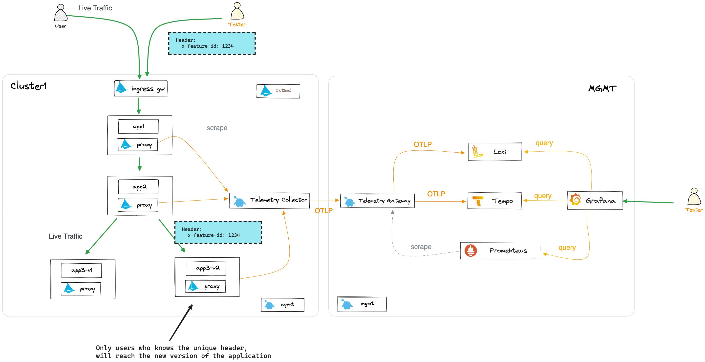
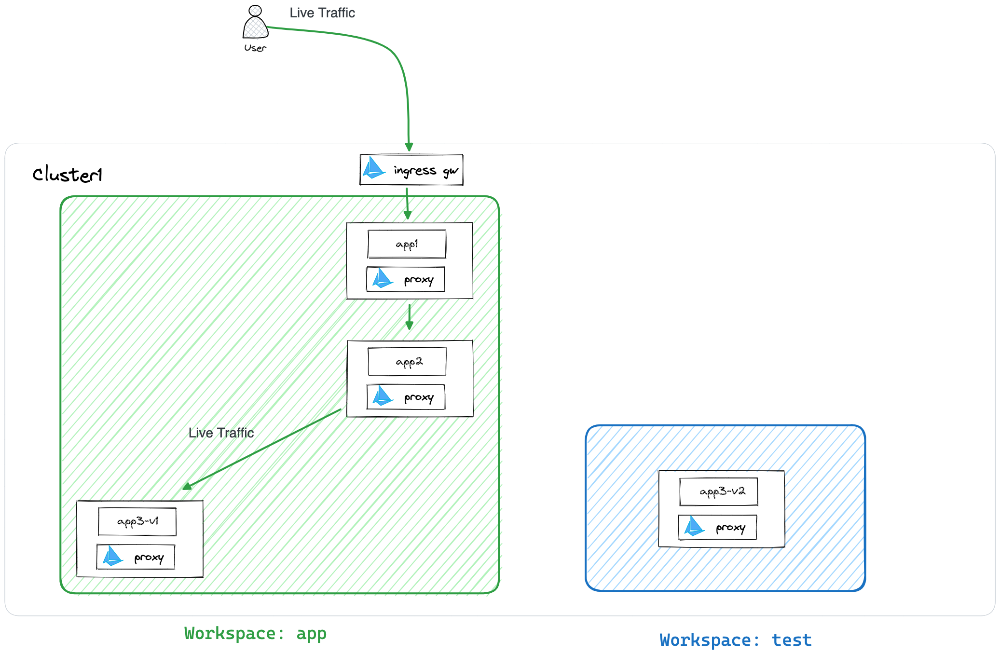
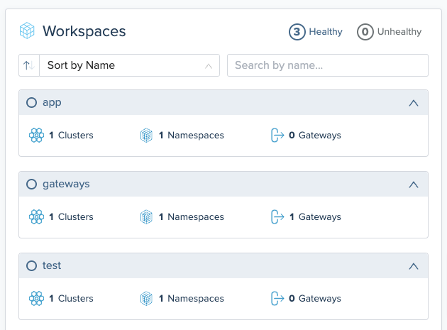
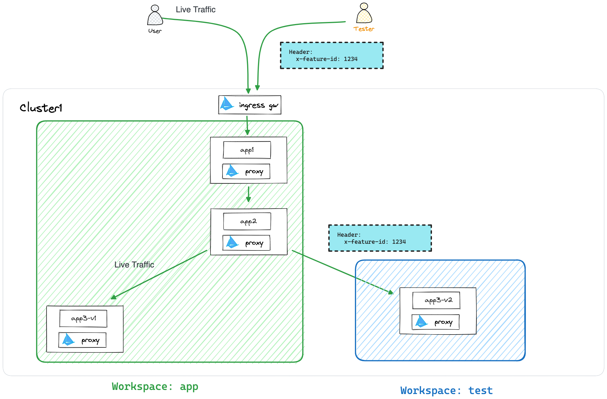
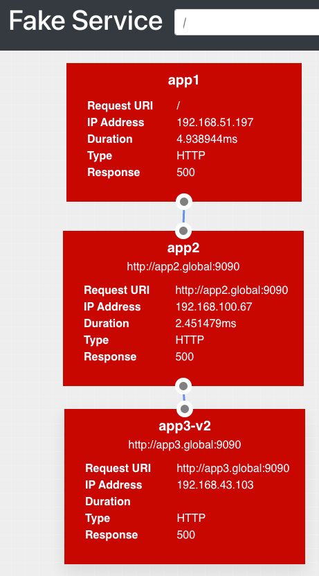
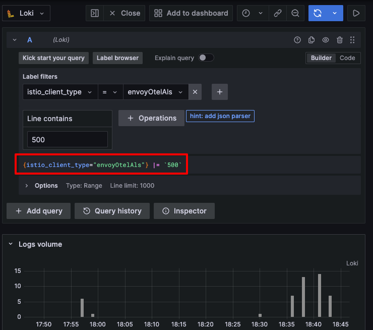
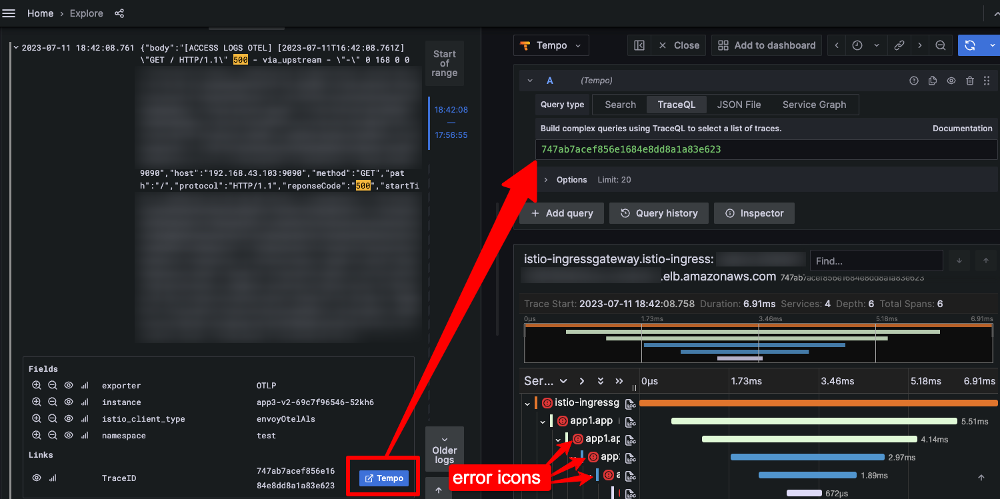
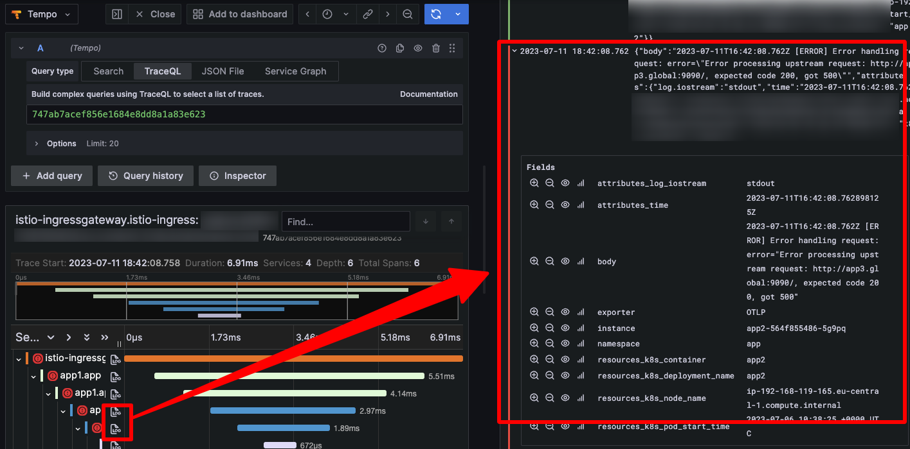
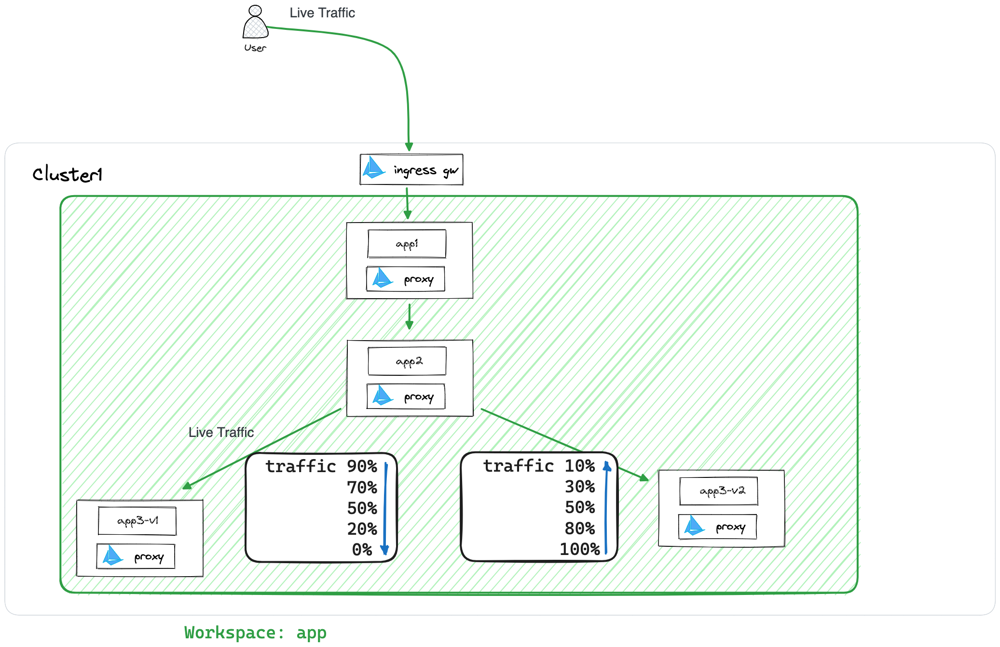

# Test In Production with Gloo Platform

This workshop aims to provide you with practical insights and hands-on experience in leveraging Observability tools within a Service Mesh (Gloo Platform) to enhance your testing strategies in a production environment.

With the application deployed in the [previous workshop](../2-test-in-production/README.md) of the series, you will deploy an app-v2 and Test in Production using one of the strategies described in this post (Dark Launch).

The goal is to show how simple is to configure the Gloo Platform to execute these strategies and speed up the development lifecycle.

## Prerequisites

- You need to have completed the [previous workshop](../2-test-in-production/README.md) of the series.
- Having [jq](https://jqlang.github.io/jq/) or similar installed in your machine to parse JSON files.

## Final Architecture

The goal of this workshop is to deploy the following architecture:



## Begin

To get started with this workshop, clone this repo.

```sh
git clone https://github.com/solo-io/solo-cop.git
cd solo-cop/workshops/debugging-with-observability/1-gloo-platform-observability
```

Set these environment variables which will be used throughout the workshop.

```sh
# Used to enable Gloo Mesh (please ask for a trail license key)
export GLOO_MESH_LICENSE_KEY=<licence_key>
export GLOO_MESH_VERSION=v2.3.4

# Istio version information
export ISTIO_IMAGE_REPO=us-docker.pkg.dev/gloo-mesh/istio-workshops
export ISTIO_IMAGE_TAG=1.17.1-solo
export ISTIO_VERSION=1.17.1
```

Kubernetes context for clusters

```sh
export MGMT=mgmt
export CLUSTER1=cluster1
```

Rename the kubectl config contexts of each of your two clusters to `mgmt` and `cluster1` respectively.

```sh
# UPDATE <context-to-rename> BEFORE APPLYING
kubectl config rename-context <context-to-rename> ${MGMT} 
kubectl config rename-context <context-to-rename> ${CLUSTER1} 
```

## Deploy the appliation to Test in Production

Deploy the application with the new version (v2) of the `app3` service.



Find out the Istio revision

```sh
export revision=$(kubectl --context $CLUSTER1 get deploy -n istio-system -l app=istiod -ojson | jq -r '.items[].metadata.labels."istio.io/rev"')

kubectl --context ${CLUSTER1} create ns test
kubectl --context ${CLUSTER1} label namespace test istio.io/rev=$revision --overwrite
```

With Gloo Platform you can create an isolated space called Workspace where to deploy the application to be tested.

```sh
kubectl --context=$MGMT apply -f ./test-workspace.yaml
```

If you go to the Gloo Mesh UI, you will see the new Workspace created.

```sh
kubectl port-forward svc/gloo-mesh-ui -n gloo-mesh 8090 --context $MGMT
echo "http://localhost:8090"
```



Deploy the application with the new version (v2) of the `app3` service.

```sh
kubectl --context=$CLUSTER1 apply -n test -f ./app3-v2.yaml
```

Notice that this application comes with a paramter to create an error with a probability of 33%. The intention is to simulate a new version of the service with a bug that you discovered when testing.

```yaml,nocopy
[...]
    spec:
      containers:
      - name: app3-v2
        image: nicholasjackson/fake-service:v0.20.0
        [...]
        env:
        - name: "NAME"
          value: "app3-v2"
        - name: "MESSAGE"
          value: "I am app3-v2 with errors"
        - name: "ERROR_RATE"
          value: "0.33"
[...]
```

## Configure Dark Launch

As you saw in the blog post covering Test in Production, Dark Launch is a strategy that allows you to test a new version of a service in production without exposing it to users.

In the previous step, we simulate that the platform team created an isolated space within the Mesh to deploy the application to be tested.

Now, that team needs to define a unique header to be used by the Tester to access the new version of the service and allows the communication between the two workspaces.

Developer/Tester will be the only one who knows that header, so that it will be the only one able to reach the new version of the service.

The rest of the users will continue reaching the old version of the service.



Deploy the resources to configure the Dark Launch strategy.

```sh
kubectl --context=$CLUSTER1 apply -f ./test-workspacesettings.yaml
kubectl --context=$CLUSTER1 apply -f ./apps-rt.yaml
kubectl --context=$CLUSTER1 apply -f ./test-vd.yaml
```

**Note:** Notice that the `RouteTable` object defines a header to route traffic either production version or testing version. That is the unique header the tester will use to run tests.

```yaml,nocopy
        - name: x-feature-id
          value: "1234"
```

Update the `App` workspace to import the required resources from the `Test` workspace.

```sh
kubectl --context=$CLUSTER1 apply -f ./apps-workspacesettings.yaml
```

Test the application as though it was live traffic (going to the old version of the service).

```sh
export ENDPOINT_HTTP_GW_CLUSTER1=$(kubectl --context ${CLUSTER1} -n istio-ingress get svc -l istio=ingressgateway -o jsonpath='{.items[0].status.loadBalancer.ingress[0].*}'):80
export HOST_GW_CLUSTER1=$(echo ${ENDPOINT_HTTP_GW_CLUSTER1} | cut -d: -f1)
curl "http://${ENDPOINT_HTTP_GW_CLUSTER1} | jq"
```

You will see the old version (`version 1`) of the application (`app3`) working smoothly.

```json,nocopy
{
  [...]
  "code": "200",
  "body": "I am app1",
  "upstream_calls": {
    "http://app2.global:9090": {
      "code": "200",
      "body": "I am app2"
      "upstream_calls": {
        "http://app3.global:9090": {
          "code": "200",
          "body": "I am app3 version 1"
        }
      }
    },
  }
}
```

Now, let's test the application as though you were a tester (going to the new version of the service). To do so, you need to add the specific and unique header and run several request. Remember that 33% of the request will show the error.

```sh
for i in {1..4}; do
  curl -s -H "x-feature-id: 1234" "http://${ENDPOINT_HTTP_GW_CLUSTER1}" | jq | grep "500"
done
```

You will see:

```yaml,nocopy
          "code": 500,
          "error": "Error processing upstream request: http://app3.global:9090/, expected code 200, got 500"
      "code": 500,
      "error": "Error processing upstream request: http://app2.global:9090/, expected code 200, got 500"
  "code": 500
          "code": 500,
          "error": "Error processing upstream request: http://app3.global:9090/, expected code 200, got 500"
      "code": 500,
      "error": "Error processing upstream request: http://app2.global:9090/, expected code 200, got 500"
  "code": 500
```

When you go through the UI version of the application, you will see that every 3 refreshes, you will see the error.



In grafana, if you check the Logs, Traces and Metrics, you will see the error as well. The corrataion you did in the previous post will help you to identify the error.

Use `admin/password` to login.

```sh
echo http://$(kubectl --context ${MGMT} get svc grafana -n observability -o jsonpath='{.status.loadBalancer.ingress[0].*}')
```

You will see in `Explore`, adding the give query for Loki, the error from the Istio Access Logs:

```sh,nocopy
{istio_client_type="envoyOtelAls"} |= `500`
```



If you click on the `Tempo` button you will go to the related Traces.



An if yu click on the Logs buttons, you will go to the Application Logs.



After noticing the error, the tester should report it to the development team to fix it, if not is the developer itself testing the new version.

## Configure Canary Release

After fixing the error, the developer/tester will deploy the again teh fixed version of the application.

```sh
kubectl --context=$CLUSTER1 apply -n test -f ./app3-v2-fix.yaml
```

After verifying that the error is fixed, the developer/tester's job is finished. A CI/CD pipeline will deploy the new version of the application to production.

To do so, you can configure the platform to define a Canary Release strategy. This can easily done with Argo Rollouts.



## Conclusion

In this demo we have seen, based on the previous workshop, how easy is to configure Gloo Platform to perform a Dark Launch and Test in Production a new version of an application.
