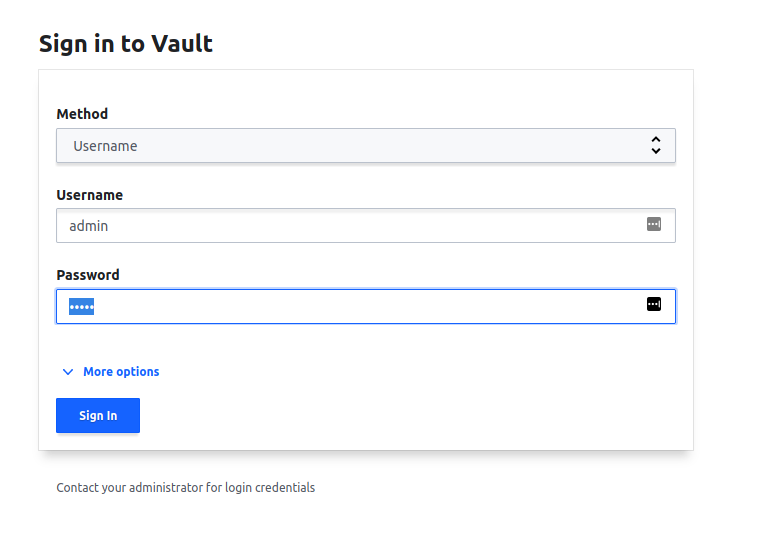

# <center>Gloo Mesh Day 2 Workshop</center>

## Table of Contents

* [Introduction](#introduction)
* [Lab 1 - Deploy Kubernetes clusters](#Lab-1)
* [Lab 2 - Deploy Vault](#Lab-2)
* [Lab 3 - Deploy Cert Manager](#Lab-3)
* [Lab 4 - Install Gloo Mesh](#Lab-4)
* [Lab 5 - Install Istio](#Lab-5)
* [Lab 6 - Scale Gloo Mesh](#Lab-6)

### Notes

2 cluster setup, mgmt and agent cluster

## Lab 2 - Deploy Vault

```sh
./install/vault/setup.sh
```

* Get Vault Address

```sh
export VAULT_ADDR=http://$(kubectl --context ${MGMT} -n vault get svc vault -o jsonpath='{.status.loadBalancer.ingress[0].*}'):8200

printf "\n\nVault available at: $VAULT_ADDR\n"
```



* Login

```sh
user: admin
password: admin
```

* Generate token to give to cert-manager

```sh
export VAULT_TOKEN=$(kubectl get configmap -n vault --context $MGMT cert-manager-token -o json | jq -r '.data.token')
```

## Lab 3 - Deploy Cert Manager

* Deploy cert-manager to all three clusters

```sh
kubectl --context ${MGMT} apply -f https://github.com/cert-manager/cert-manager/releases/download/v1.8.0/cert-manager.yaml
kubectl --context ${CLUSTER1} apply -f https://github.com/cert-manager/cert-manager/releases/download/v1.8.0/cert-manager.yaml

kubectl wait deployment --for condition=Available=True -n cert-manager --context $MGMT --all
kubectl wait deployment --for condition=Available=True -n cert-manager --context $CLUSTER1 --all
```

* Create token secret in each cert-manager namespace

```sh
kubectl create secret generic vault-token -n cert-manager --context $MGMT --from-literal=token=$VAULT_TOKEN
kubectl create secret generic vault-token -n cert-manager --context $CLUSTER1 --from-literal=token=$VAULT_TOKEN
```

* Create a ClusterIssuer in `mgmt` cluster

```yaml
kubectl apply --context $MGMT -f- <<EOF
apiVersion: cert-manager.io/v1
kind: ClusterIssuer
metadata:
  name: vault-istio-issuer
  namespace: cert-manager
spec:
  vault:
    path: pki_int_istio/root/sign-intermediate
    server: $VAULT_ADDR
    auth:
      tokenSecretRef:
        name: vault-token
        key: token
---
apiVersion: cert-manager.io/v1
kind: ClusterIssuer
metadata:
  name: vault-gloo-mesh-issuer
  namespace: cert-manager
spec:
  vault:
    path: pki_int_gloo_mesh/roles/gloo-mesh-issuer
    server: $VAULT_ADDR
    auth:
      tokenSecretRef:
        name: vault-token
        key: token
EOF
```

* Configure Issuer in `cluster1`

```yaml
kubectl apply --context ${CLUSTER1} -f- <<EOF
apiVersion: cert-manager.io/v1
kind: ClusterIssuer
metadata:
  name: vault-istio-issuer
  namespace: cert-manager
spec:
  vault:
    path: pki_int_istio/root/sign-intermediate
    server: $VAULT_ADDR
    auth:
      tokenSecretRef:
        name: vault-token
        key: token
---
apiVersion: cert-manager.io/v1
kind: ClusterIssuer
metadata:
  name: vault-gloo-mesh-issuer
  namespace: cert-manager
spec:
  vault:
    path: pki_int_gloo_mesh/roles/gloo-mesh-issuer
    server: $VAULT_ADDR
    auth:
      tokenSecretRef:
        name: vault-token
        key: token
EOF
```

### Istio Certificate Setup

* Create istio-system namespaces

```sh
kubectl create namespace istio-system --context $MGMT
kubectl create namespace istio-system --context $CLUSTER1
```

* Create Istio `cacerts` certificate in the `mgmt` cluster

```yaml
kubectl apply --context $MGMT -f- <<EOF
apiVersion: cert-manager.io/v1
kind: Certificate
metadata:
  name: mgmt-cacerts
  namespace: istio-system
spec:
  secretName: cacerts
  duration: 1h
  renewBefore: 30m
  commonName: mgmt.solo.io
  isCA: true
  usages:
    - digital signature
    - key encipherment
    - cert sign
  dnsNames:
    - mgmt.solo.io
  issuerRef:
    kind: ClusterIssuer
    name: vault-issuer-istio
EOF
```

* Create Istio `cacerts` certificate in the `cluster1` cluster

```yaml
kubectl apply --context $MGMT -f- <<EOF
apiVersion: cert-manager.io/v1
kind: Certificate
metadata:
  name: cluster1-cacerts
  namespace: istio-system
spec:
  secretName: cacerts
  duration: 1h
  renewBefore: 30m
  commonName: cluster1.solo.io
  isCA: true
  usages:
    - digital signature
    - key encipherment
    - cert sign
  dnsNames:
    - cluster1.solo.io
  issuerRef:
    kind: ClusterIssuer
    name: vault-issuer-istio
EOF
```

## Gloo Mesh Certificate Setup

* Generate a certificate for the `gloo-mesh-mgmt-server` service

```yaml
kubectl --context $MGMT_CONTEXT apply -f - <<EOF
apiVersion: cert-manager.io/v1
kind: Certificate
metadata:
  name: gloo-mesh-mgmt-server
  namespace: gloo-mesh
spec:
  commonName: gloo-mesh-mgmt-server
  dnsNames:
    - "*.gloo-mesh"
  duration: 8760h0m0s   ### 1 year life
  issuerRef:
    group: cert-manager.io
    kind: Issuer
    name: relay-root-ca
  renewBefore: 8736h0m0s
  secretName: relay-server-tls-secret
  usages:
    - server auth
    - client auth
  privateKey:
    algorithm: "RSA"
    size: 4096
EOF
```

* Generate a client certificate for the `gloo-mesh-agent`

```yaml
kubectl apply --context $CLUSTER1 -f - << EOF
kind: Certificate
apiVersion: cert-manager.io/v1
metadata:
  name: gloo-mesh-agent
  namespace: gloo-mesh
spec:
  commonName: gloo-mesh-agent
  dnsNames:
    # Must match the cluster name used in the helm chart install
    - "$CLUSTER1"
  duration: 8760h0m0s   ### 1 year life
  issuerRef:
    group: cert-manager.io
    kind: Issuer
    name: relay-root-ca
  renewBefore: 8736h0m0s
  secretName: gloo-mesh-agent-tls-cert
  usages:
    - digital signature
    - key encipherment
    - client auth
    - server auth
  privateKey:
    algorithm: "RSA"
    size: 4096
EOF
```

## Install Gloo Mesh

```sh
helm repo add gloo-mesh-agent https://storage.googleapis.com/gloo-mesh-enterprise/gloo-mesh-agent
helm repo add gloo-mesh-enterprise https://storage.googleapis.com/gloo-mesh-enterprise/gloo-mesh-enterprise 
helm repo update
```

* Default Management plane values

```sh
helm show values gloo-mesh-enterprise/gloo-mesh-enterprise --version $GLOO_MESH_VERSION
```

* Default control plane values

```sh
helm show values gloo-mesh-agent/gloo-mesh-agent --version $GLOO_MESH_VERSION
```

* Install Management Plane
```sh
helm upgrade --install gloo-mesh-enterprise gloo-mesh-enterprise/gloo-mesh-enterprise \
  --version=${GLOO_MESH_VERSION} \
  --set licenseKey=${GLOO_MESH_LICENSE_KEY} \
  --namespace gloo-mesh \
  --kube-context ${MGMT} \
  --wait
```

* Register mgmt and cluster1

```yaml
kubectl apply --context $MGMT -f- <<EOF
apiVersion: admin.gloo.solo.io/v2
kind: KubernetesCluster
metadata:
  name: mgmt
  namespace: gloo-mesh
spec:
  clusterDomain: cluster.local
---
apiVersion: admin.gloo.solo.io/v2
kind: KubernetesCluster
metadata:
  name: cluster1
  namespace: gloo-mesh
spec:
  clusterDomain: cluster.local
EOF
```

* Get the mgmt plane address

```sh
MGMT_INGRESS_ADDRESS=$(kubectl get svc -n gloo-mesh gloo-mesh-mgmt-server --context $MGMT -o jsonpath='{.status.loadBalancer.ingress[0].ip}')
MGMT_INGRESS_PORT=$(kubectl -n gloo-mesh get service gloo-mesh-mgmt-server --context $MGMT -o jsonpath='{.spec.ports[?(@.name=="grpc")].port}')
RELAY_ADDRESS=${MGMT_INGRESS_ADDRESS}:${MGMT_INGRESS_PORT}
echo "RELAY_ADDRESS: ${RELAY_ADDRESS}"
```

* Install remote cluster

```sh
helm upgrade --install gloo-mesh-agent gloo-mesh-agent/gloo-mesh-agent \
--kube-context=${CLUSTER1} \
--namespace gloo-mesh \
--set relay.serverAddress=${RELAY_ADDRESS} \
--set cluster=${CLUSTER1} \
--set relay.tokenSecret.name=gloo-mesh-agent-tls-cert \
--version ${GLOO_MESH_VERSION} \
--wait
```

## Install Istio

```sh
  helm repo add istio https://istio-release.storage.googleapis.com/charts
  helm repo update
```

* Install Istio CRDs

```sh
  helm upgrade --install istio-base istio/base \
    -n istio-system \
    --version $ISTIO_VERSION \
    --kube-context $MGMT \
    --create-namespace

  helm upgrade --install istio-base istio/base \
    -n istio-system \
    --version $ISTIO_VERSION \
    --kube-context $CLUSTER1\
    --create-namespace
```

* Install Istio control plane

```sh
  helm upgrade --install istiod istio/istiod \
    -f install/istio/operator-mgmt.yaml \
    --namespace istio-system \
    --version $ISTIO_VERSION \
    --kube-context $MGMT \
    --wait

  helm upgrade --install istiod istio/istiod \
    -f install/istio/operator-cluster1.yaml \
    --namespace istio-system \
    --version $ISTIO_VERSION \
    --kube-context $CLUSTER1 \
    --wait
```

* Install Gateways in mgmt cluster

```sh
helm upgrade --install istio-ingressgateway istio/gateway \
  -f install/istio/ingress-gateway-mgmt.yaml \
  --create-namespace \
  --namespace istio-gateways \
  --version $ISTIO_VERSION \
  --kube-context $MGMT \
  --wait


helm upgrade --install istio-eastwestgateway istio/gateway \
  -f $tmp_dir/eastwest-gateway-mgmt.yaml \
  --create-namespace \
  --namespace istio-gateways \
  --version $ISTIO_VERSION \
  --kube-context $MGMT
```

* Install Gateways in cluster1

```sh
helm upgrade --install istio-ingressgateway istio/gateway \
  -f install/istio/ingress-gateway-cluster1.yaml \
  --create-namespace \
  --namespace istio-gateways \
  --version $ISTIO_VERSION \
  --kube-context $CLUSTER1 \
  --wait

helm upgrade --install istio-eastwestgateway istio/gateway \
  -f $tmp_dir/eastwest-gateway-cluster1.yaml \
  --create-namespace \
  --namespace istio-gateways \
  --version $ISTIO_VERSION \
  --kube-context $CLUSTER1
```