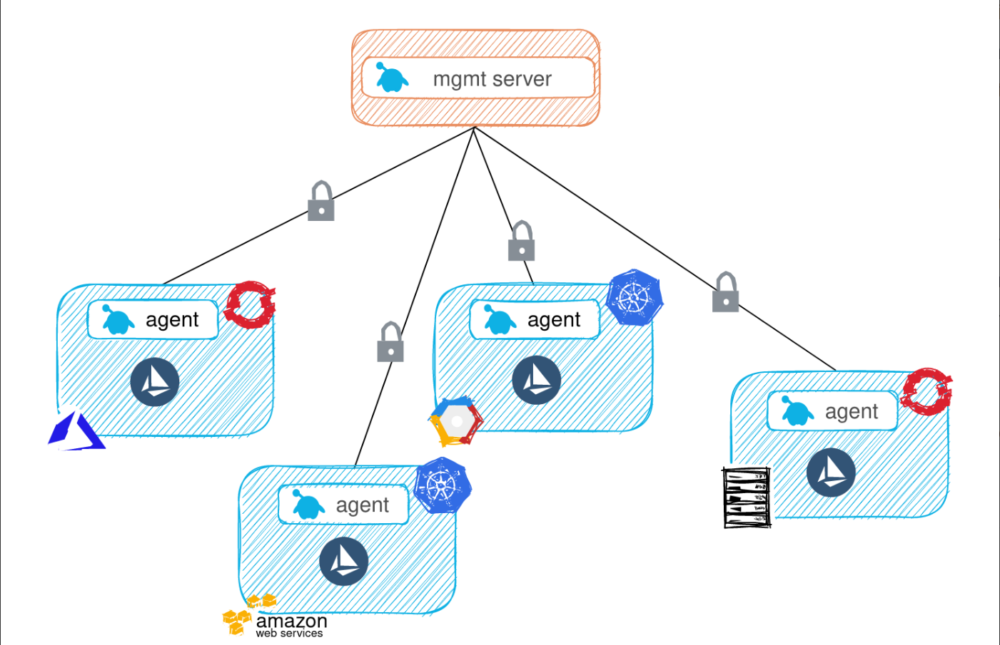

# <center>Gloo Day 2 Workshop</center>

## Table of Contents

* [Introduction](#introduction)
* [Lab 1 - Deploy Kubernetes clusters](#Lab-1)
* [Lab 2 - PKI / Vault and Cert Manager](#Lab-2)
* [Lab 3 - Install Gloo Mesh](#Lab-3)
* [Lab 4 - Install Istio](#Lab-4)
* [Lab 5 - Expose Centralized Apps via Gloo Gateway](#Lab-5)
* [Lab 6 - Tune Components](#Lab-6)
* [Lab 7 - Monitoring](#Lab-7)


## Introduction <a name="introduction"></a>


The day 2 Gloo workshop is all about the best practices and architectures to make your mutli-cluster deployment resilient, secure, and maintainable for the long term. This workshop was created based upon how Solo.io customers have been able to successfully run Gloo in Production as well as the knowledge from our Istio experts. 

High level best practices:
* Use helm and GitOps for deploying infrastructure to kubernetes
* Monitor and create alerts for your operational infrastructure
* Keep your PKI secure and rotate certificates
* Scale your components for resiliency


### Want to learn more about Gloo?

You can find more information about Gloo in the official documentation:

[https://docs.solo.io/gloo-mesh/latest/](https://docs.solo.io/gloo-mesh/latest/)

## Begin

To get started with this workshop, clone this repo.

```sh
git clone https://github.com/solo-io/solo-cop.git
cd solo-cop/workshops/gloo-mesh-demo && git checkout v1.1.0
```

Set these environment variables which will be used throughout the workshop.

```sh
# Used to enable Gloo (please ask for a trail license key)
export GLOO_LICENSE_KEY=<licence_key>
export GLOO_PLATFORM_VERSION=v2.0.12
# export ISTIO_IMAGE_REPO=us-docker.pkg.dev/gloo-mesh/istio-workshops
# export ISTIO_IMAGE_TAG=1.14.2-solo
export ISTIO_IMAGE_REPO=gcr.io/istio-release
export ISTIO_IMAGE_TAG=1.14.2
export ISTIO_VERSION=1.14.2
export ISTIO_REVISION=1-14
```

## Lab 1 - Configure/Deploy the Kubernetes clusters <a name="Lab-1"></a>

You will need to create two Kubernetes Clusters. One will serve as the Management cluster in which the Gloo Platform server will be deployed. The second cluster will be a workload cluster.

This workshop can run on many different Kubernetes distributions such as EKS, GKE, OpenShift, RKE, etc or you can 
* [create local k3d clusters](infra/k3d/README.md)
* [create eks clusters using eksctl](infra/eks/README.md).

Set these environment variables to represent your two clusters.
```sh
export MGMT=mgmt
export CLUSTER1=cluster1
```

Rename the kubectl config contexts of each of your two clusters to `mgmt`, `cluster1` respectively.

```sh
# UPDATE <context-to-rename> BEFORE APPLYING
kubectl config rename-context <context-to-rename> ${MGMT} 
kubectl config rename-context <context-to-rename> ${CLUSTER1} 
``` 


## Lab 2 - PKI / Vault and Cert Manager<a name="Lab-2"></a>

Gloo and Istio heavily rely on TLS certificates to facilitate safe and secure communitcation. Gloo Platform uses mutual tls authentication for communication between the Server and the Agents. Istio requires an Intermediate Signing CA so that it can issue workload certificates to each of the mesh enabled services. These workload certificates encrypt and authenticate traffic between each of your microservices.

It is important to design and implement a secure and reliable Public Key Infrastructure (PKI) that Gloo and Istio can rely on. In this workload we have chosen `Vault` and `cert-manager` as the PKI due to their versiatility and reliability for managing certificates. 


### Vault

Vault is not only a reliable secret store, but also great at managing and issuing certificates. In this workshop Vault will be responsible for holding `root` certificate as well as two intermediates, one for Istio, the other for Gloo.


* Deploy vault and automatically configure it to have a root certificate and 2 intermediates.

```sh
./install/vault/setup.sh
```

* Save the Vault address to be later used by `cert-manager`

```sh
export VAULT_ADDR=http://$(kubectl --context ${MGMT} -n vault get svc vault -o jsonpath='{.status.loadBalancer.ingress[0].*}'):8200

printf "\n\nVault available at: $VAULT_ADDR\n"
```

* Generate a token to give to cert-manager

```sh
export VAULT_TOKEN=$(kubectl get configmap -n vault --context $MGMT cert-manager-token -o json | jq -r '.data.token')

printf "\n\nYour vault token: $VAULT_TOKEN\n"
```

### Cert Manager

This workshop chose cert manager as the last-mile certificate management solution for a number of reasons. First, it is the most widely used Kubernetes based solution. Secondly, it natively integrates with a number of different issuing systems such as [AWS Private CA](https://github.com/cert-manager/aws-privateca-issuer), [Google Cloud CA](https://github.com/jetstack/google-cas-issuer) and [Vault](https://cert-manager.io/docs/configuration/vault/). Finally, cert-manager also creates certificates in the form of kubernetes secrets which are compatible with both Istio and Gloo Platform. It also has the ability to automatically rotate them when they are nearing their end of life.


* Deploy cert-manager to both the `mgmt` and `cluster1` clusters

```sh
kubectl --context ${MGMT} apply -f https://github.com/cert-manager/cert-manager/releases/download/v1.8.2/cert-manager.yaml
kubectl --context ${CLUSTER1} apply -f https://github.com/cert-manager/cert-manager/releases/download/v1.8.2/cert-manager.yaml

kubectl wait deployment --for condition=Available=True -n cert-manager --context $MGMT --all
kubectl wait deployment --for condition=Available=True -n cert-manager --context $CLUSTER1 --all
```

* Create the kubernetes secret containing the Vault token in each `cert-manager` namespace. This will be used by cert-manager to authenticate with Vault

```sh
kubectl create secret generic vault-token -n cert-manager --context $MGMT --from-literal=token=$VAULT_TOKEN
kubectl create secret generic vault-token -n cert-manager --context $CLUSTER1 --from-literal=token=$VAULT_TOKEN
```

* Create a ClusterIssuer for Gloo and Istio in `mgmt` cluster

```yaml
kubectl apply --context $MGMT -f- <<EOF
apiVersion: cert-manager.io/v1
kind: ClusterIssuer
metadata:
  name: vault-issuer-istio
  namespace: cert-manager
spec:
  vault:
    path: pki_int_istio/root/sign-intermediate
    server: $VAULT_ADDR
    auth:
      tokenSecretRef:
        name: vault-token
        key: token
---
apiVersion: cert-manager.io/v1
kind: ClusterIssuer
metadata:
  name: vault-issuer-gloo
  namespace: cert-manager
spec:
  vault:
    path: pki_int_gloo/sign/gloo-issuer
    server: $VAULT_ADDR
    auth:
      tokenSecretRef:
        name: vault-token
        key: token
EOF
```

* Create a ClusterIssuer for Gloo and Istio in `cluster1` cluster

```yaml
kubectl apply --context ${CLUSTER1} -f- <<EOF
apiVersion: cert-manager.io/v1
kind: ClusterIssuer
metadata:
  name: vault-issuer-istio
  namespace: cert-manager
spec:
  vault:
    path: pki_int_istio/root/sign-intermediate ## This path allows ca: TRUE certificaets
    server: $VAULT_ADDR
    auth:
      tokenSecretRef:
        name: vault-token
        key: token
---
apiVersion: cert-manager.io/v1
kind: ClusterIssuer
metadata:
  name: vault-issuer-gloo
  namespace: cert-manager
spec:
  vault:
    path: pki_int_gloo/sign/gloo-issuer ## This path is for client/server certificates
    server: $VAULT_ADDR
    auth:
      tokenSecretRef:
        name: vault-token
        key: token
EOF
```

### Istio Certificate Setup

As stated above, Istio requries an Intermediate Signing CA so that it can issue workload certificates. Each remote cluster should have an Intermediate Signing CA that is rooted in the same trust chain if you want to facilitate cross cluster communication. 


* Create istio-system namespaces

```sh
kubectl create namespace istio-system --context $MGMT
kubectl create namespace istio-system --context $CLUSTER1
```

* Create Istio `cacerts` certificate in the `mgmt` cluster

```yaml
kubectl apply --context $MGMT -f- <<EOF
apiVersion: cert-manager.io/v1
kind: Certificate
metadata:
  name: mgmt-cacerts
  namespace: istio-system
spec:
  secretName: cacerts
  duration: 1h
  renewBefore: 30m
  commonName: mgmt.solo.io
  isCA: true
  usages:
    - digital signature
    - key encipherment
    - cert sign
  dnsNames:
    - mgmt.solo.io
  issuerRef:
    kind: ClusterIssuer
    name: vault-issuer-istio
EOF
```

* Create Istio `cacerts` certificate in the `cluster1` cluster

```yaml
kubectl apply --context $CLUSTER1 -f- <<EOF
apiVersion: cert-manager.io/v1
kind: Certificate
metadata:
  name: cluster1-cacerts
  namespace: istio-system
spec:
  secretName: cacerts
  duration: 1h
  renewBefore: 30m
  commonName: cluster1.solo.io
  isCA: true
  usages:
    - digital signature
    - key encipherment
    - cert sign
  dnsNames:
    - cluster1.solo.io
  issuerRef:
    kind: ClusterIssuer
    name: vault-issuer-istio
EOF
```

* Verify Secrets are created

```sh
kubectl get secret -n istio-system cacerts --context $MGMT
kubectl get secret -n istio-system cacerts --context $CLUSTER1
```

## Gloo Platform Certificate Setup

Gloo uses client/server TLS certificates to securely communicate between the server and agents. This prevents non gloo applications from inadvertantly connecting to the Gloo server and accessing its information. 


* Create gloo-mesh namespaces

```sh
kubectl create namespace gloo-mesh --context $MGMT
kubectl create namespace gloo-mesh --context $CLUSTER1
```

* Generate a certificate for the `gloo-mesh-mgmt-server` service

```yaml
kubectl --context $MGMT_CONTEXT apply -f - <<EOF
apiVersion: cert-manager.io/v1
kind: Certificate
metadata:
  name: gloo-server
  namespace: gloo-mesh
spec:
  commonName: gloo-server
  dnsNames:
    - "*.gloo-mesh"
  duration: 8760h0m0s   ### 1 year life
  issuerRef:
    kind: ClusterIssuer
    name: vault-issuer-gloo
  renewBefore: 8736h0m0s
  secretName: gloo-server-tls-cert
  usages:
    - server auth
    - client auth
  privateKey:
    algorithm: "RSA"
    size: 4096
---
kind: Certificate
apiVersion: cert-manager.io/v1
metadata:
  name: gloo-agent
  namespace: gloo-mesh
spec:
  commonName: gloo-agent
  dnsNames:
    # Must match the cluster name used in the helm chart install
    - "mgmt-cluster"
  duration: 8760h0m0s   ### 1 year life
  issuerRef:
    kind: ClusterIssuer
    name: vault-issuer-gloo
  renewBefore: 8736h0m0s
  secretName: gloo-agent-tls-cert
  usages:
    - digital signature
    - key encipherment
    - client auth
    - server auth
  privateKey:
    algorithm: "RSA"
    size: 4096
EOF
```

* Generate a client certificate for the `gloo-agent`

```yaml
kubectl apply --context $CLUSTER1 -f - << EOF
kind: Certificate
apiVersion: cert-manager.io/v1
metadata:
  name: gloo-agent
  namespace: gloo-mesh
spec:
  commonName: gloo-agent
  dnsNames:
    # Must match the cluster name used in the helm chart install
    - "$CLUSTER1"
  duration: 8760h0m0s   ### 1 year life
  issuerRef:
    kind: ClusterIssuer
    name: vault-issuer-gloo
  renewBefore: 8736h0m0s
  secretName: gloo-agent-tls-cert
  usages:
    - digital signature
    - key encipherment
    - client auth
    - server auth
  privateKey:
    algorithm: "RSA"
    size: 4096
EOF
```

* Verify secrets

```sh
kubectl get secret gloo-server-tls-cert -n gloo-mesh --context $MGMT
kubectl get secret gloo-agent-tls-cert -n gloo-mesh --context $MGMT
kubectl get secret gloo-agent-tls-cert -n gloo-mesh --context $CLUSTER1
```

## Install Gloo <a name="Lab-3"></a>

Gloo consists of a centralized management server to which agents running on each of the workload clusters connect. The recommended way to install Gloo in production is via `helm`. Helm was chosen because of the amount of support it has with various GitOps based deployment solutions. Many of our customers today use `ArgoCD` to deploy Gloo. For more see [GitOps with ArgoCD and Gloo](https://www.solo.io/blog/gitops-with-argo-cd-and-gloo-mesh-part-1/)



* Add Gloo Helm charts to your repository

```sh
helm repo add gloo-mesh-agent https://storage.googleapis.com/gloo-mesh-enterprise/gloo-mesh-agent
helm repo add gloo-mesh-enterprise https://storage.googleapis.com/gloo-mesh-enterprise/gloo-mesh-enterprise 
helm repo update
```

* View the default management plane values

```sh
helm show values gloo-mesh-enterprise/gloo-mesh-enterprise --version $GLOO_PLATFORM_VERSION
```

* View the default control plane values

```sh
helm show values gloo-mesh-agent/gloo-mesh-agent --version $GLOO_PLATFORM_VERSION
```

### Install Gloo

* Install the management plane via helm

```sh
helm upgrade --install gloo-mesh-enterprise gloo-mesh-enterprise/gloo-mesh-enterprise \
  --version=${GLOO_PLATFORM_VERSION} \
  --set licenseKey=${GLOO_MESH_LICENSE_KEY} \
  --kube-context ${MGMT} \
  --namespace gloo-mesh \
  --set glooMeshMgmtServer.relay.disableTokenGeneration=true \
  --set glooMeshMgmtServer.relay.disableCa=true \
  --set glooMeshMgmtServer.relay.disableCaCertGeneration=true \
  --set glooMeshMgmtServer.relay.tlsSecret.name=gloo-server-tls-cert \
  --set prometheus.enabled=false \
  --wait
```

* Register mgmt and cluster1 with the management plane so that the connecting agents will be trusted

```yaml
kubectl apply --context $MGMT -f- <<EOF
apiVersion: admin.gloo.solo.io/v2
kind: KubernetesCluster
metadata:
  name: mgmt-cluster
  namespace: gloo-mesh
spec:
  clusterDomain: cluster.local
---
apiVersion: admin.gloo.solo.io/v2
kind: KubernetesCluster
metadata:
  name: cluster1
  namespace: gloo-mesh
spec:
  clusterDomain: cluster.local
EOF
```

* Get the mgmt plane address

```sh
MGMT_INGRESS_ADDRESS=$(kubectl get svc -n gloo-mesh gloo-mesh-mgmt-server --context $MGMT -o jsonpath='{.status.loadBalancer.ingress[0].ip}')
MGMT_INGRESS_PORT=$(kubectl -n gloo-mesh get service gloo-mesh-mgmt-server --context $MGMT -o jsonpath='{.spec.ports[?(@.name=="grpc")].port}')
RELAY_ADDRESS=${MGMT_INGRESS_ADDRESS}:${MGMT_INGRESS_PORT}
echo "RELAY_ADDRESS: ${RELAY_ADDRESS}"
```

* Install a Gloo agent on the management plane so we later can add and manage Gloo Gateway on it.

```sh
helm upgrade --install gloo-mesh-agent gloo-mesh-agent/gloo-mesh-agent \
  --kube-context=${MGMT} \
  --namespace gloo-mesh \
  --set relay.serverAddress=${RELAY_ADDRESS} \
  --set cluster=mgmt-cluster \
  --set relay.clientTlsSecret.name=gloo-agent-tls-cert \
  --version ${GLOO_PLATFORM_VERSION} \
  --wait
```

* Install a Gloo agent on the remote cluster.

```sh
helm upgrade --install gloo-mesh-agent gloo-mesh-agent/gloo-mesh-agent \
  --kube-context=${CLUSTER1} \
  --namespace gloo-mesh \
  --set relay.serverAddress=${RELAY_ADDRESS} \
  --set cluster=${CLUSTER1} \
  --set relay.clientTlsSecret.name=gloo-agent-tls-cert \
  --version ${GLOO_PLATFORM_VERSION} \
  --wait
```

* Install the gloo mesh addons (rate-limiter/ext-auth-service) in the `mgmt` cluster

```sh
helm upgrade --install gloo-mesh-addons gloo-mesh-agent/gloo-mesh-agent \
  --kube-context=${MGMT} \
  --create-namespace \
  --namespace gloo-mesh-addons \
  --set glooMeshAgent.enabled=false \
  --set rate-limiter.enabled=true \
  --set ext-auth-service.enabled=true \
  --version ${GLOO_PLATFORM_VERSION} \
  --wait
```

* Download `meshctl`

```sh
curl -sL https://run.solo.io/meshctl/install | GLOO_MESH_VERSION=${GLOO_PLATFORM_VERSION} sh -

export PATH=$HOME/.gloo-mesh/bin:$PATH
```

* Verify install by running `meshctl dashboard --kubecontext $MGMT`

## Install Istio <a name="Lab-4"></a>

Istio now recommends using `helm` to install its components. The helm charts are broken up into a few distinct charts. This makes it easier to manage istio and upgrade the component individually when needed. 

Istio charts:
* istio/base - Istio custom resource definitions
* istio/istiod - Istio control plane installation
* istio/gateway - Single Istio gateway (ingress/eastwest/egress) installation

There are a number of recommended best practices to employ when installing Istio for production. This workshop does not implement them all but does setup the architecture enabling the end user to iterate later on.

Recommended architecture best practices:
* Use `helm` based deployments
* Use revisions to verion the control plane and gateways
* Deploy ingress and eastwest to their own namespaces
* Use PKI to provision `cacerts`
* Monitor istiod and gateways health via observability tools

### Installation

Istio will be installed into both clusters. In a previous step, a gloo mesh agent was installed in the `mgmt` cluster. This was so that the centralized management tools could be exposed via an Istio gateway to the end user which will be done in a later step. This workshop uses a Solo.io specific build of Istio that has solo addon filters that enable such features as `external authorization`, `rate limiting`, and `GraphQL`.


Lets begin
* Add the Istio charts repository

```sh
helm repo add istio https://istio-release.storage.googleapis.com/charts
helm repo update
```

* Install Istio CRDs to each cluster

```sh
helm upgrade --install istio-base istio/base \
  -n istio-system \
  --version ${ISTIO_VERSION} \
  --kube-context ${MGMT} \
  --create-namespace

helm upgrade --install istio-base istio/base \
  -n istio-system \
  --version ${ISTIO_VERSION} \
  --kube-context ${CLUSTER1} \
  --create-namespace
```

* Install Istio control plane to the `mgmt` cluster

```yaml
helm upgrade --install istiod-${ISTIO_REVISION} istio/istiod \
  --set revision=${ISTIO_REVISION} \
  --set global.hub=${ISTIO_IMAGE_REPO} \
  --set global.tag=${ISTIO_IMAGE_TAG} \
  --version ${ISTIO_VERSION} \
  --namespace istio-system \
  --kube-context ${MGMT} \
  --wait \
  -f- <<EOF
meshConfig:
  # The trust domain corresponds to the trust root of a system. 
  # For Gloo this should be the name of the cluster that cooresponds with the CA certificate CommonName identity
  trustDomain: mgmt-cluster
  # enable access logging to standard output
  accessLogFile: /dev/stdout
  defaultConfig:
    # wait for the istio-proxy to start before application pods
    holdApplicationUntilProxyStarts: true
    # enable Gloo metrics service (required for Gloo UI)
    envoyMetricsService:
      address: gloo-mesh-agent.gloo-mesh:9977
      # enable Gloo accesslog service (required for Gloo Access Logging)
    envoyAccessLogService:
      address: gloo-mesh-agent.gloo-mesh:9977
    proxyMetadata:
      # Enable Istio agent to handle DNS requests for known hosts
      # Unknown hosts will automatically be resolved using upstream dns servers in resolv.conf
      # (for proxy-dns)
      ISTIO_META_DNS_CAPTURE: "true"
      # Enable automatic address allocation (for proxy-dns)
      ISTIO_META_DNS_AUTO_ALLOCATE: "true"
      # Used for gloo mesh metrics aggregation
      # should match trustDomain (required for Gloo UI)
      GLOO_MESH_CLUSTER_NAME: mgmt-cluster
pilot:
  env:
    # Allow multiple trust domains (Required for Gloo east/west routing)
    PILOT_SKIP_VALIDATE_TRUST_DOMAIN: "true"
EOF
```

* Install Istio control plane to the `cluster1` cluster

```yaml
helm upgrade --install istiod-${ISTIO_REVISION} istio/istiod \
  --set revision=${ISTIO_REVISION} \
  --set global.hub=${ISTIO_IMAGE_REPO} \
  --set global.tag=${ISTIO_IMAGE_TAG} \
  --version ${ISTIO_VERSION} \
  --namespace istio-system \
  --kube-context ${CLUSTER1} \
  --wait \
  -f- <<EOF
meshConfig:
  # The trust domain corresponds to the trust root of a system. 
  # For Gloo this should be the name of the cluster that cooresponds with the CA certificate CommonName identity
  trustDomain: cluster1
  # enable access logging to standard output
  accessLogFile: /dev/stdout
  defaultConfig:
    # wait for the istio-proxy to start before application pods
    holdApplicationUntilProxyStarts: true
    # enable Gloo metrics service (required for Gloo UI)
    envoyMetricsService:
      address: gloo-mesh-agent.gloo-mesh:9977
      # enable Gloo accesslog service (required for Gloo Access Logging)
    envoyAccessLogService:
      address: gloo-mesh-agent.gloo-mesh:9977
    proxyMetadata:
      # Enable Istio agent to handle DNS requests for known hosts
      # Unknown hosts will automatically be resolved using upstream dns servers in resolv.conf
      # (for proxy-dns)
      ISTIO_META_DNS_CAPTURE: "true"
      # Enable automatic address allocation (for proxy-dns)
      ISTIO_META_DNS_AUTO_ALLOCATE: "true"
      # Used for gloo mesh metrics aggregation
      # should match trustDomain (required for Gloo UI)
      GLOO_MESH_CLUSTER_NAME: cluster1
pilot:
  env:
    # Allow multiple trust domains (Required for Gloo east/west routing)
    PILOT_SKIP_VALIDATE_TRUST_DOMAIN: "true"
EOF
```

* Install Gateways in mgmt cluster

```sh
helm upgrade --install istio-ingressgateway-${ISTIO_REVISION} istio/gateway \
  --set revision=${ISTIO_REVISION} \
  --set global.hub=${ISTIO_IMAGE_REPO} \
  --set global.tag=${ISTIO_IMAGE_TAG} \
  --version ${ISTIO_VERSION} \
  --create-namespace \
  --namespace istio-ingress \
  --kube-context ${MGMT} \
  --wait \
  -f- <<EOF
name: istio-ingressgateway-${ISTIO_REVISION}
labels:
  istio: ingressgateway
  revision: ${ISTIO_REVISION}
service:
  type: LoadBalancer
  ports:
  # main http ingress port
  - port: 80
    targetPort: 8080
    name: http2
  # main https ingress port
  - port: 443
    targetPort: 8443
    name: https
EOF

helm upgrade --install istio-eastwestgateway-${ISTIO_REVISION} istio/gateway \
  --set revision=${ISTIO_REVISION} \
  --set global.hub=${ISTIO_IMAGE_REPO} \
  --set global.tag=${ISTIO_IMAGE_TAG} \
  --version ${ISTIO_VERSION} \
  --create-namespace \
  --namespace istio-eastwest \
  --kube-context ${MGMT} \
  --wait \
  -f- <<EOF
name: istio-eastwestgateway-${ISTIO_REVISION}
labels:
  istio: eastwestgateway
  revision: ${ISTIO_REVISION}
service:
  type: LoadBalancer
  ports:
  - name: tls
    port: 15443
    targetPort: 15443
env:
  # Required for Gloo multi-cluster routing
  ISTIO_META_ROUTER_MODE: "sni-dnat"
EOF
```

* Install Gateways in cluster1

```sh
helm upgrade --install istio-ingressgateway-${ISTIO_REVISION} istio/gateway \
  --set revision=${ISTIO_REVISION} \
  --set global.hub=${ISTIO_IMAGE_REPO} \
  --set global.tag=${ISTIO_IMAGE_TAG} \
  --version ${ISTIO_VERSION} \
  --create-namespace \
  --namespace istio-ingress \
  --kube-context ${CLUSTER1} \
  --wait \
  -f- <<EOF
name: istio-ingressgateway-${ISTIO_REVISION}
labels:
  istio: ingressgateway
  revision: ${ISTIO_REVISION}
service:
  type: LoadBalancer
  ports:
  # main http ingress port
  - port: 80
    targetPort: 8080
    name: http2
  # main https ingress port
  - port: 443
    targetPort: 8443
    name: https
EOF

helm upgrade --install istio-eastwestgateway-${ISTIO_REVISION} istio/gateway \
  --set revision=${ISTIO_REVISION} \
  --set global.hub=${ISTIO_IMAGE_REPO} \
  --set global.tag=${ISTIO_IMAGE_TAG} \
  --version ${ISTIO_VERSION} \
  --create-namespace \
  --namespace istio-eastwest \
  --kube-context ${CLUSTER1} \
  --wait \
  -f- <<EOF
name: istio-eastwestgateway-${ISTIO_REVISION}
labels:
  istio: eastwestgateway
  revision: ${ISTIO_REVISION}
service:
  type: LoadBalancer
  ports:
  - name: tls
    port: 15443
    targetPort: 15443
env:
  # Required for Gloo multi-cluster routing
  ISTIO_META_ROUTER_MODE: "sni-dnat"
EOF
```

## Expose Centralized Apps via Gloo Gateway<a name="Lab-5"></a>

* Setup Gloo workspace

```yaml
kubectl create namespace ops-team --context ${MGMT}
kubectl --context ${MGMT} apply -f - <<EOF
apiVersion: admin.gloo.solo.io/v2
kind: Workspace
metadata:
  name: ops-team
  namespace: gloo-mesh
spec:
  workloadClusters:
  - name: 'mgmt-cluster'
    namespaces:
    - name: ops-team
    - name: istio-ingress
    - name: istio-eastwest
    - name: gloo-mesh-addons
    - name: monitoring
  - name: 'cluster1'
    namespaces:
    - name: istio-ingress
    - name: istio-eastwest
---
apiVersion: admin.gloo.solo.io/v2
kind: WorkspaceSettings
metadata:
  name: ops-team
  namespace: ops-team
spec:
  exportTo:
  - workspaces:
    - name: "*"
    resources:
    - kind: SERVICE
      namespace: gloo-mesh-addons
    - kind: VIRTUAL_DESTINATION
      namespace: gloo-mesh-addons
  options:
    federation:
      enabled: true
      serviceSelector:
      - namespace: gloo-mesh-addons
    eastWestGateways:
    - selector:
        labels:
          istio: eastwestgateway
          revision: ${ISTIO_REVISION}
EOF
```

* Create a VirtualGateway to expose the Gloo Dashboard

```yaml
kubectl --context ${MGMT} apply -f - <<EOF
apiVersion: networking.gloo.solo.io/v2
kind: VirtualGateway
metadata:
  name: north-south-gw
  namespace: ops-team
spec:
  workloads:
    - selector:
        labels:
          istio: ingressgateway
        cluster: mgmt-cluster
        namespace: istio-ingress
  listeners: 
    - http: {}
      port:
        number: 80
      allowedRouteTables:
        - host: '*'
          selector:
            workspace: ops-team
EOF
```

* Create the RouteTable

```sh

```


## Tune Components<a name="Lab-6"></a>

```sh
--reuse-values
```


## Monitoring<a name="Lab-7"></a>

* Install prometheus in the mgmt plane

```
helm repo add prometheus-community https://prometheus-community.github.io/helm-charts
helm repo update

helm upgrade --install --create-namespace prom prometheus-community/prometheus --version 15.10.3 -n monitoring --kube-context ${MGMT} -f install/prometheus/prom-values.yaml
```

* Install Grafana in the mgmt plane

```
kubectl apply -f install/grafana/grafana.yaml --context ${MGMT}
```

