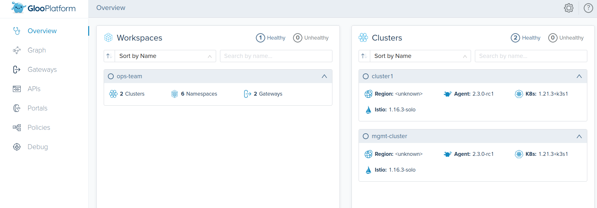

# <center>Gloo Platform Day 2 Workshop</center>

## Table of Contents

* [Introduction](#introduction)
* [Lab 1 - Deploy Kubernetes clusters](#Configure)
* [Lab 2 - PKI / Vault and Cert Manager](#Certificates)
* [Lab 3 - Install Gloo Platform](#Installation)
* [Lab 4 - Install Production Istio](#Istio)
* [Lab 5 - High Availability Management Plane](#HA)
* [Lab 6 - Expose Gloo UI](#GlooUI)
* [Lab 7 - Observability](#Observability)

## Introduction <a name="introduction"></a>


The day 2 Gloo Platform workshop is all about the best practices and architectures to make your mutli-cluster deployment resilient, secure, and maintainable for the long term. This workshop was created based upon how Solo.io customers have been able to successfully run Gloo in Production as well as the knowledge from our Istio experts.

High level best practices:
* Use helm and GitOps for deploying infrastructure to kubernetes
* Keep your PKI secure and rotate certificates
* Scale your components for resiliency
* Effectively monitoring Gloo Platform and the data plane

### Want to learn more about Gloo Platform?

You can find more information about Gloo Platform in the official documentation:

[https://docs.solo.io/gloo-mesh/latest/](https://docs.solo.io/gloo-mesh/latest/)

## Begin

To get started with this workshop, clone this repo.

```sh
git clone https://github.com/solo-io/solo-cop.git
cd solo-cop/workshops/gloo-mesh-day-2
```

Set these environment variables which will be used throughout the workshop.

```sh
# Used to enable Gloo (please ask for a trial license key)
export GLOO_PLATFORM_LICENSE_KEY=<licence_key>
export GLOO_PLATFORM_VERSION=v2.3.0-rc1
export ISTIO_IMAGE_REPO=us-docker.pkg.dev/gloo-mesh/istio-workshops
export ISTIO_IMAGE_TAG=1.16.3-solo
export ISTIO_VERSION=1.16.3
export ISTIO_REVISION=1-16
```

## Lab 1 - Configure/Deploy the Kubernetes clusters <a name="Configure"></a>

You will need to create two Kubernetes Clusters. One will serve as the Management cluster in which the Gloo Platform server will be deployed. The second cluster will be a workload cluster.

This workshop can run on many different Kubernetes distributions such as EKS, GKE, OpenShift, RKE, etc or you can 
* [create local k3d clusters](infra/k3d/README.md)
* [create eks clusters using eksctl](infra/eks/README.md).

Set these environment variables to represent your two clusters.
```sh
export MGMT=mgmt
export CLUSTER1=cluster1
```

Rename the kubectl config contexts of each of your two clusters to `mgmt`, `cluster1` respectively.

```sh
# UPDATE <context-to-rename> BEFORE APPLYING
kubectl config rename-context <context-to-rename> ${MGMT}
kubectl config rename-context <context-to-rename> ${CLUSTER1}
``` 

## Lab 2 - PKI / Vault and Cert Manager<a name="Certificates"></a>

Gloo and Istio heavily rely on TLS certificates to facilitate safe and secure communitcation. Gloo Platform uses mutual tls authentication for communication between the Server and the Agents. Istio requires an Intermediate Signing CA so that it can issue workload certificates to each of the mesh enabled services. These workload certificates encrypt and authenticate traffic between each of your microservices.

It is important to design and implement a secure and reliable Public Key Infrastructure (PKI) that Gloo and Istio can rely on. In this workload we have chosen `Vault` and `cert-manager` as the PKI due to their versatility and reliability for managing certificates. 


### Vault

Vault is not only a reliable secret store, but also great at managing and issuing certificates. In this workshop Vault will be responsible for holding `root` certificate as well as two intermediates, one for Istio, the other for Gloo.


* Deploy vault and automatically configure it to have a root certificate and 2 intermediates.

```sh
./install/vault/setup.sh
```

* Save the Vault address to be later used by `cert-manager`

```sh
export VAULT_ADDR=http://$(kubectl --context ${MGMT} -n vault get svc vault -o jsonpath='{.status.loadBalancer.ingress[0].*}'):8200

printf "\n\nVault available at: $VAULT_ADDR\n"
```

* Generate a token to give to cert-manager

```sh
export VAULT_APPROLE_ID=$(kubectl get configmap -n vault --context $MGMT cert-manager-app-role -o json | jq -r '.data.role_id')
export VAULT_APPROLE_SECRET_ID=$(kubectl get configmap -n vault --context $MGMT cert-manager-app-role -o json | jq -r '.data.secret_id')

printf "\n\nYour cert-manager AppRole RoleID: $VAULT_APPROLE_ID\nSecretID: $VAULT_APPROLE_SECRET_ID"
```

### Cert Manager

This workshop chose cert manager as the last-mile certificate management solution for a number of reasons. First, it is the most widely used Kubernetes based solution. Secondly, it natively integrates with a number of different issuing systems such as [AWS Private CA](https://github.com/cert-manager/aws-privateca-issuer), [Google Cloud CA](https://github.com/jetstack/google-cas-issuer) and [Vault](https://cert-manager.io/docs/configuration/vault/). Finally, cert-manager also creates certificates in the form of kubernetes secrets which are compatible with both Istio and Gloo Platform. It also has the ability to automatically rotate them when they are nearing their end of life.


* Deploy cert-manager to both the `mgmt` and `cluster1` clusters

```sh
kubectl --context ${MGMT} apply -f https://github.com/cert-manager/cert-manager/releases/download/v1.11.0/cert-manager.yaml
kubectl --context ${CLUSTER1} apply -f https://github.com/cert-manager/cert-manager/releases/download/v1.11.0/cert-manager.yaml

kubectl wait deployment --for condition=Available=True -n cert-manager --context $MGMT --all
kubectl wait deployment --for condition=Available=True -n cert-manager --context $CLUSTER1 --all
```

* Create the kubernetes secret containing the Vault token in each `cert-manager` namespace. This will be used by cert-manager to authenticate with Vault

```sh
kubectl create secret generic cert-manager-vault-approle -n cert-manager --context $MGMT --from-literal=secretId=$VAULT_APPROLE_SECRET_ID
kubectl create secret generic cert-manager-vault-approle -n cert-manager --context $CLUSTER1 --from-literal=secretId=$VAULT_APPROLE_SECRET_ID
```

* Create a ClusterIssuer for Gloo and Istio in `mgmt` cluster

```yaml
kubectl apply --context $MGMT -f- <<EOF
apiVersion: cert-manager.io/v1
kind: ClusterIssuer
metadata:
  name: vault-issuer-istio
  namespace: cert-manager
spec:
  vault:
    path: pki_int_istio/root/sign-intermediate
    server: $VAULT_ADDR
    # namespace: admin   # Required for multi-tenant vaukt or HCP CLoud
    auth:
      appRole:
        path: approle
        roleId: $VAULT_APPROLE_ID
        secretRef:
          name: cert-manager-vault-approle
          key: secretId
---
apiVersion: cert-manager.io/v1
kind: ClusterIssuer
metadata:
  name: vault-issuer-gloo
  namespace: cert-manager
spec:
  vault:
    path: pki_int_gloo/sign/gloo-issuer
    server: $VAULT_ADDR
    # namespace: admin   # Required for multi-tenant vaukt or HCP CLoud
    auth:
      appRole:
        path: approle
        roleId: $VAULT_APPROLE_ID
        secretRef:
          name: cert-manager-vault-approle
          key: secretId
EOF
```

* Create a ClusterIssuer for Gloo and Istio in `cluster1` cluster

```yaml
kubectl apply --context ${CLUSTER1} -f- <<EOF
apiVersion: cert-manager.io/v1
kind: ClusterIssuer
metadata:
  name: vault-issuer-istio
  namespace: cert-manager
spec:
  vault:
    path: pki_int_istio/root/sign-intermediate ## This path allows ca: TRUE certificaets
    server: $VAULT_ADDR
    # namespace: admin   # Required for multi-tenant vaukt or HCP CLoud
    auth:
      appRole:
        path: approle
        roleId: $VAULT_APPROLE_ID
        secretRef:
          name: cert-manager-vault-approle
          key: secretId
---
apiVersion: cert-manager.io/v1
kind: ClusterIssuer
metadata:
  name: vault-issuer-gloo
  namespace: cert-manager
spec:
  vault:
    path: pki_int_gloo/sign/gloo-issuer ## This path is for client/server certificates
    server: $VAULT_ADDR
    # namespace: admin   # Required for multi-tenant vaukt or HCP CLoud
    auth:
      appRole:
        path: approle
        roleId: $VAULT_APPROLE_ID
        secretRef:
          name: cert-manager-vault-approle
          key: secretId
EOF
```

## Gloo Platform Certificate Setup

Gloo uses client/server TLS certificates to securely communicate between the server and agents. This prevents non gloo applications from inadvertantly connecting to the Gloo server and accessing its information.


* Create gloo-mesh namespaces

```sh
kubectl create namespace gloo-mesh --context $MGMT
kubectl create namespace gloo-mesh --context $CLUSTER1
```

* Generate a certificate for the `gloo-mesh-mgmt-server` service

```yaml
kubectl --context $MGMT apply -f - <<EOF
apiVersion: cert-manager.io/v1
kind: Certificate
metadata:
  name: gloo-server
  namespace: gloo-mesh
spec:
  commonName: gloo-server
  dnsNames:
    - "*.gloo-mesh"
  duration: 8760h0m0s   ### 1 year life
  renewBefore: 8736h0m0s
  issuerRef:
    kind: ClusterIssuer
    name: vault-issuer-gloo
  secretName: gloo-server-tls-cert
  usages:
    - server auth
    - client auth
  privateKey:
    algorithm: "RSA"
    size: 4096
---
kind: Certificate
apiVersion: cert-manager.io/v1
metadata:
  name: gloo-agent
  namespace: gloo-mesh
spec:
  commonName: gloo-agent
  dnsNames:
    # Must match the cluster name used in the helm chart install
    - "mgmt-cluster"
  duration: 8760h0m0s   ### 1 year life
  renewBefore: 8736h0m0s
  issuerRef:
    kind: ClusterIssuer
    name: vault-issuer-gloo
  secretName: gloo-agent-tls-cert
  usages:
    - digital signature
    - key encipherment
    - client auth
    - server auth
  privateKey:
    algorithm: "RSA"
    size: 4096
EOF
```

* Generate a client certificate for the `gloo-agent`

```yaml
kubectl apply --context $CLUSTER1 -f - << EOF
kind: Certificate
apiVersion: cert-manager.io/v1
metadata:
  name: gloo-agent
  namespace: gloo-mesh
spec:
  commonName: gloo-agent
  dnsNames:
    # Must match the cluster name used in the helm chart install
    - "$CLUSTER1"
  duration: 8760h0m0s   ### 1 year life
  renewBefore: 8736h0m0s
  issuerRef:
    kind: ClusterIssuer
    name: vault-issuer-gloo
  secretName: gloo-agent-tls-cert
  usages:
    - digital signature
    - key encipherment
    - client auth
    - server auth
  privateKey:
    algorithm: "RSA"
    size: 4096
EOF
```

* Verify secrets

```sh
kubectl get secret gloo-server-tls-cert -n gloo-mesh --context $MGMT
kubectl get secret gloo-agent-tls-cert -n gloo-mesh --context $MGMT
kubectl get secret gloo-agent-tls-cert -n gloo-mesh --context $CLUSTER1
```

## Install Gloo Platform<a name="Installation"></a>

Gloo consists of a centralized management server to which agents running on each of the workload clusters connect. The recommended way to install Gloo in production is via `helm`. Helm was chosen because of the amount of support it has with various GitOps based deployment solutions. Many of our customers today use `ArgoCD` to deploy Gloo. For more see [GitOps with ArgoCD and Gloo](https://www.solo.io/blog/gitops-with-argo-cd-and-gloo-mesh-part-1/)


* Add Gloo Helm charts to your repository

```sh
helm repo add gloo-platform https://storage.googleapis.com/gloo-platform/helm-charts
helm repo update
```

* View the default management plane values

```sh
helm show values gloo-platform/gloo-platform --version $GLOO_PLATFORM_VERSION
```

Gloo Platform can be installed using Helm. It is recommended to use deploy Gloo Platform via a CI/CD orchectrator such as ArgoCD or Flux.

* Install the management plane via helm. The default prometheus deployment will be disabled in favor of a more production based install. The automatic certificate generation is also disabled as it is now handled by cert-manager. 

```sh
helm upgrade --install gloo-platform-crds gloo-platform/gloo-platform-crds \
  --version=$GLOO_PLATFORM_VERSION \
  --namespace=gloo-mesh \
  --kube-context $MGMT \
  --create-namespace

helm upgrade --install gloo-platform gloo-platform/gloo-platform \
  --version=${GLOO_PLATFORM_VERSION} \
  --set licensing.glooMeshLicenseKey=$GLOO_PLATFORM_LICENSE_KEY \
  --set licensing.glooTrialLicenseKey=$GLOO_PLATFORM_LICENSE_KEY \
  --set licensing.glooGatewayLicenseKey=$GLOO_PLATFORM_LICENSE_KEY \
  --kube-context ${MGMT} \
  --namespace gloo-mesh \
  -f install/gloo-platform/mgmt-values.yaml
```

* Register `mgmt` and `cluster1` with the management plane so that the connecting agents will be trusted

```yaml
kubectl apply --context $MGMT -f- <<EOF
apiVersion: admin.gloo.solo.io/v2
kind: KubernetesCluster
metadata:
  name: mgmt-cluster
  namespace: gloo-mesh
spec:
  clusterDomain: cluster.local
---
apiVersion: admin.gloo.solo.io/v2
kind: KubernetesCluster
metadata:
  name: cluster1
  namespace: gloo-mesh
spec:
  clusterDomain: cluster.local
EOF
```

* Get the mgmt plane address

```sh
MGMT_SERVER_NETWORKING_DOMAIN=$(kubectl get svc -n gloo-mesh gloo-mesh-mgmt-server --context $MGMT -o jsonpath='{.status.loadBalancer.ingress[0].*}')
MGMT_SERVER_NETWORKING_PORT=$(kubectl -n gloo-mesh get service gloo-mesh-mgmt-server --context $MGMT -o jsonpath='{.spec.ports[?(@.name=="grpc")].port}')
MGMT_SERVER_NETWORKING_ADDRESS=${MGMT_SERVER_NETWORKING_DOMAIN}:${MGMT_SERVER_NETWORKING_PORT}

echo "Mgmt Plane Address: $MGMT_SERVER_NETWORKING_ADDRESS"
```

* Install a Gloo agent on the management plane so we later can add and manage Gloo Gateway on it.

```sh
helm upgrade --install gloo-agent gloo-platform/gloo-platform \
  --kube-context=${MGMT} \
  --namespace gloo-mesh \
  --set glooAgent.relay.serverAddress=gloo-mesh-mgmt-server.gloo-mesh:9900 \
  --set common.cluster=${MGMT} \
  --version ${GLOO_PLATFORM_VERSION} \
  -f install/gloo-platform/agent-values.yaml
```

* Install a Gloo agent on the remote cluster.

```sh
# apply the CRDs
helm upgrade --install gloo-platform-crds gloo-platform/gloo-platform-crds \
  --version=$GLOO_PLATFORM_VERSION \
  --namespace=gloo-mesh \
  --kube-context $CLUSTER1 \
  --create-namespace

helm upgrade --install gloo-agent gloo-platform/gloo-platform \
  --kube-context=${CLUSTER1} \
  --namespace gloo-mesh \
  --set glooAgent.relay.serverAddress=${MGMT_SERVER_NETWORKING_ADDRESS} \
  --set common.cluster=${CLUSTER1} \
  --version ${GLOO_PLATFORM_VERSION} \
  -f install/gloo-platform/agent-values.yaml
```

* Since Prometheus has not been installed yet we will have to verify the agents are connected by looking at the stats emitted by the management plane.
```sh
kubectl port-forward -n gloo-mesh deploy/gloo-mesh-mgmt-server --context $MGMT 9091:9091
```

In another terminal, curl the metrics endpoint
```sh
curl -sS localhost:9091/metrics | grep relay_push_clients_connected
```

* Expected Output
```sh
▶ curl -sS localhost:9091/metrics | grep relay_push_clients_connected
# HELP relay_push_clients_connected Current number of connected Relay push clients (Relay Agents).
# TYPE relay_push_clients_connected gauge
relay_push_clients_connected{cluster="cluster1"} 1
relay_push_clients_connected{cluster="mgmt-cluster"} 1
```

## Install Istio <a name="Istio"></a>

### Istio Certificate Setup

As stated above, Istio requries an Intermediate Signing CA so that it can issue workload certificates. Each remote cluster should have an Intermediate Signing CA that is rooted in the same trust chain if you want to facilitate cross cluster communication. 


* Create istio-system namespaces

```sh
kubectl create namespace istio-system --context $MGMT
kubectl create namespace istio-system --context $CLUSTER1
```

* Create Istio `cacerts` certificate in the `mgmt` cluster

```yaml
kubectl apply --context $MGMT -f- <<EOF
apiVersion: cert-manager.io/v1
kind: Certificate
metadata:
  name: mgmt-cacerts
  namespace: istio-system
spec:
  secretName: cacerts
  duration: 720h # 30d
  renewBefore: 360h # 15d
  commonName: mgmt.solo.io
  isCA: true
  usages:
    - digital signature
    - key encipherment
    - cert sign
  dnsNames:
    - mgmt.solo.io
  issuerRef:
    kind: ClusterIssuer
    name: vault-issuer-istio
EOF
```

* Create Istio `cacerts` certificate in the `cluster1` cluster

```yaml
kubectl apply --context $CLUSTER1 -f- <<EOF
apiVersion: cert-manager.io/v1
kind: Certificate
metadata:
  name: cluster1-cacerts
  namespace: istio-system
spec:
  secretName: cacerts
  duration: 720h # 30d
  renewBefore: 360h # 15d
  commonName: cluster1.solo.io
  isCA: true
  usages:
    - digital signature
    - key encipherment
    - cert sign
  dnsNames:
    - cluster1.solo.io
  issuerRef:
    kind: ClusterIssuer
    name: vault-issuer-istio
EOF
```

* Verify Secrets are created

```sh
kubectl get secret -n istio-system cacerts --context $MGMT
kubectl get secret -n istio-system cacerts --context $CLUSTER1
```

Istio now recommends using `helm` to install its components. The helm charts are broken up into a few distinct charts. This makes it easier to manage istio and upgrade the component individually when needed.

Istio charts:
* istio/base - Istio custom resource definitions
* istio/istiod - Istio control plane installation
* istio/gateway - Single Istio gateway (ingress/eastwest/egress) installation

There are a number of recommended best practices to employ when installing Istio for production. This workshop does not implement them all but does setup the architecture enabling the end user to iterate later on.

Recommended architecture best practices:
* Use `helm` based deployments
* Use revisions to verion the control plane and gateways
* Deploy ingress and eastwest to their own namespaces
* Use PKI to provision `cacerts`
* Monitor istiod and gateways health via observability tools

### Installation

Istio will be installed into both clusters. In a previous step, a gloo mesh agent was installed in the `mgmt` cluster. This was so that the centralized management tools could be exposed via an Istio gateway to the end user which will be done in a later step. This workshop uses a Solo.io specific build of Istio that has solo addon filters that enable such features as `external authorization`, `rate limiting`, and `GraphQL`.


Lets begin
* Add the Istio charts repository

```sh
helm repo add istio https://istio-release.storage.googleapis.com/charts
helm repo update
```

* Install Istio CRDs to each cluster

```sh
helm upgrade --install istio-base istio/base \
  -n istio-system \
  --version ${ISTIO_VERSION} \
  --kube-context ${MGMT} \
  --create-namespace

helm upgrade --install istio-base istio/base \
  -n istio-system \
  --version ${ISTIO_VERSION} \
  --kube-context ${CLUSTER1} \
  --create-namespace
```

* Install Istio control plane to the `mgmt` cluster

```yaml
helm upgrade --install istiod-${ISTIO_REVISION} istio/istiod \
  --set revision=${ISTIO_REVISION} \
  --set global.hub=${ISTIO_IMAGE_REPO} \
  --set global.tag=${ISTIO_IMAGE_TAG} \
  --version ${ISTIO_VERSION} \
  --namespace istio-system \
  --kube-context ${MGMT} \
  -f- <<EOF
global:
  multiCluster:
    clusterName: $MGMT
meshConfig:
  # The trust domain corresponds to the trust root of a system. 
  # For Gloo this should be the name of the cluster that cooresponds with the CA certificate CommonName identity
  trustDomain: mgmt-cluster
  # enable access logging to standard output
  accessLogFile: /dev/stdout
  defaultConfig:
    # wait for the istio-proxy to start before application pods
    holdApplicationUntilProxyStarts: true
    proxyMetadata:
      # Enable Istio agent to handle DNS requests for known hosts
      # Unknown hosts will automatically be resolved using upstream dns servers in resolv.conf
      # (for proxy-dns)
      ISTIO_META_DNS_CAPTURE: "true"
      # Enable automatic address allocation (for proxy-dns)
      ISTIO_META_DNS_AUTO_ALLOCATE: "true"
pilot:
  env:
    # Allow multiple trust domains (Required for Gloo east/west routing)
    PILOT_SKIP_VALIDATE_TRUST_DOMAIN: "true"
    # Reload cacerts when cert-manager changes it
    AUTO_RELOAD_PLUGIN_CERTS: "true"
    # Disable selecting workload entries for local service routing.
    # Required for Gloo VirtualDestinaton functionality.
    PILOT_ENABLE_K8S_SELECT_WORKLOAD_ENTRIES: "false"
EOF
```

* Install Istio control plane to the `cluster1` cluster

```yaml
helm upgrade --install istiod-${ISTIO_REVISION} istio/istiod \
  --set revision=${ISTIO_REVISION} \
  --set global.hub=${ISTIO_IMAGE_REPO} \
  --set global.tag=${ISTIO_IMAGE_TAG} \
  --version ${ISTIO_VERSION} \
  --namespace istio-system \
  --kube-context ${CLUSTER1} \
  -f- <<EOF
global:
  multiCluster:
    clusterName: $CLUSTER1
meshConfig:
  # The trust domain corresponds to the trust root of a system. 
  # For Gloo this should be the name of the cluster that cooresponds with the CA certificate CommonName identity
  trustDomain: mgmt-cluster
  # enable access logging to standard output
  accessLogFile: /dev/stdout
  defaultConfig:
    # wait for the istio-proxy to start before application pods
    holdApplicationUntilProxyStarts: true
    proxyMetadata:
      # Enable Istio agent to handle DNS requests for known hosts
      # Unknown hosts will automatically be resolved using upstream dns servers in resolv.conf
      # (for proxy-dns)
      ISTIO_META_DNS_CAPTURE: "true"
      # Enable automatic address allocation (for proxy-dns)
      ISTIO_META_DNS_AUTO_ALLOCATE: "true"
pilot:
  env:
    # Allow multiple trust domains (Required for Gloo east/west routing)
    PILOT_SKIP_VALIDATE_TRUST_DOMAIN: "true"
    # Reload cacerts when cert-manager changes it
    AUTO_RELOAD_PLUGIN_CERTS: "true"
    # Disable selecting workload entries for local service routing.
    # Required for Gloo VirtualDestinaton functionality.
    PILOT_ENABLE_K8S_SELECT_WORKLOAD_ENTRIES: "false"
EOF
```

* Verify that Istio is using the plugged in certs `kubectl logs --context ${MGMT} deploy/istiod-${ISTIO_REVISION} -n istio-system | grep x509`
```sh
2023-04-10T14:21:41.638520Z     info    x509 cert - Issuer: "CN=mgmt.solo.io", Subject: "", SN: d7c4889aa3e4dd3b53b02169f1dc9016, NotBefore: "2023-04-10T14:19:41Z", NotAfter: "2033-04-07T14:21:41Z"
2023-04-10T14:21:41.638547Z     info    x509 cert - Issuer: "CN=Intermediate CA,O=Istio", Subject: "CN=mgmt.solo.io", SN: 60d431616502af501d1f3454e1a4a9f7d35ddd4e, NotBefore: "2023-04-10T14:20:45Z", NotAfter: "2023-05-10T14:21:15Z"
2023-04-10T14:21:41.638580Z     info    x509 cert - Issuer: "CN=Root Certificate", Subject: "CN=Intermediate CA,O=Istio", SN: 3e8948df93d720abc4a908e172eafa617e617187, NotBefore: "2023-04-10T14:13:31Z", NotAfter: "2028-04-08T14:14:01Z"
2023-04-10T14:21:41.638598Z     info    x509 cert - Issuer: "CN=Root Certificate", Subject: "CN=Root Certificate", SN: 643b4f58d74689e0facc6318ab39d5a86c0c5d5f, NotBefore: "2023-04-10T14:14:01Z", NotAfter: "2033-04-07T14:14:01Z"
```

* Verify that Istio is using the plugged in certs for cluster1 `kubectl logs --context ${CLUSTER1} deploy/istiod-${ISTIO_REVISION} -n istio-system | grep x509`
```sh
2023-04-10T14:24:59.559865Z     info    x509 cert - Issuer: "CN=cluster1.solo.io", Subject: "", SN: c848d01c8e0867395b850dc742afde71, NotBefore: "2023-04-10T14:22:59Z", NotAfter: "2033-04-07T14:24:59Z"
2023-04-10T14:24:59.559882Z     info    x509 cert - Issuer: "CN=Intermediate CA,O=Istio", Subject: "CN=cluster1.solo.io", SN: 220eed6f615f2f4ffc1b9e625d6464e640c0a419, NotBefore: "2023-04-10T14:20:50Z", NotAfter: "2023-05-10T14:21:20Z"
2023-04-10T14:24:59.559895Z     info    x509 cert - Issuer: "CN=Root Certificate", Subject: "CN=Intermediate CA,O=Istio", SN: 3e8948df93d720abc4a908e172eafa617e617187, NotBefore: "2023-04-10T14:13:31Z", NotAfter: "2028-04-08T14:14:01Z"
2023-04-10T14:24:59.559906Z     info    x509 cert - Issuer: "CN=Root Certificate", Subject: "CN=Root Certificate", SN: 643b4f58d74689e0facc6318ab39d5a86c0c5d5f, NotBefore: "2023-04-10T14:14:01Z", NotAfter: "2033-04-07T14:14:01Z"
```

* Install an Eastwest gateway in `mgmt` cluster. This will allow us to expose the Gloo UI through the Ingress gateway in `cluster1`

```sh
helm upgrade --install istio-eastwestgateway-${ISTIO_REVISION} istio/gateway \
  --set revision=${ISTIO_REVISION} \
  --set global.hub=${ISTIO_IMAGE_REPO} \
  --set global.tag=${ISTIO_IMAGE_TAG} \
  --version ${ISTIO_VERSION} \
  --create-namespace \
  --namespace istio-eastwest \
  --kube-context ${MGMT} \
  -f- <<EOF
name: istio-eastwestgateway-${ISTIO_REVISION}
labels:
  istio: eastwestgateway
  revision: ${ISTIO_REVISION}
service:
  type: LoadBalancer
  ports:
  - name: tls
    port: 15443
    targetPort: 15443
  - name: https
    port: 16443
    targetPort: 16443
env:
  # Required for Gloo multi-cluster routing
  ISTIO_META_ROUTER_MODE: "sni-dnat"
EOF
```

* Install Gloo Gateway in `cluster1`

```sh
helm upgrade --install istio-ingressgateway-${ISTIO_REVISION} istio/gateway \
  --set revision=${ISTIO_REVISION} \
  --set global.hub=${ISTIO_IMAGE_REPO} \
  --set global.tag=${ISTIO_IMAGE_TAG} \
  --version ${ISTIO_VERSION} \
  --create-namespace \
  --namespace istio-ingress \
  --kube-context ${CLUSTER1} \
  --wait \
  -f- <<EOF
name: istio-ingressgateway-${ISTIO_REVISION}
labels:
  istio: ingressgateway
  revision: ${ISTIO_REVISION}
service:
  type: LoadBalancer
  ports:
  # main http ingress port
  - port: 80
    targetPort: 8080
    name: http2
  # main https ingress port
  - port: 443
    targetPort: 8443
    name: https
EOF
```

* This is the architecture after the installation of Gloo Platform and Istio


## High Availability Managemnent Plane<a name="HA"></a>

In production it's beneficial to run more than one managment server replica. Because data is cached in Redis, multiple manangement servers pods can run and serve agents at a time. Not only does this help provide higher availability, it also will be more performant with many clusters connected. The agent connections are long lived so simply scaling the management replicas will cause the agents to balance.
Beta feature: To get a more balanced connection pool, enable `glooMeshMgmtServer.enableClusterLoadBalancing=true` which will tell the management replica pods to auto balance the connections.


* Upgrade the management plane to have 2 replias and enable agent load balancing.
```sh
helm upgrade --install gloo-platform gloo-platform/gloo-platform \
  --version=${GLOO_PLATFORM_VERSION} \
  --reuse-values \
  --kube-context ${MGMT} \
  --namespace gloo-mesh \
  --set glooMgmtServer.enableClusterLoadBalancing=true \
  --set glooMgmtServer.deploymentOverrides.spec.replicas=2
```

## Expose Gloo UI via Gloo Gateway<a name="GlooUI"></a>

* Setup Gloo Workspace for managing the service mesh components

```yaml
kubectl create namespace ops-team --context ${MGMT}
kubectl --context ${MGMT} apply -f - <<EOF
apiVersion: admin.gloo.solo.io/v2
kind: Workspace
metadata:
  name: ops-team
  namespace: gloo-mesh
spec:
  workloadClusters:
  - name: 'mgmt-cluster'
    namespaces:
    - name: gloo-mesh
    - name: ops-team
    - name: istio-eastwest
    - name: monitoring
  - name: 'cluster1'
    namespaces:
    - name: istio-ingress
    - name: gloo-mesh-addons
    - name: bookinfo
---
apiVersion: admin.gloo.solo.io/v2
kind: WorkspaceSettings
metadata:
  name: ops-team
  namespace: ops-team
spec:
  options:
    virtualDestClientMode:
      tlsTermination: {} # allow for routing to non mesh applications
    eastWestGateways:
    - selector:
        labels:
          istio: eastwestgateway
EOF
```

* Create a VirtualGateway to expose the Gloo Dashboard

```yaml
kubectl --context ${MGMT} apply -f - <<EOF
apiVersion: networking.gloo.solo.io/v2
kind: VirtualDestination
metadata:
  name: gloo-platform-ui
  namespace: ops-team
spec:
  hosts:
  - gloo-ui.solo.internal
  services:
  - labels:
      app: gloo-mesh-ui
  ports:
  - number: 8090
    protocol: HTTP
    targetPort:
      name: console
---
apiVersion: networking.gloo.solo.io/v2
kind: VirtualGateway
metadata:
  name: ingress-gateway
  namespace: ops-team
spec:
  workloads:
    - selector:
        labels:
          istio: ingressgateway
        cluster: cluster1
        namespace: istio-ingress
  listeners: 
    - http: {}
      port:
        number: 80
      allowedRouteTables:
        - host: '*'
          selector:
            workspace: ops-team
---
apiVersion: networking.gloo.solo.io/v2
kind: RouteTable
metadata:
  name: gloo-platform-ui
  namespace: ops-team
spec:
  hosts:
    - '*'
  virtualGateways:
    - name: ingress-gateway
      namespace: ops-team
      cluster: mgmt-cluster
  workloadSelectors: []
  http:
    - name: gloo-platform-ui
      labels:
        virtual-destination: gloo-platform-ui
      forwardTo:
        destinations:
          - ref:
              name: gloo-platform-ui
              namespace: ops-team
            kind: VIRTUAL_DESTINATION
            port:
              number: 8090
EOF
```

*. Access Gloo UI through the gateway
```sh
export GLOO_GATEWAY=$(kubectl --context ${CLUSTER1} -n istio-ingress get svc istio-ingressgateway-1-16 -o jsonpath='{.status.loadBalancer.ingress[0].*}'):80

echo "Gloo UI available at http://$GLOO_GATEWAY"
```

## Observability<a name="Observability"></a>

Gloo Platform offers the best in class observability for communication between your services. By aggregating logging, tracing, and metrics, Gloo Platform combines telemetry from all environments to give you a complete picture of how your platform is performing. 


Links:
* [Exploring the Gloo UI](https://docs.solo.io/gloo-mesh-enterprise/latest/observability/tools/dashboard/ui-overview/)
* [Prometheus](https://docs.solo.io/gloo-mesh-enterprise/latest/observability/tools/prometheus/)
* [Gloo Platform Tracing/Metrics/Logs](https://docs.solo.io/gloo-mesh-enterprise/latest/observability/mesh/)

### Metrics

When you install Gloo, you can choose how you want to collect metrics in your Gloo environment. Metrics provide important information about the performance and health of your service mesh, such as the time a request takes to be routed to your app, or the number of successful and failed requests that were sent to your apps. In addition, you can use the metrics to monitor the health of your Gloo Platform environment, such as the number of failed translations or workload clusters that experience issues with connecting to the Gloo management server. You can use these measures to detect failures and troubleshoot bottlenecks. Below is a common architecture for capturing service to service metrics. 

* Deploy Bookinfo so we can generate some metrics
```sh
kubectl create namespace bookinfo
kubectl label namespace bookinfo istio.io/rev=$ISTIO_REVISION

kubectl apply -n bookinfo -f install/bookinfo
```

* Install prometheus in the `mgmt` cluster
```sh
helm repo add prometheus-community https://prometheus-community.github.io/helm-charts
helm repo update

helm upgrade --install prom prometheus-community/kube-prometheus-stack \
  --version 45.9.1 \
  -n monitoring \
  --create-namespace \
  --kube-context $MGMT \
  -f install/prometheus/prom-values.yaml
```

* Update Gloo Platform to use new Prometheus endpoint
```sh
helm upgrade --install gloo-platform gloo-platform/gloo-platform \
  --version=${GLOO_PLATFORM_VERSION} \
  --reuse-values \
  --kube-context ${MGMT} \
  --namespace gloo-mesh \
  --set glooUi.prometheusUrl=http://prom-kube-prometheus-stack-prometheus.monitoring:9090
```

* Open the Gloo UI and verify cluster information is no longer in error status
```sh
echo "Gloo UI available at http://$GLOO_GATEWAY"
```


### Telemetry

Gloo Platform Telemetry is based on the [Open Telemetry](https://opentelemetry.io/) standards. Metrics, logs and traces are gathered in cluster by the `Gloo Telemetry Collector`. Where it is shipped from there is up the user. By default, telemetry data will be shipped to the `Gloo Telemetry Gateway` in the `Management Plane` and aggregated with all other telemetry data from other clusters.


**Third Party Support**

Gloo Platform can also ship these metrics to you third party telemetry provider like `Datadog`, `Splunk`, `New Relic`, or `Dynatrace`. 


* Create mTLS certificate for Gloo Telemetry Gateway
```sh
kubectl --context $MGMT apply -f - <<EOF
apiVersion: cert-manager.io/v1
kind: Certificate
metadata:
  name: gloo-telemetry-gateway
  namespace: gloo-mesh
spec:
  commonName: gloo-telemetry-gateway
  dnsNames:
    - "gloo-telemetry-gateway.gloo-mesh"
  duration: 8760h0m0s   ### 1 year life
  renewBefore: 8736h0m0s
  issuerRef:
    kind: ClusterIssuer
    name: vault-issuer-gloo
  secretName: gloo-telemetry-gateway-tls-secret
  usages:
    - server auth
    - client auth
  privateKey:
    algorithm: "RSA"
    size: 4096
EOF
```

* Install Gloo Telemetry Gateway in the `mgmt` cluster
```sh
helm upgrade --install gloo-telemetry-gateway gloo-platform/gloo-platform \
  --version=${GLOO_PLATFORM_VERSION} \
  --kube-context ${MGMT} \
  --namespace gloo-mesh \
  -f install/gloo-platform/telemetry-gateway-values.yaml
```

* Get the Gloo Telemetry Gateway Endpoint
```sh
GLOO_TELEMETRY_GATEWAY=$(kubectl get svc -n gloo-mesh gloo-telemetry-gateway --context $MGMT -o jsonpath='{.status.loadBalancer.ingress[0].*}'):$(kubectl --context ${MGMT} -n gloo-mesh get svc gloo-telemetry-gateway -o jsonpath='{.spec.ports[?(@.port==4317)].port}')

echo "Telemetry Gateway Address: $GLOO_TELEMETRY_GATEWAY"
```

* Install Gloo Telemetry Collector in the `cluster1` cluster
```sh
helm upgrade --install gloo-telemetry-collector gloo-platform/gloo-platform \
  --version=${GLOO_PLATFORM_VERSION} \
  --kube-context ${CLUSTER1} \
  --set telemetryCollector.config.exporters.otlp.endpoint=$GLOO_TELEMETRY_GATEWAY \
  --namespace gloo-mesh \
  -f install/gloo-platform/telemetry-collector-values.yaml
```

* Update Istio installation and set teletry urls to the Gloo Telemetry Collector
```sh
helm upgrade --install istiod-${ISTIO_REVISION} istio/istiod \
  --set revision=${ISTIO_REVISION} \
  --set global.hub=${ISTIO_IMAGE_REPO} \
  --set global.tag=${ISTIO_IMAGE_TAG} \
  --version ${ISTIO_VERSION} \
  --namespace istio-system \
  --kube-context ${CLUSTER1} \
  -f- <<EOF
global:
  multiCluster:
    clusterName: $CLUSTER1

meshConfig:
  enableTracing: true
  extensionProviders:
    - name: zipkincustom
      zipkin:
        service: "gloo-telemetry-collector.gloo-mesh.svc.cluster.local"
        port: "9411"
    - name: envoyOtelAls
      envoyOtelAls:
        service: "gloo-telemetry-collector.gloo-mesh.svc.cluster.local"
  # The trust domain corresponds to the trust root of a system. 
  # For Gloo this should be the name of the cluster that cooresponds with the CA certificate CommonName identity
  trustDomain: mgmt-cluster
  # enable access logging to standard output
  accessLogFile: /dev/stdout
  defaultConfig:
    # wait for the istio-proxy to start before application pods
    holdApplicationUntilProxyStarts: true
    proxyMetadata:
      # Enable Istio agent to handle DNS requests for known hosts
      # Unknown hosts will automatically be resolved using upstream dns servers in resolv.conf
      # (for proxy-dns)
      ISTIO_META_DNS_CAPTURE: "true"
      # Enable automatic address allocation (for proxy-dns)
      ISTIO_META_DNS_AUTO_ALLOCATE: "true"
pilot:
  env:
    # Allow multiple trust domains (Required for Gloo east/west routing)
    PILOT_SKIP_VALIDATE_TRUST_DOMAIN: "true"
    # Reload cacerts when cert-manager changes it
    AUTO_RELOAD_PLUGIN_CERTS: "true"
    # Disable selecting workload entries for local service routing.
    # Required for Gloo VirtualDestinaton functionality.
    PILOT_ENABLE_K8S_SELECT_WORKLOAD_ENTRIES: "false"
EOF
```

* Configure Istio to send data to Gloo Telemetry Collector
```sh
kubectl --context ${CLUSTER1} apply -f - <<EOF
apiVersion: telemetry.istio.io/v1alpha1
kind: Telemetry
metadata:
  name: default
  namespace: istio-system
spec:
  tracing:
  - providers:
      - name: zipkincustom
    randomSamplingPercentage: 100
    disableSpanReporting: false
  accessLogging:
  - providers:
    - name: envoyOtelAls
EOF
```

* Navigate to the Gloo UI and on the right hand side, click on `Graph`
```sh
echo "Gloo UI available at http://$GLOO_GATEWAY"
```

* View the teletry data being displayed in the Gloo Platform Graph


Metrics provide important information about the health of the apps in your service mesh. You can use these measures to detect failures, troubleshoot bottlenecks, and to find ways to improve the performance and reliability of your service mesh.


1. To view the raw metrics 

```sh
kubectl port-forward svc/prom-kube-prometheus-stack-prometheus --context $MGMT -n monitoring 9090:9090
```

2. Open browser at http://localhost:9080

3. Search for metrics prefixed with `istio_`, Example `istio_requests_total`

### Tracing

Sample request traces to monitor the traffic and health of your service mesh.

Distributed tracing helps you track requests across multiple services in your distributed service mesh. Sampling the requests in your mesh can give you insight into request latency, serialization, and parallelism


1. Deploy Jaeger to the `Management Plane`
```sh
helm repo add jaegertracing https://jaegertracing.github.io/helm-charts
helm upgrade --install -n monitoring --kube-context $MGMT jaeger jaegertracing/jaeger \
  -f -<<EOF
provisionDataStore:
  cassandra: false
allInOne:
  enabled: true
storage:
  type: none
agent:
  enabled: false
collector:
  enabled: false
query:
  enabled: false
EOF
```

3. Open Jaeger and observe tracing
```sh
kubectl port-forward --context $MGMT -n monitoring svc/jaeger-query 16686:16686
```

4. Open browser at http://localhost:16686

5. Select service `istio-ingressgateway-1-16.istio-ingress` and then click `Find Traces`
