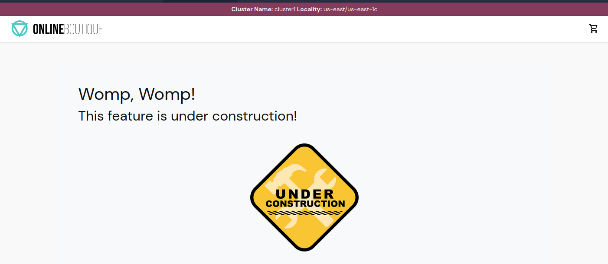
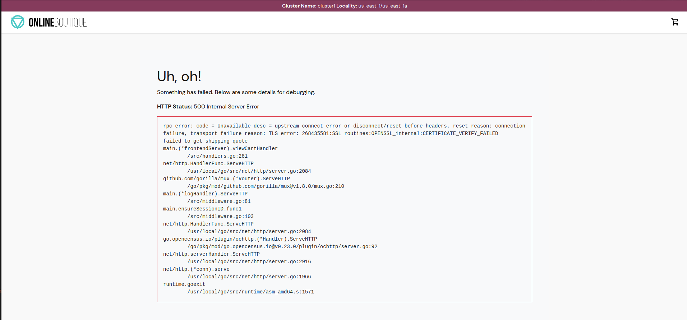

# Gloo Mesh Demo


# <center>Gloo Mesh Demo</center>

## Table of Contents
* [Introduction](#introduction)
* [Lab 1 - Deploy Kubernetes clusters](#Lab-1)
* [Lab 2 - Deploy Gloo Mesh](#Lab-2)
* [Lab 3 - Deploy Istio](#Lab-3)
* [Lab 4 - Deploy Online Boutique](#Lab-4)
* [Lab 5 - Configure Gloo Mesh Workspaces](#Lab-5)
* [Lab 6 - Expose the Online Boutique](#Lab-6)
* [Lab 7 - Zero Trust Networking](#Lab-7)
* [Lab 8 - Multicluster Routing](#Lab-8)
* [Lab 9 - Multicluster Failover](#Lab-9)
* [Lab 10 - API Gateway](#Lab-10)

## Introduction <a name="introduction"></a>

[Gloo Mesh Enterprise](https://www.solo.io/products/gloo-mesh/) is a distribution of [Istio Service Mesh](https://istio.io) with production support, CVE patching, FIPS builds, and a multi-cluster operational management plane to simplify running a service mesh across multiple clusters or a hybrid deployment. 

Gloo Mesh also has enterprise features around multi-tenancy, global failover and routing, observability, and east-west rate limiting and policy enforcement (through AuthZ/AuthN plugins). 

### Istio support

The Gloo Mesh Enterprise subscription includes end to end Istio support:

- Upstream first
- Specialty builds available (FIPS, ARM, etc)
- Long Term Support (LTS) N-4 
- Critical security patches
- Production break-fix
- One hour SLA Severity 1
- Install / upgrade
- Architecture and operational guidance, best practices

### Observability

Gloo Mesh is also using these agents to consolidate all the metrics and access logs from the different clusters. Graphs can then be used to monitor all the communication happening globally.


### Want to learn more about Gloo Mesh

You can find more information about Gloo Mesh in the official documentation:

[https://docs.solo.io/gloo-mesh/latest/](https://docs.solo.io/gloo-mesh/latest/)


## Environment Variables
```sh
# Used to enable gloo mesh (please ask for a key)
export GLOO_MESH_LICENSE_KEY=<licence_key>
export GLOO_MESH_VERSION=v2.0.6

# Kubernetes context names of each cluster
export MGMT=mgmt
export CLUSTER1=cluster1
export CLUSTER2=cluster2

# Istio version information
export ISTIO_IMAGE_REPO=<please ask for repo information>
export ISTIO_IMAGE_TAG=1.13.4-solo
export ISTIO_VERSION=1.13.4
```

## Lab 1 - Deploy the Kubernetes clusters manually <a name="Lab-1"></a>

This workshop can run on many different kubernetes distributions.

Local Options
* Using k3d - [Setup Instructions](./infra/k3d/README.md)

Remote Options
* EKS
* GKE
* OpenShift
* Rancher Kubernetes Service

You may need to rename the Kubernete contexts of each Kubernetes cluster to match `mgmt`, `cluster1` and `cluster2`.

Here is an example showing how to rename a Kubernetes context:

```sh
kubectl config rename-context <context to rename> <new context name>
```

Run the following command to make `mgmt` the current cluster.

```sh
kubectl config use-context ${MGMT}
```

## Lab 2 - Deploy Gloo Mesh <a name="Lab-2"></a>

1. Install `meshctl` command line tool and add it to your path

```sh
curl -sL https://run.solo.io/meshctl/install | GLOO_MESH_VERSION=${GLOO_MESH_VERSION} sh -

export PATH=$HOME/.gloo-mesh/bin:$PATH
```

2. Run the following commands to deploy the Gloo Mesh management plane:

```sh
meshctl install \
  --kubecontext $MGMT \
  --set mgmtClusterName=$MGMT \
  --set glooMeshUi.serviceType=LoadBalancer \
  --set glooMeshMgmtServer.ports.healthcheck=8091 \
  --license $GLOO_MESH_LICENSE_KEY
```

3. Finally, you need to register the two other clusters.

```sh
meshctl cluster register \
  --kubecontext=$MGMT \
  --remote-context=$CLUSTER1 \
  $CLUSTER1

meshctl cluster register \
  --kubecontext=$MGMT \
  --remote-context=$CLUSTER2 \
  $CLUSTER2
```

** Optionally specify the management server endpoint **

Sometimes meshctl cannot auto discover the management plane loadbalancer address so it can be supplied manually

* Discover the management server address

```sh
export GLOO_MESH_ENDPOINT=$(kubectl --context ${MGMT} -n gloo-mesh get svc gloo-mesh-mgmt-server -o jsonpath='{.status.loadBalancer.ingress[0].*}'):9900

echo "Gloo Mesh Endpoint: $GLOO_MESH_ENDPOINT"
```

* register the clusters with 

```sh
meshctl cluster register \
  --kubecontext=$MGMT \
  --remote-context=$CLUSTER1 \
  --relay-server-address $GLOO_MESH_ENDPOINT \
  $CLUSTER1

meshctl cluster register \
  --kubecontext=$MGMT \
  --remote-context=$CLUSTER2 \
  --relay-server-address $GLOO_MESH_ENDPOINT \
  $CLUSTER2
```

4. Verify Installation by opening the gloo mesh UI

```sh
export GLOO_MESH_UI_ENDPOINT=$(kubectl --context ${MGMT} -n gloo-mesh get svc gloo-mesh-ui -o jsonpath='{.status.loadBalancer.ingress[0].*}'):8090

echo "Gloo Mesh UI Endpoint: http://$GLOO_MESH_UI_ENDPOINT"
```


## Lab 3 - Deploy Istio <a name="Lab-3"></a>

1. Install [istioctl](https://istio.io/latest/docs/setup/getting-started/)

```sh
curl -L https://istio.io/downloadIstio | ISTIO_VERSION=${ISTIO_VERSION} sh -
export PATH=$PWD/istio-${ISTIO_VERSION}/bin:$PATH

istioctl version
```

2. Install Istio to each of the remote clusters

```sh
export CLUSTER_NAME=$CLUSTER1
kubectl create namespace istio-gateways --context $CLUSTER1
cat install/istio/istiooperator.yaml| envsubst | istioctl install --set hub=$ISTIO_IMAGE_REPO --set tag=$ISTIO_IMAGE_TAG  -y --context $CLUSTER_NAME -f -

export CLUSTER_NAME=$CLUSTER2
kubectl create namespace istio-gateways --context $CLUSTER2
cat install/istio/istiooperator.yaml| envsubst | istioctl install --set hub=$ISTIO_IMAGE_REPO --set tag=$ISTIO_IMAGE_TAG  -y --context $CLUSTER_NAME -f -
```

**NOTE: If you are using an M1 or M2 macbook and doing a local kubernetes deployment use this arm based istiooperator file**

* Istio installation compatible with ARM / M1 / M2 macbooks
```sh
export CLUSTER_NAME=$CLUSTER1
cat install/istio/istiooperator-arm.yaml| envsubst | istioctl install --set hub=$ISTIO_IMAGE_REPO --set tag=$ISTIO_IMAGE_TAG  -y --context $CLUSTER_NAME -f -


export CLUSTER_NAME=$CLUSTER2
cat install/istio/istiooperator-arm.yaml| envsubst | istioctl install --set hub=$ISTIO_IMAGE_REPO --set tag=$ISTIO_IMAGE_TAG  -y --context $CLUSTER_NAME -f -
```

3. Verify in the Gloo Mesh UI that isio information is now being added


## Lab 4 - Deploy Online Boutique <a name="Lab-4"></a>

1. Deploy the online boutique backend APIs to `cluster1` in the `backend-apis` namespace.

```sh
kubectl apply --context $CLUSTER1 -f install/online-boutique/backend-apis.yaml
```

2. Deploy the frontend UI to the `web-ui` namespace in `cluster1`.

```sh
kubectl apply --context $CLUSTER1 -f install/online-boutique/web-ui.yaml
```

## Lab 5 - Configure Gloo Mesh Workspaces <a name="Lab-5"></a>


1. Create config namespaces in the `mgmt` cluster for each workspace.

```sh
kubectl create namespace ops-team --context $MGMT
kubectl create namespace web-team --context $MGMT
kubectl create namespace backend-apis-team --context $MGMT
```

2. Apply the workspaces to the Gloo Mesh Management Plane root config namespace `gloo-mesh`.

```yaml
cat << EOF | kubectl --context ${MGMT} apply -f -
apiVersion: admin.gloo.solo.io/v2
kind: Workspace
metadata:
  name: ops-team
  namespace: gloo-mesh
spec:
  workloadClusters:
  - name: 'mgmt'
    namespaces:
    - name: ops-team
  - name: '*'
    namespaces:
    - name: istio-gateways
    - name: gloo-mesh-addons
---
apiVersion: admin.gloo.solo.io/v2
kind: Workspace
metadata:
  name: web-team
  namespace: gloo-mesh
spec:
  workloadClusters:
  - name: 'mgmt'
    namespaces:
    - name: web-team
  - name: '*'
    namespaces:
    - name: web-ui
---
apiVersion: admin.gloo.solo.io/v2
kind: Workspace
metadata:
  name: backend-apis-team
  namespace: gloo-mesh
spec:
  workloadClusters:
  - name: 'mgmt'
    namespaces:
    - name: backend-apis-team
  - name: '*'
    namespaces:
    - name: backend-apis
EOF
```

3. Apply the ops-team WorkspaceSettings to the `ops-team` namespace.

```yaml
cat << EOF | kubectl --context ${MGMT} apply -f -
apiVersion: admin.gloo.solo.io/v2
kind: WorkspaceSettings
metadata:
  name: ops-team
  namespace: ops-team
spec:
  importFrom:
  - workspaces:
    - name: web-team
  options:
    eastWestGateways:
    - selector:
        labels:
          istio: eastwestgateway
    serviceIsolation:
      enabled: true
      trimProxyConfig: true
EOF
```


4. Apply the web-team WorkspaceSettings to the web-team namespace.

```yaml
cat << EOF | kubectl --context ${MGMT} apply -f -
apiVersion: admin.gloo.solo.io/v2
kind: WorkspaceSettings
metadata:
  name: web-team
  namespace: web-team
spec:
  importFrom:
  - workspaces:
    - name: backend-apis-team
  exportTo:
  - workspaces:
    - name: ops-team
  options:
    eastWestGateways:
    - selector:
        labels:
          istio: eastwestgateway
    federation:
      enabled: true
      serviceSelector:
      - namespace: web-ui
    serviceIsolation:
      enabled: true
      trimProxyConfig: true
EOF
```

5. Apply the backend-apis-team WorkspaceSettings to the backend-apis-team namespace.

```yaml
cat << EOF | kubectl --context ${MGMT} apply -f -
apiVersion: admin.gloo.solo.io/v2
kind: WorkspaceSettings
metadata:
  name: backend-apis-team
  namespace: backend-apis-team
spec:
  exportTo:
  - workspaces:
    - name: web-team
  options:
    eastWestGateways:
    - selector:
        labels:
          istio: eastwestgateway
    federation:
      enabled: true
      serviceSelector:
      - namespace: backend-apis
    serviceIsolation:
      enabled: false
      trimProxyConfig: false
EOF
```

## Lab 6 - Expose the Online Boutique <a name="Lab-6"></a>


1. Apply the VirtualGateway to define the listeners and hosts

```yaml
cat << EOF | kubectl --context ${MGMT} apply -f -
apiVersion: networking.gloo.solo.io/v2
kind: VirtualGateway
metadata:
  name: north-south-gw
  namespace: ops-team
spec:
  workloads:
    - selector:
        labels:
          istio: ingressgateway
        cluster: cluster1
        namespace: istio-gateways
  listeners: 
    - http: {}
      port:
        number: 80
      allowedRouteTables:
        - host: '*'
          selector:
            workspace: web-team
EOF
```

2. Apply the RouteTable for the web team to define where traffic for the gateway should go.

```yaml
cat << EOF | kubectl --context ${MGMT} apply -f -
apiVersion: networking.gloo.solo.io/v2
kind: RouteTable
metadata:
  name: frontend
  namespace: web-team
spec:
  hosts:
    - '*'
  virtualGateways:
    - name: north-south-gw
      namespace: ops-team
      cluster: mgmt
  workloadSelectors: []
  http:
    - name: frontend
      forwardTo:
        destinations:
          - ref:
              name: frontend
              namespace: web-ui
              cluster: cluster1
            port:
              number: 80
EOF
```

3. Open the Online Boutique in your browser

```sh
export HTTP_GATEWAY_ENDPOINT=$(kubectl --context ${CLUSTER1} -n istio-gateways get svc istio-ingressgateway -o jsonpath='{.status.loadBalancer.ingress[0].*}'):80

echo "Online Boutiqe available at http://$HTTP_GATEWAY_ENDPOINT"
```

## Lab 7 - Zero Trust Networking <a name="Lab-7"></a>

1. Add a default deny all to the backend-apis namespace

```yaml
cat << EOF | kubectl --context ${CLUSTER1} apply -f -
apiVersion: security.istio.io/v1beta1
kind: AuthorizationPolicy
metadata:
 name: default-deny
 namespace: backend-apis
spec:
  {}
EOF
```

2. Check the Online Boutique and see that pages are no longer loading correctly


3. Add AccessPolicies to allow traffic from the frontend to the backend apis

```yaml
cat << EOF | kubectl --context ${MGMT} apply -f -
apiVersion: security.policy.gloo.solo.io/v2
kind: AccessPolicy
metadata:
  name: in-namespace-access
  namespace: backend-apis-team
spec:
  applyToDestinations:
  - selector:
      workspace: backend-apis-team
  config:
    authz:
      allowedClients:
      - serviceAccountSelector:
          namespace: backend-apis
---
apiVersion: security.policy.gloo.solo.io/v2
kind: AccessPolicy
metadata:
  name: frontend-api-access
  namespace: backend-apis-team
spec:
  applyToDestinations:
  - selector:
      workspace: backend-apis-team
  config:
    authz:
      allowedClients:
      - serviceAccountSelector:
          workspace: web-team
EOF
```

4. Try and purchase some items



## Lab 8 - Multi Cluster Routing <a name="Lab-8"></a>


1.  Deploy the checkout feature to `cluster2`

```sh
kubectl apply --context $CLUSTER2 -f install/online-boutique/checkout-feature.yaml
```

2. Create muticluster services

```yaml
cat << EOF | kubectl --context ${MGMT} apply -f -
apiVersion: networking.gloo.solo.io/v2
kind: VirtualDestination
metadata:
  name: checkout
  namespace: backend-apis-team
spec:
  hosts:
  - checkout.backend-apis-team.solo-io.mesh
  services:
  - labels:
      app: checkoutservice
  ports:
  - number: 80
    protocol: GRPC
    targetPort:
      name: grpc
---
apiVersion: networking.gloo.solo.io/v2
kind: VirtualDestination
metadata:
  name: currency
  namespace: backend-apis-team
spec:
  hosts:
  - currency.backend-apis-team.solo-io.mesh
  services:
  - labels:
      app: currencyservice
  ports:
  - number: 80
    protocol: GRPC
    targetPort:
      name: grpc
---
apiVersion: networking.gloo.solo.io/v2
kind: VirtualDestination
metadata:
  name: product-catalog
  namespace: backend-apis-team
spec:
  hosts:
  - product-catalog.backend-apis-team.solo-io.mesh
  services:
  - labels:
      app: productcatalogservice
  ports:
  - number: 80
    protocol: GRPC
    targetPort:
      name: grpc
---
apiVersion: networking.gloo.solo.io/v2
kind: VirtualDestination
metadata:
  name: shipping
  namespace: backend-apis-team
spec:
  hosts:
  - shipping.backend-apis-team.solo-io.mesh
  services:
  - labels:
      app: shippingservice
  ports:
  - number: 80
    protocol: GRPC
    targetPort:
      name: grpc
---
apiVersion: networking.gloo.solo.io/v2
kind: VirtualDestination
metadata:
  name: cart
  namespace: backend-apis-team
spec:
  hosts:
  - cart.backend-apis-team.solo-io.mesh
  services:
  - labels:
      app: cartservice
  ports:
  - number: 80
    protocol: GRPC
    targetPort:
      name: grpc
EOF
```

3. Update frontend to use multicluster services

```sh
kubectl apply --context $CLUSTER1 -f install/online-boutique/web-ui-with-checkout.yaml
```

4. Try and buy some items. You should see an error. 


5. Apply the RootTustPolicy to deploy a common root between clusters.

```yaml
cat << EOF | kubectl --context ${MGMT} apply -f -
apiVersion: admin.gloo.solo.io/v2
kind: RootTrustPolicy
metadata:
  name: root-trust-policy
  namespace: gloo-mesh
spec:
  config:
    mgmtServerCa:
      generated: {}
    autoRestartPods: true
EOF
```

6. Wait a minute or two until all the pods are automatically rotated

7. Try and buy some items


5. Explore the gloo mesh ui


## Lab 9 - Multicluster Failover <a name="Lab-9"></a>


1. Deploy the frontend application to `cluster2`

```sh
kubectl apply --context $CLUSTER2 -f install/online-boutique/web-ui-cluster2.yaml
```

2. Create VirtualDestination for frontend application

```yaml
cat << EOF | kubectl --context ${MGMT} apply -f -
apiVersion: networking.gloo.solo.io/v2
kind: VirtualDestination
metadata:
  name: frontend
  namespace: web-team
spec:
  hosts:
  - frontend.web-ui-team.solo-io.mesh
  services:
  - labels:
      app: frontend
  ports:
  - number: 80
    protocol: GRPC
    targetPort:
      name: http
EOF
```

3. Create VirtualDestinations for the rest of the backend-apis so the cluster2 frontend can reach them

```yaml
cat << EOF | kubectl --context ${MGMT} apply -f -
apiVersion: networking.gloo.solo.io/v2
kind: VirtualDestination
metadata:
  name: ads
  namespace: backend-apis-team
spec:
  hosts:
  - ads.backend-apis-team.solo-io.mesh
  services:
  - labels:
      app: adservice
  ports:
  - number: 80
    protocol: GRPC
    targetPort:
      name: grpc
---
apiVersion: networking.gloo.solo.io/v2
kind: VirtualDestination
metadata:
  name: cart
  namespace: backend-apis-team
spec:
  hosts:
  - cart.backend-apis-team.solo-io.mesh
  services:
  - labels:
      app: cartservice
  ports:
  - number: 80
    protocol: GRPC
    targetPort:
      name: grpc
---
apiVersion: networking.gloo.solo.io/v2
kind: VirtualDestination
metadata:
  name: recommendations
  namespace: backend-apis-team
spec:
  hosts:
  - recommendations.backend-apis-team.solo-io.mesh
  services:
  - labels:
      app: recommendationservice
  ports:
  - number: 80
    protocol: GRPC
    targetPort:
      name: grpc
EOF
```

4. Update the RouteTable so the VirtualGateway will route to both frontend applications

```yaml
cat << EOF | kubectl --context ${MGMT} apply -f -
apiVersion: networking.gloo.solo.io/v2
kind: RouteTable
metadata:
  name: frontend
  namespace: web-team
  labels:
    lab: failover
spec:
  hosts:
    - '*'
  virtualGateways:
    - name: north-south-gw
      namespace: ops-team
      cluster: mgmt
  workloadSelectors: []
  http:
    - name: frontend
      forwardTo:
        destinations:
          - ref:
              name: frontend
              namespace: web-team
            kind: VIRTUAL_DESTINATION
            port:
              number: 80
EOF
```

5. Test routing between frontend services

* cluster1 header


* cluster2 header


* Alternatively you can test this using curl
```sh
for i in {1..6}; do curl -sSk http://$HTTP_GATEWAY_ENDPOINT | grep "Cluster Name:"; done
```

6. Apply the FailoverPolicy.

```yaml
cat << EOF | kubectl --context ${MGMT} apply -f -
apiVersion: resilience.policy.gloo.solo.io/v2
kind: FailoverPolicy
metadata:
  name: failover
  namespace: web-team
spec:
  applyToDestinations:
  - kind: VIRTUAL_DESTINATION
    selector:
      namespace: web-team
  config:
    localityMappings:
    - from:
        region: us-east-1
      to:
        - region: us-west-2
    - from:
        region: us-west-2
      to: 
        - region: us-east-1
EOF
```

7. Apply the OutlierDetectionPolicy.

```yaml
cat << EOF | kubectl --context ${MGMT} apply -f -
apiVersion: resilience.policy.gloo.solo.io/v2
kind: OutlierDetectionPolicy
metadata:
  name: outlier-detection
  namespace: web-team
spec:
  applyToDestinations:
  - kind: VIRTUAL_DESTINATION
    selector:
      namespace: web-team
  config:
    consecutiveErrors: 2
    interval: 5s
    baseEjectionTime: 30s
    maxEjectionPercent: 100
EOF
```

8. Make it so that the frontend application in cluster1 cannot respond to requests.

```sh
kubectl --context $CLUSTER1 -n web-ui patch deploy frontend --patch '{"spec":{"template":{"spec":{"containers":[{"name":"server","command":["sleep","20h"],"readinessProbe":null,"livenessProbe":null}]}}}}'
```

9. Test failover to cluster2 frontend application


* Optionally view the cluster failover using curl

```sh
for i in {1..6}; do curl -sSk http://$HTTP_GATEWAY_ENDPOINT | grep "Cluster Name:"; done
```

10. Fix frontend in cluster1

```sh
kubectl --context $CLUSTER1 -n web-ui patch deploy frontend --patch '{"spec":{"template":{"spec":{"containers":[{"name":"server","command":[],"readinessProbe":null,"livenessProbe":null}]}}}}'
sleep 5
kubectl wait pod -l app=frontend -n web-ui --context $CLUSTER1 --for condition=ready
```

11. Test that the frontend in cluster1 is working again


## Lab 10 - API Gateway <a name="Lab-10"></a>

1. Deploy Keycloak

```sh
export ENDPOINT_HTTPS_GW_CLUSTER1_EXT=$HTTP_GATEWAY_ENDPOINT
./install/keycloak/setup.sh
```

2. 