# <center>Gloo Platform Quickstart</center>

## Introduction <a name="introduction"></a>

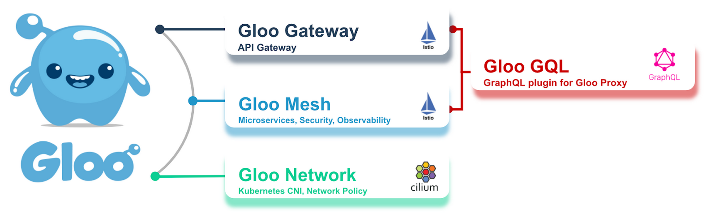

Gloo Platform integrates API gateway, API management, Kubernetes Ingress, Istio service mesh and cloud-native networking into a unified application networking platform.

## Table of Contents

- [Gloo Platform Quickstart](#gloo-platform-quickstart)
  - [Introduction ](#introduction-)
  - [Table of Contents](#table-of-contents)
  - [Lab 1 - Deploy Gloo Platform ](#lab-1---deploy-gloo-platform-)
  - [Lab 2 - Deploy \& Expose Online Boutique Sample Application](#lab-2---deploy--expose-online-boutique-sample-application)
  - [Lab 3 - Routing to other workloads ](#lab-3---routing-to-other-workloads-)
  - [Lab 4 - Authentication / API Key ](#lab-4---authentication--api-key-)
  - [Lab 5 - Zero Trust ](#lab-5---zero-trust-)
  - [Lab 6 - Traffic policies](#lab-6---traffic-policies)
  - [Lab 7 - Dashboard](#lab-7---dashboard)


## Lab 1 - Deploy Gloo Platform <a name="glooplatform"></a>

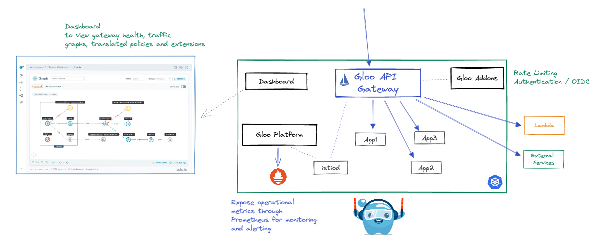

Gloo Platform provides a management plane to interact with the service mesh and gateways in your environment. The management plane exposes a unified API that is multi-tenant and multi-cluster aware. It is responsible for taking your supplied configuration and updating the mesh and gateways in your clusters. Included in the management plane is a UI for policy and traffic observability.

1. Set this env var to the Gloo license key.
    ```sh
    export GLOO_PLATFORM_LICENSE_KEY=<licence_key>
    ```

2. Install meshctl, the Gloo command line tool for bootstrapping Gloo Platform, registering clusters, describing configured resources, and more. Be sure to download version 2.3.5, which uses the latest Gloo Mesh installation values.
    ```sh
    curl -sL https://run.solo.io/meshctl/install | GLOO_MESH_VERSION=v2.3.5 sh -
    export PATH=$HOME/.gloo-mesh/bin:$PATH
    ```

3. Install Gloo Platform. This command uses profiles to install the control plane components, such as the management server and Prometheus server, and the data plane components, such as the agent, managed Istio service mesh, rate limit server, and external auth server, in your cluster.
    ```
    meshctl install --profiles gloo-mesh-single,ratelimit,extauth \
      --set common.cluster=cluster-1 \
      --set demo.manageAddonNamespace=true \
      --set licensing.glooMeshLicenseKey=$GLOO_PLATFORM_LICENSE_KEY
    ```

4. Wait 2-3 minutes for all components to install. Use `meshctl check` to check status. Once everything is ready, view the Gloo Platform Dashboard:
    ```
    meshctl dashboard
    ```

    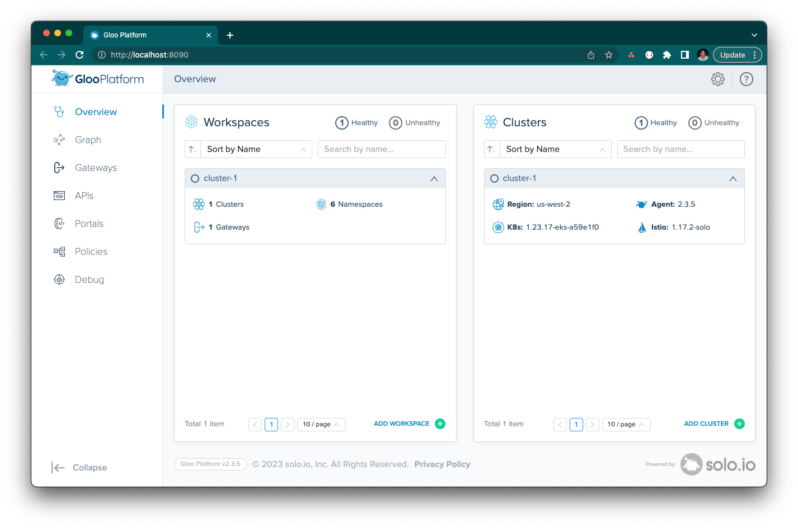


5. Wait for the Gloo Gateway Service to become ready and set it's IP address to a variable for us to use later:

```sh
export GLOO_GATEWAY=$(kubectl -n gloo-mesh-gateways get svc istio-ingressgateway -o jsonpath='{.status.loadBalancer.ingress[0].*}')
printf "\n\nGloo Gateway available at https://$GLOO_GATEWAY\n"
```

Note: No application will respond to this address...yet!

## Lab 2 - Deploy & Expose Online Boutique Sample Application<a name="onlineboutique"></a>

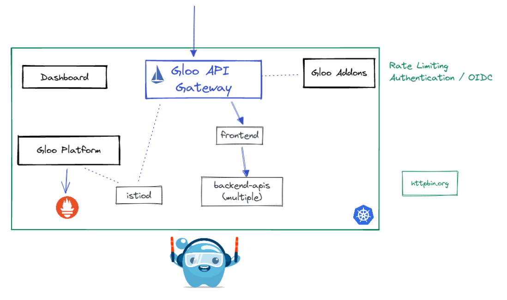

1. Deploy the Online Boutique microservices to the `online-boutique` namespace.

```sh
kubectl create namespace online-boutique
kubectl label ns online-boutique istio-injection=enabled
helm upgrade --install online-boutique --version "5.0.0" oci://us-central1-docker.pkg.dev/solo-test-236622/solo-demos/onlineboutique \
  --create-namespace \
  --namespace online-boutique
```

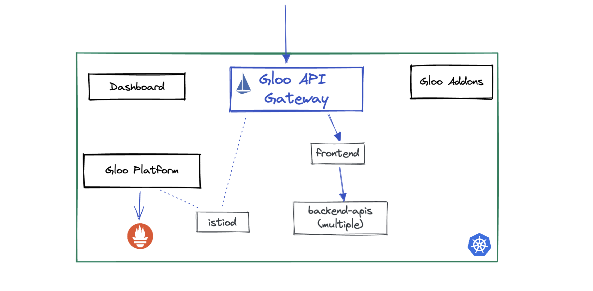

To capture the traffic coming to the Gateway and route them to your applications, you need to use the `VirtualGateway` and `RouteTable` resources.

`VirtualGateway` represents a logical gateway configuration served by Gateway workloads. It describes a set of ports that the virtual gateway listens for incoming or outgoing HTTP/TCP connections, the type of protocol to use, SNI configuration etc.

`RouteTables` defines one or more hosts and a set of traffic route rules to handle traffic for these hosts. The traffic route rules can be *delegated* to other RouteTable based on one or more given hosts or specific paths. This allows you to create a hierarchy of routing configuration and dynamically attach policies at various levels. 

1. Let's start by assuming the role of a Ops team. Configure the Gateway to listen on port 80 and create a generic RouteTable that further delegates the traffic routing to RouteTables in other namespaces.

```yaml
kubectl apply -f - <<EOF
apiVersion: networking.gloo.solo.io/v2
kind: VirtualGateway
metadata:
  name: ingress
  namespace: gloo-mesh-gateways
spec:
  workloads:
    - selector:
        labels:
          app: istio-ingressgateway
        namespace: gloo-mesh-gateways
  listeners: 
    - http: {}
      port:
        number: 80
      allowedRouteTables:
        - host: '*'
          selector:
            namespace: gloo-mesh-gateways
---
apiVersion: networking.gloo.solo.io/v2
kind: RouteTable
metadata:
  name: ingress
  namespace: gloo-mesh-gateways
spec:
  hosts:
    - '*'
  virtualGateways:
    - name: ingress
      namespace: gloo-mesh-gateways
  workloadSelectors: []
  http:
    - name: application-ingress
      labels:
        ingress: all
      delegate:
        routeTables:
        - namespace: online-boutique
EOF
```

2. The Dev team can now write their own RouteTables in their own namespace. Create a RouteTable to send traffic that matches URI `prefix: /` to the frontend application.

```yaml
kubectl apply -f - <<EOF
apiVersion: networking.gloo.solo.io/v2
kind: RouteTable
metadata:
  name: frontend
  namespace: online-boutique
spec:
  workloadSelectors: []
  http:
    - matchers:
      - uri:
          prefix: /
      name: frontend
      labels:
        route: frontend
      forwardTo:
        destinations:
          - ref:
              name: frontend
              namespace: online-boutique
            port:
              number: 80
EOF
```

3. Visit the online boutique application in your browser:
```sh
export GLOO_GATEWAY=$(kubectl -n gloo-mesh-gateways get svc istio-ingressgateway -o jsonpath='{.status.loadBalancer.ingress[0].*}')
printf "\n\nGloo Gateway available at http://$GLOO_GATEWAY\n"
```

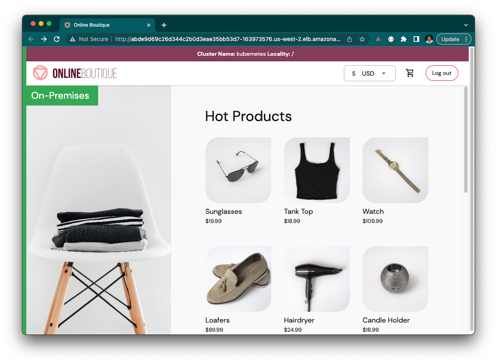

## Lab 3 - Routing to other workloads <a name="routing"></a>


1. Lets see how easy it is to expose another application. This time, we will match on URI `prefix: /products` and send to the productcatalogservice application.
  ```yaml
  kubectl apply -f - <<EOF
  apiVersion: networking.gloo.solo.io/v2
  kind: RouteTable
  metadata:
    name: productcatalog
    namespace: online-boutique
  spec:
    weight: 100
    workloadSelectors: []
    http:
      - matchers:
        - uri:
            exact: /products
        - uri:
            prefix: /products
        name: products
        labels:
          route: products
        forwardTo:
          destinations:
            - ref:
                name: productcatalogservice
                namespace: online-boutique
              port:
                number: 3555
  EOF
  ```

2. Get products from the Product Catalog API
  ```sh
  curl $GLOO_GATEWAY/products
  ```

3. Next, lets route to an endpoint (http://httpbin.org) that is external to the cluster. `ExternalService` resource defines a service that exists outside of the mesh. ExternalServices provide a mechanism to tell Gloo Platform about its existance and how it should be communicated with. Once an ExternalService is created, a RouteTable can be used to send traffic to it. In this example, we will send traffic on URI `prefix: /httpbin` to this external service.
  ```yaml
  kubectl apply -f - <<EOF
  apiVersion: networking.gloo.solo.io/v2
  kind: ExternalService
  metadata:
    name: httpbin
    namespace: online-boutique
  spec:
    hosts:
    - httpbin.org
    ports:
    - name: https
      number: 443
      protocol: HTTPS
      clientsideTls: {}   ### upgrade outbound call to HTTPS
  EOF
  ```

4. Create a new `RouteTable` that will match on requests containing the prefix `/httpbin` and route it to the httpbin `ExternalService`. You may have also noticed that we are rewriting the path using `pathRewrite: /` because httpbin.org is listening for `/get`.
  ```yaml
  kubectl apply -f - <<'EOF'
  apiVersion: networking.gloo.solo.io/v2
  kind: RouteTable
  metadata:
    name: httpbin
    namespace: online-boutique
  spec:
    weight: 150
    workloadSelectors: []
    http:
      - matchers:
        - uri:
            prefix: /httpbin
        name: httpbin-all
        labels:
          route: httpbin
        forwardTo:
          pathRewrite: /
          destinations:
          - ref:
              name: httpbin
            port: 
              number: 443
            kind: EXTERNAL_SERVICE
  EOF
  ```

5. Let's test it.
  ```sh
  curl -v $GLOO_GATEWAY/httpbin/get
  ```

## Lab 4 - Authentication / API Key <a name="apikey"></a>

API key authentication is one of the easiest forms of authentication to implement. Simply create a Kubernetes secret that contains the key and reference it from the `ExtAuthPolicy`. It is recommended to label the secrets so that multiple can be selected and more can be added later. You can select any header to validate against.

1. Create two secrets that Gloo will validate against. One with the api-key `admin` and the other `developer`.

```yaml
kubectl apply -f - <<EOF
apiVersion: v1
kind: Secret
metadata:
  name: solo-admin
  namespace: gloo-mesh-gateways
  labels:
    api-keyset: httpbin-users
type: extauth.solo.io/apikey
data:
  api-key: $(echo -n "admin" | base64)
---
apiVersion: v1
kind: Secret
metadata:
  name: solo-developer
  namespace: gloo-mesh-gateways
  labels:
    api-keyset: httpbin-users
type: extauth.solo.io/apikey
data:
  api-key: $(echo -n "developer" | base64)
EOF
```

2. Create the API key `ExtAuthPolicy` that will match header `x-api-key` values againt the secrets created above. The `ExtAuthServer` resource configures where authorization checks will be performed

```yaml
kubectl apply -f - <<EOF
apiVersion: admin.gloo.solo.io/v2
kind: ExtAuthServer
metadata:
  name: ext-auth-server
  namespace: gloo-mesh-gateways
spec:
  destinationServer:
    ref:
      cluster: cluster-1
      name: ext-auth-service
      namespace: gloo-mesh-addons
    port:
      name: grpc
---
apiVersion: security.policy.gloo.solo.io/v2
kind: ExtAuthPolicy
metadata:
  name: products-apikey
  namespace: gloo-mesh-gateways
spec:
  applyToRoutes:
  - route:
      labels:
        route: products
  config:
    server:
      name: ext-auth-server
      namespace: gloo-mesh-gateways
      cluster: cluster-1
    glooAuth:
      configs:
      - apiKeyAuth:
          headerName: x-api-key
          labelSelector:
            api-keyset: httpbin-users
EOF
```

3. Call httpbin without an api key and you will get a 401 unauthorized message.

```sh
curl -i http://$GLOO_GATEWAY/products
```

4. Call httpbin with the developer api key `x-api-key: developer`

```sh
curl -H "x-api-key: developer" http://$GLOO_GATEWAY/products
```

5. Call httpbin with the admin api key `x-api-key: admin`

```sh
curl -H "x-api-key: admin" http://$GLOO_GATEWAY/products
```


## Lab 5 - Zero Trust <a name="zerotrust"></a>

Lets enforce a "Zero Trust" networking approach where all inbound traffic to any applications is denied by default.

1. Add a default deny-all policy to the backend-apis-team workspace

```yaml
cat << EOF | kubectl apply -f -
apiVersion: security.policy.gloo.solo.io/v2
kind: AccessPolicy
metadata:
  name: allow-nothing
  namespace: online-boutique
spec:
  applyToWorkloads:
  - selector:
      namespace: online-boutique
  config:
    authn:
      tlsMode: STRICT
    authz: {}
EOF
```

2. Refresh the Online Boutique webpage (`echo http://$GLOO_GATEWAY`). You should see an error with message "RBAC: access denied"

3. Add AccessPolicy to explicitly allow traffic between the gateway and the frontend application:

```yaml
kubectl apply -f - <<EOF
apiVersion: security.policy.gloo.solo.io/v2
kind: AccessPolicy
metadata:
  name: frontend-api-access
  namespace: online-boutique
spec:
  applyToDestinations:
  - selector:
      labels: 
        app: frontend
  config:
    authz:
      allowedClients:
      - serviceAccountSelector:
          name: istio-ingressgateway-1-17-2-service-account
          namespace: gloo-mesh-gateways
EOF
```

3. Add AccessPolicy to explicitly allow traffic between the microservices online-boutique workspace. As you can see, these policies can be very flexible.

```yaml
kubectl apply -f - <<EOF
apiVersion: security.policy.gloo.solo.io/v2
kind: AccessPolicy
metadata:
  name: in-namespace-access
  namespace: online-boutique
spec:
  applyToDestinations:
  - selector:
      namespace: online-boutique
  config:
    authz:
      allowedClients:
      - serviceAccountSelector:
          namespace: online-boutique
EOF
```


## Lab 6 - Traffic policies

Implement intelligent routing rules for the apps in your cluster and optimize the responses to incoming requests with Gloo traffic policies. Traffic policies let you apply internal security and compliance standards to individual routes, destinations, or an entire workload so that you can enforce your networking strategy throughout your microservices architecture.

Gloo Platform supports a variety of policies to ensure network resiliency, traffic control, security, and observability for the microservices in your cluster. They can be applied to BOTH gateway and workloads in the mesh. You can apply the policies by using Kubernetes labels and selectors that match `RouteTables`, `VirtualDestinations`, or workloads.

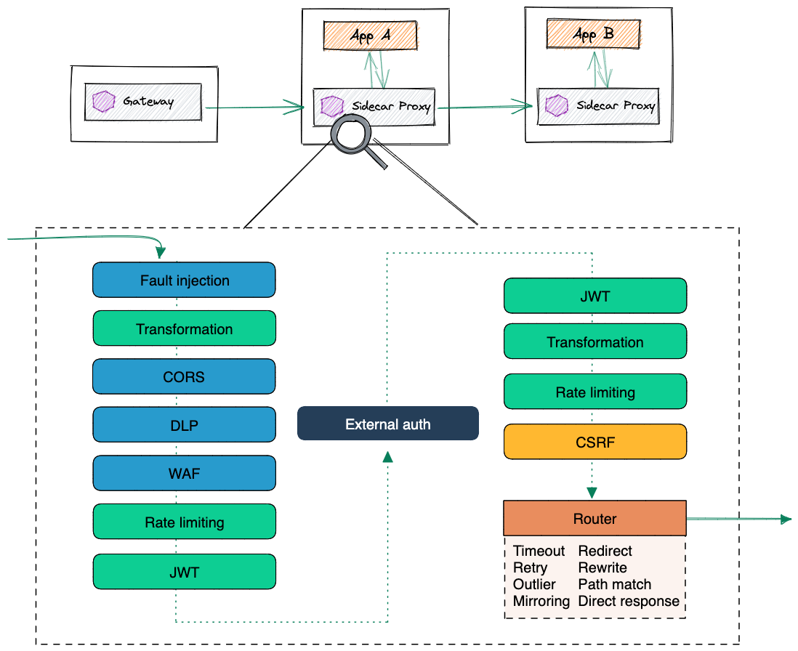

1. Let's apply a simple fault injection policy and dynamically apply it to our frontend `RouteTable` by using it's label.
  ```yaml
  kubectl apply -f - <<EOF
  apiVersion: resilience.policy.gloo.solo.io/v2
  kind: FaultInjectionPolicy
  metadata:
    name: 3sec-fault-injection
    namespace: online-boutique
  spec:
    applyToRoutes:
    - route:
        labels:
          route: frontend
    config:
      delay:
        fixedDelay: 3s
        percentage: 100
  EOF
  ```

2. Visit the Online Boutique webpage (`echo http://$GLOO_GATEWAY`). You will experience a 3 second delay.

## Lab 7 - Dashboard

Let's conclude this workshop by looking at the Gloo Dashboard again and exploring it's various features

1. Launch the dashboard:
   ```
   meshctl dashboard
   ```

2. The homepage shows an at-a-glance look at the health of workspaces and clusters that make up your Gloo setup. In this workshop, we only used a single cluster and a single workspace, but Gloo Platform is intented to scale to multiple clusters and provide isolation between teams using Workspaces. 
   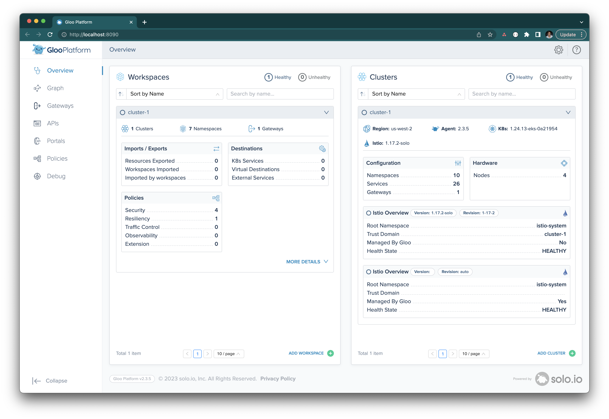

3. The Policies page shows the various Access and Traffic Policies that we defined in this workshop.
   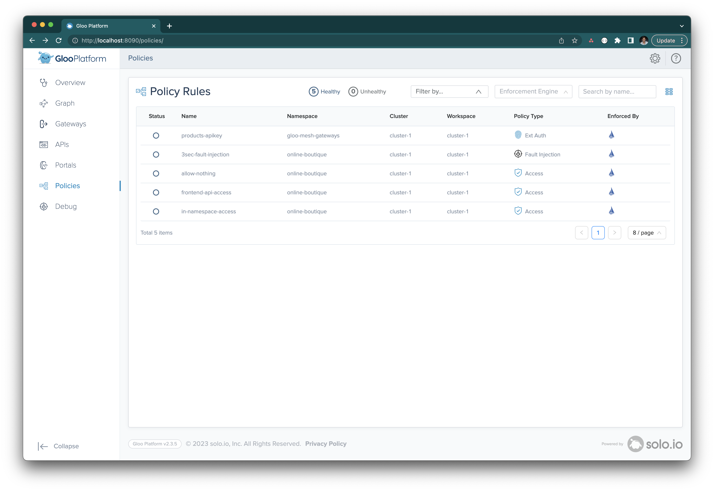

4. The Debug page shows the Istio or Envoy configuration that was _generated_ by Gloo. Review the configuration of translated Istio resources to help debug issues.
   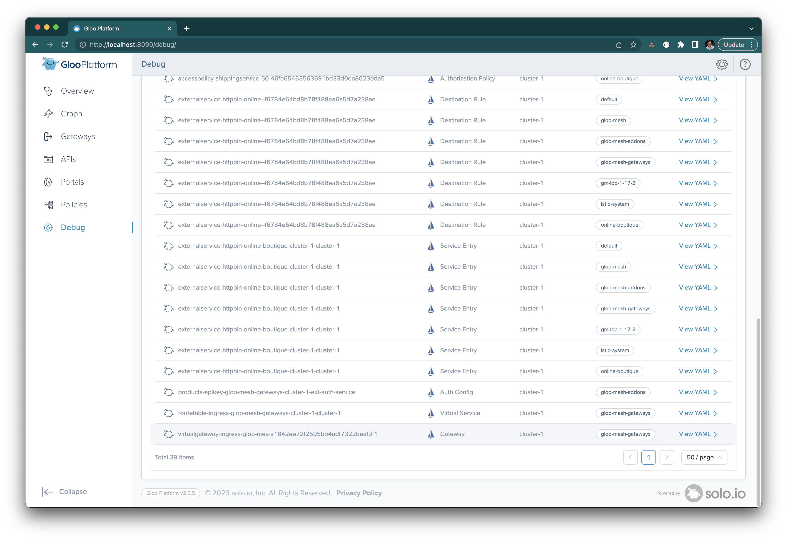

5. The Graph page is used to visualize the network traffic that enters your cluster in a graph that maps out all the nodes by workspace, namespace, or cluster.
   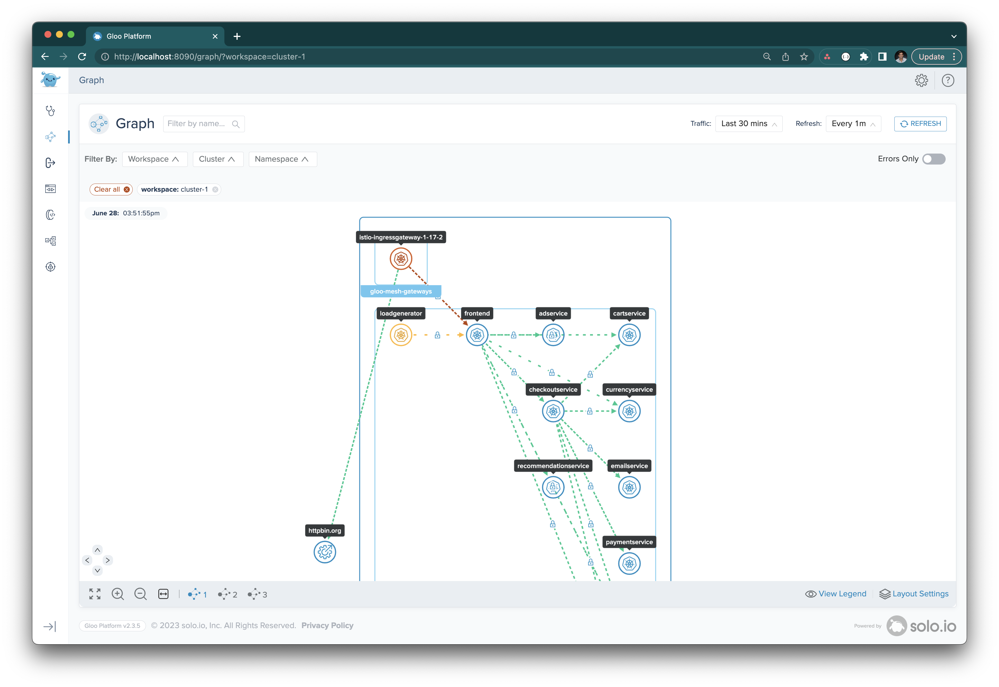


  